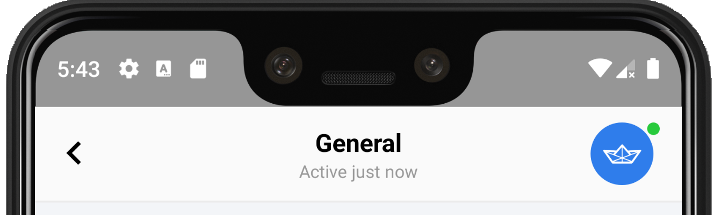

### Channel Header

<p align="center">

</p>

The ChannelHeader is used as header to display useful information about the current channel open.
Typically it will show: 

- Back navigation button
- Channel name
- Last time the channel was active
- Online indidicator about other users

You can add your ChannelHeader to your layout this way:

```xml
<com.getstream.sdk.chat.view.ChannelHeaderView
    android:id="@+id/channelHeader"
    android:layout_width="match_parent"
    android:layout_height="wrap_content"
    app:layout_constraintStart_toStartOf="parent"
    app:layout_constraintTop_toTopOf="parent"
    />
```

And in your activity do something like this:

```java
package io.getstream.chat.example;

import android.content.Intent;
import android.content.pm.PackageManager;
import android.os.Bundle;

import androidx.annotation.NonNull;
import androidx.appcompat.app.AlertDialog;
import androidx.appcompat.app.AppCompatActivity;
import androidx.databinding.DataBindingUtil;
import androidx.lifecycle.ViewModelProviders;

import com.getstream.sdk.chat.StreamChat;
import com.getstream.sdk.chat.model.Attachment;
import com.getstream.sdk.chat.model.Channel;
import com.getstream.sdk.chat.rest.Message;
import com.getstream.sdk.chat.rest.User;
import com.getstream.sdk.chat.rest.core.Client;
import com.getstream.sdk.chat.utils.Constant;
import com.getstream.sdk.chat.utils.PermissionChecker;
import com.getstream.sdk.chat.view.Dialog.MoreActionDialog;
import com.getstream.sdk.chat.view.Dialog.ReactionDialog;
import com.getstream.sdk.chat.view.MessageInputView;
import com.getstream.sdk.chat.view.MessageListView;
import com.getstream.sdk.chat.viewmodel.ChannelViewModel;
import com.getstream.sdk.chat.viewmodel.ChannelViewModelFactory;

import io.getstream.chat.example.databinding.ActivityChannelBinding;

/**
 * Show the messages for a channel
 */
public class ChannelActivity extends AppCompatActivity
        implements MessageListView.MessageClickListener,
        MessageListView.MessageLongClickListener,
        MessageListView.AttachmentClickListener,
        MessageListView.HeaderOptionsClickListener,
        MessageListView.HeaderAvatarGroupClickListener,
        MessageListView.UserClickListener,
        MessageInputView.OpenCameraViewListener {

    final String TAG = ChannelActivity.class.getSimpleName();

    private ChannelViewModel viewModel;
    private ActivityChannelBinding binding;

    @Override
    protected void onCreate(Bundle savedInstanceState) {
        super.onCreate(savedInstanceState);

        // receive the intent and create a channel object
        Intent intent = getIntent();
        String channelType = intent.getStringExtra(MainActivity.EXTRA_CHANNEL_TYPE);
        String channelID = intent.getStringExtra(MainActivity.EXTRA_CHANNEL_ID);
        Client client = StreamChat.getInstance(getApplication());

        // we're using data binding in this example
        binding = DataBindingUtil.setContentView(this, R.layout.activity_channel);
        // most the business logic of the chat is handled in the ChannelViewModel view model
        binding.setLifecycleOwner(this);

        Channel channel = client.getChannelByCid(channelType + ":" + channelID);
        if (channel == null)
            channel = client.channel(channelType, channelID);
        viewModel = ViewModelProviders.of(this,
                new ChannelViewModelFactory(this.getApplication(), channel)
        ).get(ChannelViewModel.class);

        // set listeners
        binding.messageList.setMessageClickListener(this);
        binding.messageList.setMessageLongClickListener(this);
        binding.messageList.setUserClickListener(this);
        binding.messageList.setAttachmentClickListener(this);
        binding.messageInput.setOpenCameraViewListener(this);

        binding.messageList.setViewHolderFactory(new MyMessageViewHolderFactory());

        // connect the view model
        binding.setViewModel(viewModel);
        binding.channelHeader.setViewModel(viewModel, this);

        binding.messageList.setViewModel(viewModel, this);
        binding.messageInput.setViewModel(viewModel, this);
    }


    @Override
    public void onActivityResult(int requestCode, int resultCode, Intent data) {
        super.onActivityResult(requestCode, resultCode, data);
        binding.messageInput.progressCapturedMedia(requestCode, resultCode, data);
    }

    @Override

    public void onRequestPermissionsResult(int requestCode, @NonNull String[] permissions,
                                           @NonNull int[] grantResults) {
        if (requestCode == Constant.PERMISSIONS_REQUEST) {
            boolean granted = true;
            for (int grantResult : grantResults)
                if (grantResult != PackageManager.PERMISSION_GRANTED) {
                    granted = false;
                    break;
                }
            if (!granted) PermissionChecker.showRationalDialog(this, null);
        }
    }

    @Override
    public void openCameraView(Intent intent, int REQUEST_CODE) {
        startActivityForResult(intent, REQUEST_CODE);
    }

    @Override
    public void onMessageClick(Message message, int position) {
        new ReactionDialog(this)
                .setChannel(viewModel.getChannel())
                .setMessage(message)
                .setMessagePosition(position)
                .setRecyclerView(binding.messageList)
                .setStyle(binding.messageList.getStyle())
                .show();
    }

    @Override
    public void onMessageLongClick(Message message) {
        new MoreActionDialog(this)
                .setChannel(viewModel.getChannel())
                .setMessage(message)
                .setStyle(binding.messageList.getStyle())
                .show();
    }

    @Override
    public void onAttachmentClick(Message message, Attachment attachment) {
        binding.messageList.showAttachment(message, attachment);

    }

    @Override
    public void onHeaderOptionsClick(Channel channel) {
        new AlertDialog.Builder(this)
                .setTitle("Options for channel " + channel.getName())
                .setMessage("You pressed on the options, well done")
                .setNegativeButton(android.R.string.no, null)
                .setIcon(R.drawable.stream_ic_settings)
                .show();
    }

    @Override
    public void onHeaderAvatarGroupClick(Channel channel) {
        new AlertDialog.Builder(this)
                .setTitle("Avatar group click for channel " + channel.getName())
                .setMessage("You pressed on the avatar group, well done")
                .setNegativeButton(android.R.string.no, null)
                .setIcon(R.drawable.stream_ic_settings)
                .show();
    }
}
```

#### Listeners

The following listeners can be set

* setHeaderOptionsClickListener
* setHeaderAvatarGroupClickListener

#### Styling using Attributes

You must use the following properties in your XML to change your ChannelHeaderView.

- **AvatarView**

| Properties                         | Type                   | Default |
| ---------------------------------- | ---------------------- | ------- |
| `app:streamAvatarWidth`            | dimension              | 32dp    |
| `app:streamAvatarHeight`           | dimension              | 32dp    |
| `app:streamAvatarBorderWidth`      | dimension              | 3dp     |
| `app:streamAvatarBorderColor`      | color                  | WHITE   |
| `app:streamAvatarBackGroundColor`  | color                  | #989898 |
| `app:streamAvatarTextSize`         | dimension              | 14sp    |
| `app:streamAvatarTextColor`        | color                  | WHITE   |
| `app:streamAvatarTextStyle`        | normal, bold, italic   | bold    |

- **Header Title**

| Properties                              | Type                 | Default  |
| --------------------------------------- | -------------------- | -------- |
| `app:streamChannelHeaderTitleTextSize`  | dimension            | 16sp     |
| `app:streamChannelHeaderTitleTextColor` | color                | BLACK    |
| `app:streamChannelHeaderTitleTextStyle` | normal, bold, italic | bold     |
		
- **Last Active**

| Properties                                   | Type                 | Default |
| -------------------------------------------- | -------------------- | ------- |
| `app:streamChannelHeaderLastActiveShow`      | boolean              | true    |
| `app:streamChannelHeaderLastActiveTextSize`  | dimension            | 16sp    |
| `app:streamChannelHeaderLastActiveTextColor` | color                | DKGRAY  |
| `app:streamChannelHeaderLastActiveTextStyle` | normal, bold, italic | normal  |


- **Back Button**

| Properties                                    | Type       | Default    |
| --------------------------------------------- | ---------- | ---------- |
| `app:streamChannelHeaderBackButtonShow`       | boolean    |  true      |
| `app:streamChannelHeaderBackButtonBackground` | reference  |  -         |

- **Options Button**

| Properties                                       | Type       | Default    |
| ------------------------------------------------ | ---------- | ---------- |
| `app:streamChannelHeaderOptionsButtonShow`       | boolean    |  false     |
| `app:streamChannelHeaderOptionsButtonBackground` | reference  |  -         |
| `app:streamChannelHeaderOptionsButtonTextSize`   | dimension  |  16sp      |		
| `app:streamChannelHeaderOptionsButtonWidth`      | dimension  |  40dp      |	
| `app:streamChannelHeaderOptionsButtonHeight`     | dimension  |  40dp      |	

- **Active Badge**

| Properties                                       | Type       | Default    |
| ------------------------------------------------ | ---------- | ---------- |
| `app:streamChannelHeaderActiveBadgeShow`         | boolean    |  true      |

#### Changing Header 

By default the header shows the name of the channel and when it was last active. You can customize how this is rendered by extending `ChannelHeaderView` and implement `setHeaderTitle` and `setHeaderLastActive` methods.

TODO: example code for this

