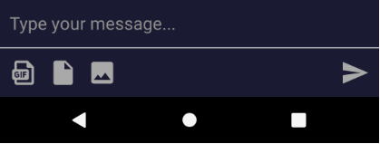

### Message Input
The MessageInput is used to enter a message with text, attachments(images & videos and the other files).
Typically it will show:

- Attachment Button

Here's an example message input view

```xml
<com.getstream.sdk.chat.view.MessageInputView
    android:id="@+id/message_input"
    android:layout_width="match_parent"
    android:layout_height="wrap_content"
    android:layout_marginTop="32dp"
    app:layout_constraintBottom_toBottomOf="parent"
    app:layout_constraintEnd_toEndOf="parent"
    app:layout_constraintStart_toEndOf="parent" />
```

#### Styling via attributes

You must use the following properties in your XML to change your MessageInputView.

- **AvatarView**

| Properties                         | Type                   | Default |
| ---------------------------------- | ---------------------- | ------- |
| `app:streamAvatarWidth`            | dimension              | 32dp    |
| `app:streamAvatarHeight`           | dimension              | 32dp    |
| `app:streamAvatarBorderWidth`      | dimension              | 3dp     |
| `app:streamAvatarBorderColor`      | color                  | WHITE   |
| `app:streamAvatarBackGroundColor`  | color                  | #989898 |
| `app:streamAvatarTextSize`         | dimension              | 14sp    |
| `app:streamAvatarTextColor`        | color                  | WHITE   |
| `app:streamAvatarTextStyle`        | normal, bold, italic   | bold    |

- **Attachment Button**

| Properties                                          | Type          | Default          |
| --------------------------------------------------- | ------------- | ---------------- |
| `app:streamShowAttachmentButton`                    | boolean       | true             |
| `app:streamAttachmentButtonDefaultIconColor`        | color         | stream_gray_dark |
| `app:streamAttachmentButtonDefaultIconPressedColor` | color         | WHITE            |
| `app:streamAttachmentButtonDefaultIconDisabledColor`| color         | LTGRAY           |
| `app:streamAttachmentButtonSelectedIconColor`       | color         | BLACK            |
| `app:streamAttachmentButtonIcon`                    | reference     | -                |
| `app:streamAttachmentButtonWidth`                   | dimension     | 25dp             |
| `app:streamAttachmentButtonHeight`                  | dimension     | 25dp             |


- **Send Button**

| Properties                                      | Type          | Default    |
| ----------------------------------------------- | ------------- | ---------- |
| `app:streamInputButtonDefaultIconColor`         | color         | #0076FF    |
| `app:streamInputButtonEditIconColor`            | color         | #0DD25E    |
| `app:streamInputButtonDefaultIconPressedColor`  | color         | WHITE      |
| `app:streamInputButtonDefaultIconDisabledColor` | color         | LTGRAY     |
| `app:streamInputButtonIcon`                     | reference     | -          |
| `app:streamInputButtonWidth`                    | dimension     | 25dp       |
| `app:streamInputButtonHeight`                   | dimension     | 25dp       |
		
- **Input Text**

| Properties                  | Type                  | Default          |
| --------------------------- | --------------------- | ---------------- |
| `app:streamInputHint`       | string                | Write a message  |
| `app:streamInputTextSize`   | dimension             | 15sp             |
| `app:streamInputTextColor`  | color                 | BLACK            |
| `app:streamInputHintColor`  | color                 | stream_gray_dark |
| `app:streamInputTextStyle`  | normal, bold, italic  | normal           |


- **Input Background**

| Properties                          | Type        | Default |
| ----------------------------------- | ----------- | ------- |
| `app:streamInputBackground`         | reference   | -       |
| `app:streamInputSelectedBackground` | reference   | -       |
| `app:streamInputEditBackground`     | reference   | -       |


#### Listeners

The following listeners can be set

* setOnSendMessageListener
* setOpenCameraViewListener
* setPermissionRequestListener

#### Send a message with attachments

* Permission Request

You can send messages with attachments like images, videos and other files.
To upload an attachment, you must allow proper permissions to access the camera and storage on your device.
If your own application has already granted the permissions, ignore this part and `setPermissionRequestListener`.
So you need to add the following code to ChannelActivity:

* Set PermissionRequestListener

```java
...
binding.messageInput.setPermissionRequestListener(this);
...

@Override
public void openPermissionRequest() {
    PermissionChecker.permissionCheck(this, null);
    // If you are writing a Channel Screen in a Fragment, use the code below instead of the code above.
    //   PermissionChecker.permissionCheck(getActivity(), this);
}
```

* Request Permissions Result
```java
@Override
public void onRequestPermissionsResult(int requestCode, @NonNull String[] permissions,
                                       @NonNull int[] grantResults) {
    binding.messageInput.permissionResult(requestCode, permissions, grantResults);
}
```

* Send Images and Videos from camera

After capturing an image or video from the device's camera, it should be processed by `ChannelActivity`.

```java
@Override
public void onActivityResult(int requestCode, int resultCode, Intent data) {
    super.onActivityResult(requestCode, resultCode, data);
    // If you are using own MessageInputView please comment this line.
    binding.messageInput.captureMedia(requestCode, resultCode, data);
}
```


### Writing your own message input view

You can also create your own message input view. 
Building your own message list or channel list is a lot of work. 
A message input or channel header view is much easier to build though.

If you need to make a larger change you can always build your own message input layout or view.
Let's go over a simple example of building your own message input.

#### Step 1: Create your custom layout

Create your custom Message input layout named `view_custom_message_input` as shown below.

```xml
<?xml version="1.0" encoding="utf-8"?>
<layout xmlns:android="http://schemas.android.com/apk/res/android"
    xmlns:app="http://schemas.android.com/apk/res-auto">

    <androidx.constraintlayout.widget.ConstraintLayout
        android:layout_width="match_parent"
        android:layout_height="wrap_content"
        android:background="#1A1A32">

        <EditText
            android:id="@+id/et_message"
            android:layout_width="match_parent"
            android:layout_height="45dp"
            android:layout_marginStart="10dp"
            android:layout_marginEnd="10dp"
            android:background="@null"
            android:hint="Type your message..."
            android:textColor="#FFFFFF"
            android:textColorHint="#8F8F8F"
            app:layout_constraintTop_toTopOf="parent" />

        <ImageView
            android:id="@+id/imageView"
            android:layout_width="match_parent"
            android:layout_height="1dp"
            android:background="@color/stream_gray_light"
            app:layout_constraintTop_toBottomOf="@+id/et_message" />

        <androidx.constraintlayout.widget.ConstraintLayout
            android:layout_width="match_parent"
            android:layout_height="50dp"
            android:orientation="horizontal"
            app:layout_constraintTop_toBottomOf="@+id/imageView">

            <Button
                android:id="@+id/btn_gif"
                android:layout_width="30dp"
                android:layout_height="25dp"
                android:layout_marginStart="10dp"
                android:background="@drawable/ic_gif"
                app:layout_constraintBottom_toBottomOf="parent"
                app:layout_constraintStart_toStartOf="parent"
                app:layout_constraintTop_toTopOf="parent" />

            <Button
                android:id="@+id/btn_file"
                android:layout_width="25dp"
                android:layout_height="25dp"
                android:layout_marginStart="10dp"
                android:background="@drawable/ic_file"
                app:layout_constraintBottom_toBottomOf="parent"
                app:layout_constraintStart_toEndOf="@+id/btn_gif"
                app:layout_constraintTop_toTopOf="parent" />

            <Button
                android:id="@+id/btn_image"
                android:layout_width="30dp"
                android:layout_height="25dp"
                android:layout_marginStart="20dp"
                android:background="@drawable/ic_image"
                app:layout_constraintBottom_toBottomOf="parent"
                app:layout_constraintStart_toEndOf="@+id/btn_file"
                app:layout_constraintTop_toTopOf="parent" />

            <Button
                android:id="@+id/btn_send"
                android:layout_width="wrap_content"
                android:layout_height="20dp"
                android:layout_marginEnd="10dp"
                android:background="@null"
                android:text="Send"
                android:textColor="#646464"
                app:layout_constraintBottom_toBottomOf="parent"
                app:layout_constraintEnd_toEndOf="parent"
                app:layout_constraintTop_toTopOf="parent" />
        </androidx.constraintlayout.widget.ConstraintLayout>
    </androidx.constraintlayout.widget.ConstraintLayout>
</layout>
```

#### Step 2: Create `CustomMessageInputView`

As a next step we need to connect your message input to the rest of the UI.
There a few things to think about:

* Typing events
* Sending messages (optionally with attachments)
* Editing a message

Have a look at the above example and add the following code to `CustomMessageInputView`:

```java
package io.getstream.chat.example;

import android.content.Context;
import android.text.TextUtils;
import android.util.AttributeSet;
import android.util.Log;
import android.view.LayoutInflater;

import androidx.annotation.Nullable;
import androidx.lifecycle.LifecycleOwner;

import com.getstream.sdk.chat.interfaces.MessageInputManager;
import com.getstream.sdk.chat.model.Attachment;
import com.getstream.sdk.chat.model.ModelType;
import com.getstream.sdk.chat.rest.Message;
import com.getstream.sdk.chat.utils.EditTextUtils;
import com.getstream.sdk.chat.view.MessageInputView;
import com.getstream.sdk.chat.viewmodel.ChannelViewModel;

import java.util.ArrayList;
import java.util.HashMap;
import java.util.List;

import io.getstream.chat.example.databinding.ViewCustomMessageInputBinding;

public class CustomMessageInputView extends MessageInputView
        implements MessageInputManager {

    final static String TAG = CustomMessageInputView.class.getSimpleName();

    // binding for this view
    private ViewCustomMessageInputBinding binding;
    Message newMessage;

    public CustomMessageInputView(Context context, @Nullable AttributeSet attrs) {
        super(context, attrs);
        initBinding(context);
    }

    public void setViewModel(ChannelViewModel viewModel, LifecycleOwner lifecycleOwner) {
        super.setViewModel(viewModel, lifecycleOwner);
        setMessageInputManager(this);
        configKeystroke(viewModel);
    }

    private void initBinding(Context context) {
        LayoutInflater inflater = LayoutInflater.from(context);
        binding = ViewCustomMessageInputBinding.inflate(inflater, this, true);

        // Send Text Message
        binding.btnSend.setOnClickListener(view -> {
            newMessage = new Message(binding.etMessage.getText().toString());
            onSendMessage();
        });
        // Send Image Message
        binding.btnImage.setOnClickListener(view -> {
            newMessage = new Message();
            newMessage.setAttachments(getAttachments(ModelType.attach_image));
            onSendMessage();
        });
        // Send Giphy Message
        binding.btnGif.setOnClickListener(view -> {
            newMessage = new Message();
            newMessage.setAttachments(getAttachments(ModelType.attach_giphy));
            onSendMessage();
        });
        // Send File Message
        binding.btnFile.setOnClickListener(view -> {
            newMessage = new Message();
            newMessage.setAttachments(getAttachments(ModelType.attach_file));
            onSendMessage();
        });
    }

    private void configKeystroke(ChannelViewModel viewModel){
        // Set Keystroke
        EditTextUtils.afterTextChanged(binding.etMessage, editable -> {
            String messageText = binding.etMessage.getText().toString();
            if (messageText.length() > 0) {
                viewModel.keystroke();
            }
        });
    }

    // Override this function to send new message
    @Override
    public Message prepareMessage() {
        // note that you typically want to use custom fields on attachments instead of messages
        HashMap<String, Object> extraData = new HashMap<>();
        extraData.put("mycustomfield", "123");
        newMessage.setExtraData(extraData);

        return newMessage;
    }

    // Override this function to edit message
    @Override
    public Message getEditMessage() {
        Message message = super.getEditMessage();
        message.setText(binding.etMessage.getText().toString());
        return message;
    }

    @Override
    public void onSendMessageSuccess(Message message) {
        clearEditText();
    }

    @Override
    public void onSendMessageError(String errMsg) {
        Log.d(TAG, "Failed send message! :" + errMsg);
        clearEditText();
    }

    @Override
    public void onEditMessage(Message message) {
        if (message == null
                || TextUtils.isEmpty(message.getText())) return;

        binding.etMessage.requestFocus();
        binding.etMessage.setText(message.getText());
        binding.etMessage.setSelection(binding.etMessage.getText().length());
    }

    private void clearEditText(){
        binding.etMessage.setText("");
    }

    private List<Attachment> getAttachments(String modelType) {
        Attachment attachment = new Attachment();
        String url;
        switch (modelType) {
            case ModelType.attach_image:
                url = "https://cdn.pixabay.com/photo/2017/12/25/17/48/waters-3038803_1280.jpg";
                attachment.setImageURL(url);
                attachment.setFallback("test image");
                attachment.setType(ModelType.attach_image);
                break;
            case ModelType.attach_giphy:
                url = "https://media1.giphy.com/media/l4FB5yXHoVSheWQ5a/giphy.gif";
                attachment.setThumbURL(url);
                attachment.setTitleLink(url);
                attachment.setTitle("hi");
                attachment.setType(ModelType.attach_giphy);
                break;
            case ModelType.attach_file:
                url = "https://stream-cloud-uploads.imgix.net/attachments/47574/08cd5fba-f157-4c97-9ab1-fd57a1fafc03.VID_20190928_213042.mp4?dl=VID_20190928_213042.mp4&s=0d8f2c1501e0f6a1de34c5fe1c84a0a5";
                attachment.setTitle("video.mp4");
                attachment.setFile_size(707971);
                attachment.setAssetURL(url);
                attachment.setType(ModelType.attach_file);
                attachment.setMime_type(ModelType.attach_mime_mp4);
                break;
        }
        List<Attachment>attachments = new ArrayList<>();
        attachments.add(attachment);
        return attachments;
    }
}

```

#### Step 3: Edit activity_channel.xml

Open `activity_channel.xml` and replace `com.getstream.sdk.chat.view.MessageInputView` with the following include:

```xml
...
<io.getstream.chat.example.CustomMessageInputView
    android:id="@+id/message_input"
    android:layout_width="match_parent"
    android:layout_height="wrap_content"
    android:layout_marginTop="32dp"
    app:layout_constraintBottom_toBottomOf="parent"
    app:layout_constraintEnd_toEndOf="parent"
    app:layout_constraintStart_toEndOf="parent" />
...
```


<p align="center">

</p>

