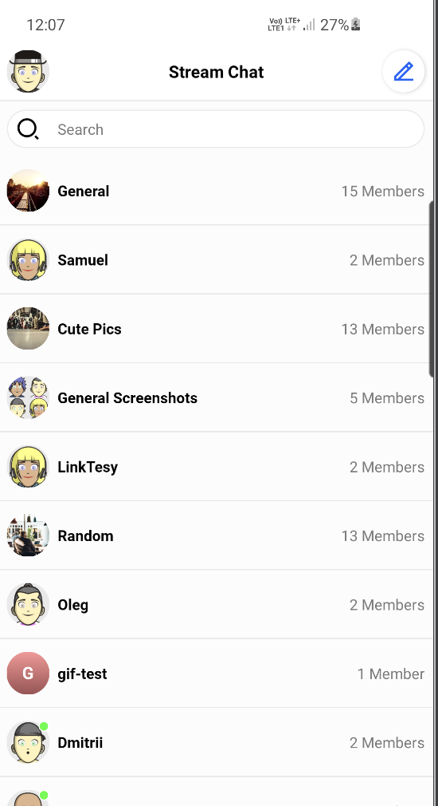

`ChannelListView` provides a mechanism for completely changing the default view holders, as well as introducing different types of views. All you need to do is to provide your own `ChannelListItemViewHolderFactory`. Let's make an example that displays the channel's photo, name, and member count:



In order to achieve such effect, we need to do the following steps. We are going to use _View Binding_ to simplify things:
1. Create `custom_channel_list_item.xml` layout:
```xml
<?xml version="1.0" encoding="utf-8"?>
<androidx.constraintlayout.widget.ConstraintLayout xmlns:android="http://schemas.android.com/apk/res/android"
    xmlns:app="http://schemas.android.com/apk/res-auto"
    android:layout_width="match_parent"
    android:layout_height="64dp"
    >

    <io.getstream.chat.android.ui.avatar.AvatarView
        android:id="@+id/avatarView"
        style="@style/StreamUiChannelListAvatarStyle"
        android:layout_marginVertical="12dp"
        android:layout_marginStart="8dp"
        app:layout_constraintBottom_toBottomOf="parent"
        app:layout_constraintStart_toStartOf="parent"
        app:layout_constraintTop_toTopOf="parent"
        />

    <TextView
        android:id="@+id/nameTextView"
        android:layout_width="wrap_content"
        android:layout_height="wrap_content"
        android:layout_marginStart="8dp"
        android:ellipsize="end"
        android:singleLine="true"
        android:textAppearance="@style/StreamUiTextAppearance.BodyBold"
        app:layout_constraintBottom_toBottomOf="parent"
        app:layout_constraintEnd_toStartOf="@id/membersCountTextView"
        app:layout_constraintHorizontal_chainStyle="spread_inside"
        app:layout_constraintStart_toEndOf="@+id/avatarView"
        app:layout_constraintTop_toTopOf="parent"
        />

    <TextView
        android:id="@+id/membersCountTextView"
        android:layout_width="wrap_content"
        android:layout_height="wrap_content"
        android:layout_marginHorizontal="8dp"
        android:textAllCaps="false"
        android:textColor="#7A7A7A"
        android:textSize="14sp"
        android:textStyle="normal"
        app:layout_constraintBottom_toBottomOf="parent"
        app:layout_constraintEnd_toEndOf="parent"
        app:layout_constraintStart_toEndOf="@id/nameTextView"
        app:layout_constraintTop_toTopOf="parent"
        />

</androidx.constraintlayout.widget.ConstraintLayout>
```
2. Add _plurals_ entry to `strings.xml`
```xml
    <plurals name="members_count">
        <item quantity="one">%1d Member</item>
        <item quantity="other">%1d Members</item>
    </plurals>
```
3. Create custom view holder and view holder factory
```kotlin
    class CustomChannelListItemViewHolderFactory : ChannelListItemViewHolderFactory() {
        override fun createChannelViewHolder(parentView: ViewGroup): BaseChannelListItemViewHolder {
            return CustomChannelViewHolder(parentView, listenerContainer.channelClickListener)
        }
    }

    class CustomChannelViewHolder(
        parent: ViewGroup,
        private val channelClickListener: ChannelListView.ChannelClickListener,
        private val binding: CustomChannelListItemBinding = CustomChannelListItemBinding.inflate(
            LayoutInflater.from(parent.context),
            parent,
            false
        ),
    ) : BaseChannelListItemViewHolder(binding.root) {

        private lateinit var channel: Channel

        init {
            binding.root.setOnClickListener { channelClickListener.onClick(channel) }
        }

        override fun bind(channel: Channel, diff: ChannelListPayloadDiff) {
            this.channel = channel

            binding.apply {
                avatarView.setChannelData(channel)
                nameTextView.text = channel.getDisplayName(itemView.context)
                membersCountTextView.text = itemView.context.resources.getQuantityString(
                    R.plurals.members_count,
                    channel.members.size,
                    channel.members.size
                )
            }
        }
    }
```
4. Set custom view holder factory
```kotlin
channelListView.setViewHolderFactory(CustomChannelListItemViewHolderFactory())
```
