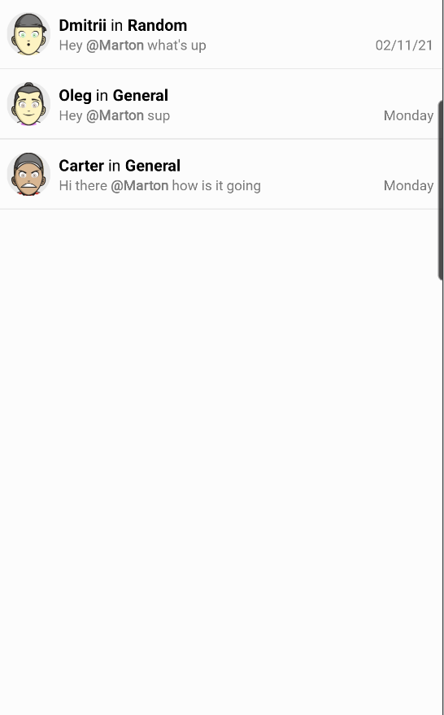
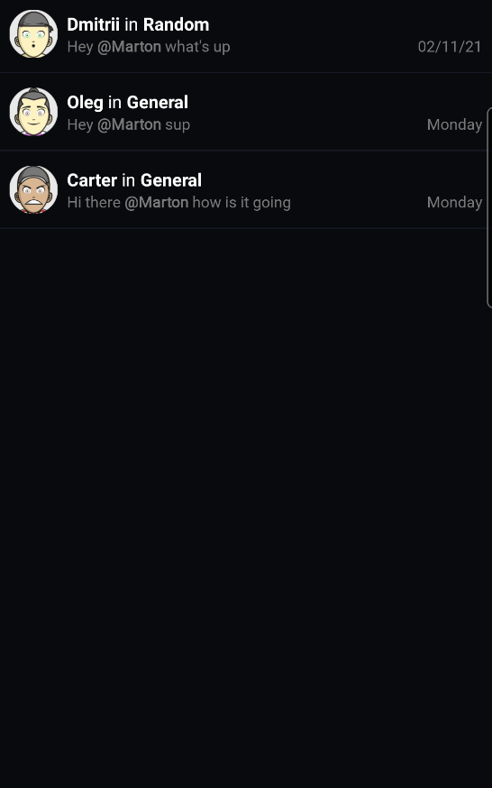

`MentionListView` is a view that is responsible for showing previews of messages which contains current user mention.

## Adding MentionListView
Here's an example layout containing `MentionListView`:

```xml
<?xml version="1.0" encoding="utf-8"?>
<androidx.constraintlayout.widget.ConstraintLayout xmlns:android="http://schemas.android.com/apk/res/android"
    xmlns:app="http://schemas.android.com/apk/res-auto"
    android:layout_width="match_parent"
    android:layout_height="match_parent"
    >

    <io.getstream.chat.android.ui.mention.list.MentionListView
        android:id="@+id/mentionsListView"
        android:layout_width="0dp"
        android:layout_height="0dp"
        app:layout_constraintBottom_toBottomOf="parent"
        app:layout_constraintLeft_toLeftOf="parent"
        app:layout_constraintRight_toRightOf="parent"
        app:layout_constraintTop_toTopOf="parent"
        />

</androidx.constraintlayout.widget.ConstraintLayout>
```


| Light Mode | Dark Mode |
| --- | --- |
|||

## Binding With View Model
You can chose to use this view with a viewmodel that already configures the default
behaviour for it. The Android SDK comes with `MentionListViewModel`,  which can be easily bound to it using `bindView`:

```kotlin
private val viewModel: MentionListViewModel by viewModels()

override fun onViewCreated(view: View, savedInstanceState: Bundle?) {
    viewModel.bindView(binding.mentionsListView, viewLifecycleOwner)
}
```
From that point, you should be able to see messages which contain current user mention.

## Handling Mention List View Actions
`MentionListView` allows to configure common actions (e.g. click on a single item):
```kotlin
mentionListView.setMentionSelectedListener { message ->
    // Handle mention click
}
```
The full list of available listeners is available [here](https://getstream.github.io/stream-chat-android/stream-chat-android-ui-components/stream-chat-android-ui-components/io.getstream.chat.android.ui.mention.list/-mention-list-view/index.html).
