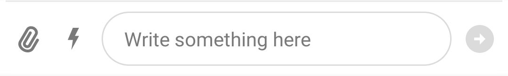
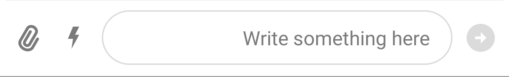

# RTL Support

The Android SDK supports RTL configuration. The default behavior is `TEXT_DIRECTION_FIRST_STRONG_LTR`, which means that it follow the first strong directional character and defaults to left-to-right if finds none. 

### MessageInputView configuration

In case you prefer a different configuration for `MessageInputView`, you can select the direction of text using `MessageInputView.setInputTextDirection`. Example:

| `TEXT_DIRECTION_FIRST_STRONG_LTR` | `TEXT_DIRECTION_FIRST_STRONG_RTL` | 
|---|---| 
||| 

### MessageListView configuration

To change RTL support for the messages in the `MessageListView` you can use custom view holders with a different text direction. You can check how to implement custom view holders [here](https://getstream.io/chat/docs/sdk/android/ui/components/message-list/#custom-message-views)

### ChannelListView configuration

To change RTL support for the channels in the `ChannelListView` you can use custom view holders with a different text direction. You can check how to implement custom view holders [here](https://getstream.io/chat/docs/sdk/android/ui/components/channel-list/#creating-a-custom-viewholder-factory)
