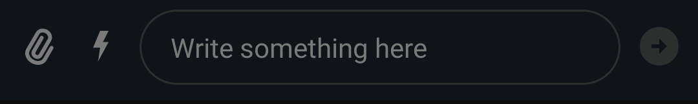
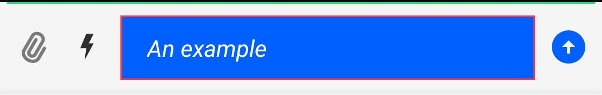
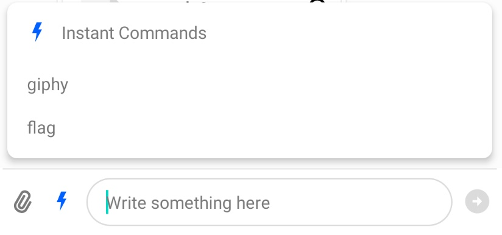
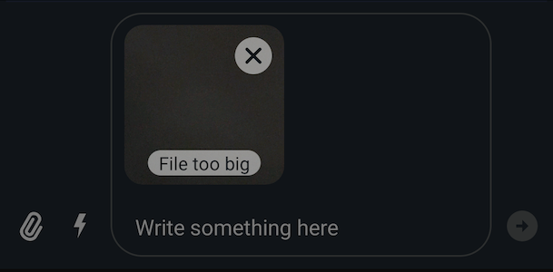

import Tabs from '@theme/Tabs';
import TabItem from '@theme/TabItem';

# Message Input

`MessageInputView` is the view used to create a new chat message and send it to a channel.

|Light|Dark| 
|---|---|
|||

It supports the following features:

* Emoticons
* Attachments
* Slash Commands
* Typing events
* Editing messages
* Threads
* Mentions
* Replies

## Usage

To use `MessageInputView`, include it in your XML layout. It usually goes below a `MessageListView`.

```xml
<io.getstream.chat.android.ui.message.input.MessageInputView
        android:id="@+id/messageInputView"
        android:layout_width="0dp"
        android:layout_height="wrap_content"
        app:layout_constraintBottom_toBottomOf="parent"
        app:layout_constraintEnd_toEndOf="parent"
        app:layout_constraintStart_toStartOf="parent"
        app:layout_constraintTop_toBottomOf="@+id/messageListView"
        />
```

The recommended way of setting up the input view is by binding it to a `MessageInputViewModel`. This will make it fully functional by setting up any necessary listeners and data handling.

<Tabs>
<TabItem value="kotlin" label="Kotlin">

```kotlin
// Instantiate the ViewModel for a given channel
val factory: MessageListViewModelFactory = MessageListViewModelFactory(cid = "channelType:channelId")
val viewModel: MessageInputViewModel by viewModels { factory }
// Bind it with MessageInputView
viewModel.bindView(messageInputView, viewLifecycleOwner)
```
</TabItem>

<TabItem value="java" label="Java">

```java
// Init view model
ViewModelProvider.Factory factory = new MessageListViewModelFactory.Builder()
        .cid("messaging:123")
        .build();
ViewModelProvider provider = new ViewModelProvider(this, factory);
MessageInputViewModel viewModel = provider.get(MessageInputViewModel.class);

// Bind view and viewModel
MessageInputViewModelBinding.bind(viewModel, messageInputView, getViewLifecycleOwner());
```
</TabItem>
</Tabs>

## Handling Actions 

Actions can be handled by setting listeners on this view. For example, you can handle clicks of the send button:

<Tabs>
<TabItem value="kotlin" label="Kotlin">

```kotlin
messageInputView.setOnSendButtonClickListener {
    // Handle send button click
}
```
</TabItem>

<TabItem value="java" label="Java">

```java
messageInputView.setOnSendButtonClickListener(() -> {
    // Handle send button click
});
```
</TabItem>
</Tabs>


Typing updates should be sent sparingly as a way of saving valuable API calls. Luckily, we offer such behavior out of the box by using our [`DefaultTypingUpdatesBuffer`](https://github.com/GetStream/stream-chat-android/blob/main/stream-chat-android-ui-common/src/main/kotlin/com/getstream/sdk/chat/utils/typing/DefaultTypingUpdatesBuffer.kt) in order to intelligently make start and stop typing API calls.

If you want to implement your own buffering mechanism you can pass in an implementation of the [`TypingUpdatesBuffer`](https://github.com/GetStream/stream-chat-android/blob/main/stream-chat-android-ui-common/src/main/kotlin/com/getstream/sdk/chat/utils/typing/TypingUpdatesBuffer.kt) interface instead:

<Tabs>
<TabItem value="kotlin" label="Kotlin">

```kotlin
messageInputView.setTypingUpdatesBuffer(object : TypingUpdatesBuffer {
    override fun onKeystroke() {
        // Your custom implementation of TypingUpdatesBuffer
    }

    override fun clear() {
        // Your custom implementation of TypingUpdatesBuffer
    }
})
```
</TabItem>

<TabItem value="java" label="Java">

```java
messageInputView.setTypingUpdatesBuffer(new TypingUpdatesBuffer() {
    @Override
    public void onKeystroke() {
        // Your custom implementation of TypingUpdatesBuffer
    }

    @Override
    public void clear() {
        // Your custom implementation of TypingUpdatesBuffer
    }
});
```
</TabItem>
</Tabs>


You can show a custom error when the maximum message length is exceeded:

<Tabs>
<TabItem value="kotlin" label="Kotlin">

```kotlin
messageInputView.setMaxMessageLengthHandler { messageText, messageLength, maxMessageLength, maxMessageLengthExceeded ->
    if (maxMessageLengthExceeded)  {
        // Show custom max-length error
    } else {
        // Hide custom max-length error
    }
}
```
</TabItem>

<TabItem value="java" label="Java">

```java
messageInputView.setMaxMessageLengthHandler((messageText, messageLength, maxMessageLength, maxMessageLengthExceeded) -> {
    if (maxMessageLengthExceeded) {
        // Show custom max-length error
    } else {
        // Hide custom max-length error
    }
});
```
</TabItem>
</Tabs>

You can also change the handler that sends messages. By default, this is set up by `bindView` and calls into the ViewModel to perform these actions.  

<Tabs>
<TabItem value="kotlin" label="Kotlin">

```kotlin
messageInputView.setSendMessageHandler(
    object : MessageInputView.MessageSendHandler {
        override fun sendMessage(messageText: String, messageReplyTo: Message?) {
            // Handle send message
        }

        override fun sendMessageWithAttachments(
            message: String,
            attachmentsWithMimeTypes: List<Pair<File, String?>>,
            messageReplyTo: Message?,
        ) {
            // Handle message with attachments
        }

        override fun sendToThreadWithAttachments(
            parentMessage: Message,
            message: String,
            alsoSendToChannel: Boolean,
            attachmentsWithMimeTypes: List<Pair<File, String?>>,
        ) {
           // Handle message to thread with attachments
        }

        override fun sendToThread(parentMessage: Message, messageText: String, alsoSendToChannel: Boolean) {
            // Handle message to thread
        }

        override fun editMessage(oldMessage: Message, newMessageText: String) {
            // Handle edit message
        }

        override fun dismissReply() {
            // Handle dismiss reply
        }
    }
)
```
</TabItem>

<TabItem value="java" label="Java">

```java
messageInputView.setSendMessageHandler(new MessageInputView.MessageSendHandler() {
    @Override
    public void sendMessage(@NonNull String messageText, @Nullable Message messageReplyTo) {
        // Handle send message
    }

    @Override
    public void sendMessageWithAttachments(@NonNull String message, @NonNull List<? extends Pair<? extends File, String>> attachmentsWithMimeTypes, @Nullable Message messageReplyTo) {
        // Handle message with attachments
    }

    @Override
    public void sendMessageWithCustomAttachments(@NonNull String message, @NonNull List<Attachment> attachments, @Nullable Message messageReplyTo) {
        // Handle message with custom attachments
    }

    @Override
    public void sendToThread(@NonNull Message parentMessage, @NonNull String messageText, boolean alsoSendToChannel) {
        // Handle message to thread
    }

    @Override
    public void sendToThreadWithAttachments(@NonNull Message parentMessage, @NonNull String message, boolean alsoSendToChannel, @NonNull List<? extends Pair<? extends File, String>> attachmentsWithMimeTypes) {
        // Handle message to thread with attachments
    }

    @Override
    public void sendToThreadWithCustomAttachments(@NonNull Message parentMessage, @NonNull String message, boolean alsoSendToChannel, @NonNull List<Attachment> attachmentsWithMimeTypes) {
        // Handle message to thread with custom attachments
    }

    @Override
    public void editMessage(@NonNull Message oldMessage, @NonNull String newMessageText) {
        // Handle edit message
    }

    @Override
    public void dismissReply() {
        // Handle dismiss reply
    }
});
```
</TabItem>
</Tabs>

## Customization

`MessageInputView` can be customized using:
- XML attributes
- Style transformations
- Methods called on `MessageInputView`'s instance

### Using XML Attributes

Many attributes of this View can be configured, like changing its color, the border and the color of the message input, fonts, components visibility, and so on. The full list of available attributes can be found [here](https://github.com/GetStream/stream-chat-android/blob/main/stream-chat-android-ui-components/src/main/res/values/attrs_message_input_view.xml).

Here's an example of setting some custom attributes:

```xml
<io.getstream.chat.android.ui.message.input.MessageInputView
    android:id="@+id/messageInputView"
    android:layout_width="0dp"
    android:layout_height="wrap_content"
    android:background="@color/grey_light"
    app:streamUiMessageInputEditTextBackgroundDrawable="@drawable/stream_ui_shape_edit_text_squared"
    app:streamUiMessageInputTextStyle="italic"
    app:streamUiMessageInputDividerBackgroundDrawable="@drawable/stream_ui_divider_green"
    app:streamUiMessageInputTextColor="@color/stream_ui_white"
    />
```

This will create this version of `MessageInputView`:



Here's another example with different attributes set:

```xml
<io.getstream.chat.android.ui.message.input.MessageInputView
    android:id="@+id/messageInputView"
    android:layout_width="0dp"
    android:layout_height="wrap_content"
    app:layout_constraintBottom_toBottomOf="parent"
    app:layout_constraintEnd_toEndOf="parent"
    app:layout_constraintStart_toStartOf="parent"
    app:layout_constraintTop_toBottomOf="@+id/messageListView"
    app:streamUiMessageInputEditTextBackgroundDrawable="@drawable/stream_ui_shape_edit_text_rounded"
    app:streamUiMessageInputTextStyle="italic"
    android:background="@color/stream_ui_black"
    app:streamUiMessageInputDividerBackgroundDrawable="@drawable/stream_ui_divider_green"
    app:streamUiMessageInputTextColor="@color/stream_ui_white"
    />
```

This produces the following styling:


Different configurations can be used to achieve the desired appearance of `MessageListView`. If you don't need to change this View appearance at runtime, XML should be enough. But if you need to able to customize it at runtime, then you can use `MessageInputViewStyle` as described in the next section.

### Using Style Transformations

You can use [TransformStyle](https://github.com/GetStream/stream-chat-android/blob/develop/stream-chat-android-ui-components/src/main/kotlin/io/getstream/chat/android/ui/TransformStyle.kt) to apply global style transformations to all `MessageInputView` instances. For example, you can create set up a `messageInputStyleTransformer` like this one to change the input text color:

<Tabs>
<TabItem value="kotlin" label="Kotlin">

```kotlin
TransformStyle.messageInputStyleTransformer = StyleTransformer { viewStyle ->
    viewStyle.copy(
        messageInputTextStyle = viewStyle.messageInputTextStyle.copy(
            color = ContextCompat.getColor(
                requireContext(),
                R.color.stream_ui_white,
            ),
        )
    )
}
```
</TabItem>

<TabItem value="java" label="Java">

```java
TransformStyle.setMessageInputStyleTransformer(source -> {
    // Customize the style
    return source;
});
```
</TabItem>
</Tabs>

:::note
The transformer should be set before the View is rendered to make sure that the new style was applied.
:::

### Changing Send Message Button

Send message button drawable can be changed dynamically based on the current input mode. You can
set the `MessageInputModeListener` on `MessageInputView` instance and change drawables based on the current input mode.
Keep in mind that `MessageInputView` displays two different send message buttons:
- `sendMessageButtonEnabled` - when the user is able to send a message
- `sendMessageButtonDisabled` - when the user is not able to send a message (send button is disabled)

:::note
Drawable will override the one provided either by attributes or `TransformStyle.messageInputStyleTransformer`.
Make sure to set different drawables in all input modes.
:::

<Tabs>
<TabItem value="kotlin" label="Kotlin">

```kotlin
messageInputView.setMessageInputModeListener {
    when(it) {
        is MessageInputView.InputMode.Edit -> {
            messageInputView.setSendMessageButtonEnabledDrawable(context.getDrawable(R.drawable.stream_ui_ic_check_single)!!)
            messageInputView.setSendMessageButtonDisabledDrawable(context.getDrawable(R.drawable.stream_ui_ic_close)!!)
        }
        else -> {
            messageInputView.setSendMessageButtonEnabledDrawable(context.getDrawable(R.drawable.stream_ui_ic_filled_up_arrow)!!)
            messageInputView.setSendMessageButtonDisabledDrawable(context.getDrawable(R.drawable.stream_ui_ic_filled_right_arrow)!!)
        }
    }
}
```
</TabItem>

<TabItem value="java" label="Java">

```java
messageInputView.setMessageInputModeListener(inputMode -> {
    if (inputMode instanceof MessageInputView.InputMode.Edit) {
        messageInputView.setSendMessageButtonEnabledDrawable(requireContext().getDrawable(R.drawable.stream_ui_ic_check_single));
        messageInputView.setSendMessageButtonDisabledDrawable(requireContext().getDrawable(R.drawable.stream_ui_ic_close));
    } else {
        messageInputView.setSendMessageButtonEnabledDrawable(requireContext().getDrawable(R.drawable.stream_ui_ic_filled_up_arrow));
        messageInputView.setSendMessageButtonDisabledDrawable(requireContext().getDrawable(R.drawable.stream_ui_ic_filled_right_arrow));
    }
});
```
</TabItem>
</Tabs>

## Creating Custom Suggestion Items

The suggestion list popup is used to provide autocomplete suggestions for commands and mentions. To customize the appearance of suggestion list items you need to provide your own `SuggestionListViewHolderFactory`. Here's an example of a custom command item that displays just a command name:

1. Create the `item_command.xml` layout:

```xml
<?xml version="1.0" encoding="utf-8"?>
<FrameLayout xmlns:android="http://schemas.android.com/apk/res/android"
    android:layout_width="match_parent"
    android:layout_height="wrap_content"
    android:background="?attr/selectableItemBackground"
    android:paddingStart="16dp"
    android:paddingEnd="16dp"
    android:paddingTop="8dp"
    android:paddingBottom="8dp">

    <TextView
        android:id="@+id/commandNameTextView"
        android:layout_width="wrap_content"
        android:layout_height="wrap_content" />

</FrameLayout>
```

2. Create a custom ViewHolder that extends `BaseSuggestionItemViewHolder`, and a custom ViewHolder factory which extends `SuggestionListItemViewHolderFactory`:

<Tabs>
<TabItem value="kotlin" label="Kotlin">

```kotlin
class CustomCommandViewHolder(
    private val binding: ItemCommandBinding,
) : BaseSuggestionItemViewHolder<SuggestionListItem.CommandItem>(binding.root) {

    override fun bindItem(item: SuggestionListItem.CommandItem) {
        binding.commandNameTextView.text = item.command.name
    }
}

class CustomSuggestionListViewHolderFactory : SuggestionListItemViewHolderFactory() {
    override fun createCommandViewHolder(
        parent: ViewGroup,
    ): BaseSuggestionItemViewHolder<SuggestionListItem.CommandItem> {
        return ItemCommandBinding
            .inflate(LayoutInflater.from(parent.context), parent, false)
            .let(::CustomCommandViewHolder)
    }
}
```
</TabItem>

<TabItem value="java" label="Java">

```java
public final class CustomCommandViewHolder extends BaseSuggestionItemViewHolder<SuggestionListItem.CommandItem> {

    ItemCommandBinding binding;

    public CustomCommandViewHolder(ItemCommandBinding binding) {
        super(binding.getRoot());
        this.binding = binding;
    }

    @Override
    public void bindItem(@NonNull SuggestionListItem.CommandItem item) {
        binding.commandNameTextView.setText(item.getCommand().getName());
    }
}

public final class CustomSuggestionListViewHolderFactory extends SuggestionListItemViewHolderFactory {
    @NonNull
    @Override
    public BaseSuggestionItemViewHolder<SuggestionListItem.CommandItem> createCommandViewHolder(@NonNull ViewGroup parentView) {
        return new CustomCommandViewHolder(ItemCommandBinding.inflate(LayoutInflater.from(parentView.getContext()), parentView, false));
    }
}
```
</TabItem>
</Tabs>

4. Set the custom ViewHolder factory on `MessageInputView`:

<Tabs>
<TabItem value="kotlin" label="Kotlin">

```kotlin
messageInputView.setSuggestionListViewHolderFactory(CustomSuggestionListViewHolderFactory())
```
</TabItem>

<TabItem value="java" label="Java">

```java
messageInputView.setSuggestionListViewHolderFactory(new CustomSuggestionListViewHolderFactory());
```
</TabItem>
</Tabs>

This produces the following result:



## Changing Mention Search
It is possible to change the search method in the mention list. The default class: `DefaultUserLookupHandler` removes diacritics and uses Levenstein distance to include similar words in the results.

<Tabs>
<TabItem value="kotlin" label="Kotlin">

```kotlin
val defaultUserLookupHandler = DefaultUserLookupHandler(users)
messageInputView.setUserLookupHandler(defaultUserLookupHandler)
```
</TabItem>

<TabItem value="java" label="Java">

```java
MessageInputView.DefaultUserLookupHandler defaultUserLookupHandler = new MessageInputView.DefaultUserLookupHandler(users, new DefaultStreamTransliterator(null));
messageInputView.setUserLookupHandler(defaultUserLookupHandler);
```
</TabItem>
</Tabs>

### Transliteration
You can add transliteration to `DefaultUserLookupHandler` by setting the desired id for transliteration inside `DefaultStreamTransliterator` and passing it to `DefaultUserLookupHandler` constructor.
 
:::note
`DefaultStreamTransliterator` only supports transliteration prior to API 29 (Android Q) and it will not apply transliteration for APIs smaller than this. 
:::

<Tabs>
<TabItem value="kotlin" label="Kotlin">

```kotlin
val defaultUserLookupHandler = DefaultUserLookupHandler(
    users,
    DefaultStreamTransliterator("Cyrl-Latn")
)
messageInputView.setUserLookupHandler(defaultUserLookupHandler)
```
</TabItem>

<TabItem value="java" label="Java">

```java
MessageInputView.DefaultUserLookupHandler defaultUserLookupHandler = new MessageInputView.DefaultUserLookupHandler(
        users,
        new DefaultStreamTransliterator("Cyrl-Latn")
);
messageInputView.setUserLookupHandler(defaultUserLookupHandler);
```
</TabItem>
</Tabs>

You can also use your own implementation of `StreamTransliterator` to add support for lowers APIs. An interesting library is [ICU4J](https://unicode-org.github.io/icu/userguide/icu4j)

## Attachment Size Limits

There is a limit for the size of attachments you can send. The default value is 100 MB and selecting a file larger than that limit will notify the user:



You can use `MessageInputViewStyle.attachmentMaxFileSize` to change the maximum allowed size of attachments. However, the same default limit applies to Stream Chat's CDN as well. To send larger attachments, you can [use your own CDN](https://getstream.io/chat/docs/android/file_uploads/?language=kotlin#using-your-own-cdn).

You can listen for large attachments being added to the list of attachments (for example, to present a custom message to the user in this case) with `MessageInputView.listenForBigAttachments`. 
