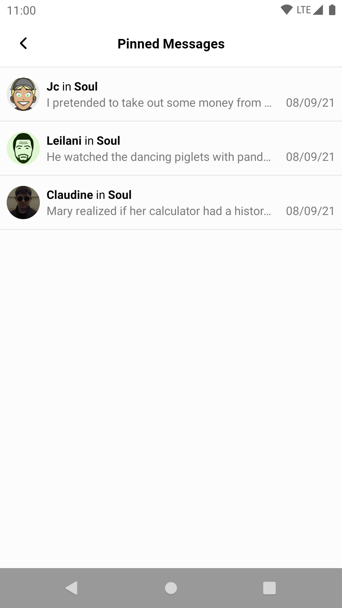
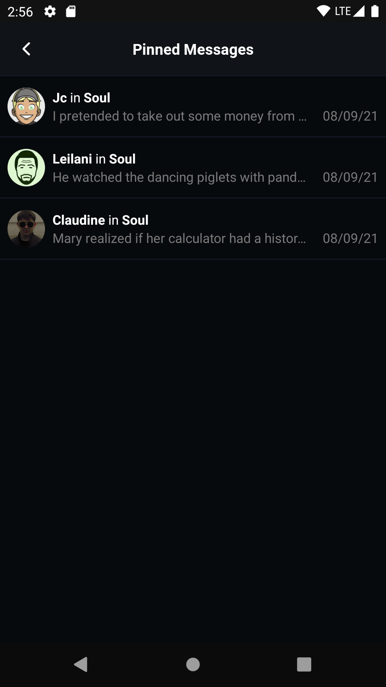

import Tabs from '@theme/Tabs';
import TabItem from '@theme/TabItem';

# Pinned Message List View

`PinnedMessageListView` is a UI Component that shows a list of pinned messages.

| Light Mode | Dark Mode |
| --- | --- |
|||

## Usage

You can add this View via XML:

```xml
<?xml version="1.0" encoding="utf-8"?>
<androidx.constraintlayout.widget.ConstraintLayout xmlns:android="http://schemas.android.com/apk/res/android"
    xmlns:app="http://schemas.android.com/apk/res-auto"
    android:layout_width="match_parent"
    android:layout_height="match_parent"
    >

    <io.getstream.chat.android.ui.pinned.list.PinnedMessageListView
        android:id="@+id/pinnedMessageListView"
        android:layout_width="0dp"
        android:layout_height="0dp"
        app:layout_constraintBottom_toBottomOf="parent"
        app:layout_constraintLeft_toLeftOf="parent"
        app:layout_constraintRight_toRightOf="parent"
        app:layout_constraintTop_toTopOf="parent"
        />

</androidx.constraintlayout.widget.ConstraintLayout>
```

We recommend using this view with its [ViewModel](../01-overview.mdx#viewmodels), which supplies it with data from the Stream API.

The basic setup of the ViewModel and connecting it to the View is done the following way:

<Tabs>
<TabItem value="kotlin" label="Kotlin">

```kotlin
val viewModel: PinnedMessageListViewModel by viewModels {
    PinnedMessageListViewModelFactory(cid = "channelType:channelId")
}
viewModel.bindView(pinnedMessageListView, viewLifecycleOwner)
```
</TabItem>

<TabItem value="java" label="Java">

```java
ViewModelProvider.Factory factory = new PinnedMessageListViewModelFactory.Builder()
        .cid("channelType:channelId")
        .build();
PinnedMessageListViewModel viewModel = new ViewModelProvider(this, factory).get(PinnedMessageListViewModel.class);

PinnedMessageListViewModelBinding.bind(viewModel, pinnedMessageListView, getViewLifecycleOwner());
```
</TabItem>
</Tabs>

From that point, you should be able to see the list of pinned messages.

:::note
`bindView` sets listeners on the View and the ViewModel. Any additional listeners should be set _after_ calling `bindView`.
:::

## Handling Actions

`PinnedMessageListView` allows you to configure certain actions on it:

<Tabs>
<TabItem value="kotlin" label="Kotlin">

```kotlin
pinnedMessageListView.setPinnedMessageSelectedListener { message ->
    // Handle a pinned message item being clicked
}
```
</TabItem>

<TabItem value="java" label="Java">

```java
pinnedMessageListView.setPinnedMessageSelectedListener(message -> {
    // Handle a mention item being clicked
});
```
</TabItem>
</Tabs>

The full list of available listeners is available [here](https://getstream.github.io/stream-chat-android/stream-chat-android-ui-components/io.getstream.chat.android.ui.pinned.list/-pinned-message-list-view/).
