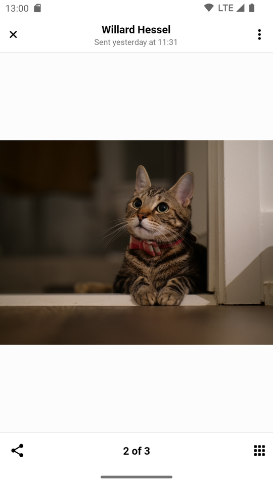
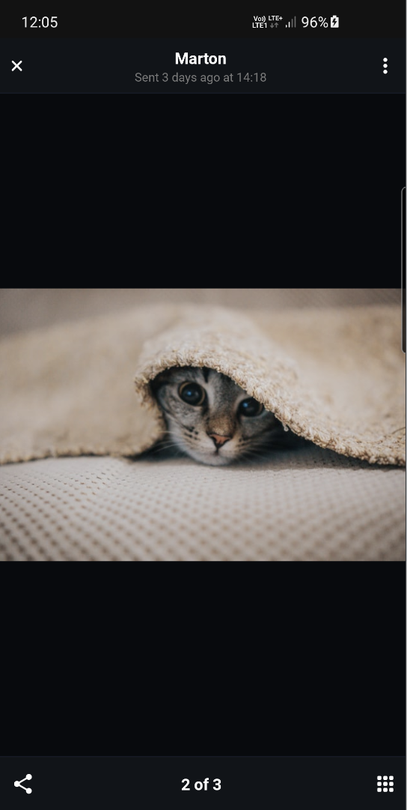
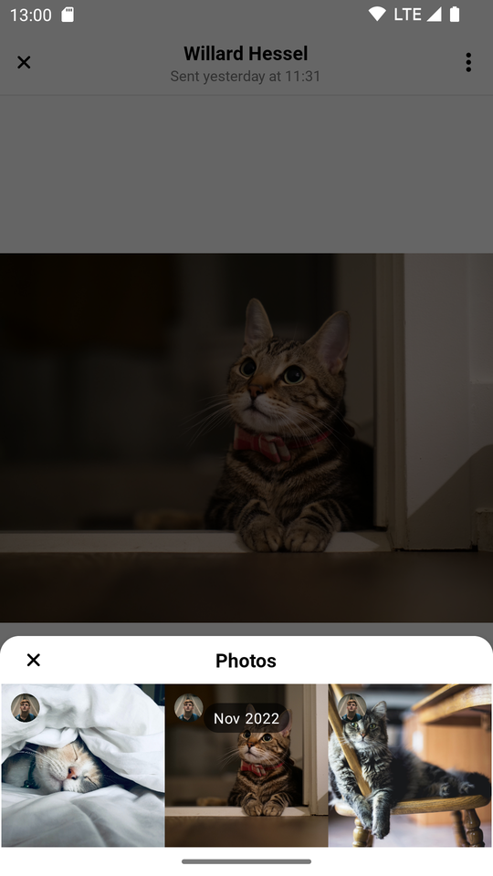
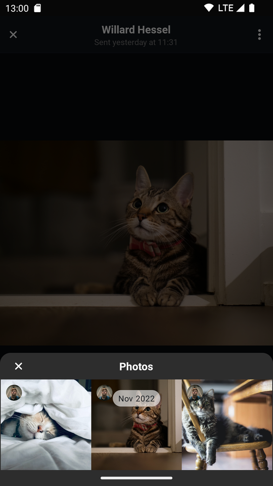
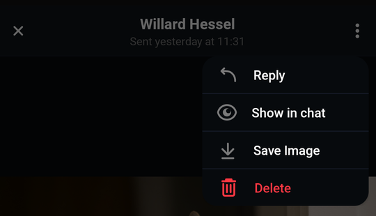
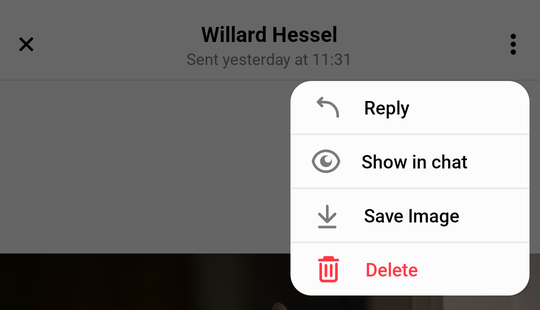
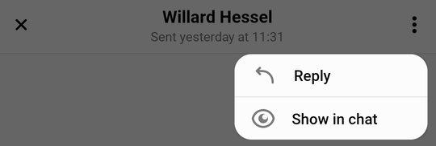
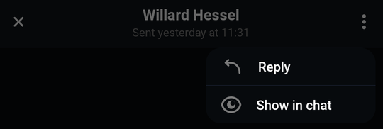

import Tabs from '@theme/Tabs';
import TabItem from '@theme/TabItem';

# Attachment Gallery

`AttachmentGalleryActivity` is an Activity used to display attachments that the users have sent in the chat. It is an image gallery where users can view, share, and download the pictures, and use a menu to easily navigate through them.

| Light Mode | Dark Mode |
| --- | --- |
|||
|||

## Handling Actions

There are four user actions that can be customized by the following handlers:

- `AttachmentReplyOptionHandler`
- `AttachmentShowInChatOptionHandler`
- `AttachmentDownloadOptionHandler`
- `AttachmentDeleteOptionHandler`

These are called when the user selects one of the options from the overflow menu in the top right:

|Light|Dark| 
|---|---|
|||

As the gallery is usually opened from `MessageListView`, you can set these handlers on that View the following way:

<Tabs>
<TabItem value="kotlin" label="Kotlin">

```kotlin
messageListView.setAttachmentReplyOptionClickHandler { resultItem ->
    resultItem.messageId
    // Handle reply to attachment
}

messageListView.setAttachmentShowInChatOptionClickHandler { resultItem ->
    resultItem.messageId
    // Handle show in chat
}

messageListView.setDownloadOptionHandler { resultItem ->
    resultItem.assetUrl
    // Handle download the attachment
}

messageListView.setAttachmentDeleteOptionClickHandler { resultItem ->
    resultItem.assetUrl
    resultItem.imageUrl
    // Handle delete
}
```
</TabItem>

<TabItem value="java" label="Java">

```java
messageListView.setAttachmentReplyOptionClickHandler(resultItem -> {
    resultItem.getMessageId();
    // Handle reply to attachment
});

messageListView.setAttachmentShowInChatOptionClickHandler(resultItem -> {
    resultItem.getMessageId();
    // Handle show in chat
});

messageListView.setDownloadOptionHandler(resultItem -> {
    resultItem.getAssetUrl();
    // Handle download the attachment
});

messageListView.setAttachmentDeleteOptionClickHandler(resultItem -> {
    resultItem.getAssetUrl();
    resultItem.getImageUrl();
    // Handle delete
});
```
</TabItem>
</Tabs>

## Navigating to the Attachment Gallery

By default, the Attachment Gallery is opened when a user clicks on an attachment in `MessageListView`. In which case, all actions mentioned above have a default implementation, which can be changed by overriding `MessageListView`'s handlers.

You can also navigate to `AttachmentGalleryActivity` manually from anywhere else in your code. In this case, you will need to implement all available actions:

<Tabs>
<TabItem value="kotlin" label="Kotlin">

```kotlin
// Create Attachment Gallery Destination
val destination = AttachmentGalleryDestination(
    requireContext(),
    attachmentReplyOptionHandler = { resultItem ->
        // Handle reply
    },
    attachmentShowInChatOptionHandler = { resultItem ->
        // Handle show image in chat
    },
    attachmentDownloadOptionHandler = { resultItem ->
        // Handle download image
    },
    attachmentDeleteOptionClickHandler = { resultItem ->
        // Handle delete image
    },
)

// Register destination with the ActivityResultRegistry
activity?.activityResultRegistry?.let { registry ->
    destination.register(registry)
}

// Set the data to display
destination.setData(attachmentGalleryItems = listOf(), attachmentIndex = 0)

// Fire the navigation request
ChatUI.navigator.navigate(destination)
```
</TabItem>

<TabItem value="java" label="Java">

```java
// Create Attachment Gallery Destination
AttachmentGalleryDestination destination = new AttachmentGalleryDestination(
        activity,
        resultItem -> {
            // Handle reply
        },
        resultItem -> {
            // Handle show image in chat
        },
        resultItem -> {
            // Handle download image
        },
        resultItem -> {
            // Handle delete image
        }
);

// Register destination with the ActivityResultRegistry
destination.register(activity.getActivityResultRegistry());

// Set the data to display
int attachmentIndex = 0;
destination.setData(Collections.emptyList(), attachmentIndex);

// Fire the navigation request
ChatUI.getNavigator().navigate(destination);
```
</TabItem>
</Tabs>

## Customization

The gallery can be customized through the use of styleable attributes. These are organized into individual styles which apply to a certain aspect or feature of the gallery.

You can find all of the styles listed [here](https://github.com/GetStream/stream-chat-android/blob/v5/stream-chat-android-ui-components/src/main/res/values/attrs_attachment_gallery_activity.xml).<br/>
Some of these styles are applied directly to stock Android components. These accept any attribute that is normally applicable to the given stock Android component. Others power Stream UI components and have custom made styled attributes.

- `streamUiAttachmentGalleryCloseButtonStyle`: Styles the button used to close the gallery. Accepts all `ImageView` attributes.
- `streamUiAttachmentGalleryTitleStyle`: Styles the title seen in the header. Accepts all `TextView` attributes.
- `streamUiAttachmentGalleryDateStyle`: Styles the date section in the header. Accepts all `TextView` attributes.
- `streamUiAttachmentGalleryActionsMenuStyle`: Styles the button used to activate the options menu. Accepts all `ImageView` attributes.
- `streamUiAttachmentGalleryBottomBarImageCountStyle`: Styles the text displaying the number of all media attachments contained within the message and the position of the one currently being viewed. Accepts all `TextView` attributes.
- `streamUiAttachmentGalleryBottomBarLeftIconStyle`: Styles the left icon inside the bottom bar. By default it shows a share icon. Accepts all `ImageView` attributes.
- `streamUiAttachmentGalleryBottomBarRightIconStyle`: Styles the right icon inside the bottom bar. By default it shows a tiled icon that opens the menu. Accepts all `ImageView` attributes.
- `streamUiAttachmentGalleryOptionsStyle`: Styles the actions menu. Accepts custom Stream attributes, all of which are listed [here](https://github.com/GetStream/stream-chat-android/blob/v5/stream-chat-android-ui-components/src/main/res/values/attrs_attachment_options_view.xml).

### Creating styles to change the appearance

Let's customize our screen by changing the attachment actions available to the user.

1. Create a style that disables the abilities to download and delete images:

```xml
<style name="CustomAttachmentGalleryOptionsStyle">
    <item name="streamUiDeleteEnabled">false</item>
    <item name="streamUiSaveImageEnabled">false</item>
</style>
```

2. Use the newly created style to create a custom Stream theme:

```xml
<style name="CustomStreamUiTheme" parent="@style/StreamUiTheme">
    <item name="streamUiAttachmentGalleryOptionsStyle">@style/CustomAttachmentGalleryOptionsStyle</item>
</style>
```

3. Finally, add the custom theme to your attachment gallery Activity theme, along with a few lines that make the status and navigation bars look prettier:

```xml
<style name="CustomAttachmentGalleryTheme" parent="Theme.MaterialComponents.DayNight.NoActionBar">
    <!-- Style the status and navigation bars -->
    <item name="android:windowLightStatusBar">?attr/isLightTheme</item>
    <item name="android:statusBarColor">@android:color/transparent</item>
    <item name="android:navigationBarColor">@android:color/transparent</item>

    <!-- Add custom stream theme you've created -->
    <item name="streamUiTheme">@style/CustomStreamUiTheme</item>
</style>
```

4. Finally, override the default gallery theme in your app's manifest:

```xml
<activity
   android:name="io.getstream.chat.android.ui.gallery.AttachmentGalleryActivity"
   android:theme="@style/CustomAttachmentGalleryTheme"
   tools:replace="android:theme" />
```

This results in the attachment actions menu looking like so:

|Light|Dark|
|---|---|
|||

Styling the gallery further follows the same trend as the previous example. Simply create a style which targets the feature you want to customize and add it to your custom Stream theme.

Now you have the ability to make the gallery feel like an organic part of your app.
