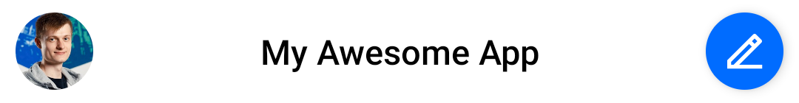
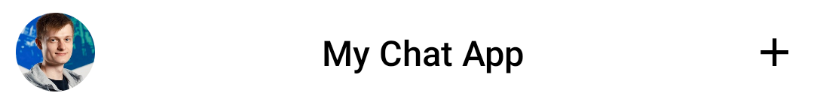

# ChannelListHeader

The `ChannelListHeader` component allows you to display a header for the channels screen. It sets up the following:

* **User avatar**: Shows the current user image.
* **Header title**: A component that shows the title of the header, or a loading view if there's no network available.
* **Action button**: A customizable trailing action shown at the end of the header, exposed as a parameter.

Let's see how to use the header.

## Usage

To use the `ChannelListHeader`, you can add it to your UI, within `setContent()`:

```kotlin
override fun onCreate(savedInstanceState: Bundle?) {
    super.onCreate(savedInstanceState)
        
    setContent {
        ChatTheme {
            ChannelListHeader(
                modifier = Modifier.fillMaxWidth(),
                currentUser = user,
                title = "My Awesome App"
            )
        }
    }
}
```

This will produce the UI below:



:::note 
The `ChannelListHeader` can be used without any parameters, but we advise that you pass in the title of your app, the current user, as well as the action handlers.
:::

Next, let's see how to handle actions in the header.

## Handling Actions

The `ChannelListHeader` exposes two main actions you can override and handle yourself, as per the signature:

```kotlin
@Composable
fun ChannelListHeader(
    ..., // State
    onAvatarClick: (User?) -> Unit = {},
    onHeaderActionClick: () -> Unit = {}
)
```

* `onAvatarClick`: Handler when the user taps on their own avatar.
* `onHeaderActionClick`: Handler when the user taps on the trailing action. This is only used if you don't override the `trailingContent` parameter, which defines the UI for the trailing icon.

:::note
The `trailingContent` parameter uses the `onHeaderActionClick` parameter for the default header action. If you want to keep the same UI but override the behavior, you need to change `onHeaderActionClick`. Otherwise, skip over to [Customization](#customization) to learn how to customize the action UI.
:::

To override the actions, you can use the following approach:

```kotlin
ChannelListHeader(
    ..., // State
    onHeaderActionClick = {}, // Default header action
    onAvatarClick = {} // Avatar click action
)
```

These two parameters let you gain more control over the behavior of the `ChannelListHeader`. Let's see how to customize the appearance next.

## Customization

In terms of UI customization, the `ChannelListHeader` exposes the following properties:

```kotlin
@Composable
fun ChannelListHeader(
    modifier: Modifier = Modifier,
    title: String = "",
    currentUser: User? = null,
    connectionState = ConnectionState.CONNECTED,
    color: Color = ChatTheme.colors.barsBackground,
    shape: Shape = ChatTheme.shapes.header,
    elevation: Dp = ChatTheme.dimens.headerElevation,
    leadingContent: @Composable RowScope.() -> Unit = { ... },
    centerContent: @Composable RowScope.() -> Unit = { ... },
    trailingContent: @Composable RowScope.() -> Unit = { ... },
    ... // Action handlers
)
```

* `modifier`: Modifier for the root component. You can use it to add padding or change the dimensions and such, however attributes such as color, shape and elevation have their own parameters.
* `title`: The text to show when you're connected to the Internet.
* `currentUser`: The state of the current user, for displaying the `Avatar`.
* `connectionState`: The state of WebSocket connection, used to switch between the title and the `NetworkLoadingView`.
* `color`: The color of the header.
* `shape`: The shape of the header.
* `elevation`: The elevation of the header.
* `leadingContent`: Represents the content at the beginning of the header. By default shows the channel avatar that you can override or change the behavior of `onAvatarClick`.
* `centerContent`: Represents the core and center part of the header. By default shows the title and the network status that you can override.
* `trailingContent`: Represents the content at the end of the header. By default shows a button that you can override or change the behavior of `trailingContent`.

Here's an example of customizing the UI of the header:

```kotlin
ChannelListHeader(
    // Customizing the appearance
    modifier = Modifier.fillMaxWidth(),
    currentUser = user,
    title = "My Chat App",
    connectionState = ConnectionState.CONNECTED,
    trailingContent = { // Customizing the trailing action
        Icon(
            modifier = Modifier.clickable {
                // Click handler for the custom action
            },
            imageVector = Icons.Default.Add,
            contentDescription = "Add",
            tint = ChatTheme.colors.textHighEmphasis
        )
    }
)
```

By passing in various pieces of data, you control which image is loaded for the `Avatar`, what title is shown, if you need to show the `NetworkLoadingView` or not and finally, what action to show at the end of the header. 

By overriding the `trailingContent` parameter, you replace the default action UI with your custom UI, and by adding a `clickable {}` modifier, you can add click actions on the custom component. This allows you to customize both the UI and behavior.
 
The snippet above will produce the following UI.



<!-- TODO WIP PAGE You can also choose to build a completely custom header and integrate it with the rest of our components. To learn how to do that, read our Building Custom Screens (../07-guides/05-building-custom-screens.mdx) guide. -->
