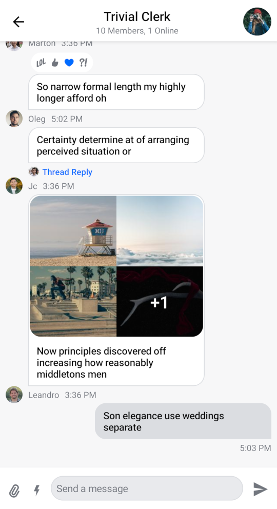
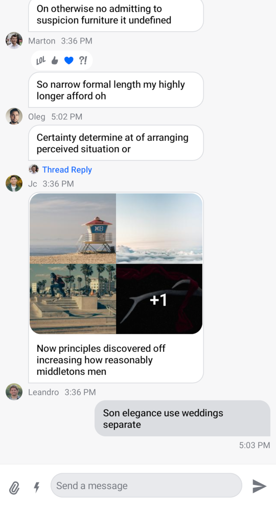

# MessagesScreen

The `MessagesScreen` component is the second screen component in the SDK, out of the box it provides you with the following features:

* **Header**: Displays a back button, the name of the channel or thread and a channel avatar.
* **Messages**: Shows a paginated list of messages if the data is available, otherwise displays the correct empty or loading state. Sets up action handlers and displays a button for quick scroll to bottom action.
* **Message composer**: Handles message input, attachments and message actions like editing, replying and more.
* **Attachment picker**: Allows the user to select images, files and media capture.
* **Message options**: Shown when the user selects the message by long tapping. Allows the user to react to messages and perform different actions such as deleting, editing, replying, starting a thread and more.
* **Reactions menu**: Shown when the user taps on a reaction to a message. Displays all of the reactions left on the message along with the option to add or change yours.

<!-- TODO WIP PAGE The `MessagesScreen` is very complex and sets up many interactions between different components. We recommend reading our Building Messages Screen (../07-guides/03-building-messages-screen.mdx) guide for more information on this component and other internal components. -->

## Usage

The benefit of a screen component solution is easy integration. All you need to do to integrate `MessagesScreen` in your app is to call it within `setContent()` in your `Activity` or `Fragment` and pass in the `MessagesViewModelFactory` with your `channelId`:

```kotlin
override fun onCreate(savedInstanceState: Bundle?) {
    super.onCreate(savedInstanceState)
    // Load the ID of the channel you've opened
    val channelId = "messaging:123"

    setContent {
        ChatTheme {
            MessagesScreen(
                viewModelFactory = MessagesViewModelFactory(
                    context = this,
                    channelId = channelId
                )
            )
        }
    }
}
```

This small snippet of code will render the UI shown below:

|  |
|---|

Next, learn more about handling screen actions.

## Handling Actions

The `MessagesScreen` component exposes two actions, as per the signature:

```kotlin
@Composable
fun MessagesScreen(
    ..., // State
    onBackPressed: () -> Unit = {},
    onHeaderActionClick: (channel: Channel) -> Unit = {},
)
```

* `onBackPressed`: Called when the user taps on the header back button.
* `onHeaderActionClick`: Called when the user taps on the header title. Useful for showing the channel information.

Here's an example of setting up custom behavior for the user tapping on the back button and the channel info:

```kotlin
MessagesScreen(
    ..., // State
    onBackPressed = { finish() }, // Navigation handler
    onHeaderActionClick = { channel ->
        // Show channel info
    },
)
```

## Customization

Given that `MessagesScreen` is a screen level solution, it offers limited customization. Currently, the options offered in the signature are the following:

```kotlin
@Composable
fun MessagesScreen(
    viewModelFactory: MessagesViewModelFactory,
    showHeader: Boolean = true,
    ... // action handlers and state
)
```

* `viewModelFactory`: The factory that you build yourself. This lets you control not just the way the `ViewModel`s are built, but also their lifecycle, as you can share them between components. This requires of you to provide a `channelId` in order to power the screen and show data, but it also allows you to customize the behavior of the screen through various parameters.
* `showHeader`: Controls whether the messages header is shown or not.

If you set `showHeader` to `false` you'll get the following UI:

|  |
|---|

As you can see, the header is removed from the screen, rendering only the list and the composer.

<!-- TODO WIP PAGE If you want more customization of this screen, read our Building Messages Screen (../07-guides/03-building-messages-screen.mdx) and Building Custom Screens (../07-guides/05-building-custom-screens.mdx) guides. -->
