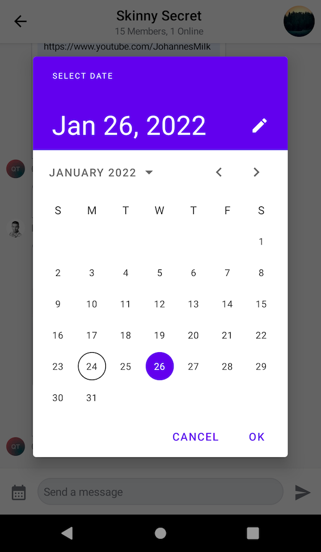
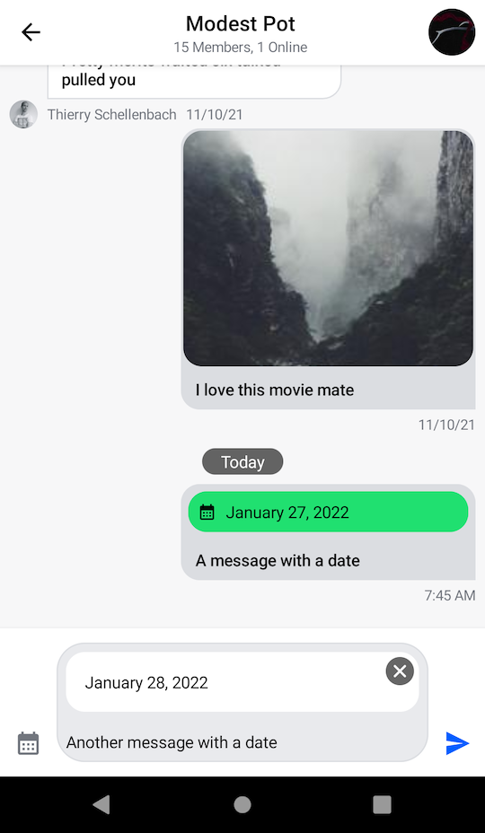
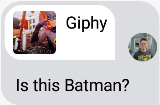
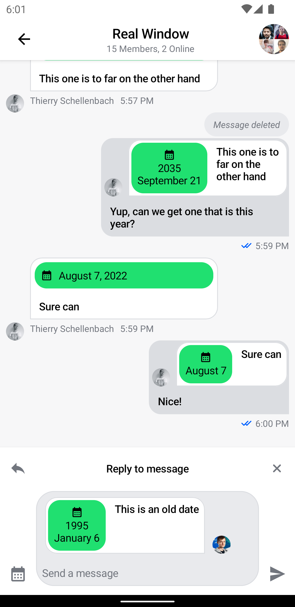

# Adding Custom Attachments

## Introduction

By default Stream Chat supports several built-in attachment types like image, video, file and giphy. Apart from that, you can also add your own types of attachments such as location, contact, audio, sticker, etc.

In this guide, we will demonstrate how to build a date sharing feature. Chat users will be able to pick a date from a calendar, preview their selection in the message composer and see the sent attachment within a message in the message list.

This involves doing the following steps:
1. Implementing a custom message composer that is capable of sending a message with `date` attachments.
2. Adding support for `date` attachments by creating a custom [AttachmentFactory](https://getstream.io/chat/docs/sdk/android/compose/general-customization/attachment-factory/).

:::note
In this guide, we'll show only the main points concerning custom attachments and their factories. Smaller parts will be omitted for the sake of being concise.

You can find the full code from this guide on [GitHub](https://github.com/GetStream/stream-chat-android/tree/main/stream-chat-android-ui-guides/src/main/java/io/getstream/chat/android/guides/catalog/compose/customattachments). To check the final result, clone the repository and run the `stream-chat-android-ui-guides` module.
:::

## Sending Date Attachments

To begin with, you'll need a custom message composer with a button to pick dates. Here's the code for this component:

```kotlin
@Composable
fun CustomMessageComposer(
    viewModel: MessageComposerViewModel,
    onDateSelected: (Long) -> Unit,
) {
    val activity = LocalContext.current as AppCompatActivity

    MessageComposer(
        modifier = Modifier
            .fillMaxWidth()
            .wrapContentHeight(),
        viewModel = viewModel,
        integrations = { // here
            IconButton(
                modifier = Modifier
                    .size(48.dp)
                    .padding(12.dp),
                content = {
                    Icon(
                        painter = painterResource(id = R.drawable.ic_calendar),
                        contentDescription = null,
                        tint = ChatTheme.colors.textLowEmphasis
                    )
                },
                onClick = {
                    MaterialDatePicker.Builder
                        .datePicker()
                        .build()
                        .apply {
                            show(activity.supportFragmentManager, null)
                            addOnPositiveButtonClickListener {
                                onDateSelected(it)
                            }
                        }
                }
            )
        }
    )
}
```
For simplicity, the `integration` section to the left of the message input has only one button that is used to show the date picker dialog.

What's happening here is that within the `integrations`, you define a custom button to open the picker. Within its `onClick`, you build a new `MaterialDatePicker` and show it using `activity.supportFragmentManager`.

If the user selects a date and selects the positive button, you proceed to call `onDateSelected()` and update the state. But more on that later.

Next, you'll need to create a custom messages screen that makes use of the composer that you've created above:

```kotlin
@Composable
fun CustomMessagesScreen(
    channelId: String,
    onBackPressed: () -> Unit = {}
) {
    val factory = MessagesViewModelFactory(
        context = LocalContext.current,
        channelId = channelId,
    )

    val composerViewModel = viewModel(MessageComposerViewModel::class.java, factory = factory)

    // Other declarations
    
    Box(modifier = Modifier.fillMaxSize()) {
        Scaffold(
            modifier = Modifier.fillMaxSize(),
            topBar = {
                // Message list header
            },
            bottomBar = {
                // 1
                CustomMessageComposer(
                    viewModel = composerViewModel,
                    onDateSelected = {
                        // 2
                        val date = DateFormat
                            .getDateInstance(DateFormat.LONG)
                            .format(Date(it))
                        val attachment = Attachment(
                            type = "date",
                            extraData = mutableMapOf("payload" to date)
                        )
                        // 3
                        composerViewModel.addSelectedAttachments(listOf(attachment))
                    }
                )
            }
        ) {
            // Message list setup - available in the full code sample
        }
    }
}
```

:::note
The full source code of the `CustomMessagesScreen` component is available [here](https://github.com/GetStream/Android-Samples/blob/main/compose-custom-attachments/src/main/java/io/getstream/chat/android/compose/customattachments/ui/CustomMessagesScreen.kt).
:::

In the snippet above, you:

1. Make use of the newly created custom message composer in our messages screen, as the `bottomBar`.
2. Create a custom attachment of type `date` carrying the selected date as a payload.
3. Submit the attachment with the selected date to the message composer.

Now you can send a custom attachment of type `date` to the chat. The resulting UI will look like this:



Now that you've set up the `DatePicker` and the custom composer, you need to build a custom attachment factory to render the item both in the input and the list. 

## Rendering Date Attachments

Let's see how to create an [AttachmentFactory](../03-general-customization/02-attachment-factory.mdx) that is capable of handling date attachments:

```kotlin
val dateAttachmentFactory: AttachmentFactory = AttachmentFactory(
    canHandle = { attachments -> attachments.any { it.type == "date" } },
    content = @Composable { modifier, attachmentState ->
      // Composable that represents the UI of "date" attachments in the message list
    },
    previewContent = { modifier, attachments, onAttachmentRemoved ->
      // Composable that represents the UI of "date" attachments in the message input
    },
    textFormatter = { attachment -> 
      // String representation of the attachment in the channel list
    }
)
```

There are four important parts of each attachment factory:

* `canHandle`: Describes the condition that tells our components if the factory can handle a given set of attachments.
* `content`: Represents the attachment UI within the `MessageList`.
* `previewContent`: Represents the attachment UI within the `MessageComposer`.
* `textFormatter`: Shows the attachment information formatted for our `ChannelItem`s.

Let's start with creating a component for the message input:

```kotlin
@Composable
fun DateAttachmentPreviewContent(
    attachments: List<Attachment>,
    onAttachmentRemoved: (Attachment) -> Unit,
    modifier: Modifier = Modifier,
) {
    val attachment = attachments.first { it.type == "date" }
    val formattedDate = attachment.extraData["payload"].toString()

    Box(
        modifier = modifier
            .wrapContentHeight()
            .clip(RoundedCornerShape(16.dp))
            .background(color = ChatTheme.colors.barsBackground)
    ) {
        Text(
            modifier = Modifier
                .align(Alignment.CenterStart)
                .padding(16.dp)
                .fillMaxWidth(),
            text = formattedDate,
            style = ChatTheme.typography.body,
            maxLines = 1,
            color = ChatTheme.colors.textHighEmphasis
        )

        CancelIcon(
            modifier = Modifier
                .align(Alignment.TopEnd)
                .padding(4.dp),
            onClick = { onAttachmentRemoved(attachment) }
        )
    }
}
```

Then, create a component that will be rendered in the message list:

```kotlin
@Composable
fun DateAttachmentContent(
    attachmentState: AttachmentState,
    modifier: Modifier = Modifier,
) {
    val attachment = attachmentState.message.attachments.first { it.type == "date" }
    val formattedDate = attachment.extraData["payload"].toString()

    Column(
        modifier = modifier
            .fillMaxWidth()
            .padding(4.dp)
            .clip(ChatTheme.shapes.attachment)
            .background(ChatTheme.colors.infoAccent)
            .padding(8.dp)
    ) {
        Row(
            horizontalArrangement = Arrangement.spacedBy(8.dp),
            verticalAlignment = Alignment.CenterVertically
        ) {
            Icon(
                modifier = Modifier.size(16.dp),
                painter = painterResource(id = R.drawable.ic_calendar),
                contentDescription = null,
                tint = ChatTheme.colors.textHighEmphasis,
            )

            Text(
                text = formattedDate,
                style = ChatTheme.typography.body,
                maxLines = 1,
                color = ChatTheme.colors.textHighEmphasis
            )
        }
    }
}
```

What's important here is how you're able to fetch the custom attachment data, using `attachment.extraData["payload"]`. You can format the data in any way you want here, which makes our attachments very powerful.

Finally, you need to provide a string representation of the attachment for message preview:

```kotlin
textFormatter = { attachment -> 
    attachment.extraData["payload"].toString()
}
```

Now your attachment factory is complete and looks like that:

```kotlin
val dateAttachmentFactory: AttachmentFactory = AttachmentFactory(
    canHandle = { attachments -> attachments.any { it.type == "date" } },
    content = @Composable { modifier, attachmentState ->
        DateAttachmentContent(
            modifier = modifier,
            attachmentState = attachmentState
        )
    },
    previewContent = { modifier, attachments, onAttachmentRemoved ->
        DateAttachmentPreviewContent(
            modifier = modifier,
            attachments = attachments,
            onAttachmentRemoved = onAttachmentRemoved
        )
    },
    textFormatter = { attachment -> 
      attachment.extraData["payload"].toString()
    },
)
```

To complete the date sharing feature you just need to provide `dateAttachmentFactory` along with the default attachment factories via `ChatTheme`:

```kotlin
class MessagesActivity : AppCompatActivity() {

    override fun onCreate(savedInstanceState: Bundle?) {
        super.onCreate(savedInstanceState)
        val channelId = requireNotNull(intent.getStringExtra(KEY_CHANNEL_ID))

        val customFactories = listOf(dateAttachmentFactory)
        val defaultFactories = StreamAttachmentFactories.defaultFactories()

        setContent {
            // Pass in custom factories or combine them with the default ones
            ChatTheme(attachmentFactories = customFactories + defaultFactories) {
                CustomMessagesScreen(
                    channelId = channelId,
                    onBackPressed = { finish() }
                )
            }
        }
    }

    companion object {
        private const val KEY_CHANNEL_ID = "channelId"

        fun getIntent(context: Context, channelId: String): Intent {
            return Intent(context, MessagesActivity::class.java).apply {
                putExtra(KEY_CHANNEL_ID, channelId)
            }
        }
    }
}
```

Date attachments should be now correctly rendered in the message composer and in the message list like on the screenshot below:



With just a few lines of code, you're able to render any custom UI within the `MessageComposer` and `MessageList` components of our SDK. This gives the ability to build powerful features without having to change our default components — you just need a custom `AttachmentFactory`!

## Quoted Messages

Stream SDK supports quoting or replying to messages, even if they contain attachments. These quoted messages are shown inside the message bubble above the text you wrote when quoting, which is a common pattern in various chat services.



Since the quoted content is nested inside a regular message, it has less space available and requires a different layout. For this reason, the Compose SDK provides separate attachment factories just for the quoted content. This allows you to provide a different UI for attachments that are displayed as a part of the quoted content.

Attachment factories used for displaying quoted content extend the same `class` as regular attachment factories. As such, they are interchangeable. If you don't provide a `quotedAttachmentFactory` that can render your custom type of attachments, we will use your custom `attachmentFactory` by default in our UI, instead.

Let's see how to build a custom **quoted attachment factory**.

## Rendering Quoted Date Attachments

We will be using the same [AttachmentFactory](https://getstream.io/chat/docs/sdk/android/compose/general-customization/attachment-factory/) type for quoted messages.

Let's start with creating a component that will be used to render the quoted message inside the regular message content:

```kotlin
@Composable
fun QuotedDateAttachmentContent(
    attachmentState: AttachmentState,
    modifier: Modifier = Modifier,
) {
    val attachment = attachmentState.message.attachments.first { it.type == "date" }
    val date = attachment.extraData["payload"].toString()
    val formattedDate = StringBuilder().apply {
        val dateTime = SimpleDateFormat("MMMMM dd, yyyy", Locale.getDefault()).parse(date) ?: return@apply
        val year = Calendar.getInstance().apply {
            timeInMillis = dateTime.time
        }.get(Calendar.YEAR)
        if (Calendar.getInstance().get(Calendar.YEAR) != year) {
            append(year).append("\n")
        }
        append(date.replace(", $year", ""))
    }.toString()

    Column(
        modifier = modifier
            .padding(4.dp)
            .clip(ChatTheme.shapes.attachment)
            .background(ChatTheme.colors.infoAccent)
            .padding(8.dp)
    ) {
        Column(
            horizontalAlignment = Alignment.CenterHorizontally
        ) {
            Icon(
                modifier = Modifier.size(16.dp),
                painter = painterResource(id = R.drawable.ic_calendar),
                contentDescription = null,
                tint = ChatTheme.colors.textHighEmphasis,
            )

            Text(
                text = formattedDate,
                style = ChatTheme.typography.body,
                color = ChatTheme.colors.textHighEmphasis,
                textAlign = TextAlign.Center
            )
        }
    }
}
```

As before, we are fetching the custom attachment data using `attachment.extraData["payload"]`. We also hide the year if it's the same as the current one and we add a new line before the date for a more compact preview.

This time we don't need the `textFormatter` or `previewContent`. The `textFormatter` is used to show the description of the attachment in the `ChannelList` and that will be handled by the parent message. The `previewContent` is used in the `MessageComposer` and it only shows the parent message before it's sent.

Now your attachment factory should be complete and look like this:

```kotlin
val quotedDateAttachmentFactory: AttachmentFactory = AttachmentFactory(
    canHandle = { attachments -> attachments.any { it.type == "date" } },
    content = @Composable { modifier, attachmentState ->
        QuotedDateAttachmentContent(
            modifier = modifier,
            attachmentState = attachmentState
        )
    }
)
```

To complete the quoted date sharing feature you just need to provide `quotedDateAttachmentFactory` along with the default quoted attachment factories via `ChatTheme`:

```kotlin
class MessagesActivity : AppCompatActivity() {

    override fun onCreate(savedInstanceState: Bundle?) {
        super.onCreate(savedInstanceState)
        val channelId = requireNotNull(intent.getStringExtra(KEY_CHANNEL_ID))

        val customFactories = listOf(dateAttachmentFactory)
        val defaultFactories = StreamAttachmentFactories.defaultFactories()

        val customQuotedFactories = listOf(quotedDateAttachmentFactory)
        val defaultQuotedFactories = StreamAttachmentFactories.defaultQuotedFactories()

        setContent {
            // pass in custom factories or combine them with the default ones
            ChatTheme(attachmentFactories = customFactories + defaultFactories, quotedAttachmentFactories = customQuotedFactories + defaultQuotedFactories) {
                CustomMessagesScreen(
                    channelId = channelId,
                    onBackPressed = { finish() }
                )
            }
        }
    }

    companion object {
        private const val KEY_CHANNEL_ID = "channelId"

        fun getIntent(context: Context, channelId: String): Intent {
            return Intent(context, MessagesActivity::class.java).apply {
                putExtra(KEY_CHANNEL_ID, channelId)
            }
        }
    }
}
```

:::note
To show the `MessageOptions`, you need to add the component to the `CustomMessagesScreen`. We'll skip this part for the sake of the guide.

You can find the full source code of the `CustomMessagesScreen` component [here](https://github.com/GetStream/Android-Samples/blob/main/compose-custom-attachments/src/main/java/io/getstream/chat/android/compose/customattachments/ui/CustomMessagesScreen.kt), where everything is set up.
:::

Quoted date attachments should now be correctly rendered in messages where they're quoted, like in the screenshot below:



With even fewer lines of code than the previous custom attachment factory we have adjusted the date preview to fit a smaller layout retaining all the relevant data. This gives you even more fine grained customization to build powerful and responsive UI with the same reusable components.