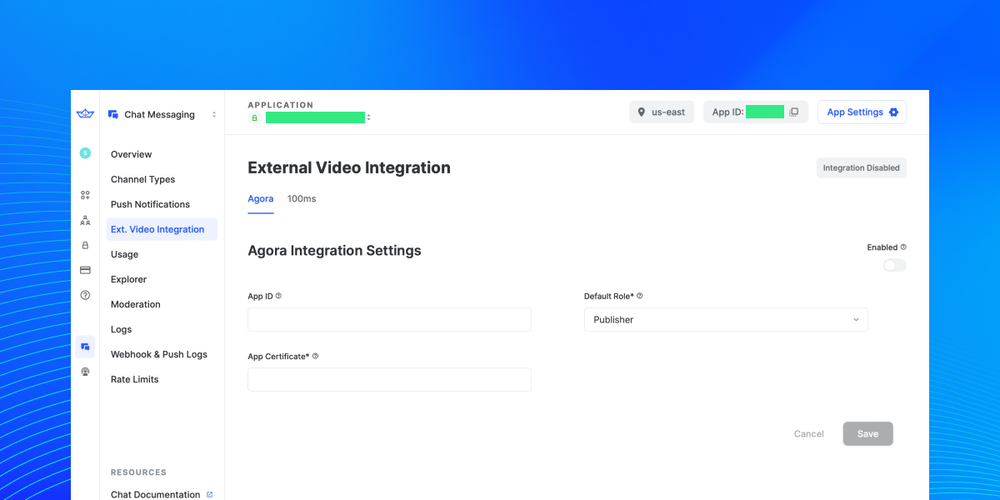
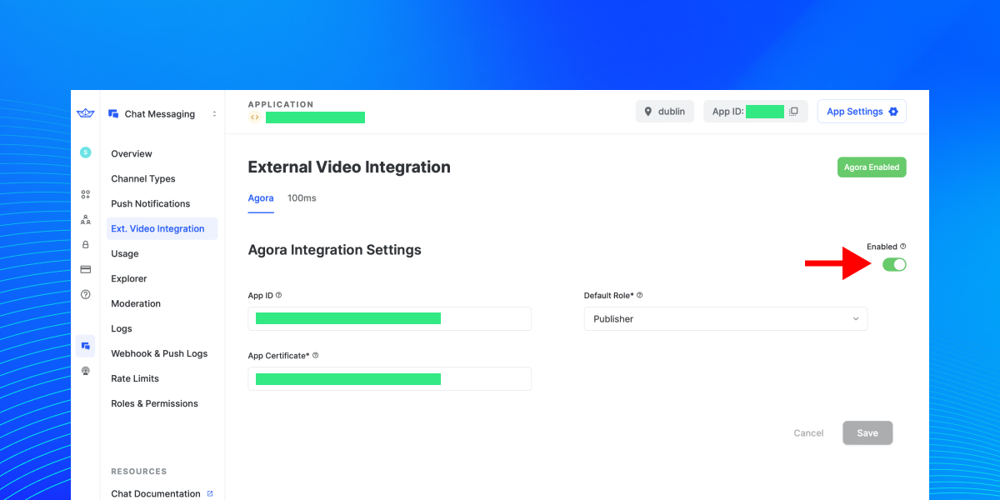
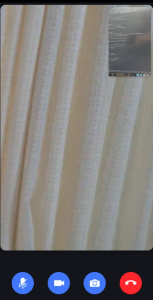
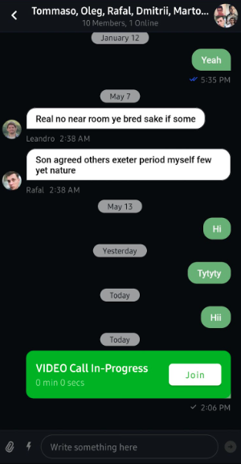

# Agora: Guide for Android

<!-- Code is available here: https://github.com/GetStream/android-video-integration-agora -->


This page shows you how to integrate [Agora](https://www.agora.io/en/) into Stream Chat SDK for implementing video call features.

## Introduction
Video calls have become immensely popular since the onset of the pandemic. Today, we take a look at how you can use the service of **[Agora](https://www.agora.io/en/)** to integrate video calls into the Stream Chat SDK.

**Agora** is an infrastructure provider for live, interactive voice and video. They offer native SDKs for mobile platforms, cross-platform frameworks, and the web and allow for simple integration with very few lines of code. They cover a wide range of use cases such as video conferencing, interactive live-streaming, real-time messaging, and many more.

You must complete quite a few steps to create the final product. We will cover all of them to help you create a well-integrated, fully functional, and reusable solution in the end.

Follow the steps below to produce this app that allows your users to make video calls:

1. Setting up an account for **Agora**
2. Stream Dashboard integration
3. Configure dependencies and permissions
4. Implement a ViewModel for video calls
5. Implement video call layouts
6. Implement custom call messages using custom attachments

:::note
This tutorial assumes you already use [Stream Chat SDK for Android](https://getstream.io/chat/sdk/android/) in your Android project. So you will not cover how to set up the Stream Chat SDK in this tutorial. For more information, check out the [Android Chat Messaging Tutorial](https://getstream.io/tutorials/android-chat/) guide.
:::

## 1. Setting up an account for Agora

You need to set up an account on the agora.io website. Once you’ve created the account, you will need to create a project and look for it in the console. Once you have that ready, you will need to prepare two things for the creation of the server in the next chapter:

- App ID
- App certificate

Once you have these two available you can continue with this guide.

## 2. Stream Dashboard integration

In order for the integration of **Agora** to work there needs to be a server component handling token generation and more. Normally this would require a custom server implementation but Stream offers first-class integration for **Agora** relieving you of these duties.

There are only a few setup steps to go through in the Stream dashboard and this guide details all of them:

1. Head over to the [Dashboard](https://dashboard.getstream.io) and login
2. Create a new app or select your app by name
3. In the sidebar on the left, select **Ext. Video Integration**
4. Make sure the **Agora** tab is selected

This is the screen that you navigated to:



First, it is necessary to enable the integration through the toggle in the top right (red arrow in the image below). Make sure that you can see the green **Agora Enabled** badge at the top.

Next, it is necessary to enter the credentials from the **Agora** console. This is the place you need to enter the aforementioned `app id` and `app certificate` from the **Agora** console.



With these steps being taken, the Stream Chat SDK will use these credentials internally to initiate calls without you needing to take additional steps.

So, let's focus on the Video call implementation.

## 3. Configure Dependencies and Permissions

Before you dive in, you need to configure the dependencies. First, add the codes below to your root `settings.gradle` at the end of the `repositories closure`:

```groovy
dependencyResolutionManagement {
    repositoriesMode.set(RepositoriesMode.FAIL_ON_PROJECT_REPOS)
    repositories {
        google()
        mavenCentral()
        maven { url "https://jitpack.io" }
    }
}
```

Next, add the dependencies below to your app-level **build.gradle** file:

```groovy {2, 5}
// Agora SDK
implementation "io.agora.rtc:full-sdk:4.0.0.4"

// Stream chat SDK
implementation "io.getstream:stream-chat-android-ui-components:6.0.0"
implementation "io.getstream:stream-chat-android-offline:6.0.0"
```

Add permissions for network and device access. In `/app/Manifests/AndroidManifest.xml`, add the following permissions after `</application>` tag:

```xml
 <uses-permission android:name="android.permission.INTERNET" />
 <uses-permission android:name="android.permission.CAMERA" />
 <uses-permission android:name="android.permission.RECORD_AUDIO" />
 <uses-permission android:name="android.permission.MODIFY_AUDIO_SETTINGS" />
 <uses-permission android:name="android.permission.ACCESS_WIFI_STATE" />
 <uses-permission android:name="android.permission.ACCESS_NETWORK_STATE" />
 <uses-permission android:name="android.permission.BLUETOOTH" />
```

## 4. Implement a ViewModel For Video Calls

We will implement a `VideoCallViewModel`, which includes all video-relevant behaviors, such as creating a dynamic call, requesting an authentication token, connecting to a video call, and toggling the mic or video. 

First, you should create a data class called `AgoraCall` to contain video call information like the below:

```kotlin
data class AgoraCall(
    val channel: String,
    val token: String
)
```

Next, according to [Agora’s Start a Video Call guides](https://docs.agora.io/en/video-call-4.x/start_call_android_ng?platform=Android), you should initialize [RtcEngine](https://docs.agora.io/en/video-call-4.x/API%20Reference/java_ng/API/class_irtcengine.html) that allows you to implement the core functions of real-time communication.

```kotlin
class VideoCallViewModel constructor(
    private val application: Application,
    private val chatClient: ChatClient,
    private val cid: String
) : ViewModel() {

    // Fill the App ID of your project generated on Agora Console.
    private val agoraAppId = "Your Agora App ID"

    private var onSetupRemoteVideo: ((Int) -> Unit)? = null

    private val mRtcEventHandler: IRtcEngineEventHandler = object : IRtcEngineEventHandler() {
        // Listen for the remote host joining the channel to get the uid of the host.
        override fun onUserJoined(uid: Int, elapsed: Int) {
            onSetupRemoteVideo?.invoke(uid)
        }
    }

    init {
        try {
            val config = RtcEngineConfig().apply {
                mContext = application
                mAppId = agoraAppId
                mEventHandler = mRtcEventHandler
            }
            rtcEngine = RtcEngine.create(config)
        } catch (e: java.lang.Exception) {
            throw RuntimeException("Check the error.")
        }
    }
}
```

As you can see from the sample above, you need to create `RtcEngineConfig` with the App ID that you’ve already got from your **Agora** Dashboard and `IRtcEngineEventHandler` that listens for the remote host joining the channel. 

Next, you can create a new video call with an unique call id and get a video call token with Stream chat SDK like the below:

```kotlin
private suspend fun createVideoCall(): VideoCallInfo = withContext(Dispatchers.IO) {
    val uuid = UUID.randomUUID().toString()
    val (channelType, channelId) = cid.cidToTypeAndId()
    val result = chatClient.createVideoCall(
        channelType = channelType,
        channelId = channelId,
        callType = CallType.VIDEO.name.lowercase(),
        callId = uuid
    ).await()
    when (result) {
        is Result.Success -> result.value
        is Result.Failure -> throw IllegalStateException("Couldn't create a call.")
    }
}

private suspend fun getVideoCallToken(callId: String): String = withContext(Dispatchers.IO) {
    when (val result = chatClient.getVideoCallToken(callId).await()) {
        is Result.Success -> result.value.token
        is Result.Failure -> throw IllegalStateException("Couldn't get a token.")
    }
}
```

Stream chat SDK provides video integration APIs for **Agora**, so you can create a new video call and get a video call token from the Stream server without building your own backend service.

Next, you should create a new function called `createVideoCallOrJoin` that receives the` onCreateRoom` lambda function to pass the result as an instance of `AgoraCall` like the below:

```kotlin
fun createVideoCallOrJoin(channel: String?, onCreateRoom: (AgoraCall) -> Unit) {
    viewModelScope.launch {
        try {
            val videoCallInfo = createVideoCall()
            val createdVideoChannel = channel ?: videoCallInfo.agoraChannel.channel
            val token = getVideoCallToken(videoCallInfo.callId)
            onCreateRoom.invoke(
                AgoraCall(
                    channel = createdVideoChannel,
                    token = token
                )
            )
        } catch (e: Exception) {
            Timber.e(e)
        }
    }
}
```

As you can see from the sample above, the `createVideoCallOrJoin` function receives the `onCreateRoom` lambda function, and it will be invoked when the function gets results from the API calls. You will receive an instance of `AgoraCall` as a result in the call site, and you can configure the video layouts with it.

As a result, the full source code of the `VideoCallViewModel` will be like the below:

```kotlin
class VideoCallViewModel constructor(
    private val application: Application,
    private val chatClient: ChatClient,
    private val cid: String
) : ViewModel() {

    val rtcEngine: RtcEngine

    private val _loading = MutableLiveData(true)
    val loading: LiveData<Boolean> = _loading

    private val _muteVideo = MutableStateFlow(false)
    val muteVideo: StateFlow<Boolean> = _muteVideo

    private val _muteMic = MutableStateFlow(false)
    val muteMic: StateFlow<Boolean> = _muteMic

    private var onSetupRemoteVideo: ((Int) -> Unit)? = null

    private val mRtcEventHandler: IRtcEngineEventHandler = object : IRtcEngineEventHandler() {
        // Listen for the remote host joining the channel to get the uid of the host.
        override fun onUserJoined(uid: Int, elapsed: Int) {
            onSetupRemoteVideo?.invoke(uid)
        }
    }

    // Fill the App ID of your project generated on Agora Console.
    private val agoraAppId = "Your Agora App ID"

    init {
        try {
            val config = RtcEngineConfig().apply {
                mContext = application
                mAppId = agoraAppId
                mEventHandler = mRtcEventHandler
            }
            rtcEngine = RtcEngine.create(config)
        } catch (e: java.lang.Exception) {
            throw RuntimeException("Check the error.")
        }
    }

    fun createVideoCallOrJoin(channel: String?, onCreateRoom: (AgoraCall) -> Unit) {
        viewModelScope.launch {
            try {
                val videoCallInfo = createVideoCall()
                val createdVideoChannel = channel ?: videoCallInfo.agoraChannel.channel
                val token = getVideoCallToken(videoCallInfo.callId)
                onCreateRoom.invoke(
                    AgoraCall(
                        channel = createdVideoChannel,
                        token = token
                    )
                )
            } catch (e: Exception) {
                Timber.e(e)
            }
        }
    }

    private suspend fun createVideoCall(): VideoCallInfo = withContext(Dispatchers.IO) {
        val uuid = UUID.randomUUID().toString()
        val (channelType, channelId) = cid.cidToTypeAndId()
        val result = chatClient.createVideoCall(
            channelType = channelType,
            channelId = channelId,
            callType = CallType.VIDEO.name.lowercase(),
            callId = uuid
        ).await()
        when (result) {
            is Result.Success -> result.value
            is Result.Failure -> throw IllegalStateException("Couldn't create a call.")
        }
    }

    private suspend fun getVideoCallToken(callId: String): String = withContext(Dispatchers.IO) {
        when (val result = chatClient.getVideoCallToken(callId).await()) {
            is Result.Success -> result.value.token
            is Result.Failure -> throw IllegalStateException("Couldn't get a token.")
        }
    }

    fun setupRemoteVideo(onSetupRemoteVideo: (Int) -> Unit) {
        this.onSetupRemoteVideo = onSetupRemoteVideo
    }

    fun toggleVideo() {
        if (muteVideo.value) {
            rtcEngine.disableVideo()
        } else {
            rtcEngine.enableVideo()
        }
        _muteVideo.value = !muteVideo.value
    }

    fun toggleMic() {
        if (muteMic.value) {
            rtcEngine.disableVideo()
        } else {
            rtcEngine.enableVideo()
        }
        _muteMic.value = !muteMic.value
    }

    fun toggleCamera() {
        rtcEngine.switchCamera()
    }

    fun leaveCall() {
        rtcEngine.leaveChannel()
    }
}
```

Let’s break down each method one by one:

- **createVideoCallOrJoin**: This method requests an authentication token to the Stream server and joins a call with a specific `channel` parameter. If the `channel` is null, it will request creating a new call dynamically.
- **createVideoCall**: This method creates a new call dynamically with a unique UUID for the call id.
- **getVideoCallToken**: This method requests an authentication token to the Stream server.

For more information about the `RtcEngine`, check out the [Agora’s Start a Video Call guides](https://docs.agora.io/en/video-call-4.x/start_call_android_ng?platform=Android).

## 5. Implement Video Call Layouts

Now you’ll implement a video call screen like the below:


1. A vertical list of all call participants
2. The user’s own video (placed at the top right above the other content)
3. A row of buttons at the bottom to control certain call elements (namely, toggle audio, video, rotate the camera, and end call)

So let’s create a video call layout.

### Create a Video Call Layout

First, you should create a video call layout that renders a user’s video, a list of participants, and call interaction buttons that you’ve seen in the image above. You implement the `fragment_video_call.xml` file like the below:

```xml
<?xml version="1.0" encoding="utf-8"?>
<layout xmlns:android="http://schemas.android.com/apk/res/android"
    xmlns:app="http://schemas.android.com/apk/res-auto">

    <data>

        <variable
            name="vm"
            type="io.getstream.video.agora.ui.call.VideoCallViewModel" />
    </data>

    <androidx.constraintlayout.widget.ConstraintLayout
        android:layout_width="match_parent"
        android:layout_height="match_parent"
        android:background="@color/background">

        <FrameLayout
            android:id="@+id/remote_video_view_container"
            android:layout_width="0dp"
            android:layout_height="0dp"
            android:background="@android:color/white"
            app:layout_constraintBottom_toBottomOf="parent"
            app:layout_constraintEnd_toEndOf="parent"
            app:layout_constraintStart_toStartOf="parent"
            app:layout_constraintTop_toTopOf="parent" />

        <androidx.cardview.widget.CardView
            android:layout_width="110dp"
            android:layout_height="180dp"
            android:layout_margin="12dp"
            app:cardCornerRadius="14dp"
            app:cardElevation="6dp"
            app:layout_constraintEnd_toEndOf="parent"
            app:layout_constraintTop_toTopOf="parent">

            <FrameLayout
                android:id="@+id/local_video_view_container"
                android:layout_width="match_parent"
                android:layout_height="match_parent"
                android:background="@android:color/darker_gray" />

        </androidx.cardview.widget.CardView>

        <androidx.constraintlayout.widget.ConstraintLayout
            android:layout_width="match_parent"
            android:layout_height="wrap_content"
            android:paddingVertical="18dp"
            app:gone="@{vm.loading}"
            app:layout_constraintBottom_toBottomOf="parent"
            app:layout_constraintEnd_toEndOf="parent"
            app:layout_constraintStart_toStartOf="parent">

            <ImageView
                android:id="@+id/mic"
                android:layout_width="wrap_content"
                android:layout_height="wrap_content"
                android:src="@drawable/ic_mic"
                app:layout_constraintBottom_toBottomOf="parent"
                app:layout_constraintEnd_toStartOf="@id/video"
                app:layout_constraintStart_toStartOf="parent"
                app:layout_constraintTop_toTopOf="parent"
                app:toggleMic="@{vm.muteMic}" />

            <ImageView
                android:id="@+id/video"
                android:layout_width="wrap_content"
                android:layout_height="wrap_content"
                android:src="@drawable/ic_video"
                app:layout_constraintBottom_toBottomOf="parent"
                app:layout_constraintEnd_toEndOf="@id/camera"
                app:layout_constraintStart_toEndOf="@id/mic"
                app:layout_constraintTop_toTopOf="parent"
                app:toggleVideo="@{vm.muteVideo}" />

            <ImageView
                android:id="@+id/camera"
                android:layout_width="wrap_content"
                android:layout_height="wrap_content"
                android:src="@drawable/ic_camera"
                app:layout_constraintBottom_toBottomOf="parent"
                app:layout_constraintEnd_toStartOf="@id/call"
                app:layout_constraintStart_toEndOf="@id/video"
                app:layout_constraintTop_toTopOf="parent" />

            <ImageView
                android:id="@+id/call"
                android:layout_width="wrap_content"
                android:layout_height="wrap_content"
                android:src="@drawable/ic_call_end"
                app:layout_constraintBottom_toBottomOf="parent"
                app:layout_constraintEnd_toEndOf="parent"
                app:layout_constraintStart_toEndOf="@id/camera"
                app:layout_constraintTop_toTopOf="parent" />

        </androidx.constraintlayout.widget.ConstraintLayout>

    </androidx.constraintlayout.widget.ConstraintLayout>
</layout>
```

As you can see in the example above, the layout uses [FrameLayout](https://developer.android.com/reference/android/widget/FrameLayout)s to render remote/local video streaming. 

### Create a VideoCallDialogFragment

Now, you can implement a video call screen called `VideoCallDialogFragment` and connect all UI behaviors to `VideoCallViewModel`. The example below uses `DialogFragment` to make belong to the chat message list screen and show the video call screen above the message list screen:

```kotlin
class VideoCallDialogFragment : DialogFragment() {

    private lateinit var binding: FragmentVideoCallBinding
    private val videoCallViewModel: VideoCallViewModel by activityViewModels()
    private val channelViewModel: ChannelViewModel by activityViewModels()

    override fun onResume() {
        super.onResume()
        dialog?.window?.setLayout(
            ViewGroup.LayoutParams.MATCH_PARENT,
            ViewGroup.LayoutParams.MATCH_PARENT
        )
        dialog?.window?.setBackgroundDrawable(ColorDrawable(Color.TRANSPARENT))
        dialog?.window?.clearFlags(WindowManager.LayoutParams.FLAG_DIM_BEHIND)
    }

    override fun onCreateView(
        inflater: LayoutInflater,
        container: ViewGroup?,
        savedInstanceState: Bundle?
    ): View {
        super.onCreateView(inflater, container, savedInstanceState)

        binding = DataBindingUtil.inflate(
            inflater,
            R.layout.fragment_video_call,
            container,
            false
        )
        return binding.apply {
            lifecycleOwner = viewLifecycleOwner
        }.root
    }

    override fun onViewCreated(view: View, savedInstanceState: Bundle?) {
        super.onViewCreated(view, savedInstanceState)

        val callType = arguments?.getSerializable(EXTRA_CALL_TYPE) as? CallType
        binding.call.setOnClickListener {
            videoCallViewModel.leaveCall()
            dismissAllowingStateLoss()
        }

        val channelName = arguments?.getString(EXTRA_CHANNEL_NAME)
        videoCallViewModel.createVideoCallOrJoin(channelName) {
            if (channelName == null && callType != null) {
                channelViewModel.createCallAttachment(
                    callType = callType, agoraChannel = it.channel
                )
            }

            initializeAndJoinChannel(it)
        }

        videoCallViewModel.setupRemoteVideo { uid ->
            setupRemoteVideo(uid)
        }

        binding.mic.setOnClickListener {
            videoCallViewModel.toggleMic()
        }

        binding.video.setOnClickListener {
            videoCallViewModel.toggleVideo()
        }

        binding.camera.setOnClickListener {
            videoCallViewModel.toggleCamera()
        }
    }

    private fun initializeAndJoinChannel(agoraCall: AgoraCall) {
        val rtcEngine = videoCallViewModel.rtcEngine
        // By default, video is disabled, and you need to call enableVideo to start a video stream.
        rtcEngine.enableVideo()
        // Start local preview.
        rtcEngine.startPreview()
        val container = binding.localVideoViewContainer
        // Create a SurfaceView object and add it as a child to the FrameLayout.
        val surfaceView = SurfaceView(requireContext())
        container.addView(surfaceView)
        // Pass the SurfaceView object to Agora so that it renders the local video.
        rtcEngine.setupLocalVideo(VideoCanvas(surfaceView, VideoCanvas.RENDER_MODE_FIT))
        val options = ChannelMediaOptions()
        // Set both clients as the BROADCASTER.
        options.clientRoleType = Constants.CLIENT_ROLE_BROADCASTER
        // For a video call scenario, set the channel profile as BROADCASTING.
        options.channelProfile = Constants.CHANNEL_PROFILE_LIVE_BROADCASTING

        // Join the channel with a temp token.
        // You need to specify the user ID yourself, and ensure that it is unique in the channel.
        rtcEngine.joinChannel(agoraCall.token, agoraCall.channel, 0, options)
    }

    private fun setupRemoteVideo(uid: Int) {
        val container = binding.remoteVideoViewContainer
        val surfaceView = SurfaceView(requireContext())
        surfaceView.setZOrderMediaOverlay(true)
        container.addView(surfaceView)
        videoCallViewModel.rtcEngine.setupRemoteVideo(
            VideoCanvas(
                surfaceView,
                VideoCanvas.RENDER_MODE_FIT,
                uid
            )
        )
    }

    companion object {
        const val TAG = "VideoCallDialogFragment"

        private const val EXTRA_CALL_TYPE = "EXTRA_CALL_TYPE"
        private const val EXTRA_CHANNEL_NAME = "EXTRA_CHANNEL_NAME"

        fun create(callType: CallType, channelName: String?): VideoCallDialogFragment =
            VideoCallDialogFragment().apply {
                arguments = bundleOf(EXTRA_CALL_TYPE to callType, EXTRA_CHANNEL_NAME to channelName)
            }
    }
}
```

Now, you can launch the video call screen from other Activities or Fragments with the following code:

```kotlin
VideoCallDialogFragment.create(callType = callType, channelName = channelName)
            .show(supportFragmentManager, VideoCallDialogFragment.TAG)
```

The end result will look like this:



But you may face an unresolved IDE error for the `ChannelViewModel` if you build your project now. You’ll cover it in the following sections.

We implemented a basic form of a video call with the **Agora** SDK. Now let’s create custom call messages that represent video call messages with Stream chat’s custom attachment.

## 6. Implement Custom Call Messages Using Custom Attachments

Now, let’s integrate the video call into your chat screen with the custom attachment. You will show a custom UI for call messages in the message list that will look like this:


### Create Video Call Custom Attachments

First, you should define the `CallType` `enum` class as shown below to distinguish call type:

```kotlin
enum class CallType(val type: String) {
    AUDIO("Audio"),
    VIDEO("Video"),
    UNKNOWN("Unknown");
}
```

Next, create a new Kotlin class, **ModelExtensions.kt**, which includes the extensions below that distinguish call types for convenience:

```kotlin
val CallType.attachmentForCallOn: String
    get() = if (this == CallType.AUDIO) {
        ATTACHMENT_AUDIO_CALL_ON
    } else {
        ATTACHMENT_VIDEO_CALL_ON
    }

val CallType.attachmentForCallOff: String
    get() = if (this == CallType.AUDIO) {
        ATTACHMENT_AUDIO_CALL_OFF
    } else {
        ATTACHMENT_VIDEO_CALL_OFF
    }

fun Attachment.hasCallType(): Boolean = getOnCallType() != CallType.UNKNOWN

fun Attachment.getOnCallType(): CallType {
    return when (title) {
        CallType.AUDIO.attachmentForCallOn -> CallType.AUDIO
        CallType.VIDEO.attachmentForCallOn -> CallType.VIDEO
        else -> CallType.UNKNOWN
    }
}

fun Attachment.getOffCallType(): CallType {
    return when (title) {
        CallType.AUDIO.attachmentForCallOff -> CallType.AUDIO
        CallType.VIDEO.attachmentForCallOff -> CallType.VIDEO
        else -> CallType.UNKNOWN
    }
```

Next, you need to create a custom attachment factory class, which extends `AttachmentFactory` called `CallOnAttachmentViewFactory` like the below:

```kotlin
class CallOnAttachmentViewFactory constructor(
    private val onJoinClicked: (CallType, String) -> Unit
) : AttachmentFactory {

    override fun canHandle(message: Message): Boolean {
        val callOnAttachment = message.attachments.firstOrNull { it.isCallOnAttachment() }
        return callOnAttachment != null
    }

    override fun createViewHolder(
        message: Message,
        listeners: MessageListListeners?,
        parent: ViewGroup
    ): InnerAttachmentViewHolder {
        // this method is called if `canHandle` returns true
        val callOnAttachment = message.attachments.first { it.isCallOnAttachment() }
        val binding =
            AttachmentCallOnBinding.inflate(LayoutInflater.from(parent.context), null, false)
        return CallOnAttachmentViewHolder(
            attachment = callOnAttachment, binding = binding
        )
    }

    inner class CallOnAttachmentViewHolder(
        binding: AttachmentCallOnBinding,
        attachment: Attachment
    ) : InnerAttachmentViewHolder(binding.root) {

        init {
            with(binding) {
                shape.apply {
                    shapeAppearanceModel = shapeAppearanceModel.toBuilder()
                        .setAllCornerSizes(resources.getDimension(io.getstream.chat.android.ui.R.dimen.stream_ui_selected_attachment_corner_radius))
                        .build()
                }

                val callTypeName = attachment.getOnCallType().name
                callTitle.text = context.getString(R.string.call_in_progress, callTypeName)

                val start = attachment.text?.toLong() ?: Instant.now().toEpochMilli()
                val callTime = Instant.now().toEpochMilli().minus(start)
                val localTime =
                    Instant.ofEpochMilli(callTime).atZone(ZoneId.systemDefault()).toLocalTime()
                callContent.text =
                    context.getString(R.string.call_time, localTime.minute, localTime.second)

                join.setOnClickListener {
                    onJoinClicked(
                        attachment.getOnCallType(), attachment.getChannel()
                    )
                }
            }
        }
    }
}
```

The `AttachmentFactory` class allows you to build your own attachments to display in your message list. This custom attachment indicates a video call was initiated and ongoing in the channel, and it contains the information of the video call.

With the video call information, people who are joined the same channel can join the video call by clicking the **Join** button on the custom attachment.

For more information, check out the [Custom Attachments](https://getstream.io/chat/docs/sdk/android/compose/general-customization/attachment-factory/).

In a similar way, you can build the `CallOffAttachmentViewFactory` class, which indicates the video call has ended in your channel. But you will not cover the details in this tutorial.

By setting the `AttachmentFactoryManager` to your message list like the below, the custom video call attachment will be shown in your message list when you invoke the `createCallAttachment` of the `ChannelViewModel`:

```kotlin
// Set attachment factories
val attachmentManager = AttachmentFactoryManager(
      listOf(
          CallOnAttachmentViewFactory(onCallJoinClicked),
          CallOffAttachmentViewFactory()
      )
)            

binding.messageListView.setAttachmentFactoryManager(attachmentManager)

private val onCallJoinClicked = { callType: CallType, roomId: String ->
        VideoCallDialogFragment.create(callType)
            .show(supportFragmentManager, VideoCallDialogFragment.TAG)
        videoCallViewModel.createRoomOrJoin(roomId) {}
    }
```

Next, you’ll cover how to create the custom attachment in a channel and leave a video call with `ChannelViewModel` that we've missed before.

### Create ChannelViewModel

Now, you should create the `ChannelViewModel` that was used in the `VideoCallDialogFragment` class in the previous sections. The `ChannelViewModel` is responsible for creating a new custom attachment message in a channel and handling leaving a video call. 

You can implement `ChannelViewModel` like the below:

```kotlin
class ChannelViewModel constructor(
    chatClient: ChatClient,
    private val cid: String
) : ViewModel() {

    private val channel = chatClient.channel(cid)

    fun createCallAttachment(callType: CallType, agoraChannel: String) {
        viewModelScope.launch {
            when (val channelResult = channel.watch().await()) {
                is Result.Success -> {
                    val callStatus = channelResult.value.extraData[CHANNEL_CALL_STATUS].toString()
                    if (CallStatus.getCallStatus(callStatus) != CallStatus.ON_CALL) {
                        val attachment = Attachment(
                            title = callType.attachmentForCallOn,
                            text = Instant.now().toEpochMilli().toString(),
                            extraData = mutableMapOf("channel" to agoraChannel)
                        )
                        val message = Message(
                            cid = cid,
                            attachments = mutableListOf(attachment),
                        )
                        channel.sendMessage(message).await()
                        channel.update(
                            extraData = mapOf(
                                CHANNEL_CALL_STATUS to CallStatus.ON_CALL.status
                            )
                        ).await()
                    }
                }
                is Result.Failure -> {
                    // Handle error
                }
            }
        }
    }

    fun leaveOnCall(callType: CallType) {
        viewModelScope.launch {
            when (val channelResult = channel.watch().await()) {
                is Result.Success -> {
                    val callStatus = channelResult.value.extraData[CHANNEL_CALL_STATUS].toString()
                    if (CallStatus.getCallStatus(callStatus) == CallStatus.ON_CALL) {
                        val message = channelResult.value.messages.reversed().firstOrNull {
                            it.attachments.any { attachment -> attachment.isCallOnAttachment() }
                        } ?: return@launch
                        val attachment = Attachment(
                            title = callType.attachmentForCallOff,
                            text = Instant.now().toEpochMilli().toString()
                        )
                        message.attachments = mutableListOf(attachment)
                        channel.updateMessage(message).await()
                        channel.update(
                            extraData = mapOf(
                                CHANNEL_CALL_STATUS to CallStatus.OFF_CALL.status
                            )
                        ).await()
                    }
                }
                is Result.Failure -> {
                    // Handle error
                }
            }
        }
    }
}
```

Let’s break down each method one by one:

- **createCallAttachment**: Creates a new attachment that contains a new video call information and sends a new message to the channel. The channel will contain call information, such as status in the extra data.

- **leaveOnCall**: Leave a call and update the call attachment to be ended up. This method should be called if there are no participants on the video call.
## Conclusion
This concludes how you integrate video calls in your chat application with the **Agora** SDK. You can utilize video calls in comprehensive ways such as group calls, screen sharing, live streams, and much more.
To learn more about each SDK, check out the materials below:

- [Start a Video Call with Agora SDK](https://docs.agora.io/en/video-call-4.x/start_call_android_ng?platform=Android).
- [Stream Chat SDK’s UI Components](https://getstream.io/chat/docs/sdk/android/).

