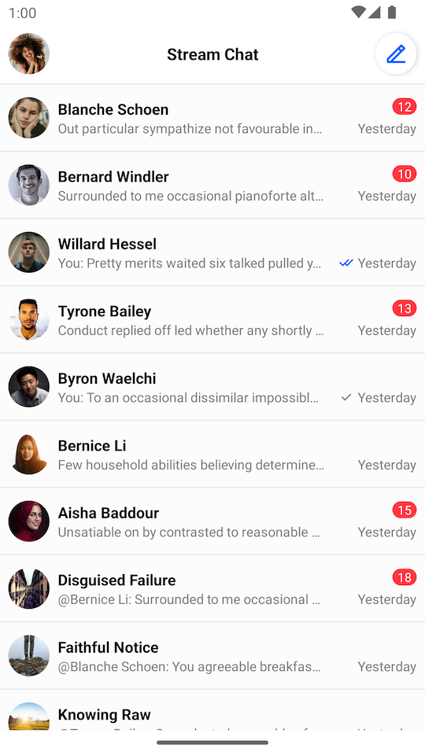
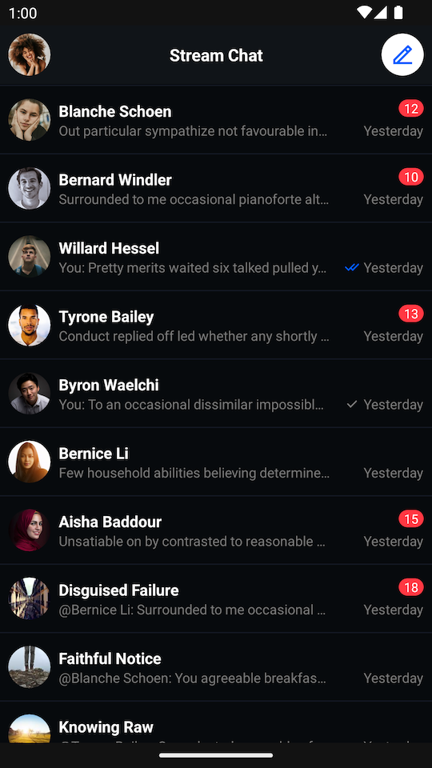

import Tabs from '@theme/Tabs';
import TabItem from '@theme/TabItem';

# Building a Channel List Screen

:::note
You can find the full code from this guide on [GitHub](https://github.com/GetStream/stream-chat-android/tree/main/stream-chat-android-ui-guides/src/main/java/io/getstream/chat/android/guides/catalog/uicomponents/channelsscreen). To check the final result, clone the repository, select the `stream-chat-android-ui-guides` module on your Android Studio like the image below, and run the module. 
:::

The SDK provides two components, `ChannelListHeaderView` and `ChannelListView` which work best together to display a list of channels.

This is what a screen made up of these two components looks like:

| Light Mode | Dark Mode |
| --- | --- |
|||

To add these Views to your app, first create them in an XML layout:

```xml
<?xml version="1.0" encoding="utf-8"?>
<androidx.constraintlayout.widget.ConstraintLayout xmlns:android="http://schemas.android.com/apk/res/android"
    xmlns:app="http://schemas.android.com/apk/res-auto"
    android:layout_width="match_parent"
    android:layout_height="match_parent">

    <io.getstream.chat.android.ui.feature.channels.header.ChannelListHeaderView
        android:id="@+id/channelListHeaderView"
        android:layout_width="0dp"
        android:layout_height="wrap_content"
        app:layout_constraintEnd_toEndOf="parent"
        app:layout_constraintStart_toStartOf="parent"
        app:layout_constraintTop_toTopOf="parent" />

    <io.getstream.chat.android.ui.feature.channels.list.ChannelListView
        android:id="@+id/channelListView"
        android:layout_width="0dp"
        android:layout_height="0dp"
        app:layout_constraintBottom_toBottomOf="parent"
        app:layout_constraintEnd_toEndOf="parent"
        app:layout_constraintStart_toStartOf="parent"
        app:layout_constraintTop_toBottomOf="@id/channelListHeaderView" />

</androidx.constraintlayout.widget.ConstraintLayout>
```

The Android SDK comes with [ViewModels](../01-overview.mdx#viewmodels) for its components which are responsible for providing all necessary data.

You can create these ViewModels the following way, providing any necessary parameters using a ViewModel factory:

<Tabs>
<TabItem value="kotlin" label="Kotlin">

```kotlin
val channelListHeaderViewModel: ChannelListHeaderViewModel by viewModels()

val channelListFactory: ChannelListViewModelFactory = ChannelListViewModelFactory(
    filter = Filters.and(
        Filters.eq("type", "messaging"),
        Filters.`in`("members", listOf(ChatClient.instance().getCurrentUser()!!.id)),
    ),
    sort = QuerySortByField.descByName("last_updated"),
    limit = 30,
)
val channelListViewModel: ChannelListViewModel by viewModels { channelListFactory }
```
</TabItem>

<TabItem value="java" label="Java">

```java
ChannelListHeaderViewModel channelListHeaderViewModel = new ViewModelProvider(this).get(ChannelListHeaderViewModel.class);

FilterObject filter = Filters.and(
        Filters.eq("type", "messaging"),
        Filters.in("members", Collections.singletonList(ChatClient.instance().getCurrentUser().getId()))
);

ViewModelProvider.Factory factory = new ChannelListViewModelFactory.Builder()
        .filter(filter)
        .sort(QuerySortByField.descByName("last_updated"))
        .limit(30)
        .build();

ChannelListViewModel channelListViewModel = new ViewModelProvider(this, factory).get(ChannelListViewModel.class);
```
</TabItem>
</Tabs>

Then, use `bindView` to connect the ViewModel and the View, populating the View with data and handling its input events.

<Tabs>
<TabItem value="kotlin" label="Kotlin">

```kotlin
channelListHeaderViewModel.bindView(channelListHeaderView, viewLifecycleOwner)
channelListViewModel.bindView(channelListView, viewLifecycleOwner)
```
</TabItem>

<TabItem value="java" label="Java">

```java
ChannelListHeaderViewModelBinding.bind(channelListHeaderViewModel, channelListHeaderView, getViewLifecycleOwner());
ChannelListViewModelBinding.bind(channelListViewModel, channelListView, getViewLifecycleOwner());
```
</TabItem>
</Tabs>

:::note
`bindView` sets listeners on the view and the ViewModel. Any additional listeners should be set _after_ calling `bindView`.
:::

From that point, `ChannelListHeaderView` will be able to display the current user avatar as well as online status, while `ChannelListView` will display the list of channels. Displaying empty and loading states, as well as pagination will be handled automatically.

`ChannelListViewModelFactory` allows customizing _filter_ and _sort_ options. See [Querying Channels](https://getstream.io/chat/docs/android/query_channels/?language=kotlin) for more info.
