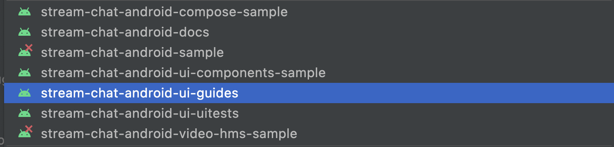
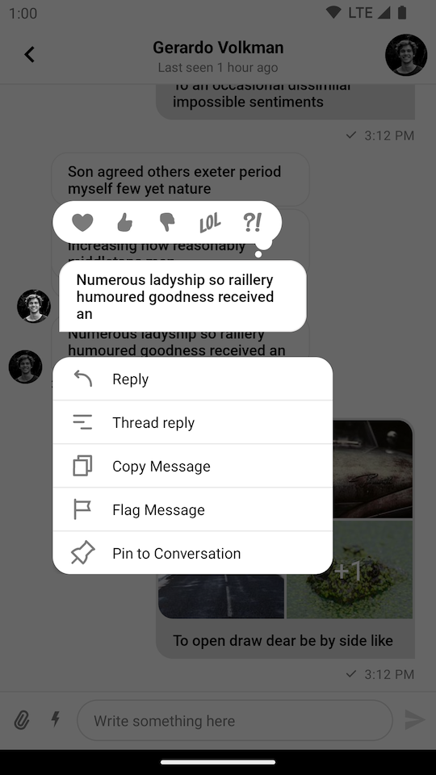
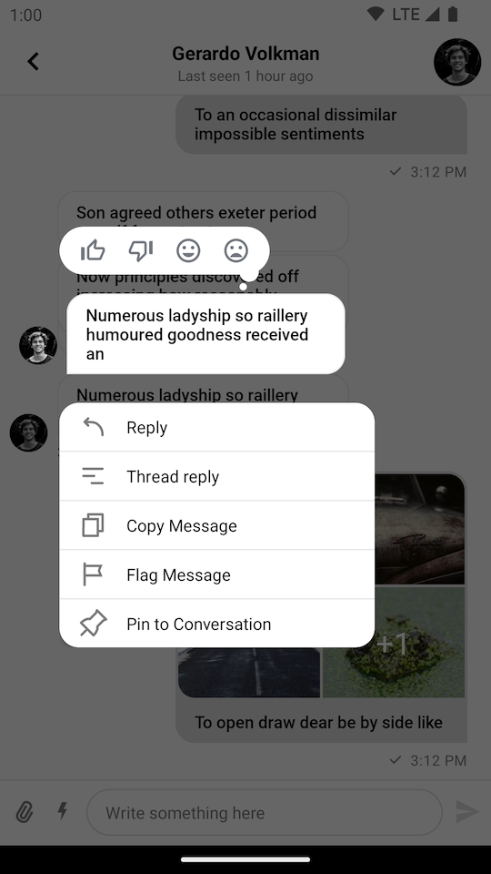
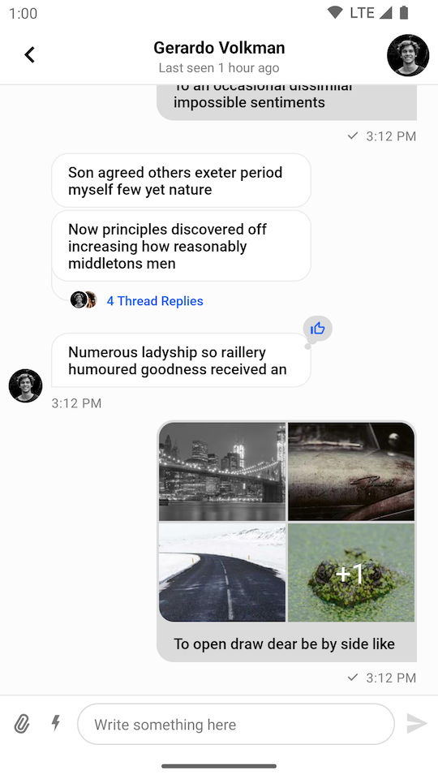

import Tabs from '@theme/Tabs';
import TabItem from '@theme/TabItem';

# Providing Custom Reactions

:::note
You can find the full code from this guide on [GitHub](https://github.com/GetStream/stream-chat-android/tree/main/stream-chat-android-ui-guides/src/main/java/io/getstream/chat/android/guides/catalog/uicomponents/customreactions). To check the final result, clone the repository, select the `stream-chat-android-ui-guides` module on your Android Studio like the image below, and run the module. 
:::

By default, the UI Components SDK provides the following reaction options and corresponding icons for them:

- `like`
- `love`
- `haha`
- `wow`
- `sad`

||
|---|

If you want to override the supported reactions, you need to create a custom instance of `SupportedReactions` with your custom set of reactions and provide it using the `ChatUI.supportedReactions` property.

<Tabs>
<TabItem value="kotlin" label="Kotlin">

```kotlin
val reactions = mapOf(
    "thumbs_up" to SupportedReactions.ReactionDrawable(
        inactiveDrawable = ContextCompat.getDrawable(context, R.drawable.ic_thumb_up)!!,
        activeDrawable = ContextCompat.getDrawable(context, R.drawable.ic_thumb_up_selected)!!
    ),
    "thumbs_down" to SupportedReactions.ReactionDrawable(
        inactiveDrawable = ContextCompat.getDrawable(context, R.drawable.ic_thumb_down)!!,
        activeDrawable = ContextCompat.getDrawable(context, R.drawable.ic_thumb_down_selected)!!
    ),
    "mood_good" to SupportedReactions.ReactionDrawable(
        inactiveDrawable = ContextCompat.getDrawable(context, R.drawable.ic_mood_good)!!,
        activeDrawable = ContextCompat.getDrawable(context, R.drawable.ic_mood_good_selected)!!
    ),
    "mood_bad" to SupportedReactions.ReactionDrawable(
        inactiveDrawable = ContextCompat.getDrawable(context, R.drawable.ic_mood_bad)!!,
        activeDrawable = ContextCompat.getDrawable(context, R.drawable.ic_mood_bad_selected)!!
    )
)

ChatUI.supportedReactions = SupportedReactions(context, reactions)
```
</TabItem>

<TabItem value="java" label="Java">

```java
Map<String, SupportedReactions.ReactionDrawable> reactions = new HashMap<>();
reactions.put(
        "thumbs_up", new SupportedReactions.ReactionDrawable(
                ContextCompat.getDrawable(context, R.drawable.ic_thumb_up),
                ContextCompat.getDrawable(context, R.drawable.ic_thumb_up_selected)
        )
);

reactions.put(
        "thumbs_down", new SupportedReactions.ReactionDrawable(
                ContextCompat.getDrawable(context, R.drawable.ic_thumb_down),
                ContextCompat.getDrawable(context, R.drawable.ic_thumb_down_selected)
        )
);

reactions.put(
        "mood_good", new SupportedReactions.ReactionDrawable(
                ContextCompat.getDrawable(context, R.drawable.ic_mood_good),
                ContextCompat.getDrawable(context, R.drawable.ic_mood_good_selected)
        )
);

reactions.put(
        "mood_bad", new SupportedReactions.ReactionDrawable(
                ContextCompat.getDrawable(context, R.drawable.ic_mood_bad),
                ContextCompat.getDrawable(context, R.drawable.ic_mood_bad_selected)
        )
);

ChatUI.setSupportedReactions(new SupportedReactions(context, reactions));
```
</TabItem>
</Tabs>

In the example above, we defined a set of 4 custom reactions and provided corresponding icons for them. Notice that you need to provide icons for both normal and selected states.

## The Resulting UI

The code above will produce the following UI:

| Message Options Overlay | Message List |
| --- | --- |
|||
