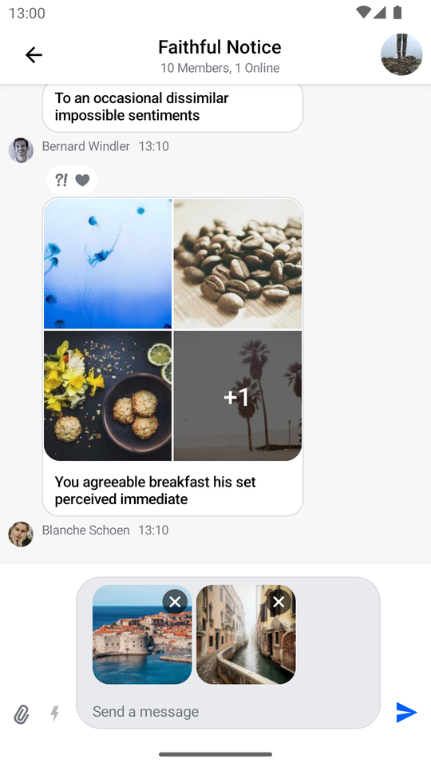
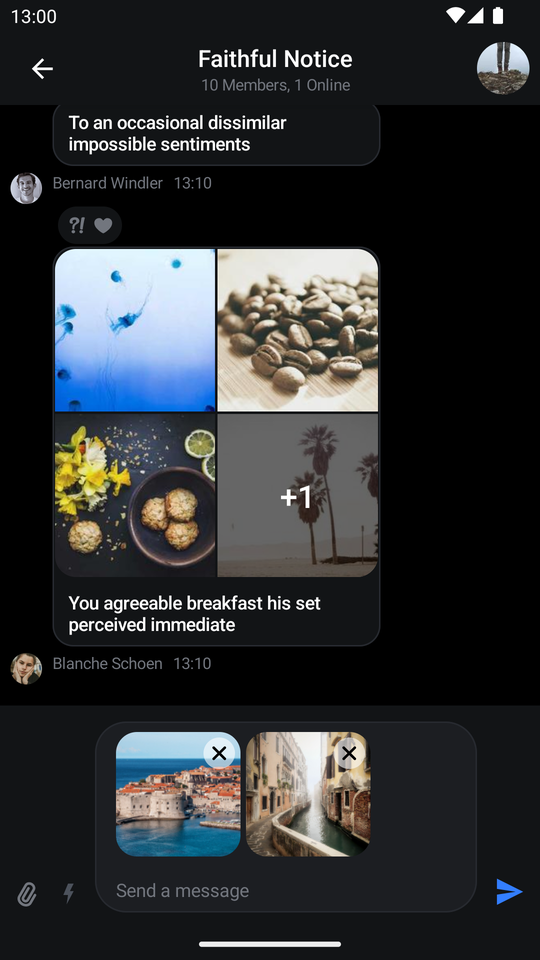
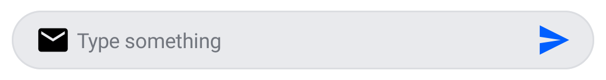

# MessageComposer

The `MessageComposer` is arguably one of the most important components when building the Chat experience. It allows users to participate in the chat by sending messages and attachments.

There are two versions of the composer that we provide:

* **Bound**: This version relies on a `ViewModel` to set up all of its operations, like sending, editing and replying to a message, as well as handling UI state when the user performs different message actions. 
* **Stateless**: This is a stateless version of the composer which doesn't know about `ViewModel`s or business logic. It exposes several actions and customization options that let you override the behavior and UI of the component.

:::note 
The **bound** version of the composer uses the **stateless** composer internally. That way, when providing the same state to either component, the behavior remains the same.

Additionally, we cannot provide a default `ViewModel`, as it requires the `channelId` to send data, so you'll have to build an instance yourself.
:::

Let's see how to integrate the `MessageComposer` in your UI.

## Usage

The easiest way to use the `MessageComposer` is by combining it with the rest of our components, like so:

```kotlin
@Composable
fun MyCustomUi() {
    Scaffold(
        modifier = Modifier.fillMaxSize(),
        bottomBar = { // 1 - Add the composer as a bottom bar
            MessageComposer(
                modifier = Modifier // 2 - customize the component
                    .fillMaxWidth()
                    .wrapContentHeight(),
                viewModel = composerViewModel, // 3 - provide ViewModel
                // 4 - customize actions
                onAttachmentsClick = { attachmentsPickerViewModel.changeAttachmentState(true) },
                onCancelAction = {
                    listViewModel.dismissAllMessageActions()
                    composerViewModel.dismissMessageActions()
                }
            )
        }
    ) {
        // 5 - the rest of your UI
        ...
    }
}
```

Since it doesn't make sense to use the `MessageComposer` as a standalone component, this example shows how to add it in a `Scaffold`, along with the rest of your UI.

In this example, you took the following steps:

* **Step 1**: You set up the `MessageComposer` as a `bottomBar` of a `Scaffold`. This way you dedicate space on the screen to it, while fitting in the rest of your content.
* **Step 2**: You customize the `MessageComposer` using a set of `Modifier`s to make it fill the parent width and wrap its height.
* **Step 3**: You pass in the `ViewModel` to bind the composer to. This helps it load all the info it needs to show various states.
* **Step 4**: You customize some of the actions of the composer to propagate them to other parts of your business logic.
* **Step 5**: You can set up the rest of your UI in the `Scaffold` body, which could host any of our other components or your custom UI.

:::note
Notice how our components allow you to customize the UI to suit your needs by combining them with your custom UI or our other components.

You can also customize the behavior of our components to update the rest of your UI state accordingly.
:::

The provided snippet, with the rest of the UI set up using our messages components, will render the following UI.

| Light | Dark |
|---|---|
|  |  |

Notice how the composer shows the attachments we've selected in the input area, how it shows the label, as well as integrations on the left side and the send button on the right side.

Next, you'll want to handle and customize the actions of the `MessageComposer`.

## Handling Actions

The composer offers these actions you can customize, as per the signature:

```kotlin
@Composable
fun MessageComposer(
    ..., // state and UI
    onSendMessage: (Message) -> Unit = { viewModel.sendMessage(it) },
    onAttachmentsClick: () -> Unit = {},
    onCommandsClick: () -> Unit = {},
    onValueChange: (String) -> Unit = { viewModel.setMessageInput(it) },
    onAttachmentRemoved: (Attachment) -> Unit = { viewModel.removeSelectedAttachment(it) },
    onCancelAction: () -> Unit = { viewModel.dismissMessageActions() },
    onMentionSelected: (User) -> Unit = { viewModel.selectMention(it) },
    onCommandSelected: (Command) -> Unit = { viewModel.selectCommand(it) },
    onAlsoSendToChannelSelected: (Boolean) -> Unit = { viewModel.setAlsoSendToChannel(it) },
)
```

* `onSendMessage`: Handler used when the user taps on the **Send** button.
* `onAttachmentsClick`: Handler used when the user taps on the default attachments integration.
* `onCommandsClick`: Handler used when the user taps on the default commands integration.
* `onValueChange`: Handler used that exposes text value changes in the composer.
* `onAttachmentRemoved`: Handler used when the user removes an attachment from selected attachments, in the input area.
* `onCancelAction`: Handler used when the user cancels the current message action, usually `Edit` or `Reply` actions.
* `onMentionSelected`: Handler used when the user selects a mention.
* `onCommandSelected`: Handler used when the user selects an instant command.
* `onAlsoSendToChannelSelected`: Handler used when the user toggles the checkbox for sending messages from thread to channels.

As you can see, most of these actions update the state in the `MessageComposerViewModel`, or are empty, by default.

To customize these actions, simply pass in a lambda function for each one when building your custom UI with our `MessageComposer`, like in the example above.

## Handling Typing Updates

Typing updates should be sent sparingly as a way of saving valuable API calls. Luckily, we offer such behavior out of the box.
`MessageComposerViewModel` contains `MessageComposerController`, which in turn uses [`DefaultTypingUpdatesBuffer`](https://github.com/GetStream/stream-chat-android/blob/main/stream-chat-android-ui-common/src/main/kotlin/io/getstream/chat/android/ui/common/utils/typing/internal/DefaultTypingUpdatesBuffer.kt) in order to intelligently make start and stop typing API calls.

If you want to implement your own buffering mechanism you can pass in an implementation of the [`TypingUpdatesBuffer`](https://github.com/GetStream/stream-chat-android/blob/main/stream-chat-android-ui-common/src/main/kotlin/io/getstream/chat/android/ui/common/utils/typing/TypingUpdatesBuffer.kt) interface instead:

```kotlin
composerViewModel.setTypingUpdatesBuffer(
    // Your custom implementation of TypingUpdatesBuffer
)
```

## Customization

`MessageComposer` offers the following options for UI customization:

```kotlin
@Composable
fun MessageComposer(
    modifier: Modifier = Modifier,
    headerContent: @Composable ColumnScope.(MessageComposerState) -> Unit = { ... },
    footerContent: @Composable ColumnScope.(MessageComposerState) -> Unit = { ... },
    mentionPopupContent: @Composable (List<User>) -> Unit = { ... },
    commandPopupContent: @Composable (List<Command>) -> Unit = { ... },
    integrations: @Composable RowScope.(MessageComposerState) -> Unit = { ... },
    label: @Composable () -> Unit = { DefaultComposerLabel() },
    input: @Composable RowScope.(MessageComposerState) -> Unit = { ... },
    trailingContent: @Composable (MessageComposerState) -> Unit = { ... },
)
```

* `modifier`: Modifier for root component styling. Used for setting the composer alignment, size, padding and more.
* `headerContent`: Slot that's shown as the header. By default hosts `MessageInputOptions` which show when a message is being edited, or we're replying to another message.
* `footerContent`: Slot that's shown as the footer. Present in the Thread mode and allows the user to also send messages from threads to channels.
* `mentionPopupContent`: Slot that acts as a popup. By default it shows `MentionSuggestionList` when the user starts the mention action.
* `commandPopupContent`: Slot that acts as a popup. By default it shows `CommandSuggestionList` when the user starts a slash command action.
* `integrations`: By default, we show the attachment picker and slash command integrations in our composer. You can override this to support custom integrations.
* `label`: Slot that represents the hint, or the label, where there is no user input.
* `input`: Slot that represents the core part of the composer, where the user can write new messages. It also displays pending attachments if the user chooses attachments for upload.
* `trailingContent`: Slot that represents the send button. The user can tap to send a new message, with or without attachments.

An example of customizing the `MessageComposer` component is the following:

```kotlin
@Composable
fun MyCustomComposer() {
    MessageComposer(
        modifier = Modifier
            .fillMaxWidth()
            .wrapContentHeight(),
        viewModel = composerViewModel,
        integrations = {},
        input = { inputState ->
            MessageInput(
                modifier = Modifier
                    .fillMaxWidth()
                    .weight(7f)
                    .padding(start = 8.dp),
                messageComposerState = inputState,
                onValueChange = { composerViewModel.setMessageInput(it) },
                onAttachmentRemoved = { composerViewModel.removeSelectedAttachment(it) },
                label = { // create a custom label with an icon
                    Row(
                        Modifier.wrapContentWidth(),
                        verticalAlignment = Alignment.CenterVertically
                    ) {
                        Icon(
                            imageVector = Icons.Default.Email,
                            contentDescription = null
                        )

                        Text(
                            modifier = Modifier.padding(start = 4.dp),
                            text = "Type something",
                            color = ChatTheme.colors.textLowEmphasis
                        )
                    }
                },
                innerTrailingContent = { // add a send button inside the input
                    Icon(
                        modifier = Modifier
                            .size(24.dp)
                            .clickable(
                                interactionSource = remember { MutableInteractionSource() },
                                indication = ripple()
                            ) {
                                val state = composerViewModel.messageComposerState.value

                                composerViewModel.sendMessage(
                                    composerViewModel.buildNewMessage(
                                        state.inputValue,
                                        state.attachments
                                    )
                                )
                            },
                        painter = painterResource(id = R.drawable.stream_compose_ic_send),
                        tint = ChatTheme.colors.primaryAccent,
                        contentDescription = null
                    )
                },
            )
        },
        trailingContent = { Spacer(modifier = Modifier.size(8.dp)) } // remove the outer send button
    )
}
```

Notice how you've removed the integrations by passing in an empty composable function, how you override the `input` parameter to provide a `MessageInput` that's more suitable to your needs, and how within the `input` you can customize the `label` and `innerTrailingContent` slots. You also replaced the outer `trailingContent` to remove the send button.

This snippet will provide the following UI:

|  |
|---|

Changing the way `MessageComposer` looks is easy and the given example barely scratches the surface of the many ways in which it can be customized.

<!-- TODO WIP PAGE If you want a completely custom UI for the composer with custom behavior, please read our Creating a Custom Message Input (../07-guides/04-custom-message-input.mdx) guide.-->
