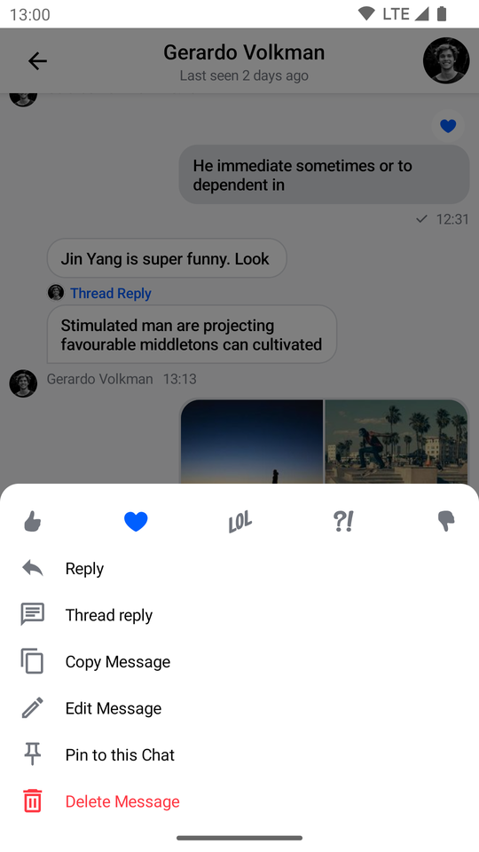
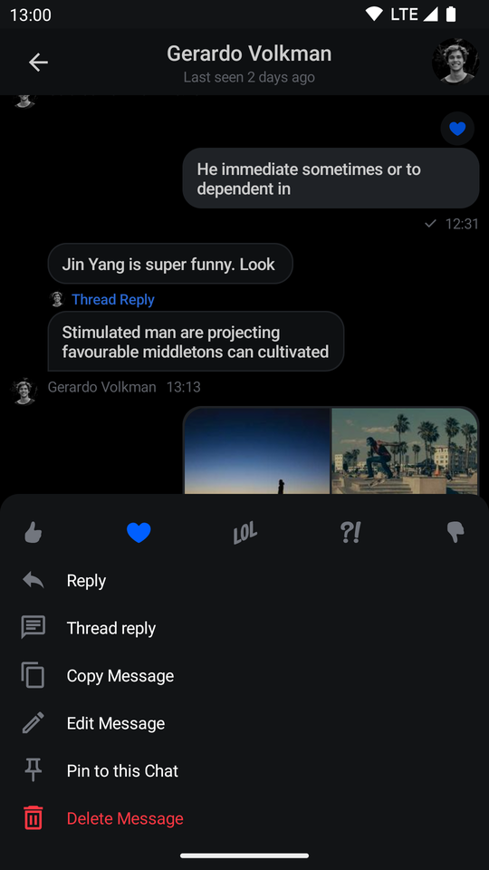
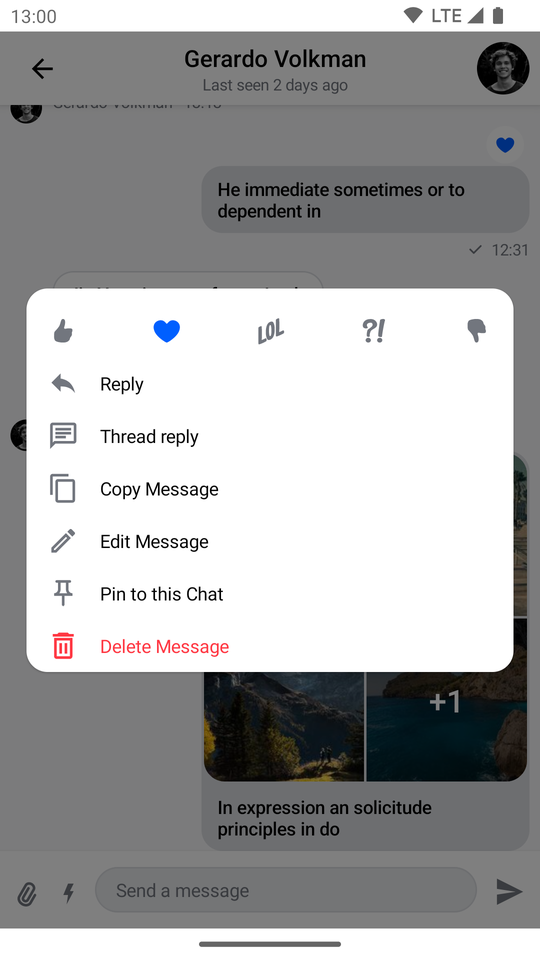
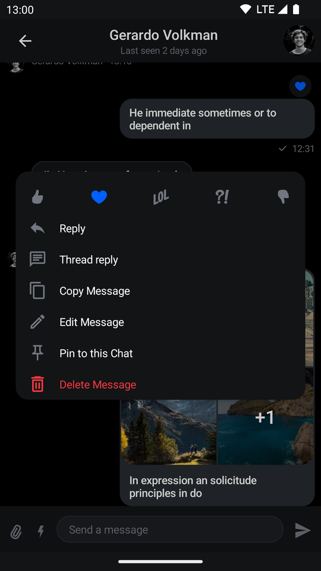
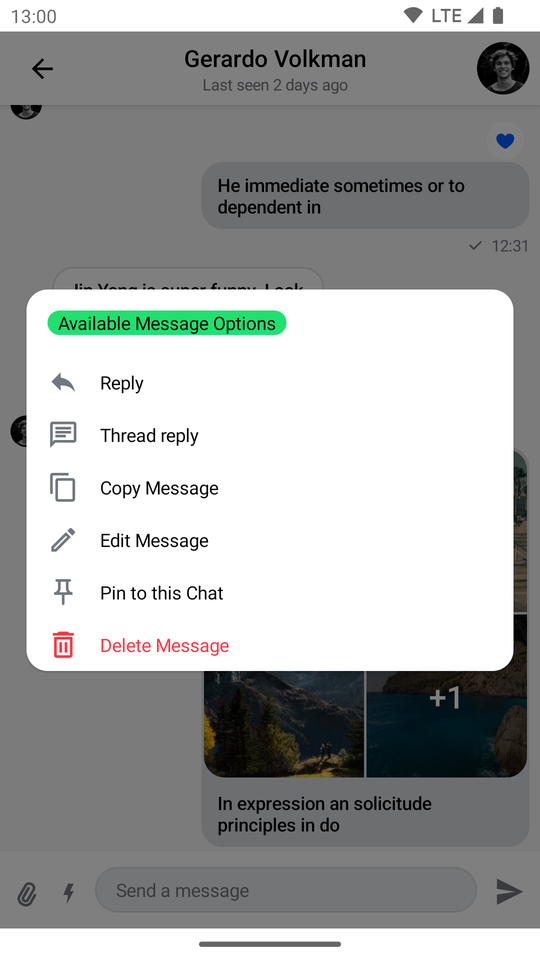
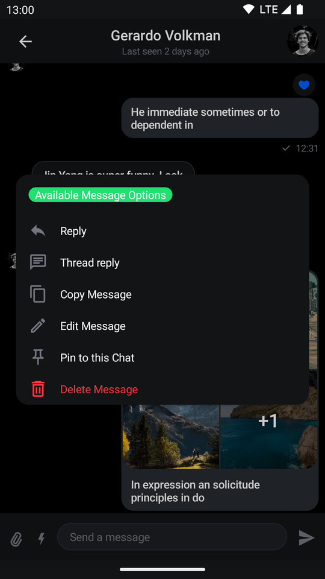

# SelectedMessageMenu

The `SelectedMessageMenu` component allows you to show different message options to the user when they select a message in the `MessageList`. This is usually done by long tapping on a message item.

This is a **stateless component** that you can easily add to your UI if you're building a custom Messages screen. Internally, it sets up the following components:

* **Reaction options**: Shows a list of reactions the user can use to react to the message. Those reactions are shown as `ReactionOptionItem`s.
* **Message options**: Shows a list of actions the user can take with the selected message, such as **delete**, **edit**, **reply to**, **flag**, **copy**, **pin** and **start a thread**.

Let's see how to use it.

## Usage

If you're using [`MessagesScreen`](01-messages-screen.mdx), `SelectedMessageMenu` is already set up for you. To use `SelectedMessageMenu` in your custom screens, simply add it to your UI, like so:

```kotlin
// The rest of your UI
if (selectedMessageState is SelectedMessageOptionsState) {
    val selectedMessage = selectedMessageState.message
    SelectedMessageMenu(
        modifier = Modifier.align(Alignment.BottomCenter),
        // Define your message options
        messageOptions = defaultMessageOptionsState(
            selectedMessage = selectedMessage,
            currentUser = user,
            isInThread = listViewModel.isInThread,
            ownCapabilities = selectedMessageState.ownCapabilities
        ),
        // The message you selected
        message = selectedMessage,
        // The capabilities the user has in a given channel
        ownCapabilities = selectedMessageState.ownCapabilities,
        onMessageAction = { action ->
            // Handle message action
        },
        onShowMoreReactionsSelected = {
            // Handle show more reactions button click
        },
        onDismiss = {
            // Handle dismiss
        }
    )
}
```

As you can see, showing the menu is very simple. If the `selectedMessageState` is an instance of `SelectedMessageOptionsState`, you pass in the message options you want to expose to the user, as well as the selected message. The reactions you show are taken from the [`ChatTheme`](../03-general-customization/01-chat-theme.mdx) component and everything else required to show the component is taken care of internally.

The small snippet of code above produces the following UI:

| Light | Dark |
|---|---|
|  |  |

The component shows reactions from the [`ChatTheme`](../03-general-customization/01-chat-theme.mdx) on the top, followed by the message actions you passed in.

The menu overlay has a darker background and tapping it will dismiss the component, as will pressing the system back button.

## Handling Actions

`SelectedMessageMenu` exposes the following actions:

```kotlin
@Composable
fun SelectedMessageMenu(
    ..., // State and options
    onMessageAction: (MessageAction) -> Unit,
    onShowMoreReactionsSelected: () -> Unit,
    onDismiss: () -> Unit = {},
)
```

* `onMessageAction`: Handler used when the user triggers any message action, such as **reply**, **edit**, **delete**, **react** and others.
* `onShowMoreReactionsSelected`: Handler used when the show more reactions button has been clicked.
* `onDismiss`: Handler used when the component is dismissed by clicking outside of the component UI or pressing the system back button.

To handle these actions, you can override them like so:

```kotlin
if (selectedMessageState is SelectedMessageOptionsState) {
    SelectedMessageMenu(
        ..., // State and options
        onMessageAction = { action ->
            composerViewModel.performMessageAction(action)
            listViewModel.performMessageAction(action)
        },
        onShowMoreReactionsSelected = {
            listViewModel.selectExtendedReactions(selectedMessage)
        },
        onDismiss = { listViewModel.removeOverlay() }
    )
}
```

In the snippet above, you propagate the `action` to the `composerViewModel` and `listViewModel`, for them to store the latest action. This will update the UI accordingly.

Alternatively, you call `listViewModel.removeOverlay()` to remove the overlay from the screen in `onDismiss()`. It's important to note that `onMessageAction()` calls `removeOverlay()` internally to hide the overlay.

Next, let's see how to customize the overlay.

## Customization

You can customize the reactions you show, as well as the message options in this component:

```kotlin
@Composable
fun SelectedMessageMenu(
    ..., // State
    messageOptions: List<MessageOptionItemState>,
    modifier: Modifier = Modifier,
    shape: Shape = ChatTheme.shapes.bottomSheet,
    overlayColor: Color = ChatTheme.colors.overlay,
    reactionTypes: Map<String, ReactionIcon> = ChatTheme.reactionIconFactory.createReactionIcons(),
    ... // Actions and Slot APIs
)
```

* `messageOptions`: Allows you to customize which message options are shown in the overlay. You can use `defaultMessageOptionsState()` to get the default actions that we expose in our SDK.
* `modifier`: Modifier for the dialog component.
* `overlayColor`: Allows you to customize the color of the overlay.
* `shape`: Allows you to customize the shape of the dialog.
* `reactionTypes`: Allows you to customize which reactions show in the overlay. By default it uses `ChatTheme.reactionIconFactory` which is exposed by the [`ChatTheme`](../03-general-customization/01-chat-theme.mdx) component.

The best way to customize reactions is by overriding `ChatTheme.reactionIconFactory` with your own implementation of `ReactionIconFactory` so that all of your components wrapped inside of `ChatTheme` draw from the same source.

By default `SelectedMessageMenu` looks like a bottom sheet, however you can customize it to look like a completely different component, such as a dialog, a drawer or whatever helps you retain the look and feel of your app.

```kotlin
if (selectedMessageState is SelectedMessageOptionsState) {
    SelectedMessageMenu(
        // Use a Modifier to customize the appearance
        modifier = Modifier
            .align(Alignment.Center)
            .padding(horizontal = 20.dp)
            .wrapContentSize(),
        // Assign a different shape to the Composable element
        shape = ChatTheme.shapes.attachment,
        onMessageAction = { action ->
            // Handle message action
        },
        onShowMoreReactionsSelected = {
            // Handle show more reactions button click
        },
        onDismiss = {
            // Handle dismiss
        },
        ...
    )
}
```

The code above will produce the following UI:

| Light | Dark |
|---|---|
|  |  |

`SelectedMessageMenu` provides you with `Composable` slots that are ready for more extensive customizations.

```kotlin
@Composable
fun SelectedMessageMenu(
    ...,
    headerContent: @Composable ColumnScope.() -> Unit = {
        // Header content
    },
    centerContent: @Composable ColumnScope.() -> Unit = {
        // Center content
    }
)
```

* `headerContent`: Allows you to customize the content shown at the top of the menu. By default it shows reaction options.
* `centerContent`: Allows you to customize the content shown at the center of the menu. By default it shows message options.

You can easily override either slot:

```kotlin
if (selectedMessageState is SelectedMessageOptionsState) {
    SelectedMessageMenu(
            ...,
            // Custom header content
            headerContent = {
                Text(
                    modifier = Modifier
                        .padding(16.dp)
                        .background(
                            shape = ChatTheme.shapes.avatar,
                            color = ChatTheme.colors.infoAccent
                        )
                        .padding(horizontal = 8.dp),
                    style = ChatTheme.typography.body,
                    color = ChatTheme.colors.textHighEmphasis,
                    text = "Available Message Options"
                )
            }
        )
}
```

The example above shows how to replace the header content with a custom `Text`.

The UI Looks like this:

| Light | Dark |
|---|---|
|  |  |
