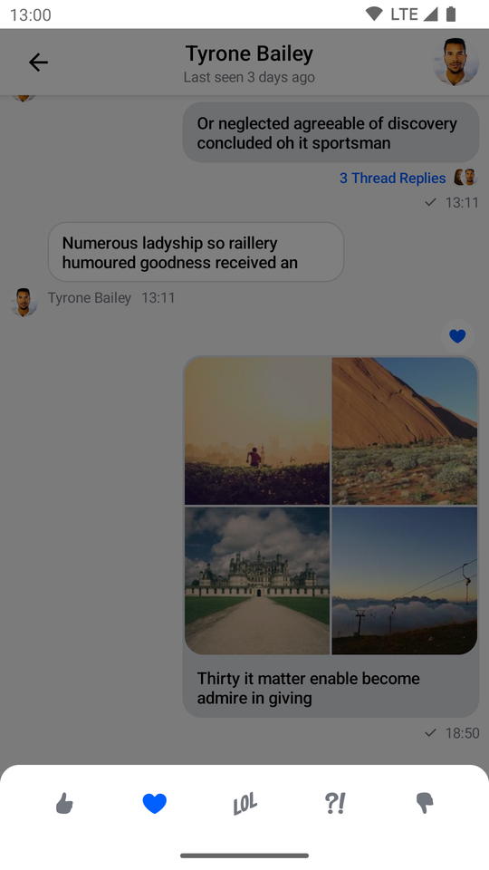
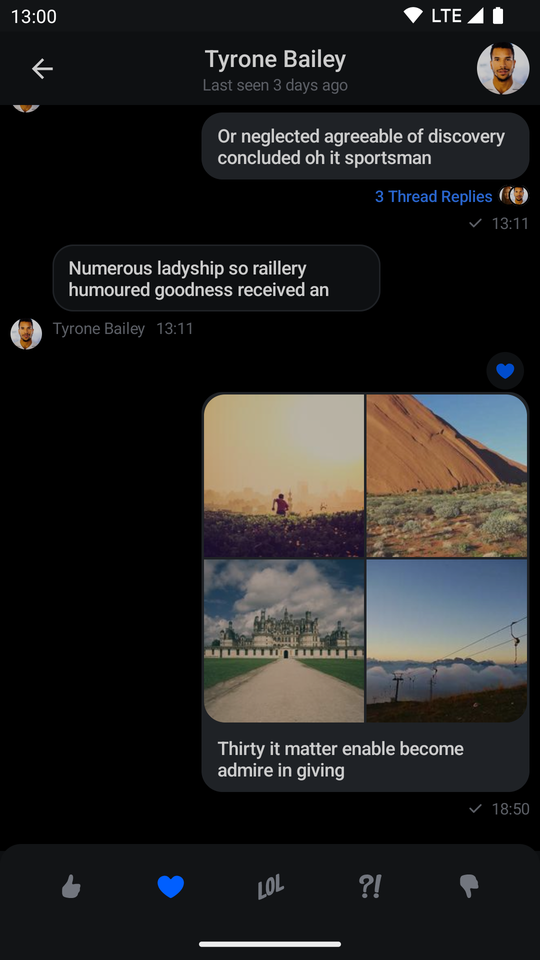
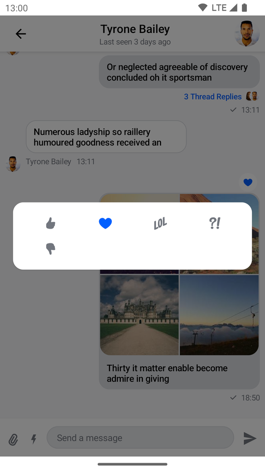
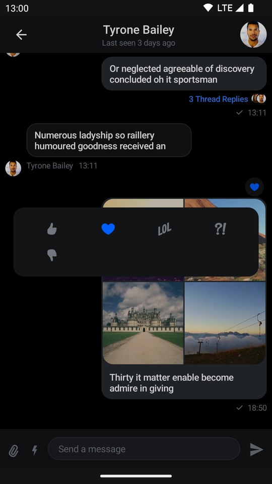
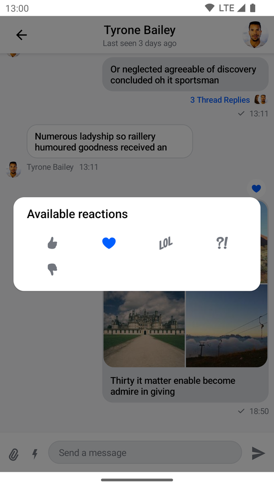
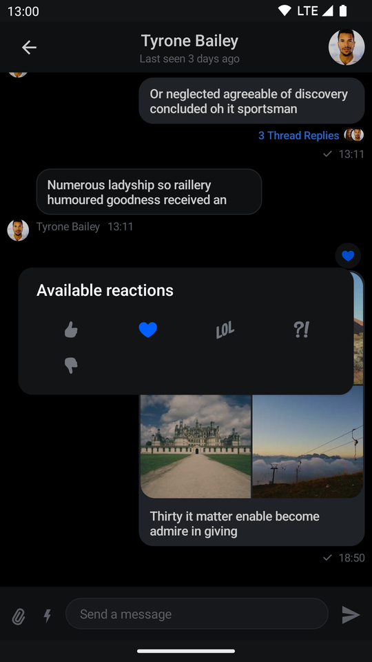

# ReactionsPicker

The `ReactionsPicker` component allows you to display all of the reactions your app contains inside a simple menu. Normally it is displayed after clicking on the show more reactions button inside `SelectedMessageMenu` or `SelectedReactionsMenu`.

## Usage

If you're using the [`MessagesScreen`](01-messages-screen.mdx) component, `ReactionsPicker` is automatically set up for you. To use it inside of your custom screens simply add it like so:

```kotlin
ChatTheme {
    // The rest of your UI
    if (selectedMessageState != null) {
        val selectedMessage = selectedMessageState.message
        if (selectedMessageState is SelectedMessageReactionsPickerState) {
            ReactionsPicker(
                modifier = Modifier
                    .align(Alignment.BottomCenter)
                    .heightIn(max = 400.dp)
                    .wrapContentHeight(),
                message = selectedMessage,
                onMessageAction = { action ->
                    // Handle message action
                },
                onDismiss = {
                    // Handle on dismiss
                }
            )
        }
    }
}
```

Adding the `ReactionsPicker` component is very simple, all you need to do is make sure that it is displayed when the `selectedMessageState` is `SelectedMessageReactionsPickerState` and pass in the selected `Message`. The reactions are drawn from the [`ChatTheme`](../03-general-customization/01-chat-theme.mdx) and the rest is done for you.

The code above will render the following UI:

| Light | Dark |
|---|---|
|  |  |

The menu overlay has a darker background and tapping it will dismiss the component, as will pressing the system back button.

## Handling Actions

`ReactionsPicker` exposes the following actions:

```kotlin
@Composable
public fun ReactionsPicker(
    ..., // State,
    onMessageAction: (MessageAction) -> Unit,
    onDismiss: () -> Unit = {},
    ... // Content
)
```

* `onMessageAction`: Handler used for triggering message actions such as **reply**, **edit**, **delete**, **react** and others.
* `onDismiss`: Handler used when the component is dismissed by clicking outside of the component UI or pressing the system back button.

```kotlin
ReactionsPicker(
    ..., // State
    onMessageAction = { action ->
        composerViewModel.performMessageAction(action)
        listViewModel.performMessageAction(action)
    },
    onDismiss = { listViewModel.removeOverlay() },
    ... // Content
)
```

In the snippet above, you propagate the `action` to the `composerViewModel` and `listViewModel`, for them to store the latest action. This will update the UI accordingly.

Alternatively, you call `listViewModel.removeOverlay()` to remove the overlay from the screen, in `onDismiss()`. It's important to note that `onMessageAction()` calls `removeOverlay()` internally, to hide the overlay.

Next, let's see how to customize `ReactionsPicker`.

## Customization

`ReactionsPicker` allows you to customize the reactions you are showing:

```kotlin
@Composable
public fun ReactionsPicker(
    ..., // State,
    reactionTypes: Map<String, ReactionIcon> = ChatTheme.reactionIconFactory.createReactionIcons(),
    ... // Actions and content
)
```

* `reactionTypes`: Allows you to customize which reactions are shown. By default it uses `reactionIconFactory` inside of [`ChatTheme`](../03-general-customization/01-chat-theme.mdx).

The best way to customize this is by overriding `ChatTheme.reactionIconFactory` with your own implementation of `ReactionIconFactory` so that all of your components wrapped inside of `ChatTheme` draw from the same source.

By default `ReactionsPicker` looks like a bottom sheet, however you can customize it to look like a completely different component, such as a dialog, a drawer or whatever helps you retain the look and feel of your app.

For example, you can it customize like so:

```kotlin
ReactionsPicker(
    modifier = Modifier
        .align(Alignment.Center)
        .padding(horizontal = 20.dp)
        .wrapContentSize(),
    shape = ChatTheme.shapes.attachment,
    message = selectedMessage,
    onMessageAction = { action ->
        composerViewModel.performMessageAction(action)
        listViewModel.performMessageAction(action)
    },
    onDismiss = { listViewModel.removeOverlay() },
    cells = GridCells.Fixed(4)
)
```

The code above will result in the following UI:

| Light | Dark |
|---|---|
|  |  |

```kotlin
@Composable
public fun ReactionsPicker(
    ..., // State and actions
    headerContent: @Composable ColumnScope.() -> Unit = {},
    centerContent: @Composable ColumnScope.() -> Unit = {
        DefaultReactionsPickerCenterContent(
            message = message,
            onMessageAction = onMessageAction,
            cells = cells,
            reactionTypes = reactionTypes
        )
    },
)
```

Apart from customization through modifiers, the component provides these slots:

* `headerContent`: Allows you to customize what content you show on the top part of `ReactionsPicker`. Empty by default.
* `centerContent`: Allows you to customize what content you show on the bottom part of `ReactionsPicker`. Shows reactions by default.

As an example, let's override the header content. First create a custom text label:

```kotlin
@Composable
fun TextLabel() {
    Text(
        modifier = Modifier.padding(start = 20.dp, top = 12.dp),
        text = "Available reactions",
        style = ChatTheme.typography.title3Bold,
        color = ChatTheme.colors.textHighEmphasis
    )
}
```

Then expand on the previous customization example by replacing the empty `headerContent` with the text label:

```kotlin
ReactionsPicker(
    ..., // State, actions and other content
    headerContent = { TextLabel() }
)
```

Doing so gives you the following UI:

| Light | Dark |
|---|---|
|  |  |


