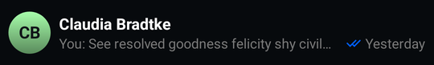
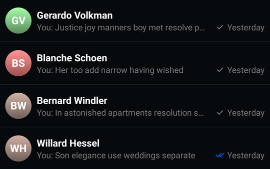
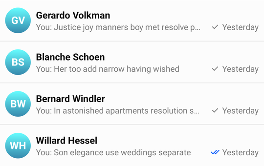
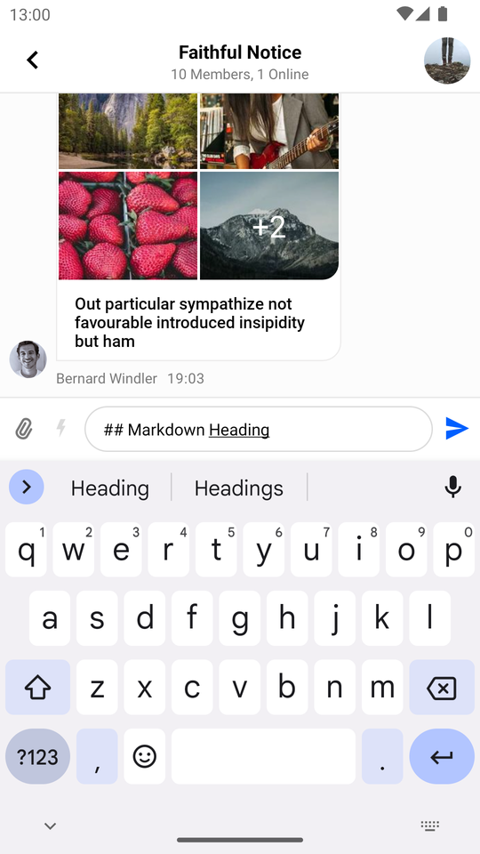
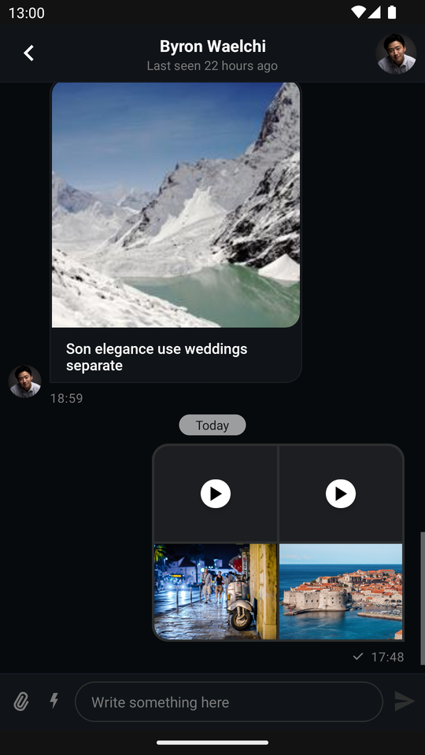

import Tabs from '@theme/Tabs';
import TabItem from '@theme/TabItem';

# Customizing Components

The SDK provides an API for general configuration of the UI Component library's behavior and appearance, which is exposed via the `ChatUI` object.

`ChatUI` allows you to override the default implementations of commonly used parts of the SDK such as:

* Available message reactions
* The UI used for rendering attachments
* MIME type icons for attachments
* Default font used across the UI components
* Attachments URLs
* Text transformations

The full list of `ChatUI` properties you can override include:

* `style`: Allows overriding the global, default style of UI components, such as `defaultTextStyle`.
* `navigator`: Allows intercepting and modifying default navigation between SDK components (for example: navigating from `MessageListView` to `AttachmentGalleryActivity`).
* `imageHeadersProvider`: Allows adding extra headers to image loading requests.
* `fonts`: The default font for `TextView`s displayed by UI Components.
* `messageTextTransformer`: Used to transform the way text is rendered on screen, for example: create clickable link text or implement markdown support. You can override it with `MarkdownTextTransformer` if you want to use Stream's ready-made markdown support.
* `supportedReactions`: The set of supported message reactions.
* `mimeTypeIconProvider`: The icons used for different mime types.
* `channelNameFormatter`: Allows customizing the way channel names are formatted.
* `messagePreviewFormatter`: Allows you to generate a preview text for the given message.
* `dateFormatter`: Allows changing the way dates are formatted.
* `attachmentFactoryManager`: Allows changing the way attachments are displayed in the message list. Includes adding UI for custom attachments.
* `attachmentPreviewFactoryManager`: Allows changing the way attachments are displayed in the message composer. Includes adding UI for custom attachments.
* `quotedAttachmentFactoryManager`: Allows changing the way attachments are displayed in quoted messages both in the message list and the message composer. Includes adding UI for custom attachments.
* `currentUserProvider`: provides the currently logged in user.
* `videoThumbnailsEnabled`: Changes whether video thumbnails are displayed or not. Video thumbnails are a paid feature, You can find the pricing [here](https://getstream.io/chat/pricing/).

:::note
`ChatUI` is initialized out-of-the-box with default implementations - no initialization is required on app startup.
:::

## Custom Reactions

By default, the SDK provides 5 built-in reactions:

| Light Theme                                                              | Dark Theme                                                                   |
|--------------------------------------------------------------------------|------------------------------------------------------------------------------|
|  |  |

You can change the default reactions by overriding `ChatUI.supportedReactions` with your own set of reactions:


<Tabs>
<TabItem value="kotlin" label="Kotlin">

```kotlin
// Create a drawable for the non-selected reaction option
val loveDrawable = ContextCompat.getDrawable(context, R.drawable.stream_ui_ic_reaction_love)!!
// Create a drawable for the selected reaction option and set a tint to it
val loveDrawableSelected = ContextCompat.getDrawable(context, R.drawable.stream_ui_ic_reaction_love)!!
    .mutate()
    .apply { setTint(Color.RED) }

// Create a map of reactions
val supportedReactionsData = mapOf(
    "love" to SupportedReactions.ReactionDrawable(loveDrawable, loveDrawableSelected)
)

// Replace the default reactions with your custom reactions
ChatUI.supportedReactions = SupportedReactions(context, supportedReactionsData)
```
</TabItem>

<TabItem value="java" label="Java">

```java
// Create a drawable for the non-selected reaction option
Drawable loveDrawable = ContextCompat.getDrawable(context, R.drawable.stream_ui_ic_reaction_love);
// Create a drawable for the selected reaction option and set a tint to it
Drawable loveDrawableSelected = ContextCompat.getDrawable(context, R.drawable.stream_ui_ic_reaction_love).mutate();
loveDrawableSelected.setTint(Color.RED);

// Create a map of reactions
Map<String, SupportedReactions.ReactionDrawable> supportedReactionsData = new HashMap<>();
supportedReactionsData.put("love", new SupportedReactions.ReactionDrawable(loveDrawable, loveDrawableSelected));

// Replace the default reactions with your custom reactions
ChatUI.setSupportedReactions(new SupportedReactions(context, supportedReactionsData));
```
</TabItem>
</Tabs>

As a result, only the _love_ reaction is available in the chat, and when selected, it will have a red tint.

| Normal state - available reactions (Light Mode) | Selected state - reaction selected (Light Mode) |
| --- | --- |
|||

| Normal state - available reactions (Dark Mode) | Selected state - reaction selected (Dark Mode) |
| --- | --- |
|||

## Custom MIME Type Icons

When possible, the SDK displays thumbnails for image and video files. When thumbnails are unavailable or when other types of files are in question, mime type icons are displayed in `MessageListView`, `MessageComposer` and attachment picker.

By default, the SDK provides built-in MIME type icons for the most popular file types and displays a generic file icon for others.

To customize these icons, you need to override `ChatUI.mimeTypeIconProvider` like so:

<Tabs>
<TabItem value="kotlin" label="Kotlin">

```kotlin
ChatUI.mimeTypeIconProvider = MimeTypeIconProvider { mimeType ->
    when {
        // Generic icon for missing MIME type
        mimeType == null -> R.drawable.stream_ui_ic_file
        // Special icon for XLS files
        mimeType == "application/vnd.ms-excel" -> R.drawable.stream_ui_ic_file_xls
        // Generic icon for audio files
        mimeType.contains("audio") -> R.drawable.stream_ui_ic_file_mp3
        // Generic icon for video files
        mimeType.contains("video") -> R.drawable.stream_ui_ic_file_mov
        // Generic icon for other files
        else -> R.drawable.stream_ui_ic_file
    }
}
```
</TabItem>

<TabItem value="java" label="Java">

```java
ChatUI.setMimeTypeIconProvider(mimeType -> {
    if (mimeType == null) {
        // Generic icon for missing MIME type
        return R.drawable.stream_ui_ic_file;
    } else if (mimeType.equals("application/vnd.ms-excel")) {
        // Special icon for XLS files
        return R.drawable.stream_ui_ic_file_xls;
    } else if (mimeType.contains("audio")) {
        // Generic icon for audio files
        return R.drawable.stream_ui_ic_file_mp3;
    } else if (mimeType.contains("video")) {
        // Generic icon for video files
        return R.drawable.stream_ui_ic_file_mov;
    } else {
        // Generic icon for other files
        return R.drawable.stream_ui_ic_file;
    }
});
```
</TabItem>
</Tabs>

## Customizing Avatars
An avatar is a small image which identifies a specific user or channel.
`UserAvatarView` is used in the lists of users and messages, whereas `ChannelAvatarView` is used in the lists of channels.

The image in the `UserAvatarView` and `ChannelAvatarView` is being displayed based on the `image` property, present in both `User` and `Channel` objects respectively:

| Light Mode | Dark Mode |
|---|---|
|  |  |

Both `UserAvatarView` and `ChannelAvatarView` will use the default gradient color with initials if the `image` property cannot be loaded:

| Light Mode | Dark Mode |
|---|---|
|  |  |

In addition, `ChannelAvatarView` provides several extra fallback scenarios if `image` property is an empty string:
- If the channel has just `1` member, the `image` property of this user will be used to display an avatar.
- If the channel has just `2` members, the `name` property of the user, who is not the current user will be used to display an avatar.
- If the channel has more than two members, the avatar image will be produced from the first `4` users in the channel's member list.

#### Customizing Avatars Using Styles
You can configure the avatar shape, border width, online indicator and other aspects using [AvatarStyle](https://github.com/GetStream/stream-chat-android/blob/main/stream-chat-android-ui-components/src/main/kotlin/io/getstream/chat/android/ui/widgets/avatar/AvatarStyle.kt). You can create this kind of avatar by changing the shape and corner radius:

| Light Mode | Dark Mode |
|---|---|
|  | 

#### Customizing User Avatars Using UserAvatarRenderer

Overriding the `UserAvatarRenderer` allows you to add custom logic for the and user's avatars displayed using `UserAvatarView`.

:::note
The `UserAvatarView.setAvatar` method mentioned below can accept different data types as `avatar` parameter.
It can be a `Bitmap`, `Drawable`, `Uri`, `String` or `DrawbleRes` (resource id).
:::

<Tabs>
<TabItem value="kotlin" label="Kotlin">

```kotlin
object : UserAvatarRenderer {
    override fun render(style: AvatarStyle, user: User, target: UserAvatarView) {
        // You can apply custom image loading logic here
        val placeholder: Drawable = /* ... */
        target.setAvatar(avatar = user.image, placeholder = placeholder)
        target.setOnline(online = user.online)
    }
}
```
</TabItem>

<TabItem value="java" label="Java">

```java
new UserAvatarRenderer() {
    @Override
    public void render(
        @NonNull AvatarStyle style,
        @NonNull User user, 
        @NonNull UserAvatarView target
    ) {
        // You can apply custom image loading logic here
        final Drawable placeholder = /* ... */;
        target.setAvatar(user.getImage(), placeholder);
        target.setOnline(user.getOnline());
    }
};
```
</TabItem>
</Tabs>

#### Customizing Channel Avatars Using ChannelAvatarRenderer

Overriding the `ChannelAvatarRenderer` allows you to add custom logic for the channel's avatars displayed using `ChannelAvatarView`.

:::note
The `AvatarImageView.setAvatar` method mentioned below can accept different data types as `avatar` parameter.
It can be a `Bitmap`, `Drawable`, `Uri`, `String` or `DrawbleRes` (resource id).
:::

Let's look at the different scenarios for channel avatars, which are handled by the default.
You can override the `ChannelAvatarRenderer` to apply custom logic for each scenario or just simplify the logic to a single approach for all scenarios.

<Tabs>
<TabItem value="kotlin" label="Kotlin">

```kotlin
object : ChannelAvatarRenderer {
    override fun render(
        style: AvatarStyle, 
        channel: Channel, 
        user: User, 
        targetProvider: ChannelAvatarViewProvider,
    ) {
        // You can apply custom image loading logic here
        val placeholder: Drawable = /* ... */
            
        // Scenario_1: `Channel.image` is not empty
        val target1: AvatarImageView = targetProvider.regular()
        target1.setAvatar(avatar = channel.image, placeholder = placeholder)

        // Scenario_2: `Channel.image` is empty and `Channel` has less or equal to 2 members
        val singleUser: User = /* ... */
        val target2: UserAvatarView = targetProvider.singleUser()
        target2.setAvatar(avatar = singleUser.image, placeholder = placeholder)
        target2.setOnline(online = singleUser.online)

        // Scenario_3: `Channel.image` is empty and `Channel` has more than 2 members
        val users = channel.members.filter { it.user.id != currentUser?.id }.map { it.user }
        val target3: List<AvatarImageView> = targetProvider.userGroup(users.size)
        target3.forEachIndexed { index, targetItem ->
            targetItem.setAvatar(avatar = users[index].image, placeholder = placeholder)
        }
    }
}
```
</TabItem>

<TabItem value="java" label="Java">

```java
new ChannelAvatarRenderer() {
    @Override
    public void render(
        @NonNull AvatarStyle style,
        @NonNull User user,
        @NonNull UserAvatarView target
    ) {
        // You can apply custom image loading logic here
        final Drawable placeholder = /* ... */;
        
        // Scenario_1: `Channel.image` is not empty
        final AvatarImageView target1 = targetProvider.regular();
        target1.setAvatar(channel.getImage(), placeholder);
        
        // Scenario_2: `Channel.image` is empty and `Channel` has less or equal to 2 members
        final User singleUser = /* ... */;
        final UserAvatarView target2 = targetProvider.singleUser();
        target2.setAvatar(singleUser.getImage(), placeholder);
        target2.setOnline(singleUser.getOnline());
        
        // Scenario_3: `Channel.image` is empty and `Channel` has more than 2 members
        final List<User> users = channel.getMembers().stream()
                .filter(member -> !member.getUser().getId().equals(currentUser.getId()))
                .map(Member::getUser)
                .collect(Collectors.toList());
        final List<AvatarImageView> target3 = targetProvider.userGroup(users.size());
        for (int i = 0; i < target3.size(); i++) {
            target3.get(i).setAvatar(users.get(i).getImage(), placeholder);
        }
    }
};
```
</TabItem>
</Tabs>


**If you only would like to change the gradient colors for the default avatar**, you can use `stream_ui_avatar_gradient_colors`.

The default color set includes a variety of colors:

| Light Mode | Dark Mode |
|---|---|
|  |  |

The set can be overridden in the `color.xml` file - you can expand or reduce the number of supported colors, like in the example below:

```
<array name="stream_ui_avatar_gradient_colors">
    <item>@color/stream_ui_avatar_gradient_blue</item>
</array>        
```

Which creates:

| Light Mode | Dark Mode |
|---|---|
|  |  |

## Adding Extra Headers to Image Requests

If you're [using your own CDN](https://getstream.io/chat/docs/android/file_uploads/?language=kotlin#using-your-own-cdn), you might also need to add extra headers to image loading requests. You can do this by creating your own implementation of the `ImageHeadersProvider` interface and then setting it on `ChatUI`:

<Tabs>
<TabItem value="kotlin" label="Kotlin">

```kotlin
ChatUI.imageHeadersProvider = object : ImageHeadersProvider {
    override fun getImageRequestHeaders(): Map<String, String> {
        return mapOf("token" to "12345")
    }
}
```
</TabItem>

<TabItem value="java" label="Java">

```java
ChatUI.setImageHeadersProvider(() -> {
    Map<String, String> headers = new HashMap<>();
    headers.put("token", "12345");

    return headers;
});
```
</TabItem>
</Tabs>

## Changing the Default Font

You can customize the default fonts used by all of the UI components. To change the fonts, implement the `ChatFont` interface and set the new implementation on `ChatUI`:

<Tabs>
<TabItem value="kotlin" label="Kotlin">

```kotlin
ChatUI.fonts = object : ChatFonts {

    // Fetch the font you want to use
    val font = ResourcesCompat.getFont(context, R.font.stream_roboto_regular)

    override fun setFont(textStyle: TextStyle, textView: TextView) {
        textView.setTypeface(font, Typeface.BOLD)
    }

    override fun setFont(textStyle: TextStyle, textView: TextView, defaultTypeface: Typeface) {
        textView.setTypeface(font, Typeface.BOLD)
    }

    override fun getFont(textStyle: TextStyle): Typeface? = font
}
```
</TabItem>

<TabItem value="java" label="Java">

```java
ChatUI.setFonts(new ChatFonts() {

    // Fetch the font you want to use
    final Typeface font = ResourcesCompat.getFont(context, R.font.stream_roboto_regular);

    @Override
    public void setFont(@NonNull TextStyle textStyle, @NonNull TextView textView) {
        textView.setTypeface(font, Typeface.BOLD);
    }

    @Override
    public void setFont(@NonNull TextStyle textStyle, @NonNull TextView textView, @NonNull Typeface defaultTypeface) {
        textView.setTypeface(font, Typeface.BOLD);
    }

    @Nullable
    @Override
    public Typeface getFont(@NonNull TextStyle textStyle) {
        return font;
    }
});
```
</TabItem>
</Tabs>

## Transforming Message Text

You can easily provide a transformer that can transform and apply the message text to a given `TextView`. You need to override `ChatUI.messageTextTransformer` to an instance of `ChatMessageTextTransformer`s implementation.

<Tabs>
<TabItem value="kotlin" label="Kotlin">

```kotlin
ChatUI.messageTextTransformer = ChatMessageTextTransformer { textView: TextView, messageItem: MessageItem ->
    // Transform messages to upper case.
    textView.text = messageItem.message.text.uppercase()
}
```
</TabItem>

<TabItem value="java" label="Java">

```java
ChatUI.setMessageTextTransformer((textView, messageItem) -> {
    textView.setText(messageItem.getMessage().getText().toUpperCase(Locale.ROOT));
});
```
</TabItem>
</Tabs>

Stream UI TextView components don't have `android:autoLink` property set because it conflicts with Markdown plugins.
:::note
You can use `AutoLinkableTextTransformer` if you want to apply custom transformation but keep links clickable.
:::

## Markdown

The SDK provides a standalone Markdown module `stream-chat-android-markdown-transformer` that contains `MarkdownTextTransformer` which is an implementation of `ChatMessageTextTransformer`. It uses the [Markwon](https://github.com/noties/Markwon) library internally.

<Tabs>
<TabItem value="kotlin" label="Kotlin">

```kotlin
ChatUI.messageTextTransformer = MarkdownTextTransformer(context)
```
</TabItem>

<TabItem value="java" label="Java">

```java
ChatUI.setMessageTextTransformer(new MarkdownTextTransformer(context));
```
</TabItem>
</Tabs>

If you use `MarkdownTextTransformer`, don't use `android:autoLink` attribute because it'll break the markdown [Linkify](https://noties.io/Markwon/docs/v4/linkify/) implementation.

Then the SDK will parse Markdown automatically:

| Markdown Input in the Message Composer | Message with Markdown in the Message List |
|---|---|
|  |  |

## Navigator

The SDK performs navigation in certain cases:

- Navigating to `AttachmentGalleryActivity` after clicking on a video or an image attachment.
- Opening the browser after clicking a link in the chat.

This action is performed by `ChatNavigator`. You can customize its behavior by providing your own implementation of `ChatNavigationHandler`:

<Tabs>
<TabItem value="kotlin" label="Kotlin">

```kotlin
val navigationHandler = ChatNavigationHandler { destination: ChatDestination ->
    // Perform a custom action here
    true
}

ChatUI.navigator = ChatNavigator(navigationHandler)
```
</TabItem>

<TabItem value="java" label="Java">

```java
ChatNavigationHandler chatNavigatorHandler = destination -> {
    // Perform a custom action here
    return true;
};

ChatUI.setNavigator(new ChatNavigator(chatNavigatorHandler));
```
</TabItem>
</Tabs>

## Customizing ChannelNameFormatter

You can customize the way channel names are formatted by overriding the default `ChannelNameFormatter`:

<Tabs>
<TabItem value="kotlin" label="Kotlin">

```kotlin
ChatUI.channelNameFormatter = ChannelNameFormatter { channel, currentUser ->
    channel.name
}
```
</TabItem>

<TabItem value="java" label="Java">

```java
ChatUI.setChannelNameFormatter((channel, currentUser) -> channel.getName());
```
</TabItem>
</Tabs>

## Customizing MessagePreviewFormatter

You can change the way the last messages are formatted in the channel list by overriding the default `MessagePreviewFormatter`:

<Tabs>
<TabItem value="kotlin" label="Kotlin">

```kotlin
ChatUI.messagePreviewFormatter = MessagePreviewFormatter { channel, message, currentUser ->
    message.text
}
```
</TabItem>

<TabItem value="java" label="Java">

```java
ChatUI.setMessagePreviewFormatter((channel, message, currentUser) -> message.getText());
```
</TabItem>
</Tabs>

## Customizing DateFormatter

Overriding the `DateFormatter` allows you to change the way dates are formatted in the application:

<Tabs>
<TabItem value="kotlin" label="Kotlin">

```kotlin
ChatUI.dateFormatter = object: DateFormatter {
    private val dateFormat: DateFormat = SimpleDateFormat("dd/MM/yyyy")
    private val timeFormat: DateFormat = SimpleDateFormat("HH:mm")

    override fun formatDate(date: Date?): String {
        date ?: return ""
        return dateFormat.format(date)
    }

    override fun formatTime(date: Date?): String {
        date ?: return ""
        return timeFormat.format(date)
    }
}
```
</TabItem>

<TabItem value="java" label="Java">

```java
ChatUI.setDateFormatter(new DateFormatter() {
    private final DateFormat dateFormat = new SimpleDateFormat("dd/MM/yyyy");
    private final DateFormat timeFormat = new SimpleDateFormat("HH:mm");

    public String formatDate(Date date) {
        // Provide a way to format Date
        return dateFormat.format(date);
    }

    public String formatTime(Date date) {
        // Provide a way to format Time
        return timeFormat.format(date);
    }
});

```
</TabItem>
</Tabs>

## Customizing Attachments

Stream allows both overriding the way the out-of-the-box supported attachments (image, video, etc.) are displayed, and implementing UI for custom attachments.

In the intro section, we've mentioned the different types of attachment factory managers. Depending on which part of the UI you want to customize, you will have to override different `ChatUI` properties.

If you want to customize the way attachments are presented in `MessageListView`:

<Tabs>
<TabItem value="kotlin" label="Kotlin">

```kotlin
val attachmentFactoryManager = AttachmentFactoryManager(
    // Set your custom attachment factories here
)

ChatUI.attachmentFactoryManager = attachmentFactoryManager
```
</TabItem>

<TabItem value="java" label="Java">

```java
AttachmentFactoryManager attachmentFactoryManager = new AttachmentFactoryManager(
        // Set your custom attachment factories here
);

ChatUI.setAttachmentFactoryManager(attachmentFactoryManager);
```
</TabItem>
</Tabs>

If you want to customize the way attachments are presented in `MessageInputView` or `MessageComposerView`:

<Tabs>
<TabItem value="kotlin" label="Kotlin">

```kotlin
val attachmentPreviewFactoryManager = AttachmentPreviewFactoryManager(
    // Set your custom attachment factories here
)

ChatUI.attachmentPreviewFactoryManager = attachmentPreviewFactoryManager
```
</TabItem>

<TabItem value="java" label="Java">

```java
AttachmentPreviewFactoryManager attachmentPreviewFactoryManager = new AttachmentPreviewFactoryManager(
        // Set your custom attachment factories here
);

ChatUI.setAttachmentPreviewFactoryManager(attachmentPreviewFactoryManager);
```
</TabItem>
</Tabs>

If you want to customize the way attachments are presented inside quoted messages in `MessageListView`:

<Tabs>
<TabItem value="kotlin" label="Kotlin">

```kotlin
val quotedAttachmentFactoryManager = QuotedAttachmentFactoryManager(
    // Set your custom attachment factories here
)

ChatUI.quotedAttachmentFactoryManager = quotedAttachmentFactoryManager
```
</TabItem>

<TabItem value="java" label="Java">

```java
QuotedAttachmentFactoryManager quotedAttachmentFactoryManager = new QuotedAttachmentFactoryManager(
        // Set your custom attachment factories here
);

ChatUI.setQuotedAttachmentFactoryManager(quotedAttachmentFactoryManager);
```
</TabItem>
</Tabs>

### Guide on Adding Support for Custom Attachments

We offer a [guide](../06-guides/09-adding-custom-attachments.mdx) on implementing custom attachment support which covers the topic extensively.

## Disabling Video Thumbnails

Video thumbnails are enabled by default, but since they are a paid feature, they can also be disabled.

When video thumbnails are enabled, the UI takes the following appearance:

| Messages List (Light Mode) | Attachment Gallery (Light Mode) |
|---|---|
|  |  |

| Messages List (Dark Mode) | Attachment Gallery (Dark Mode) |
|---|---|
|  |  |


You can disable the video thumbnails like so:

<Tabs>
<TabItem value="kotlin" label="Kotlin">

```kotlin
ChatUI.videoThumbnailsEnabled = false
```
</TabItem>

<TabItem value="java" label="Java">

```java
ChatUI.setVideoThumbnailsEnabled(false);
```
</TabItem>
</Tabs>

Which makes the UI look like so:

| Messages List (Light Mode) | Attachment Gallery (Light Mode) |
|---|---|
|  |  |

| Messages List (Dark Mode) | Attachment Gallery (Dark Mode) |
|---|---|
|  |  |

:::note
Only the video thumbnails fetched from Stream's APIs are paid and can be disabled. Video thumbnails loaded from local storage - such as the ones in the attachment picker - are not paid and will remain enabled.
:::

## Customizing Message Decorators

Message decorators are used to decorate the message UI elements. 
For example, the `ReplyDecorator` is used to reflect `Message.replyTo` property on UI.

You can customize the message decorators by overriding the default `ChatUI.decoratorProviderFactory`:

### Removing Built-in Decorators

For instance you can remove one the built-in decorators.
Let's try to remove the `ReplyDecorator`:

<Tabs>
<TabItem value="kotlin" label="Kotlin">

```kotlin
ChatUI.decoratorProviderFactory = DecoratorProviderFactory.defaultFactory {
    it.type != Decorator.Type.BuiltIn.REPLY
}
```
</TabItem>

<TabItem value="java" label="Java">

```java
ChatUI.setDecoratorProviderFactory(
    DecoratorProviderFactory.defaultFactory(
        decorator -> decorator.getType() != Decorator.Type.BuiltIn.REPLY
    )
);
```
</TabItem>
</Tabs>


| DecoratorProviderFactory (default)                                                                                       | DecoratorProviderFactory (no ReplyDecorator)                                                                                                 |
|--------------------------------------------------------------------------------------------------------------------------|-------------------------------------------------------------------------------------------------------------------------------------|
|  |  |

### Adding Custom Decorators
You can also add your own decorators.

:::note
You can find the `ForwardedDecorator` related classes below in our [Sample App](https://github.com/GetStream/stream-chat-android/blob/main/stream-chat-android-ui-components-sample/src/main/kotlin/io/getstream/chat/ui/sample/feature/chat/messagelist/decorator/).
:::

Let's add a `ForwardedDecorator` that will display a `Forwarded` label for the **forwarded** messages:
```kotlin
// First, create a custom decorator type enum
enum class CustomDecoratorType : Decorator.Type {
    FORWARDED,
}

// Then, create a decorator
class ForwardedDecorator() : BaseDecorator() {

    override val type: Decorator.Type = CustomDecoratorType.FORWARDED

    private val forwardedViewId = View.generateViewId()

    override fun decorateCustomAttachmentsMessage(
        viewHolder: CustomAttachmentsViewHolder,
        data: MessageListItem.MessageItem,
    ) {
        setupForwardedView(viewHolder.binding.messageContainer, data)
    }

    override fun decorateGiphyAttachmentMessage(
        viewHolder: GiphyAttachmentViewHolder,
        data: MessageListItem.MessageItem,
    ) {
        setupForwardedView(viewHolder.binding.messageContainer, data)
    }

    override fun decorateFileAttachmentsMessage(
        viewHolder: FileAttachmentsViewHolder,
        data: MessageListItem.MessageItem,
    ) {
        setupForwardedView(viewHolder.binding.messageContainer, data)
    }

    override fun decorateMediaAttachmentsMessage(
        viewHolder: MediaAttachmentsViewHolder,
        data: MessageListItem.MessageItem,
    ) {
        setupForwardedView(viewHolder.binding.messageContainer, data)
    }

    override fun decoratePlainTextMessage(viewHolder: MessagePlainTextViewHolder, data: MessageListItem.MessageItem) {
        setupForwardedView(viewHolder.binding.messageContainer, data, isPlainText = true)
    }

    override fun decorateLinkAttachmentsMessage(
        viewHolder: LinkAttachmentsViewHolder,
        data: MessageListItem.MessageItem,
    ) {
        setupForwardedView(viewHolder.binding.messageContainer, data)
    }

    private fun setupForwardedView(
        container: ViewGroup,
        data: MessageListItem.MessageItem,
        isPlainText: Boolean = false,
    ) {
        // Check if the message is forwarded based on your custom message property
        val isForwarded = data.message.extraData["forwarded"] as? Boolean ?: false
        var textView = container.findViewById<TextView>(forwardedViewId)
        if (textView == null && isForwarded) {
            textView = createTextView(container, isPlainText)
            container.addView(textView, 0)
        }
        textView?.isVisible = isForwarded
    }

    private fun createTextView(container: ViewGroup, isPlainText: Boolean) = TextView(container.context).apply {
        id = forwardedViewId
        layoutParams = MarginLayoutParams(WRAP_CONTENT, WRAP_CONTENT).apply {
            topMargin = Utils.dpToPx(MARGIN_TOP_DP)
            marginStart = Utils.dpToPx(MARGIN_START_DP)
            marginEnd = Utils.dpToPx(MARGIN_END_DP)
            if (!isPlainText) bottomMargin = Utils.dpToPx(MARGIN_BOTTOM_DP)
        }
        setTextSize(TypedValue.COMPLEX_UNIT_SP, TEXT_SIZE)
        setText(R.string.message_forwarded)
        setTextColor(ContextCompat.getColor(container.context, R.color.message_forwarded))
        setCompoundDrawablesWithIntrinsicBounds(R.drawable.rounded_arrow_top_right_24, 0, 0, 0)
    }

    companion object {
        const val MARGIN_TOP_DP = 4
        const val MARGIN_START_DP = 8
        const val MARGIN_END_DP = 16
        const val MARGIN_BOTTOM_DP = 4

        const val TEXT_SIZE = 13f
    }
}
```

Then, add the decorator to the `CustomDecoratorProviderFactory` and `CustomDecoratorProvider`:
```kotlin
/**
 * Custom decorator provider factory that creates a [CustomDecoratorProvider].
 */
class CustomDecoratorProviderFactory : DecoratorProviderFactory  {
    override fun createDecoratorProvider(
        channel: Channel,
        dateFormatter: DateFormatter,
        messageListViewStyle: MessageListViewStyle,
        showAvatarPredicate: MessageListView.ShowAvatarPredicate,
        messageBackgroundFactory: MessageBackgroundFactory,
        deletedMessageVisibility: () -> DeletedMessageVisibility,
        getLanguageDisplayName: (code: String) -> String,
    ): DecoratorProvider = CustomDecoratorProvider(
        channel,
        dateFormatter,
        messageListViewStyle,
        showAvatarPredicate,
        messageBackgroundFactory,
        deletedMessageVisibility,
        getLanguageDisplayName,
    )
}

/**
 * Custom decorator provider that creates the list of decorators.
 */
class CustomDecoratorProvider(
    channel: Channel,
    dateFormatter: DateFormatter,
    messageListViewStyle: MessageListViewStyle,
    showAvatarPredicate: MessageListView.ShowAvatarPredicate,
    messageBackgroundFactory: MessageBackgroundFactory,
    deletedMessageVisibility: () -> DeletedMessageVisibility,
    getLanguageDisplayName: (code: String) -> String,
) : DecoratorProvider {
    override val decorators by lazy {
        // You can pass any of the above paparameters 
        // to your decorator to have more customized behavior.
        listOf(ForwardedDecorator())
    }
}
```

Then you need to send the message with the `forwarded` property set to `true`. 
You can do it by using the `extraData` property of the `Message` object:

```kotlin
val channelClient = client.channel("messaging", "<channel_id>")

// Create a forwarded message with the custom fields
val forwardedMessage = Message(
    text = originalMessage.text,
    extraData = mutableMapOf(
        "forwarded" to true,
    ),
)

// Send the message to the channel
channelClient.sendMessage(message).enqueue { /* ... */ }
```

As a result, the forwarded message will be decorated with the custom decorator:

| No ForwardedDecorator                                                                                                      | Has ForwardedDecorator                                                                                                         |
|----------------------------------------------------------------------------------------------------------------------------|--------------------------------------------------------------------------------------------------------------------------------|
|  |  |

On the **left** image you can see the default setup with `DecoratorProviderFactory.defaultFactory()` only: 
```kotlin
ChatUI.decoratorProviderFactory = DecoratorProviderFactory.defaultFactory()
```

On the **right** image you can see the default setup along with the `ForwardedDecorator` added to the `CustomDecoratorProviderFactory`:
```kotlin
ChatUI.decoratorProviderFactory = CustomDecoratorProviderFactory() + DecoratorProviderFactory.defaultFactory()
```