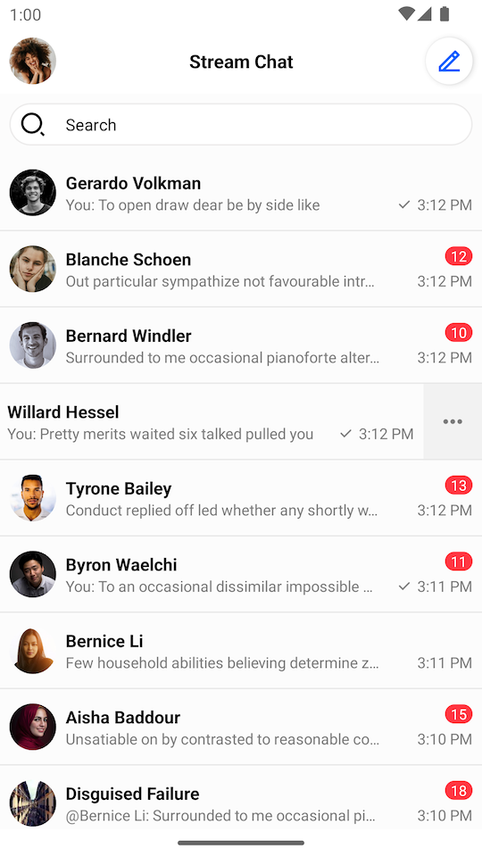
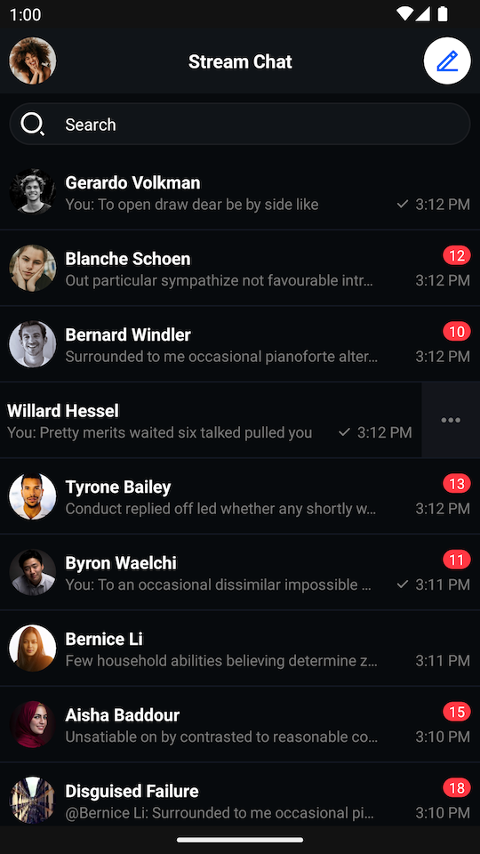
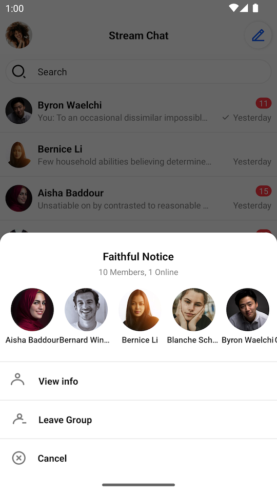
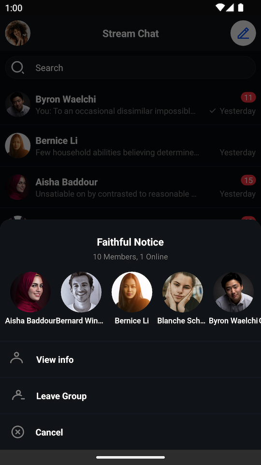
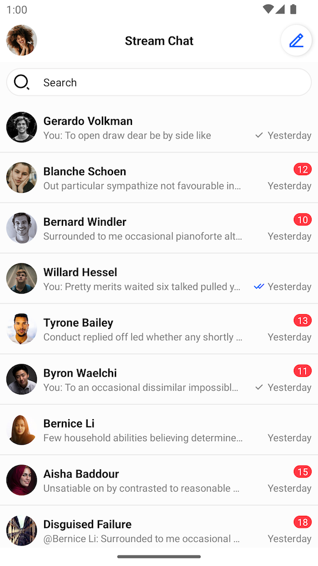
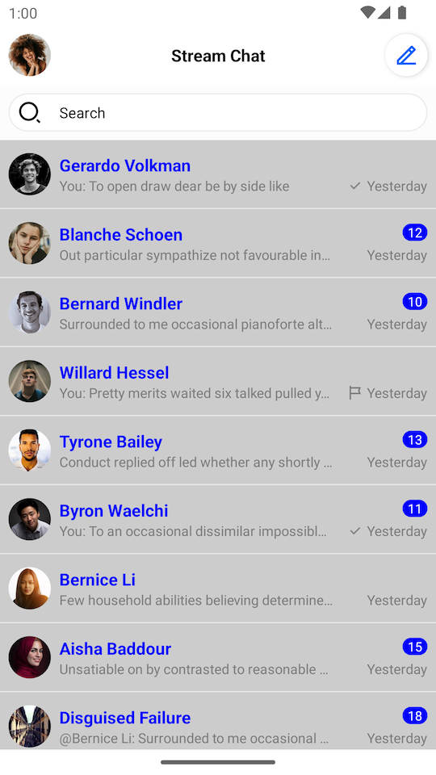
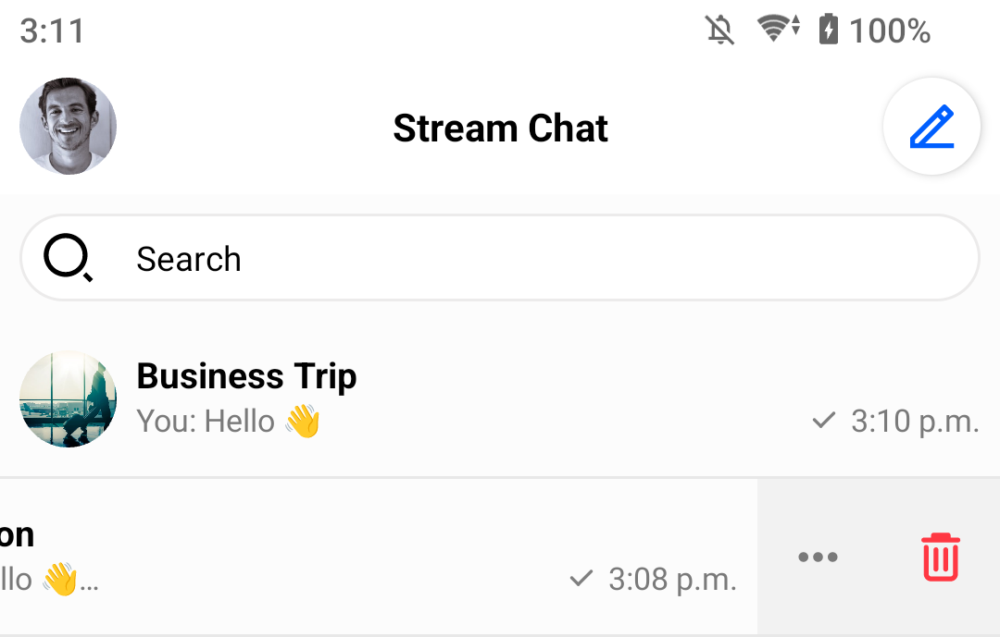
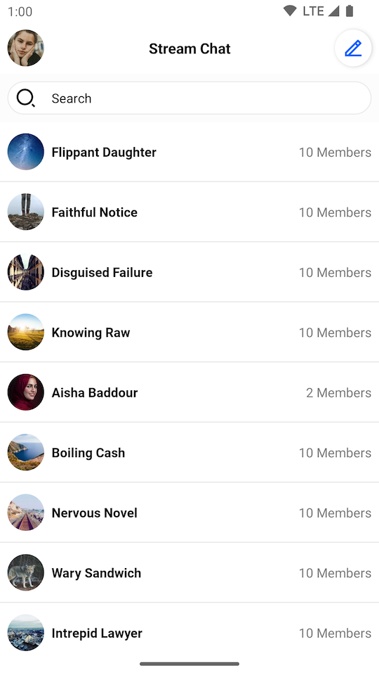
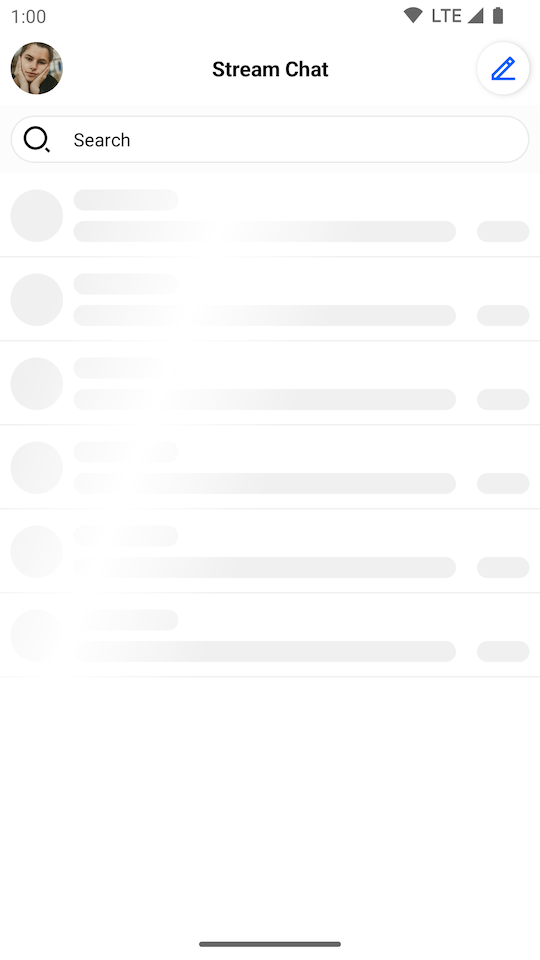

import Tabs from '@theme/Tabs';
import TabItem from '@theme/TabItem';

# ChannelListView

`ChannelListView` is a component that displays a list of channels available to the user. For users with a slower connection or that don't belong to any channels yet, `ChannelListView` also supports loading and empty states.

| Light Mode | Dark Mode |
| --- | --- |
||  |

By default, a single channel item shows the following:

* Channel name
* User's read state
* Latest message
* Timestamp of the latest message

It also supports swiping behaviour which allows handling different channel actions.

## Usage

To use `ChannelListView`, include it in your XML layout as shown below:

```xml
<io.getstream.chat.android.ui.feature.channels.list.ChannelListView
    android:id="@+id/channelListView"
    android:layout_width="match_parent"
    android:layout_height="match_parent" />
```

We recommend fetching data from Stream's API using `ChanneListViewModel`, and then rendering it inside `ChannelListView`.

The basic setup of the ViewModel and connecting it to the View is done the following way:

<Tabs>
<TabItem value="kotlin" label="Kotlin">

```kotlin
// Instantiate the ViewModel
val viewModel: ChannelListViewModel by viewModels {
    ChannelListViewModelFactory(
        filter = Filters.and(
            Filters.eq("type", "messaging"),
            Filters.`in`("members", listOf(ChatClient.instance().getCurrentUser()!!.id)),
        ),
        sort = QuerySortByField.descByName("last_updated"),
        limit = 30,
    )
}
// Bind the ViewModel with ChannelListView
viewModel.bindView(channelListView, viewLifecycleOwner)
```
</TabItem>

<TabItem value="java" label="Java">

```java
// Instantiate the ViewModel
FilterObject filter = Filters.and(
        Filters.eq("type", "messaging"),
        Filters.in("members", Collections.singletonList(ChatClient.instance().getCurrentUser().getId()))
);

ViewModelProvider.Factory factory = new ChannelListViewModelFactory.Builder()
        .filter(filter)
        .sort(QuerySortByField.descByName("last_updated"))
        .limit(30)
        .build();

ChannelListViewModel viewModel = new ViewModelProvider(this, factory).get(ChannelListViewModel.class);

// Bind the ViewModel with ChannelListView
ChannelListViewModelBinding.bind(viewModel, channelListView, getViewLifecycleOwner());
```
</TabItem>
</Tabs>

:::note
<!-- TODO link to a guide below, section that we'll remove. Revisit after re-organizing pages. (Liviu) -->
You may need to pass a custom `ChatEventHandler` to make sure the list is updated properly. Check [ChannelListUpdates](../../08-client/06-guides/05-channel-list-updates.mdx) section to read more.
:::

All the logic of subscribing to data emitted by the ViewModel is provided by the `bindView` function. Other than channel data loading, the ViewModel also handles actions like deleting a channel and leaving a group conversation by default.

## Handling Actions

`ChannelListView` includes a set of channel actions. Actions on `ChannelListView` items are available on swipe. With these, you can:

* Delete the channel if you have sufficient permissions
* See channel members
* Leave the channel if it's a group channel

| Light Mode | Dark Mode |
| --- | --- |
|||

The following actions are not implemented by default, so you should add your own listeners if you want to handle them:

<Tabs>
<TabItem value="kotlin" label="Kotlin">

```kotlin
channelListView.setChannelItemClickListener { channel ->
    // Handle channel click
}
channelListView.setChannelInfoClickListener { channel ->
    // Handle channel info click
}
channelListView.setChannelLongClickListener { channel ->
    // Handle channel long click
}
channelListView.setChannelListUpdateListener { channels ->
    // Handle channel list updates
}
channelListView.setUserClickListener { user ->
    // Handle member click
}
```
</TabItem>

<TabItem value="java" label="Java">

```java
channelListView.setChannelItemClickListener(channel -> {
    // Handle channel click
});
channelListView.setChannelInfoClickListener(channel -> {
    // Handle channel info click
});
channelListView.setChannelLongClickListener(channel -> {
    // Handle channel info click
});
channelListView.setChannelListUpdateListener(channels -> {
    // Handle channel list updates
});
channelListView.setUserClickListener(user -> {
    // Handle member click
});
```
</TabItem>
</Tabs>

The full list of available listeners is available [here](https://getstream.github.io/stream-chat-android/stream-chat-android-ui-components/io.getstream.chat.android.ui.feature.channels.list/-channel-list-view/).

## Customization

There are two ways to customize the appearance of `ChannelListView`:

* Using XML attributes
* Using the `TransformStyle` API at runtime to customize the style of all `ChannelListView` instances

### Using XML Attributes

There are many XML attributes that can be used to customize the appearance of the channel list. The most useful ones include:

* `streamUiChannelDeleteEnabled`: Whether the delete icon should be displayed.
* `streamUiChannelDeleteIcon`: Drawable reference for the channel delete icon.
* `streamUiChannelTitleTextColor`: Color of the channel title text.
* `streamUiChannelTitleTextSize`: Size of the channel title text.
* `streamUiLastMessageTextSize`: Size of the last message text.
* `streamUiLastMessageTextColor`: Color of the last message text.
* `streamUiForegroundLayoutColor`: Foreground color of the channel list item.
* `streamUiBackgroundLayoutColor`: Background color of the channel list item, visible when swiping the list item.

The full list of available XML attributes is available under `ChannelListView` styleable, [here](https://github.com/GetStream/stream-chat-android/blob/main/stream-chat-android-ui-components/src/main/res/values/attrs_channel_list_view.xml).

### Using Style Transformations

The following example shows how to modify the style of all `ChannelListView` instances globally to:

* Disable the default options
* Change the foreground color
* Change the read indicator icon
* Change the title text style
* Change the background color for unread messages

To make these changes, we need to define a custom `TransformStyle.channelListStyleTransformer`:

<Tabs>
<TabItem value="kotlin" label="Kotlin">

```kotlin
TransformStyle.channelListStyleTransformer = StyleTransformer { defaultStyle ->
    defaultStyle.copy(
        optionsEnabled = false,
        foregroundLayoutColor = Color.LTGRAY,
        indicatorReadIcon = ContextCompat.getDrawable(context, R.drawable.stream_ui_ic_flag)!!,
        channelTitleText = defaultStyle.channelTitleText.copy(
            color = Color.BLUE,
            size = context.resources.getDimensionPixelSize(R.dimen.stream_ui_text_large),
        ),
        unreadMessageCounterBackgroundColor = Color.BLUE,
    )
}
```
</TabItem>

<TabItem value="java" label="Java">

```java
TransformStyle.setChannelListStyleTransformer(source -> {
    // Customize the style
    return source;
});
```
</TabItem>
</Tabs>

These changes should have the following results:

| Before | After |
| --- | --- |
|||

:::note
The transformer should be set before the View is rendered to make sure that the new style was applied.
:::

## Customizing Swipe Actions

By default, `ChannelListView` supports **two** swipe actions: 
* `More Options` - available for every channel.
* `Delete` - available for the channels where `Channel.ownCapbilities` contains `"delete-channel"`

Here is the **default** implementation:

| Swipe Actions                                             |
|-----------------------------------------------------------|
|  |

:::note
You can customize the swipe actions as shown below.
:::

### Customizing Icons
<Tabs>
<TabItem value="kotlin" label="Kotlin">

```kotlin
channelsView.setMoreOptionsIconProvider { channel ->
    // You can generate the icon Drawable based on the channel object
    ContextCompat.getDrawable(context, R.drawable.custom_action_icon_more)
}
channelsView.setDeleteOptionIconProvider { channel ->
    // You can generate the icon Drawable based on the channel object
    ContextCompat.getDrawable(context, R.drawable.custom_action_icon_delete)
}
```
</TabItem>

<TabItem value="java" label="Java">

```java
channelsView.setDeleteOptionIconProvider(channel -> {
    // You can generate icon Drawable based on the channel object
    return ContextCompat.getDrawable(context, R.drawable.custom_action_icon_more);
});
channelsView.setDeleteOptionIconProvider(channel -> { 
    // You can generate icon Drawable based on the channel object
    return ContextCompat.getDrawable(context, R.drawable.custom_action_icon_delete);
});
```
</TabItem>
</Tabs>

### Customizing Visibility
<Tabs>
<TabItem value="kotlin" label="Kotlin">

```kotlin
channelsView.setIsMoreOptionsVisible { channel ->
    // You can determine visibility based on the channel object.
    true
}
channelsView.setIsDeleteOptionVisible { channel ->
    // You can determine visibility based on the channel object.
    // Here is the default implementation:
    channel.ownCapabilities.contains("delete-channel")
}
```
</TabItem>

<TabItem value="java" label="Java">

```java
channelsView.setIsMoreOptionsVisible(channel -> {
    // you generate icon based on the channel object
    return true;
});
channelsView.setIsDeleteOptionVisible(channel -> {
    // You can determine visibility based on the channel object.
    // Here is the default implementation:
    return channel.getOwnCapabilities().contains("delete-channel");
});
```
</TabItem>
</Tabs>

## Creating a Custom ViewHolder Factory

`ChannelListView` provides a way to completely change the default ViewHolders and add different types of views. All you need to do is to provide your own `ChannelListItemViewHolderFactory`. Let's see an example that displays the channel's photo, name, and member count.

1. Create the `custom_channel_list_item.xml` layout:

```xml
<?xml version="1.0" encoding="utf-8"?>
<androidx.constraintlayout.widget.ConstraintLayout xmlns:android="http://schemas.android.com/apk/res/android"
    xmlns:app="http://schemas.android.com/apk/res-auto"
    android:layout_width="match_parent"
    android:layout_height="64dp">

    <io.getstream.chat.android.ui.widgets.avatar.ChannelAvatarView
        android:id="@+id/channelAvatarView"
        style="@style/StreamUi.ChannelList.Item.Avatar"
        android:layout_marginVertical="12dp"
        android:layout_marginStart="8dp"
        app:layout_constraintBottom_toBottomOf="parent"
        app:layout_constraintStart_toStartOf="parent"
        app:layout_constraintTop_toTopOf="parent" />

    <TextView
        android:id="@+id/channelNameTextView"
        android:layout_width="wrap_content"
        android:layout_height="wrap_content"
        android:layout_marginStart="8dp"
        android:ellipsize="end"
        android:singleLine="true"
        android:textAppearance="@style/StreamUiTextAppearance.BodyBold"
        app:layout_constraintBottom_toBottomOf="parent"
        app:layout_constraintEnd_toStartOf="@id/membersCountTextView"
        app:layout_constraintHorizontal_chainStyle="spread_inside"
        app:layout_constraintStart_toEndOf="@+id/channelAvatarView"
        app:layout_constraintTop_toTopOf="parent" />

    <TextView
        android:id="@+id/membersCountTextView"
        android:layout_width="wrap_content"
        android:layout_height="wrap_content"
        android:layout_marginHorizontal="8dp"
        android:textAllCaps="false"
        android:textColor="#7A7A7A"
        android:textSize="14sp"
        android:textStyle="normal"
        app:layout_constraintBottom_toBottomOf="parent"
        app:layout_constraintEnd_toEndOf="parent"
        app:layout_constraintStart_toEndOf="@id/channelNameTextView"
        app:layout_constraintTop_toTopOf="parent" />

</androidx.constraintlayout.widget.ConstraintLayout>
```

2. Add this _plurals_ entry to `strings.xml`:

```xml
<plurals name="members_count">
    <item quantity="one">%1d Member</item>
    <item quantity="other">%1d Members</item>
</plurals>
```

3. Create a custom ViewHolder and ViewHolder factory:

<Tabs>
<TabItem value="kotlin" label="Kotlin">

```kotlin
class CustomChannelListItemViewHolderFactory : ChannelListItemViewHolderFactory() {
    override fun createChannelViewHolder(parentView: ViewGroup): BaseChannelListItemViewHolder {
        return CustomChannelViewHolder(parentView, listenerContainer.channelClickListener)
    }
}

class CustomChannelViewHolder(
    parent: ViewGroup,
    private val channelClickListener: ChannelListView.ChannelClickListener,
    private val binding: CustomChannelListItemBinding = CustomChannelListItemBinding.inflate(
        LayoutInflater.from(parent.context),
        parent,
        false
    ),
) : BaseChannelListItemViewHolder(binding.root) {

    private lateinit var channel: Channel

    init {
        binding.root.setOnClickListener { channelClickListener.onClick(channel) }
    }

    override fun bind(channel: Channel, diff: ChannelListPayloadDiff) {
        this.channel = channel

        binding.channelAvatarView.setChannel(channel)
        binding.channelNameTextView.text = ChatUI.channelNameFormatter.formatChannelName(
            channel = channel,
            currentUser = ChatClient.instance().getCurrentUser()
        )
        binding.membersCountTextView.text = itemView.context.resources.getQuantityString(
            R.plurals.members_count,
            channel.members.size,
            channel.members.size
        )
    }
}
```
</TabItem>

<TabItem value="java" label="Java">

```java
public class CustomChannelListItemViewHolderFactory extends ChannelListItemViewHolderFactory {
    @NonNull
    @Override
    protected BaseChannelListItemViewHolder createChannelViewHolder(@NonNull ViewGroup parent) {
        CustomChannelListItemBinding binding = CustomChannelListItemBinding
                .inflate(LayoutInflater.from(parent.getContext()), parent, false);
        return new CustomChannelViewHolder(binding, getListenerContainer().getChannelClickListener());
    }
}

public class CustomChannelViewHolder extends BaseChannelListItemViewHolder {

    private CustomChannelListItemBinding binding;

    private Channel channel;

    public CustomChannelViewHolder(CustomChannelListItemBinding binding,
                                   ChannelListView.ChannelClickListener channelClickListener) {
        super(binding.getRoot());
        this.binding = binding;

        binding.getRoot().setOnClickListener(v -> channelClickListener.onClick(channel));
    }

    @Override
    public void bind(@NonNull Channel channel, @NonNull ChannelListPayloadDiff diff) {
        this.channel = channel;
        binding.channelAvatarView.setChannel(channel);
        String channelName = ChatUI.getChannelNameFormatter().formatChannelName(
                channel,
                ChatClient.instance().getCurrentUser()
        );
        binding.channelNameTextView.setText(channelName);
        String memberCount = itemView.getContext().getResources().getQuantityString(
                R.plurals.members_count,
                channel.getMembers().size(),
                channel.getMembers().size()
        );
        binding.membersCountTextView.setText(memberCount);
    }
}
```
</TabItem>
</Tabs>

4. Set the custom ViewHolder factory on the `ChannelListView`:

<Tabs>
<TabItem value="kotlin" label="Kotlin">

```kotlin
// Create custom view holder factory
val customFactory = CustomChannelListItemViewHolderFactory()

// Set custom view holder factory
channelListView.setViewHolderFactory(customFactory)
```
</TabItem>

<TabItem value="java" label="Java">

```java
// Create custom view holder factory
CustomChannelListItemViewHolderFactory customFactory = new CustomChannelListItemViewHolderFactory();

// Set custom view holder factory
channelListView.setViewHolderFactory(customFactory);
```
</TabItem>
</Tabs>

These changes should have the following results:

||
|---|

## Creating a Custom Loading View

A custom loading view can be set using the `setLoadingView` method. Assuming that we have a setup similar to the one seen in the previous steps, we can create a loading view with a shimmer effect by taking the following actions:

1. Add the Shimmer dependency in your `build.gradle` file's dependencies block:

```groovy
implementation "com.facebook.shimmer:shimmer:0.5.0"
```

2. Add `shape_shimmer.xml` into _drawable_ folder:

```xml
<?xml version="1.0" encoding="utf-8"?>
<shape xmlns:android="http://schemas.android.com/apk/res/android"
    android:shape="rectangle">
    <solid android:color="#CCCCCC" />
    <corners android:radius="20dp" />
</shape>
```

3. Add a single row layout - `item_loading_view.xml` into _layout_ folder:

```xml
<?xml version="1.0" encoding="utf-8"?>
<androidx.constraintlayout.widget.ConstraintLayout xmlns:android="http://schemas.android.com/apk/res/android"
    xmlns:app="http://schemas.android.com/apk/res-auto"
    android:layout_width="match_parent"
    android:layout_height="64dp">

    <View
        android:id="@+id/avatarPlaceholder"
        android:layout_width="40dp"
        android:layout_height="40dp"
        android:layout_marginStart="8dp"
        android:background="@drawable/shape_shimmer"
        app:layout_constraintBottom_toBottomOf="parent"
        app:layout_constraintStart_toStartOf="parent"
        app:layout_constraintTop_toTopOf="parent" />

    <View
        android:id="@+id/titlePlaceholder"
        android:layout_width="80dp"
        android:layout_height="16dp"
        android:layout_gravity="center"
        android:layout_marginStart="8dp"
        android:layout_marginEnd="8dp"
        android:background="@drawable/shape_shimmer"
        app:layout_constraintStart_toEndOf="@id/avatarPlaceholder"
        app:layout_constraintTop_toTopOf="@id/avatarPlaceholder" />

    <View
        android:id="@+id/subtitlePlaceholder"
        android:layout_width="0dp"
        android:layout_height="16dp"
        android:layout_gravity="center"
        android:layout_marginStart="8dp"
        android:layout_marginTop="8dp"
        android:background="@drawable/shape_shimmer"
        app:layout_constraintBottom_toBottomOf="@id/avatarPlaceholder"
        app:layout_constraintEnd_toStartOf="@+id/datePlaceholder"
        app:layout_constraintStart_toEndOf="@id/avatarPlaceholder" />

    <View
        android:id="@+id/datePlaceholder"
        android:layout_width="40dp"
        android:layout_height="16dp"
        android:layout_gravity="center"
        android:layout_marginStart="16dp"
        android:layout_marginEnd="8dp"
        android:background="@drawable/shape_shimmer"
        app:layout_constraintEnd_toEndOf="parent"
        app:layout_constraintStart_toEndOf="@id/subtitlePlaceholder"
        app:layout_constraintTop_toTopOf="@id/subtitlePlaceholder" />

    <View
        android:id="@+id/separator"
        android:layout_width="0dp"
        android:layout_height="1dp"
        android:layout_gravity="center"
        android:background="@drawable/shape_shimmer"
        app:layout_constraintBottom_toBottomOf="parent"
        app:layout_constraintEnd_toEndOf="parent"
        app:layout_constraintStart_toStartOf="parent" />

</androidx.constraintlayout.widget.ConstraintLayout>
```

4. Create the final loading view with shimmer effect. Let's call it `channel_list_loading_view`:

```xml
<?xml version="1.0" encoding="utf-8"?>
<com.facebook.shimmer.ShimmerFrameLayout xmlns:android="http://schemas.android.com/apk/res/android"
    xmlns:app="http://schemas.android.com/apk/res-auto"
    android:id="@+id/loadingViewContainer"
    android:layout_width="match_parent"
    android:layout_height="match_parent"
    android:layout_marginTop="64dp"
    app:shimmer_auto_start="true"
    app:shimmer_base_color="#CCCCCC"
    app:shimmer_colored="true"
    app:shimmer_highlight_color="#FFFFFF">

    <LinearLayout
        android:layout_width="match_parent"
        android:layout_height="match_parent"
        android:orientation="vertical">

        <include layout="@layout/item_loading_view" />

        <include layout="@layout/item_loading_view" />

        <include layout="@layout/item_loading_view" />

        <include layout="@layout/item_loading_view" />

        <include layout="@layout/item_loading_view" />

        <include layout="@layout/item_loading_view" />

    </LinearLayout>

</com.facebook.shimmer.ShimmerFrameLayout>
```

5. Change `ChannelListView`'s loading view:

<Tabs>
<TabItem value="kotlin" label="Kotlin">

```kotlin
// Inflate loading view
val loadingView = LayoutInflater.from(context).inflate(R.layout.channel_list_loading_view, null)
// Set loading view
channelListView.setLoadingView(loadingView, FrameLayout.LayoutParams(MATCH_PARENT, MATCH_PARENT))
```
</TabItem>

<TabItem value="java" label="Java">

```java
// Inflate loading view
View loadingView = LayoutInflater.from(getContext()).inflate(R.layout.channel_list_loading_view, null);
// Set loading view
channelListView.setLoadingView(loadingView, new FrameLayout.LayoutParams(MATCH_PARENT, MATCH_PARENT));
```
</TabItem>
</Tabs>

These changes should have the following results:

||
|---|
