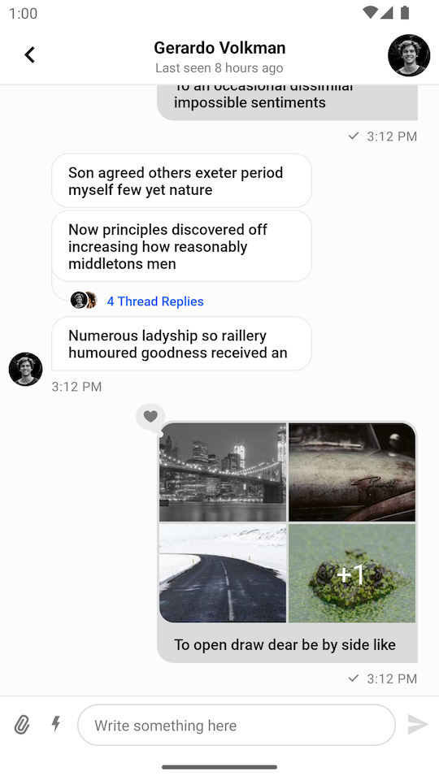

import Tabs from '@theme/Tabs';
import TabItem from '@theme/TabItem';

# Message List Screen

You can set up a self-contained chat screen that displays a list of messages and gives users the ability to send messages by using one of the following components:

* `MessageListFragment`: A Fragment that represents a self-contained chat screen.
* `MessageListActivity`: An Activity that is just a thin wrapper around `MessageListFragment`.

The `MessageListFragment` contains these three inner components:

* [`MessageListHeaderView`](02-message-list-header.mdx): Displays a navigation icon, the name of the channel or thread and the channel avatar.
* [`MessageListView`](03-message-list.mdx): Shows a list of paginated messages, with threads, replies, reactions and deleted messages.
* [`MessageComposerView`](../06-message-composer/01-message-composer.mdx): Allows users to participate in the chat by sending messages and attachments.

:::note
Fragments and Activities representing self-contained screens are easy to use. They allow you to explore the features of our SDK in a breeze, however, they offer limited customization.
:::

## Usage

To use the message list screen, you can simply start `MessageListActivity` from the SDK:

<Tabs>
<TabItem value="kotlin" label="Kotlin">

```kotlin
context.startActivity(MessageListActivity.createIntent(context, cid = "messaging:123"))
```
</TabItem>

<TabItem value="java" label="Java">

```java
context.startActivity(MessageListActivity.createIntent(context, "messaging:123"));
```
</TabItem>
</Tabs>

This single line of code will produce a fully working solution, as shown in the image below.

||
|---|

Alternatively, you can achieve the same result by adding `MessageListFragment` from the SDK to your Fragment or Activity:

```xml
<?xml version="1.0" encoding="utf-8"?>
<FrameLayout xmlns:android="http://schemas.android.com/apk/res/android"
    android:id="@+id/container"
    android:layout_width="match_parent"
    android:layout_height="match_parent" />
```

<Tabs>
<TabItem value="kotlin" label="Kotlin">

```kotlin
class MyMessageListActivity : AppCompatActivity(R.layout.fragment_container) {

    override fun onCreate(savedInstanceState: Bundle?) {
        super.onCreate(savedInstanceState)
        if (savedInstanceState == null) {
            val fragment = MessageListFragment.newInstance(cid = "messaging:123") {
                showHeader(true)
            }
            supportFragmentManager.beginTransaction()
                .replace(R.id.container, fragment)
                .commit()
        }
    }
}
```
</TabItem>

<TabItem value="java" label="Java">

```java
public final class MyMessageListActivity extends AppCompatActivity {

    public MyMessageListActivity() {
        super(R.layout.fragment_container);
    }
    
    @Override
    protected void onCreate(@Nullable Bundle savedInstanceState) {
        super.onCreate(savedInstanceState);
        if (savedInstanceState == null) {
            MessageListFragment fragment  = MessageListFragment.newInstance("messaging:123", builder -> {
                builder.showHeader(true);
                return Unit.INSTANCE;
            });
            getSupportFragmentManager().beginTransaction()
                    .replace(R.id.container, fragment)
                    .commit();
        }
    }
}
```
</TabItem>
</Tabs>

Next, let's see how to handle actions on the screen.

## Handling Actions

To handle actions supported by `MessageListFragment` you have to implement corresponding click listeners in the parent Fragment or Activity:

<Tabs>
<TabItem value="kotlin" label="Kotlin">

```kotlin
class MyMessageListActivity : AppCompatActivity(R.layout.fragment_container), MessageListFragment.BackPressListener {

    override fun onCreate(savedInstanceState: Bundle?) {
        super.onCreate(savedInstanceState)
        // Add MessageListFragment to the layout
    }

    override fun onBackPress() {
        // Handle back press
    }
}
```
</TabItem>

<TabItem value="java" label="Java">

```java
public final class MyMessageListActivity extends AppCompatActivity implements MessageListFragment.BackPressListener {

    public MyMessageListActivity() {
        super(R.layout.fragment_container);
    }
    
    @Override
    protected void onCreate(@Nullable Bundle savedInstanceState) {
        super.onCreate(savedInstanceState);
        // Add MessageListFragment to the layout
    }

    @Override
    public void onBackPress() {
        // Handle back press
    }
}
```
</TabItem>
</Tabs>

Currently, there's only a single click listener you can use with the `MessageListFragment`:

* `BackPressListener`: Click listener for the navigation button in the header. Finishes Activity by default.

## Customization

The message list screen component offers limited customization. The `MessageListFragment` exposes a builder with the following methods:

* `setFragment`: Sets custom message list Fragment. The Fragment must be a subclass of `MessageListFragment`.
* `customTheme`: Custom theme for the screen.
* `showHeader`: Whether the header is shown or hidden.
* `messageId`: The ID of the message to highlight.

Other than that, you can use inheritance for further customization as shown in the example below:

<Tabs>
<TabItem value="kotlin" label="Kotlin">

```kotlin
class CustomMessageListFragment : MessageListFragment() {

    override fun setupMessageListHeader(messageListHeaderView: MessageListHeaderView) {
        super.setupMessageListHeader(messageListHeaderView)
        // Customize message list header view

        // For example, set a custom listener for the back button
        messageListHeaderView.setBackButtonClickListener {
            // Handle back press
        }
    }

    override fun setupMessageList(messageListView: MessageListView) {
        super.setupMessageList(messageListView)
        // Customize message list view
    }

    override fun setupMessageComposer(messageComposerView: MessageComposerView) {
        super.setupMessageComposer(messageComposerView)
        // Customize message composer view
    }
}

class CustomMessageListActivity : MessageListActivity() {

    override fun createMessageListFragment(cid: String, messageId: String?): MessageListFragment {
        return MessageListFragment.newInstance(cid) {
            setFragment(CustomMessageListFragment())
            customTheme(R.style.StreamUiTheme)
            showHeader(true)
            messageId(messageId)
        }
    }
}
```
</TabItem>

<TabItem value="java" label="Java">

```java
public final class CustomMessageListFragment extends MessageListFragment {

    @Override
    protected void setupMessageListHeader(@NonNull MessageListHeaderView messageListHeaderView) {
        super.setupMessageListHeader(messageListHeaderView);
        // Customize message list header view

        // For example, set a custom listener for the back button
        messageListHeaderView.setBackButtonClickListener(() -> {
            // Handle back press
        });
    }

    @Override
    protected void setupMessageList(@NonNull MessageListView messageListView) {
        super.setupMessageList(messageListView);
        // Customize message list view
    }

    @Override
    protected void setupMessageComposer(@NonNull MessageComposerView messageComposerView) {
        super.setupMessageComposer(messageComposerView);
        // Customize message composer view
    }
}

public final class CustomMessageListActivity extends MessageListActivity {

    @NonNull
    @Override
    protected MessageListFragment createMessageListFragment(@NonNull String cid, @Nullable String messageId) {
        return MessageListFragment.newInstance(cid, builder -> {
            builder.setFragment(new CustomMessageListFragment());
            builder.customTheme(R.style.StreamUiTheme);
            builder.showHeader(true);
            builder.messageId(messageId);
            return Unit.INSTANCE;
        });
    }
}
```
</TabItem>
</Tabs>

Then you need to add `CustomMessageListActivity` to your `AndroidManifest.xml`, create an Intent for it using the `MessageListActivity.createIntent()` method, and finally start the Activity:

<Tabs>
<TabItem value="kotlin" label="Kotlin">

```kotlin
context.startActivity(
    MessageListActivity.createIntent(
        context = context,
        cid = "messaging:123",
        activityClass = CustomMessageListActivity::class.java
    )
)
```
</TabItem>

<TabItem value="java" label="Java">

```java
context.startActivity(MessageListActivity.createIntent(context, "messaging:123", null, CustomMessageListActivity.class));
```
</TabItem>
</Tabs>

:::note
Fragments and Activities representing self-contained screens can be styled using the options described in the [theming](../02-theming.mdx) guide.
:::
