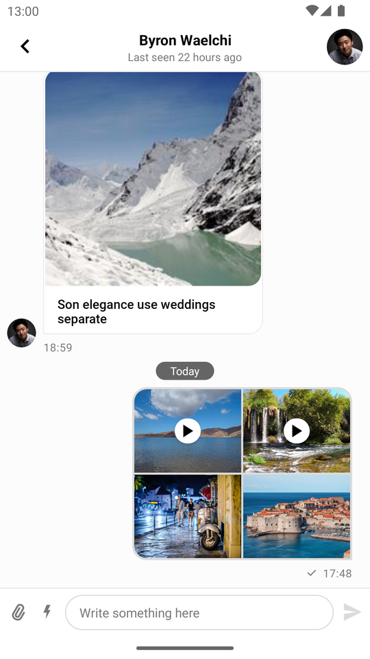
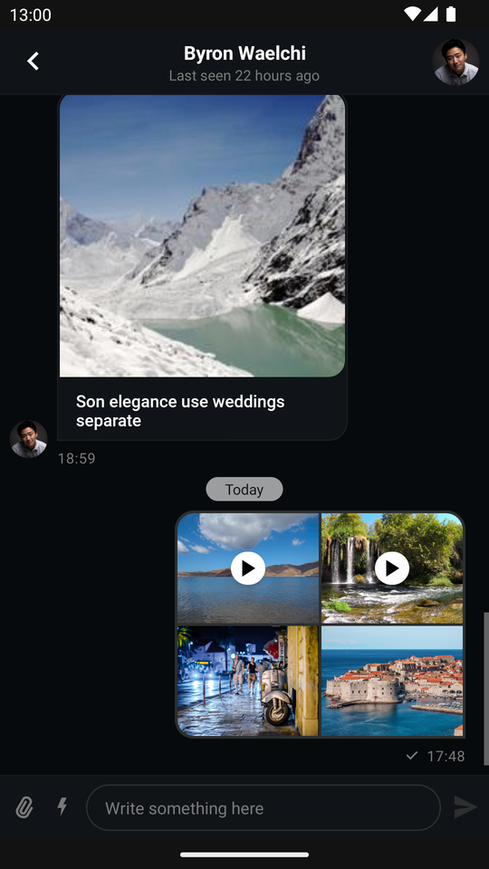
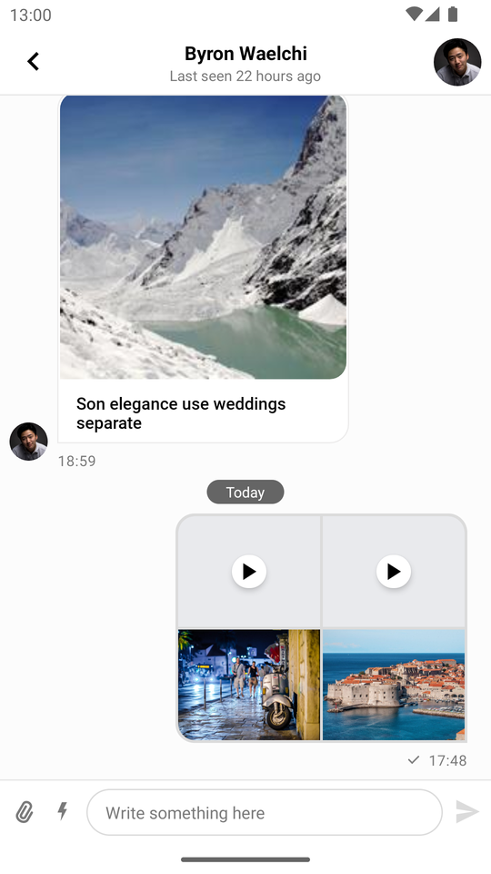

import Tabs from '@theme/Tabs';
import TabItem from '@theme/TabItem';

# MessageListView

`MessageListView` is one of our core UI components, which displays a list of messages for the given channel. It contains the following list of possible items:

- Plain text message
- Text message with attachments (media or file)
- Deleted message (depending on the set `DeletedMessageVisibility` value)
- Error message (for example inappropriate messages blocked by moderation)
- System message (for example when a user joins the channel)
- Giphy preview
- Date separator
- Loading more indicator
- Thread separator (for thread mode only)
- Typing indicator

You're able to customize the appearance of this component using custom attributes as well as method calls at runtime. `MessageListView` also contains a set of overridable action/option handlers and event listeners. By default, this component has the following appearance:

| Light Mode | Dark Mode |
| --- | --- |
|||

## Usage

If you want to keep the default design and behavior of this component then getting started with it is very simple:

1. Add the component to your XML layout hierarchy.
2. Bind it to a `MessageListViewModel`.

Adding `MessageListView` to your layout is as easy as inserting the following lines to your layout hierarchy:

```xml
<io.getstream.chat.android.ui.feature.messages.list.MessageListView
    android:id="@+id/messageListView"
    android:layout_height="match_parent"
    android:layout_width="match_parent" />
``` 

The UI components library includes a `ViewModel` for `MessageListView`.<br/>
Binding it to the `View` is easily accomplished using an extension function called `bindView`:

<Tabs>
<TabItem value="kotlin" label="Kotlin">

```kotlin
// 1. Init ViewModel
val viewModel: MessageListViewModel by viewModels {
    MessageListViewModelFactory(cid = "messaging:123")
}

// 2. Bind View and ViewModel
viewModel.bindView(messageListView, lifecycleOwner)
```
</TabItem>

<TabItem value="java" label="Java">

```java
// Init ViewModel
ViewModelProvider.Factory factory = new MessageListViewModelFactory.Builder()
        .cid("messaging:123")
        .build();
ViewModelProvider provider = new ViewModelProvider(this, factory);
MessageListViewModel viewModel = provider.get(MessageListViewModel.class);

// Bind View and ViewModel
MessageListViewModelBinding.bind(viewModel, messageListView, getViewLifecycleOwner());
```
</TabItem>
</Tabs>

## Handling Actions

`MessageListView` contains a set of actions which are activated by long pressing a message:

* Adding reactions
* Replying
* Replying in a thread
* Copying the message
* Editing the message
* Deleting the message
* Flagging the message

:::note
Certain actions are subject to how user permissions are setup. You can find them inside the [Stream Dashboard](https://dashboard.getstream.io).<br/>
Learn more about permissions [here](https://getstream.io/chat/docs/other-rest/chat_permission_policies/).
:::

| Light Mode | Dark Mode |
| --- | --- |
|||

Default action handlers are set up when binding the ViewModel to the View.<br/>
You can customize the default behavior by overriding each of the following handlers:

<Tabs>
<TabItem value="kotlin" label="Kotlin">

```kotlin
messageListView.setLastMessageReadHandler {
    // Handle when last message got read
}
messageListView.setEndRegionReachedHandler {
    // Handle when end region reached
}
messageListView.setMessageDeleteHandler { message: Message ->
    // Handle when message is going to be deleted
}
messageListView.setThreadStartHandler { message: Message ->
    // Handle when new thread for message is started
}
messageListView.setMessageFlagHandler { message: Message ->
   // Handle when message is going to be flagged
}
messageListView.setMessagePinHandler { message: Message ->
    // Handle when message is going to be pinned
}
messageListView.setMessageUnpinHandler { message: Message ->
    // Handle when message is going to be unpinned
}
messageListView.setGiphySendHandler { giphyAction: GiphyAction ->
    // Handle when some giphyAction is going to be performed
}
messageListView.setMessageRetryHandler { message: Message ->
    // Handle when some failed message is going to be retried
}
messageListView.setMessageReactionHandler { message: Message, reactionType: String ->
    // Handle when some reaction for message is going to be send
}
messageListView.setMessageReplyHandler { cid: String, message: Message ->
    // Handle when message is going to be replied in the channel with cid
}
messageListView.setAttachmentDownloadHandler {
    // Handle when attachment is going to be downloaded
}
```
</TabItem>

<TabItem value="java" label="Java">

```java
messageListView.setLastMessageReadHandler(() -> {
    // Handle when last message got read
});
messageListView.setEndRegionReachedHandler(() -> {
    // Handle when end region reached
});
messageListView.setMessageDeleteHandler((message) -> {
    // Handle when message is going to be deleted
});
messageListView.setThreadStartHandler((message) -> {
    // Handle when new thread for message is started
});
messageListView.setMessageFlagHandler((message) -> {
    // Handle when message is going to be flagged
});
messageListView.setMessagePinHandler((message) -> {
    // Handle when message is going to be pinned
});
messageListView.setMessageUnpinHandler((message) -> {
    // Handle when message is going to be unpinned
});
messageListView.setGiphySendHandler((giphyAction) -> {
    // Handle when some giphyAction is going to be performed
});
messageListView.setMessageRetryHandler((message) -> {
    // Handle when some failed message is going to be retried
});
messageListView.setMessageReactionHandler((message, reactionType) -> {
    // Handle when some reaction for message is going to be send
});
messageListView.setMessageReplyHandler((cid, message) -> {
    // Handle when message is going to be replied in the channel with cid
});
messageListView.setAttachmentDownloadHandler((attachmentDownloadCall) -> {
    // Handle when attachment is going to be downloaded
});
messageListView.setMessageEditHandler((message) -> {
    // Handle edit message
});
```
</TabItem>
</Tabs>

:::note
Handlers must be set before passing any data to `MessageListView`. If you're not using the default binding provided by `bindView`, please make sure to set up all the handlers yourself.
:::

This section lists only some of the more important handlers, many more exist and you can find there inside [`MessageListView`](https://github.com/GetStream/stream-chat-android/blob/main/stream-chat-android-ui-components/src/main/kotlin/io/getstream/chat/android/ui/feature/messages/list/MessageListView.kt).

### Listeners

In addition to the required handlers, `MessageListView` also provides optional listeners. They are also set by default if you use `bindView`.

You can always override them to get the event when something happens:

<Tabs>
<TabItem value="kotlin" label="Kotlin">

```kotlin
messageListView.setMessageClickListener { message: Message ->
    // Handle message being clicked
}
messageListView.setEnterThreadListener { message: Message ->
    // Handle thread being entered
}
messageListView.setAttachmentDownloadClickListener { attachment: Attachment ->
    // Handle clicks on the download attachment button
}
messageListView.setUserReactionClickListener { message: Message, user: User, reaction: Reaction ->
    // Handle clicks on a reaction left by a user
}
messageListView.setMessageLongClickListener { message ->
    // Handle message being long clicked
}
messageListView.setAttachmentClickListener { message, attachment ->
    // Handle attachment being clicked
}
messageListView.setUserClickListener { user ->
    // Handle user avatar being clicked
}
```
</TabItem>

<TabItem value="java" label="Java">

```java
messageListView.setMessageClickListener((message) -> {
    // Handle message being clicked
});
messageListView.setEnterThreadListener((message) -> {
    // Handle thread being entered
});
messageListView.setAttachmentDownloadClickListener((attachment) -> {
    // Handle clicks on the download attachment button
});
messageListView.setUserReactionClickListener((message, user, reaction) -> {
    // Handle clicks on a reaction left by a user
});
messageListView.setMessageLongClickListener((message) -> {
    // Handle message being long clicked
});
messageListView.setAttachmentClickListener((message, attachment) -> {
    // Handle attachment being clicked
});
messageListView.setUserClickListener((user) -> {
    // Handle user avatar being clicked
});
```
</TabItem>
</Tabs>

Other available listeners for `MessageListView` can be found [here](https://getstream.github.io/stream-chat-android/stream-chat-android-ui-components/io.getstream.chat.android.ui.feature.messages.list.adapter/-message-list-listener-container/).

## Previewing Attachments

Out of the box previews are provided for the following attachment types: uploading, link, Giphy, image, video and file.

### Image and Video

Image and video attachments are previewed as thumbnails which can be displayed as a single tile or multiple ones depending on how many attachments are contained within the specific message.

In practice they appear as such:

| Video Thumbnails Enabled (Light Mode) | Video Thumbnails Enabled (Dark Mode) |
|---|---|
|  |  |

Video thumbnails are a paid feature, with the pricing listed [here](https://getstream.io/chat/pricing/). They are enabled by default but can be turned off by setting the `ChatUI` property `videoThumbnailsEnabled` to `false`. You can read more about disabling video thumbnails in the [configuration documentation](../03-customizing-components.mdx#disabling-video-thumbnails)

Once video thumbnails are disabled, messages containing video attachments will be displayed in the following manner:

| Video Thumbnails Disabled (Light Mode) | Video Thumbnails Disabled (Dark Mode) |
|---|---|
|  |  |
<!-- TODO WIP link in the actual guide once it is finish -->
<!-- If you want to read more about how to customize the way these attachments are displayed, head over to the relevant section seen [here](../11-guides/TODO-link-in-the-actual-guide-once-it-is-finish) -->

## Customization

You can change the appearance of this component to fit your app's design requirements. These changes can be done either at compile-time through the use of XML attributes, or at runtime by using style transformations.

### Using XML Attributes

`MessageListView` provides a large set of XML attributes available for customization. The complete list is available [here](https://github.com/GetStream/stream-chat-android/blob/main/stream-chat-android-ui-components/src/main/res/values/attrs_message_list_view.xml).

Let's consider an example in which we want to change the style of messages sent by the current user.

| Light Mode | Dark Mode |
| --- | --- |
|||

In order to do that, we need to add additional attributes to `MessageListView`:

```xml {11-14}
<io.getstream.chat.android.ui.feature.messages.list.MessageListView
    android:clipToPadding="false"
    android:id="@+id/messageListView"
    android:layout_height="0dp"
    android:layout_marginHorizontal="0dp"
    android:layout_width="0dp"
    app:layout_constraintBottom_toTopOf="@+id/messageComposerView"
    app:layout_constraintEnd_toEndOf="parent"
    app:layout_constraintStart_toStartOf="parent"
    app:layout_constraintTop_toBottomOf="@+id/messagesHeaderView"
    app:streamUiMessageBackgroundColorMine="#70AF74"
    app:streamUiMessageBackgroundColorTheirs="#FFFFFF"
    app:streamUiMessageTextColorMine="#FFFFFF"
    app:streamUiMessageTextColorTheirs="#000000" />
```

### Using Style Transformations

Both `MessageListView` and its ViewHolders can be configured programmatically (a list of supported customizations can be found [here](https://getstream.github.io/stream-chat-android/stream-chat-android-ui-components/io.getstream.chat.android.ui.feature.messages.list/-message-list-view-style/) and [here](https://getstream.github.io/stream-chat-android/stream-chat-android-ui-components/io.getstream.chat.android.ui.feature.messages.list/-message-list-item-style/)).

As an example, let's apply the green style from the previous section, but this time programmatically:

| Before | After |
| --- | --- |
|||

We are going to use a custom `TransformStyle.messageListItemStyleTransformer`:

<Tabs>
<TabItem value="kotlin" label="Kotlin">

```kotlin
TransformStyle.messageListItemStyleTransformer = StyleTransformer { defaultViewStyle ->
    defaultViewStyle.copy(
        messageBackgroundColorMine = Color.parseColor("#70AF74"),
        messageBackgroundColorTheirs = Color.WHITE,
        textStyleMine = defaultViewStyle.textStyleMine.copy(color = Color.WHITE),
        textStyleTheirs = defaultViewStyle.textStyleTheirs.copy(color = Color.BLACK),
    )
}
```
</TabItem>

<TabItem value="java" label="Java">

```java
TransformStyle.setMessageListItemStyleTransformer(source -> {
    // Customize the theme
    return source;
});
```
</TabItem>
</Tabs>

:::note
The transformers should be set before the views are rendered to make sure that the new style was applied.
:::

As another example, let's modify the default view which allows scrolling to the bottom when a new message arrives:

| Before | After |
| --- | --- |
|||

To achieve this effect we need to provide this custom `TransformStyle.messageListStyleTransformer`:

<Tabs>
<TabItem value="kotlin" label="Kotlin">

```kotlin
TransformStyle.messageListStyleTransformer = StyleTransformer { defaultViewStyle ->
    defaultViewStyle.copy(
        scrollButtonViewStyle = defaultViewStyle.scrollButtonViewStyle.copy(
            scrollButtonColor = Color.RED,
            scrollButtonUnreadEnabled = false,
            scrollButtonIcon = ContextCompat.getDrawable(requireContext(), R.drawable.stream_ui_ic_clock)!!,
        ),
    )
}
```
</TabItem>

<TabItem value="java" label="Java">

```java
TransformStyle.setMessageListStyleTransformer(source -> {
    // Customize the theme
    return source;
});
```
</TabItem>
</Tabs>

## Channel Feature Flags

Certain XML attributes let you to enable/disable features in `MessageListView`.
- `streamUiScrollButtonEnabled` - Show/hide the scroll-to-bottom button.
- `streamUiScrollButtonUnreadEnabled` - Show/hide the unread count badge on the scroll-to-bottom button.
- `streamUiReactionsEnabled` - Whether users can react to messages.
- `streamUiReplyEnabled` - Whether users can reply to messages.
- `streamUiCopyMessageActionEnabled` - Whether users can copy messages.
- `streamUiRetryMessageEnabled` - Whether users can retry failed messages.
- `streamUiEditMessageEnabled` - Whether users can edit their messages.
- `streamUiFlagMessageEnabled` - Whether users can flag messages.
- `streamUiFlagMessageConfirmationEnabled` - Whether users will see the confirmation dialog while flagging messages.
- `streamUiDeleteMessageEnabled` - Whether users can delete their messages.
- `streamUiDeleteConfirmationEnabled` - Whether users will see the confirmation dialog when deleting messages.
- `streamUiThreadsEnabled` - Whether users can create thread replies.
- `streamUiPinMessageEnabled` - Whether users can pin messages.

These attributes let you enable/disable configuration for channel features. for example if a channel's configuration supports message replies, but you disabled it via XML attributes, then members of this channel won't see such an option.

`MessageListView` provides you the possibility to enable/disable these channel features at runtime as well:

<Tabs>
<TabItem value="kotlin" label="Kotlin">

```kotlin
messageListView.setRepliesEnabled(false)
messageListView.setDeleteMessageEnabled(false)
messageListView.setEditMessageEnabled(false)
```
</TabItem>

<TabItem value="java" label="Java">

```java
messageListView.setRepliesEnabled(false);
messageListView.setDeleteMessageEnabled(false);
messageListView.setEditMessageEnabled(false);
```
</TabItem>
</Tabs>

| Before | After |
| --- | --- |
|||

## Messages Start Position
You can configure the messages to start at the top or the bottom **(default)** of the view by using `streamUiMessagesStart` and `streamUiThreadMessagesStart` attributes.

| Bottom | Top |
| --- | --- |
|||

:::note
The start position does not affect the orientation. The default is from bottom to top. If you would like to change that, use the method `setCustomLinearLayoutManager` and set a `LinearLayoutManager` with the desired orientation.
:::


## Filtering Messages

You can filter out certain messages if you don't want to show them in the `MessageListView`.
Imagine you want to hide all messages which contain the word 'secret'. This can be achieved using the following code:

<Tabs>
<TabItem value="kotlin" label="Kotlin">

```kotlin
val forbiddenWord = "secret"
val predicate = MessageListView.MessageListItemPredicate { item ->
    !(item is MessageListItem.MessageItem && item.message.text.contains(forbiddenWord))
}
messageListView.setMessageListItemPredicate(predicate)
```
</TabItem>

<TabItem value="java" label="Java">

```java
String forbiddenWord = "secret";
messageListView.setMessageListItemPredicate(item -> {
    if (item instanceof MessageListItem.MessageItem) {
        MessageListItem.MessageItem messageItem = (MessageListItem.MessageItem) item;
        return !((MessageListItem.MessageItem) item).getMessage().getText().contains(forbiddenWord);
    }

    return true;
});
```
</TabItem>
</Tabs>

:::note
The predicate has to return `true` for the items that you _do_ want to display in the list.
:::

## Custom Message Views

`MessageListView` provides an API for creating custom ViewHolders. To use your own ViewHolder: 
1. Extend `MessageListItemViewHolderFactory`.
2. Write your own logic for creating ViewHolders. 
3. Create a new factory instance and set it on `MessageListView`.

Let's consider an example in which we want to create a custom ViewHolder for messages sent by other users less than 24 hours ago. The result should look like this:

|  |
| --- |

1. Add a new layout called `today_message_list_item.xml`:

``` xml
<?xml version="1.0" encoding="utf-8"?>
<androidx.constraintlayout.widget.ConstraintLayout xmlns:android="http://schemas.android.com/apk/res/android"
    xmlns:app="http://schemas.android.com/apk/res-auto"
    android:layout_width="match_parent"
    android:layout_height="wrap_content">

    <com.google.android.material.card.MaterialCardView
        android:layout_width="wrap_content"
        android:layout_height="wrap_content"
        android:layout_marginStart="40dp"
        android:layout_marginTop="4dp"
        android:layout_marginBottom="4dp"
        app:cardBackgroundColor="@android:color/holo_green_dark"
        app:cardCornerRadius="8dp"
        app:cardElevation="0dp"
        app:layout_constrainedWidth="true"
        app:layout_constraintEnd_toEndOf="@id/marginEnd"
        app:layout_constraintHorizontal_bias="0"
        app:layout_constraintStart_toStartOf="parent"
        app:layout_constraintTop_toTopOf="parent">

        <TextView
            android:id="@+id/textLabel"
            android:layout_width="wrap_content"
            android:layout_height="wrap_content"
            android:gravity="start"
            android:padding="16dp"
            android:textColor="@android:color/primary_text_light" />

    </com.google.android.material.card.MaterialCardView>

    <androidx.constraintlayout.widget.Guideline
        android:id="@+id/marginEnd"
        android:layout_width="wrap_content"
        android:layout_height="wrap_content"
        android:orientation="vertical"
        app:layout_constraintGuide_percent="0.7" />

</androidx.constraintlayout.widget.ConstraintLayout>
```

2. Add a new `TodayViewHolder` class that inflates this layout and populates it with data:

<Tabs>
<TabItem value="kotlin" label="Kotlin">

```kotlin
class TodayViewHolder(
    parentView: ViewGroup,
    private val binding: TodayMessageListItemBinding = TodayMessageListItemBinding.inflate(LayoutInflater.from(
        parentView.context),
        parentView,
        false),
) : BaseMessageItemViewHolder<MessageListItem.MessageItem>(binding.root) {

    override fun bindData(data: MessageListItem.MessageItem, diff: MessageListItemPayloadDiff?) {
        binding.textLabel.text = data.message.text
    }
}
```
</TabItem>

<TabItem value="java" label="Java">

```java
class TodayViewHolder extends BaseMessageItemViewHolder<MessageListItem.MessageItem> {

    TodayMessageListItemBinding binding;

    public TodayViewHolder(@NonNull ViewGroup parentView, @NonNull TodayMessageListItemBinding binding) {
        super(binding.getRoot());
        this.binding = binding;
    }

    @Override
    public void bindData(@NonNull MessageListItem.MessageItem data, @Nullable MessageListItemPayloadDiff diff) {
        binding.textLabel.setText(data.getMessage().getText());
    }
}
```
</TabItem>
</Tabs>

3. Add a new `CustomMessageViewHolderFactory` class that evaluates each message, and uses the custom ViewHolder when necessary:

<Tabs>
<TabItem value="kotlin" label="Kotlin">

```kotlin
class CustomMessageViewHolderFactory : MessageListItemViewHolderFactory() {
    override fun getItemViewType(item: MessageListItem): Int {
        return if (item is MessageListItem.MessageItem &&
            item.isTheirs &&
            item.message.attachments.isEmpty() &&
            item.message.createdAt.isLessThenDayAgo()
        ) {
            TODAY_VIEW_HOLDER_TYPE
        } else {
            super.getItemViewType(item)
        }
    }

    private fun Date?.isLessThenDayAgo(): Boolean {
        if (this == null) {
            return false
        }
        val dayInMillis = TimeUnit.DAYS.toMillis(1)
        return time >= System.currentTimeMillis() - dayInMillis
    }

    override fun createViewHolder(
        parentView: ViewGroup,
        viewType: Int,
    ): BaseMessageItemViewHolder<out MessageListItem> {
        return if (viewType == TODAY_VIEW_HOLDER_TYPE) {
            TodayViewHolder(parentView)
        } else {
            super.createViewHolder(parentView, viewType)
        }
    }

    companion object {
        private const val TODAY_VIEW_HOLDER_TYPE = 1
    }
}
```
</TabItem>

<TabItem value="java" label="Java">

```java
class CustomMessageViewHolderFactory extends MessageListItemViewHolderFactory {

    private int TODAY_VIEW_HOLDER_TYPE = 1;

    @Override
    public int getItemViewType(@NonNull MessageListItem item) {
        if (item instanceof MessageListItem.MessageItem) {
            MessageListItem.MessageItem messageItem = (MessageListItem.MessageItem) item;
            if (messageItem.isTheirs()
                    && messageItem.getMessage().getAttachments().isEmpty()
                    && isLessThanDayAgo((messageItem.getMessage().getCreatedAt()))) {
                return TODAY_VIEW_HOLDER_TYPE;
            }
        }

        return super.getItemViewType(item);

    }

    private boolean isLessThanDayAgo(Date date) {
        if (date == null) return false;
        long dayInMillis = TimeUnit.DAYS.toMillis(1);

        return date.getTime() >= System.currentTimeMillis() - dayInMillis;
    }

    @NonNull
    @Override
    public BaseMessageItemViewHolder<? extends MessageListItem> createViewHolder(@NonNull ViewGroup parentView, int viewType) {
        if (viewType == TODAY_VIEW_HOLDER_TYPE) {
            return new TodayViewHolder(parentView, TodayMessageListItemBinding.inflate(LayoutInflater.from(parentView.getContext()), parentView, false));
        }
        return super.createViewHolder(parentView, viewType);
    }
}
```
</TabItem>
</Tabs>

4. Finally, set an instance of the custom factory on `MessageListView`:

<Tabs>
<TabItem value="kotlin" label="Kotlin">

```kotlin
messageListView.setMessageViewHolderFactory(CustomMessageViewHolderFactory())
```
</TabItem>

<TabItem value="java" label="Java">

```java
messageListView.setMessageViewHolderFactory(new CustomMessageViewHolderFactory());
```
</TabItem>
</Tabs>

## Custom Empty State

`MessageListView` handles loading and empty states out of the box. If you want to customize these, you can do it at runtime.

Let's consider an example where you want to set a custom empty state:

<Tabs>
<TabItem value="kotlin" label="Kotlin">

```kotlin
val textView = TextView(context).apply {
    text = "There are no messages yet"
    setTextColor(Color.RED)
}
messageListView.setEmptyStateView(
    view = textView,
    layoutParams = FrameLayout.LayoutParams(
        FrameLayout.LayoutParams.WRAP_CONTENT,
        FrameLayout.LayoutParams.WRAP_CONTENT,
        Gravity.CENTER
    )
)
```
</TabItem>

<TabItem value="java" label="Java">

```java
TextView textView = new TextView(getContext());
textView.setText("There are no messages yet");
textView.setTextColor(Color.RED);
messageListView.setEmptyStateView(
        textView,
        new FrameLayout.LayoutParams(
                FrameLayout.LayoutParams.WRAP_CONTENT,
                FrameLayout.LayoutParams.WRAP_CONTENT,
                Gravity.CENTER
        )
);
```
</TabItem>
</Tabs>

This code will display the following empty state:

|  |
| --- |
## Configure When the User Avatar Appears
By default, user avatars will appear next to messages that are either the last message in a group of messages, or the only one within it.

|  |
|---|

You can configure when the user avatar will appear by setting your own predicate using `MessageListView.setShowAvatarPredicate()`.<br/>
For instance, the following code will make the user avatar appear next to all messages sent by other users, regardless of their position.

<Tabs>
<TabItem value="kotlin" label="Kotlin">

```kotlin
messageListView.setShowAvatarPredicate { messageItem ->
    messageItem.isTheirs
}
```
</TabItem>

<TabItem value="java" label="Java">

```java
messageListView.setShowAvatarPredicate((messageItem) ->
        messageItem.isTheirs()
);
```
</TabItem>
</Tabs>

The result looks like this:

|  |
|---|

:::note
To avoid overlap between the avatar and the message bubble, remember to use `streamUiMessageStartMargin` and `streamUiMessageEndMargin` to create space for the message avatar.
:::

If you set a predicate that shows avatars for your own messages as well, use the following value:

```xml
streamUiMessageEndMargin="@dimen/stream_ui_message_viewholder_avatar_missing_margin"
```

If your predicate doesn't show avatars for your own messages (the default behavior), remove the end margin:

```xml
streamUiMessageEndMargin="0dp"
```
### Giphy Sizing Modes

We offer two sizing modes:

* `adaptive`: The container will automatically resize itself to respect the aspect ratio of the Giphy it is hosting.
* `fixed_size`: The container will retain a fixed size, regardless of the aspect ratio of the Giphy it is hosting.

If you use adaptive sizing, you're all set. However, if you use fixed sizing, you also need to set the container dimensions.

You have the following attributes at your disposal to do so:

* `streamUiGiphyMediaAttachmentWidth`: Sets the width of the Giphy container.
* `streamUiGiphyMediaAttachmentHeight`: Sets the height of the Giphy container.
* `streamUiGiphyMediaAttachmentDimensionRatio`: Sets the dimension ratio of the Giphy container.

To apply them, include them in your app's theme. You can find out more about theming in the [Theming documentation page](../02-theming.mdx).

### Giphy Types

The following represent the available types(quality modes):

* `original`: The original Giphy quality.
* `fixedHeight`: Usually results in a slightly lower quality than the original, but improves performance.
* `fixedHeightDownsampled`: Lower visual fidelity than the original along with a lower FPS (frames per second) count.

### Scale type:

The scale type affects how the Giphys are rendered inside the container with regards to the difference in their sizes and aspect ratios. If you are using adaptive sizing, then it's best not to change this setting. If however you decide to use fixed height sizing, then you can fine tune the way Giphys are displayed.

We support every scale type used by the stock Android `ImageView` attribute `scaleType`, some of them being:

* `fitCenter`: Changes the aspect ratio of the Giphy in order to fit it inside its container.
* `centerCrop`: Centers the Giphy and crops it to the aspect ratio of its container.
* `center`: Doesn't scale the image and centers it inside its container.
* ...
