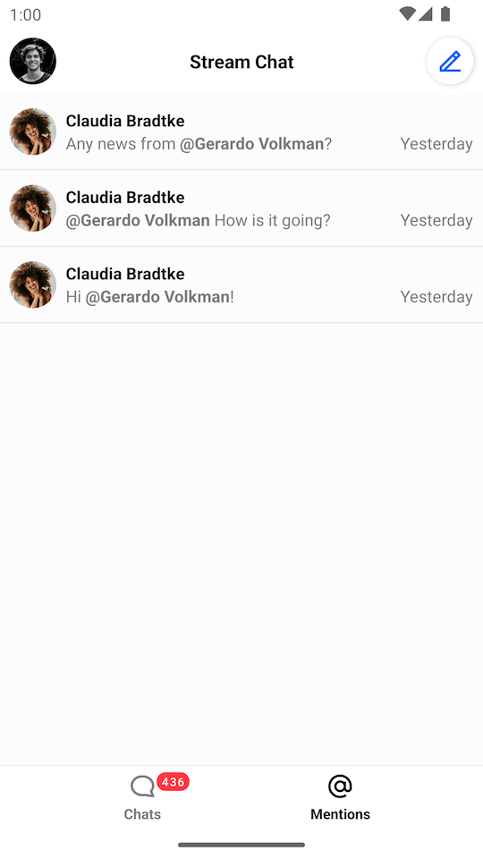
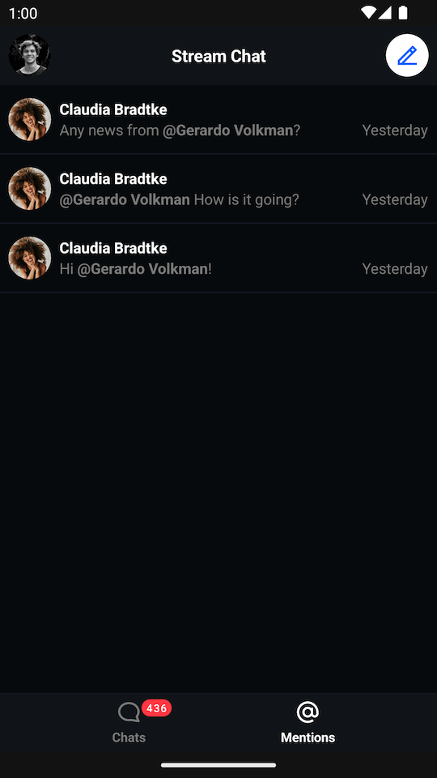
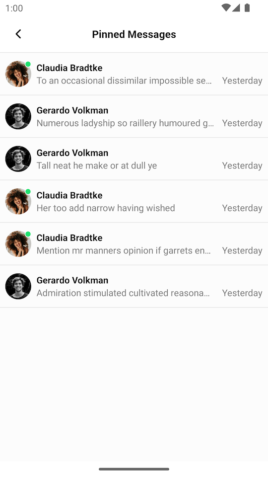
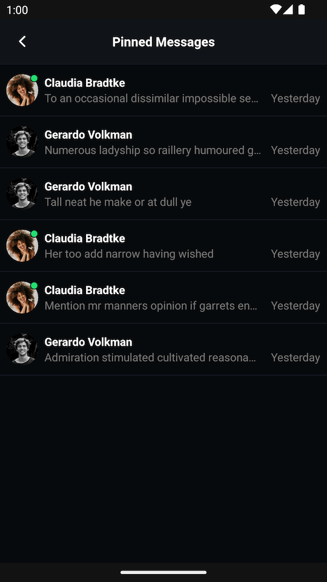

# Mentions and Pinned Messages

import Tabs from '@theme/Tabs';
import TabItem from '@theme/TabItem';

## Mention List

`MentionListView` is a UI Component that shows previews of messages that contain mentions of the current user.

| Light Mode | Dark Mode |
| --- | --- |
|||

### Usage

You can add this View via XML:

```xml
<io.getstream.chat.android.ui.feature.mentions.list.MentionListView
    android:id="@+id/mentionsListView"
    android:layout_width="match_parent"
    android:layout_height="match_parent" />
```

We recommend using this view with its [ViewModel](../01-overview.mdx#viewmodels), which supplies it with data from the Stream API.

The basic setup of the ViewModel and connecting it to the View is done the following way:

<Tabs>
<TabItem value="kotlin" label="Kotlin">

```kotlin
val viewModel: MentionListViewModel by viewModels()
viewModel.bindView(mentionListView, viewLifecycleOwner)
```
</TabItem>

<TabItem value="java" label="Java">

```java
MentionListViewModel viewModel = new ViewModelProvider(this).get(MentionListViewModel.class);
MentionListViewModelBinding.bind(viewModel, mentionListView, getViewLifecycleOwner());
```
</TabItem>
</Tabs>

From that point, you should be able to see messages which contain mentions of the current user.

:::note
`bindView` sets listeners on the View and the ViewModel. Any additional listeners should be set _after_ calling `bindView`.
:::

### Handling Actions

`MentionListView` allows you to configure certain actions on it:

<Tabs>
<TabItem value="kotlin" label="Kotlin">

```kotlin
mentionListView.setMentionSelectedListener { message ->
    // Handle a mention item being clicked
}
```
</TabItem>

<TabItem value="java" label="Java">

```java
mentionListView.setMentionSelectedListener(message -> {
    // Handle a mention item being clicked
});
```
</TabItem>
</Tabs>

The full list of available listeners is available [here](https://getstream.github.io/stream-chat-android/stream-chat-android-ui-components/io.getstream.chat.android.ui.feature.mentions.list/-mention-list-view/).

## Pinned Message List

`PinnedMessageListView` is a UI Component that shows a list of pinned messages.

| Light Mode | Dark Mode |
| --- | --- |
|||

### Usage

You can add this View via XML:

```xml
<io.getstream.chat.android.ui.feature.pinned.list.PinnedMessageListView
    android:id="@+id/pinnedMessageListView"
    android:layout_width="match_parent"
    android:layout_height="match_parent" />
```

We recommend using this view with its [ViewModel](../01-overview.mdx#viewmodels), which supplies it with data from the Stream API.

The basic setup of the ViewModel and connecting it to the View is done the following way:

<Tabs>
<TabItem value="kotlin" label="Kotlin">

```kotlin
val viewModel: PinnedMessageListViewModel by viewModels {
    PinnedMessageListViewModelFactory(cid = "messaging:123")
}
viewModel.bindView(pinnedMessageListView, viewLifecycleOwner)
```
</TabItem>

<TabItem value="java" label="Java">

```java
ViewModelProvider.Factory factory = new PinnedMessageListViewModelFactory.Builder()
        .cid("messaging:123")
        .build();
PinnedMessageListViewModel viewModel = new ViewModelProvider(this, factory).get(PinnedMessageListViewModel.class);

PinnedMessageListViewModelBinding.bind(viewModel, pinnedMessageListView, getViewLifecycleOwner());
```
</TabItem>
</Tabs>

From that point, you should be able to see the list of pinned messages.

:::note
`bindView` sets listeners on the View and the ViewModel. Any additional listeners should be set _after_ calling `bindView`.
:::

### Handling Actions

`PinnedMessageListView` allows you to configure certain actions on it:

<Tabs>
<TabItem value="kotlin" label="Kotlin">

```kotlin
pinnedMessageListView.setPinnedMessageSelectedListener { message ->
    // Handle a pinned message item being clicked
}
```
</TabItem>

<TabItem value="java" label="Java">

```java
pinnedMessageListView.setPinnedMessageSelectedListener(message -> {
    // Handle a mention item being clicked
});
```
</TabItem>
</Tabs>

The full list of available listeners is available [here](https://getstream.github.io/stream-chat-android/stream-chat-android-ui-components/io.getstream.chat.android.ui.feature.pinned.list/-pinned-message-list-view/).
