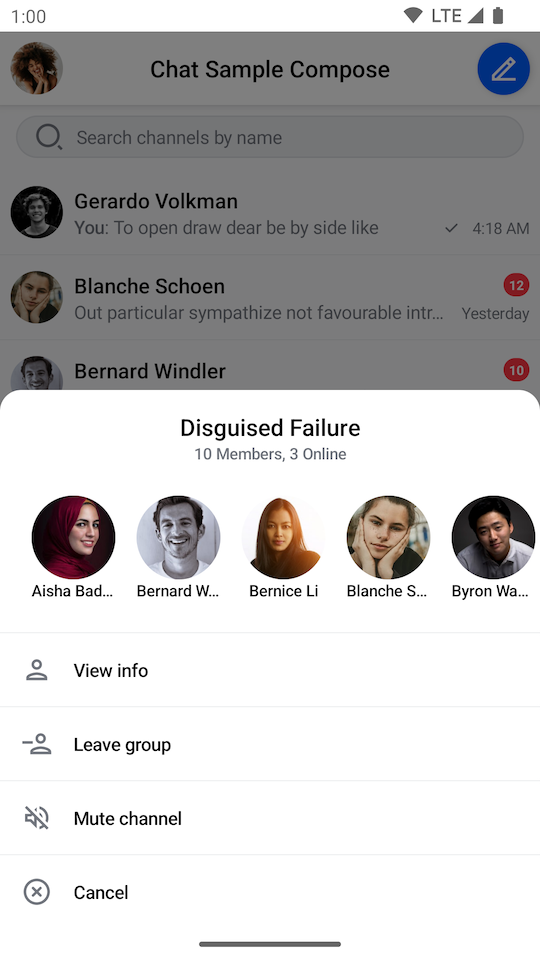
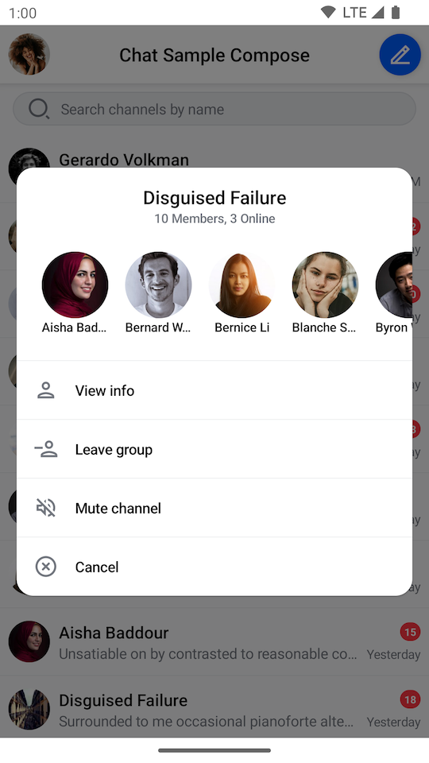

# SelectedChannelMenu

The `SelectedChannelMenu` component is used to show information about the selected `Channel` while providing various actions that the user can take.

This includes the following:
- **Channel information**: The name and the member count of the selected channel.
- **Channel members**: The list of members with their avatars and names.
- **Channel options**: A list of actions the user can take with the selected channel.

It also exposes a callback when the user selects a channel option from the list. Let's see how to use the `SelectedChannelMenu` in your code.

## Usage

If you're using the [`ChannelScreen`](./01-channels-screen.mdx) component, you don't have to do anything. The `SelectedChannelMenu` component and its logic will be integrated into the UI.

If you're looking to build a custom UI, you can add the `SelectedChannelMenu` component on top of your UI, like so:

```kotlin
val listViewModel: ChannelListViewModel by viewModels { ChannelViewModelFactory() }

override fun onCreate(savedInstanceState: Bundle?) {
    super.onCreate(savedInstanceState)

    setContent {
        ChatTheme {
            val user by listViewModel.user.collectAsState()
            val selectedChannelState by listViewModel.selectedChannel
            val currentlySelectedChannel = selectedChannelState

            Box(modifier = Modifier.fillMaxSize()) {
                // The rest of your UI

                if (currentlySelectedChannel != null) {
                    val isMuted = listViewModel.isChannelMuted(currentlySelectedChannel.cid)

                    SelectedChannelMenu(
                        modifier = Modifier
                            .fillMaxWidth() // Fill width
                            .wrapContentHeight() // Wrap height
                            .align(Alignment.BottomCenter), // Aligning the content to the bottom
                        selectedChannel = currentlySelectedChannel,
                        isMuted = isMuted,
                        currentUser = user,
                        onChannelOptionClick = { listViewModel.performChannelAction(it) },
                        onDismiss = { listViewModel.dismissChannelAction() }
                    )
                }
            }
        }
    }
}
```

For the `SelectedChannelMenu` component to work, you need to provide `selectedChannel`, `isMuted` and `currentUser` parameters.

In the example above, you fetch the data from a `ChannelListViewModel` that you use in the rest of the UI. But you can also provide the data manually if you decide not to use our components.

Notice how you also show the `SelectedChannelMenu` only if the `selectedChannel` is not null. This is a smart way of knowing when to show the info and when to hide it.

With a bit of extra code for the rest of the content, when selecting a channel, the snippet above will produce the next UI:

||
|---|

This represents just the `SelectedChannelMenu` component, the rest of the UI can be whatever your implementation requires.

Finally, you can see a list of `ChannelOption`s, which are different depending on whether you're an admin for this channel or just a member. Clicking these will trigger channel actions.

Let's see how to handle these.

## Handling Actions

The `SelectedChannelMenu` exposes two actions you can handle, as per the signature:

```kotlin
@Composable
fun SelectedChannelMenu(
    ..., // State & styling,
    onChannelOptionClick: (ChannelAction) -> Unit,
    onDismiss: () -> Unit = {},
)
```

* `onChannelOptionClick`: Handler when the user taps on any channel option in the list.
* `onDismiss`: Handler when the dialog is dismissed.

By providing an `onChannelOptionClick` handler, you can choose what happens when the user selects options like 'Leave Group', 'Delete Conversation', 'Mute channel', 'Cancel' and more. You can react to these actions, update your UI state and show new UI if needed.

If you want to customize the actions, you can do the following:

```kotlin
SelectedChannelMenu(
    ..., // State and styling
    onChannelOptionClick = { action ->
        if (action is ViewInfo) {
            // Start the channel info screen
        } else {
            listViewModel.performChannelAction(action)
        }
    },
    onDismiss = { listViewModel.dismissChannelAction() }
)
```

In the snippet above, you set up an `onChannelOptionClick` handler to show a new screen if the user decides to view more info about the channel. Alternatively, you send the action to the `listViewModel` and store it to update the state. In addition, we configured the `onDismiss` handler to dismiss the menu.

## Customization

This component offers the following customization options:

```kotlin
@Composable
fun SelectedChannelMenu(
    ..., // State and actions
    modifier: Modifier = Modifier,
    channelOptions: List<ChannelOptionState> = buildDefaultChannelOptionsState(
        selectedChannel = selectedChannel,
        isMuted = isMuted,
        ownCapabilities = selectedChannel.ownCapabilities
    ),
    shape: Shape = ChatTheme.shapes.bottomSheet,
    overlayColor: Color = ChatTheme.colors.overlay,
    headerContent: @Composable ColumnScope.() -> Unit = { ... },
    centerContent: @Composable ColumnScope.() -> Unit = { ... },
)
```

* `modifier`: Used to style the root of the `SelectedChannelMenu`, which is a `Card` component. Useful for the component size and padding, background, alignment and more.
* `channelOptions`: Allows you to customize which channel options are shown in the overlay. Uses the function `buildDefaultChannelOptionsState()` to build a list of the default channel options.
* `shape`: Used for the `Card` shape. By default, we position the element at the bottom of the screen with the top corners being rounded, which imitates a bottom drawer component. If you want to use the `SelectedChannelMenu` as a dialog, you can change the shape to have all round corners or to be flat.
* `overlayColor`: Used to customize the color of the component overlay.
* `headerContent`: Customizable composable representing the header content with channel members.
* `centerContent`: Customizable composable representing the center content with channel options.

Here's an example of customizing this component to imitate a dialog:

```kotlin
SelectedChannelMenu(
    modifier = Modifier
        .padding(16.dp) // Adding padding to the component
        .fillMaxWidth() // Fill width
        .wrapContentHeight() // Wrap height
        .align(Alignment.Center), // Centering the component
    shape = RoundedCornerShape(16.dp), // Rounded corners for all sides
    ... // State
)
```

This code will produce the following UI:

||
|---|

The `SelectedChannelMenu` component now looks more like a dialog that displays over other elements. This is just an example of how easy it is to apply UI customization to our components.
