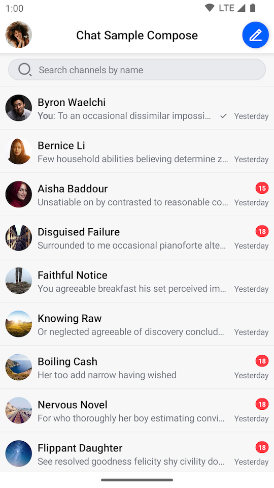
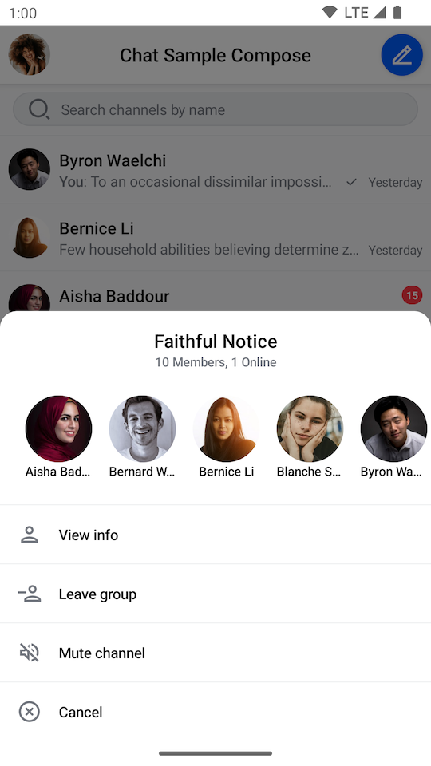

# Channels Screen

The easiest way to set up a screen that shows the active user's channels and gives them the ability to search for a specific channel is to use the `ChannelsScreen`.

`ChannelsScreen` sets up the following functionality internally:

* Header with the information of the current user and customizable title and action.
* Search input that can be shown or hidden that allows users to search for channels by name.
* List of user's channels with pagination, based on defined filters and sorting.
* Menu with detailed channel information, shown when long clicking on a `Channel` in the list.

It also sets up all the business logic and styles the UI according to our default design system.

Let's see how to integrate the component.

## Usage

To use `ChannelsScreen`, you just need to call it within `setContent()` in your `Activity` or `Fragment`:

```kotlin
override fun onCreate(savedInstanceState: Bundle?) {
    super.onCreate(savedInstanceState)

    setContent {
        ChatTheme {
            ChannelsScreen()
        }
    }
}
```

:::note 
The `ChannelsScreen` can be used without any parameters, but we advise that you pass in the title of your app, as well as the action handlers.
:::

This small snippet will produce a fully working solution, as shown in the image below.

|  |  |
|---|---|

To get a better feel of the component, you'll want to customize its actions.

## Handling Actions

When it comes to action handlers exposed in the `ChannelsScreen` signature you have access to the following:

```kotlin
fun ChannelsScreen(
    ..., // ViewModel factory and UI customization
    onHeaderActionClick: () -> Unit = {},
    onHeaderAvatarClick: () -> Unit = {},
    onItemClick: (Channel) -> Unit = {},
    onViewChannelInfoAction: (Channel) -> Unit = {},
    onBackPressed: () -> Unit = {},
)
```

There are several action handlers you can use with the `ChannelsScreen`:

* `onHeaderActionClick`: Handler for the default header trailing icon click action.
* `onHeaderAvatarClick`: Handler for the clicks on the user avatar in the header.
* `onItemClick`: Handler for a `Channel` being clicked.
* `onViewChannelInfoAction`: Handler for the **View info** action selected in `SelectedChannelMenu`. 
* `onBackPressed`: Handler for the system back button being clicked.

All of these actions are empty by default, but if you want to customize them, you can do the following:

```kotlin
override fun onCreate(savedInstanceState: Bundle?) {
    super.onCreate(savedInstanceState)

    setContent {
        ChatTheme {
            ChannelsScreen(
                onItemClick = {
                    // Open messages screen
                },
                onHeaderActionClick = {
                    // Handle the header click action
                },
                onHeaderAvatarClick = {
                    // Handle the header avatar clicks
                },
                onViewChannelInfoAction = {
                    // Show UI to view more channel info
                },
                onBackPressed = { finish() }
            )
        }
    }
}
```

## Customization

`ChannelsScreen` is one of our **screen components** and as such it doesn't offer much customization. As with any component, you can customize the content theme and styling by wrapping it in the [`ChatTheme`](../03-customizing-components.mdx).

When it comes to UI and behavior customization in the `ChannelsScreen` signature you have access to the following:

```kotlin
fun ChannelsScreen(
    viewModelFactory: ChannelViewModelFactory = ChannelViewModelFactory(
      ... // Params
    ),
    title: String = "Stream Chat",
    isShowingHeader: Boolean = true,
    isShowingSearch: Boolean = false,
    ... // Action handlers
)
```

* `viewModelFactory`: The factory that you build yourself, if you want access to `ViewModels` for custom behavior. This lets you control not just the way the `ViewModel`s are built, but also their lifecycle, as you can share them between components. You can also customize its parameters to affect the behavior of the screen.
* `title`: The title of the `ChannelListHeader`.
* `isShowingHeader`: Flag that affects if we show the `ChannelListHeader`. `true` by default.
* `isShowingSearch`: Flag that affects if we show the `SearchInput`. `false` by default.

## Overriding the ViewModels

In case you want to control the logic when using the `ChannelsScreen`, you can do so by providing a `ChannelViewModelFactory` that you use to build the respective ViewModels yourself.

Here's an example:

```kotlin
class ChannelsActivity : AppCompatActivity() {

    // 1
    private val factory by lazy {
        ChannelViewModelFactory(
            chatClient = ChatClient.instance(),
            querySort = QuerySortByField.descByName("last_updated"),
            filters = null
        )
    }

    // 2
    private val listViewModel: ChannelListViewModel by viewModels { factory }

    override fun onCreate(savedInstanceState: Bundle?) {
        super.onCreate(savedInstanceState)

        setContent {
            ChannelsScreen(
                viewModelFactory = factory // 3
            )
        }
    }
}
```

There are a few steps here that allow you to override and control the ViewModels:
1. You create the `ChannelViewModelFactory` yourself, which lets you describe the data and configuration used to build the `ViewModel`s.
2. You lazily create an instance of the `ChannelListViewModel`. This means that you'll either build the `ViewModel` first and then pass it to the Compose component, or your Compose component will create the `ViewModel` and you'll get access to it here.
3. You pass in the factory to the `ChannelsScreen`, which allows this connection to happen.

The `ViewModel`s should be the same and you should easily be able to react to things like item clicks, changes in the state and more.

:::note
Even though `ChannelsScreen` offers limited customization, you can still achieve a unique look and feel by modifying `ChatTheme` parameters.
For more information on how to do so read our [Customizing Components](../03-customizing-components.mdx) page.
:::

<!-- TODO WIP PAGE If you want to build a custom Channels screen UI or override the default the behavior, follow our Building Custom Screens (../guides/05-_05-building-custom-screens.mdx) guide. -->
