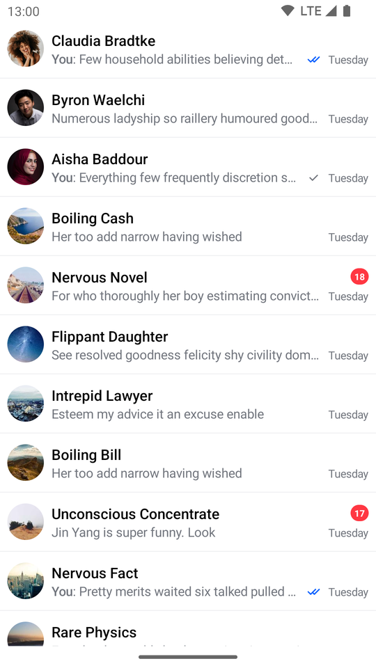
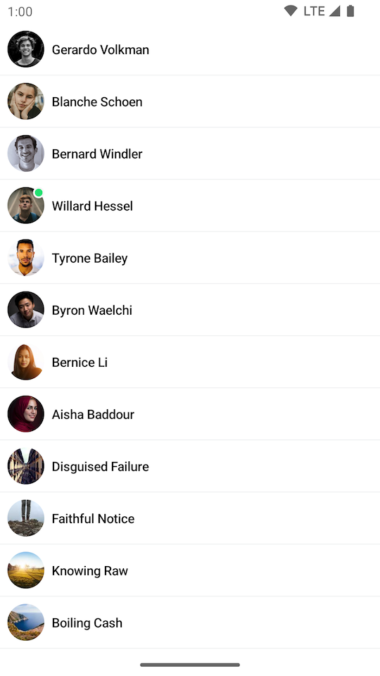

# Channel List

The `ChannelList` component allows you to build a paginated list of `Channel` items with exposed long tap and single tap actions. We provide two versions of the `ChannelList` component:

* **Bound**: This version binds itself to a `ChannelListViewModel` and loads all the required data. It also connects long item tap and pagination events to the `ViewModel`.
* **Stateless**: This is a stateless version of the list, which doesn't depend on a `ViewModel`, and instead depends on pure state from external sources to render its UI.

You can learn more about the different component types on the [Component Architecture](../02-component-architecture.mdx) page.

:::note 
The **bound** version of the list uses the **stateless** list internally. That way, when providing the same state to either component, the behavior will be the same.
:::

Based on the provided state, the component shows the following UI:

* Loading indicator if we're loading the initial data.
* Empty view if loading is done but there is no data to show.
* The list of channels with pagination.

Let's see how to show a list of channels.

## Usage

To use the **bound** `ChannelList`, add it to your UI within `setContent()`:

```kotlin
override fun onCreate(savedInstanceState: Bundle?) {
    super.onCreate(savedInstanceState)

    setContent {
        ChatTheme {
            ChannelList(modifier = Modifier.fillMaxSize())
        }
    }
}
```

This is a very basic and crude example, that just shows a list of channels with pagination. Even though the state handling is set up, we recommend passing in action handlers or a `ChannelListViewModel` instance and consuming the internal state, to react to single and long item taps.

The snippet above will generate the following UI.

||
|---|

In order to fully utilize the `Channel` items, let's see how to handle actions and state from the ViewModel.

## Handling Actions

If you've chosen the **bound** version of the `ChannelList` component, we recommend either providing your own instance of the `ViewModel`, or overriding default actions to react to state changes. To support that, the `ChannelList` signature exposes the following parameters:

```kotlin
@Composable
fun ChannelList(
    viewModel: ChannelListViewModel = viewModel(
        factory = ... // Our default factory
    ),
    onLastItemReached: () -> Unit = { viewModel.loadMore() },
    onChannelClick: (Channel) -> Unit = {},
    onChannelLongClick: (Channel) -> Unit = { viewModel.selectChannel(it) },
    ... // Content Slots
)
```

* `viewModel`: The instance of the `ChannelListViewModel` that this component reads data from and sends events to. Pass in your own instance if you want more control over your business logic, such as changing `Channel` filters or sort order in runtime.
* `onLastItemReached`: Handler when the user reaches the last item in the list to trigger pagination. You don't need to override this if you're using the default `viewModel`, but if you're using a custom one, you can add custom behavior.
* `onChannelClick`: Handler when the user taps on an item. Useful for starting the `MessagesScreen`.
* `onChannelLongClick`: Handler when the user long taps on an item. By default, this updates state in the `viewModel`, which you can read to show custom UI and `Channel` actions if you're using a custom `ViewModel` instance. Override if you're using the default `viewModel` and you want to change the behavior.

:::note
<!-- TODO link to guides, which we'll remove. Revisit after re-organizing pages. (Liviu) -->
You may need to pass a custom `ChatEventHandlerFactory` to the ViewModel to make sure the list is updated properly. Check [ChannelListUpdates](../../06-advanced/05-channel-list-updates.mdx) section to learn more.
:::

Here's an example of using the default `ViewModel`, but overriding the behavior:

```kotlin
override fun onCreate(savedInstanceState: Bundle?) {
    super.onCreate(savedInstanceState)
    
    setContent {
        ChatTheme {
            // Custom state holder
            var selectedChannel by remember { mutableStateOf<Channel?>(null) }

            Box(modifier = Modifier.fillMaxSize()) {
                ChannelList(
                    modifier = Modifier.fillMaxSize(),
                    onChannelLongClick = { // Custom long tap handler
                        selectedChannel = it
                    },
                    onChannelClick = {
                        // Start the MessagesScreen
                    },
                )

                if (selectedChannel != null) {
                    // Show custom UI
                }
            }
        }
    }
}
```

In the example above, we created a `selectedChannel` state holder, which we use to show some custom UI if the data is not null. We update the state when the user long taps on an item.

We also provide a custom `onChannelClick` handler, to open the `MessagesScreen` with the selected item. This will produce the same UI, but with user-defined actions.

Alternatively, you can override the default `ViewModel` and read the internal state:

```kotlin
val listViewModel: ChannelListViewModel by viewModels { ChannelViewModelFactory() }

override fun onCreate(savedInstanceState: Bundle?) {
    super.onCreate(savedInstanceState)

    setContent {
        ChatTheme {
            Box(modifier = Modifier.fillMaxSize()) {
                ChannelList(
                    modifier = Modifier.fillMaxSize(),
                    viewModel = listViewModel, // Passing in our ViewModel
                    onChannelClick = {
                        // Start the MessagesScreen
                    }
                )

                if (listViewModel.selectedChannel != null) {
                    // Show custom UI
                }
            }
        }
    }
}
```

The behavior will be the same and you gain more control over the `ViewModel`.

We recommend that you create an instance of our `ViewModel` if you're thinking of using our predefined state and operations. If you're looking into a more low-level solution, with more control, you can use the **stateless** version of our components.

### Controlling the scroll state

You can control the scroll state of the channel list by providing a `lazyListState` parameter, like in the example below:

```kotlin
@Composable
fun ChannelList(
    ..., // State
    lazyListState: LazyListState = rememberLazyListState(),
    ... // Actions & Content Slots
)
```

* `lazyListState`: The scroll state of the list. While not a handler, you can use it to control the scroll and trigger custom scroll actions.

To customize this state you can simply pass your own instance as a parameter:

```kotlin
 val lazyListState = rememberLazyListState()

ChannelList(
    // State
    lazyListState = lazyListState
    // Actions & Content Slots
)
```

## Customization

If you're looking to customize the UI of the `ChannelList`, there are a few ways you can do so, as per the signature:

```kotlin
@Composable
fun ChannelList(
    // State and action handlers
    modifier: Modifier = Modifier,
    contentPadding: PaddingValues = PaddingValues(...),
    loadingContent: @Composable () -> Unit = { ... },
    emptyContent: @Composable () -> Unit = { ... },
    emptySearchContent: @Composable (String) -> Unit = { ... },
    helperContent: @Composable BoxScope.() -> Unit = { ... },
    loadingMoreContent: @Composable () -> Unit = { ... },
    itemContent: @Composable (ChannelItemState) -> Unit = { ... },
    divider: @Composable () -> Unit = { ... },
)
```

* `modifier`: The modifier for the root component. You can apply a background, elevation, padding, shape, touch handlers and much more.
* `contentPadding`: Padding values to be applied to the channel list surrounding the content inside.
* `loadingContent`: Customizable composable that allows you to override the default loading indicator when loading the initial data set.
* `emptyContent`: Customizable composable that allows you to override the empty state, when there are no channels available. 
* `emptySearchContent`: Customizable composable that allows you to override the empty state, when there are no channels matching the search query.
* `helperContent`: Composable that represents helper content for the channel list. Empty by default, but can be used, for example, to display back to top floating action button.
* `loadingMoreContent`: Composable that represents the loading more content, when we're loading the next page.
* `itemContent`: Customizable composable that allows you to fully override the UI and behavior of channel items. This will be applied to each item in the list, and you'll gain access to the `Channel` inside the lambda when building your custom UI.
* `divider`: Customizable composable that allows you to override the item divider.

Here's a simple example for building your own channel item, by overriding the `itemContent` parameter:

```kotlin
val user by listViewModel.user.collectAsState() // Fetch user

ChannelList(
    ..., // Set up state
    itemContent = { // Customize the channel items
        Row(
            modifier = Modifier
                .padding(8.dp)
                .fillMaxWidth(),
            verticalAlignment = Alignment.CenterVertically
        ) {
            ChannelAvatar(
                modifier = Modifier.size(40.dp),
                channel = it.channel,
                currentUser = user
            )

            Spacer(modifier = Modifier.width(8.dp))

            Text(
                text = ChatTheme.channelNameFormatter.formatChannelName(it.channel, user),
                style = ChatTheme.typography.bodyBold,
                maxLines = 1,
            )
        }
    }
)
```

The snippet above will generate the following UI:

||
|---|

As you can see, the items now show just the image and the channel name. You can customize the items to any extent, whatever your design specification might require.

And you can customize the `emptyContent` and the `loadingContent` to your needs if you need custom UI there.
