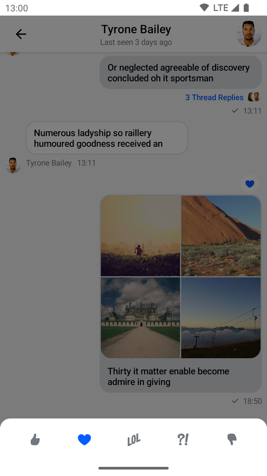
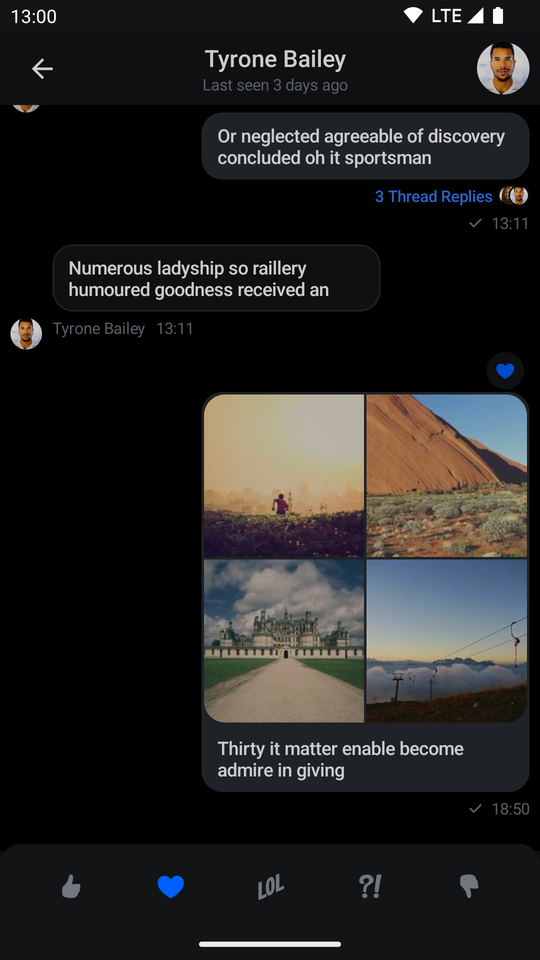

# Message Reactions

## SelectedReactionsMenu

The `SelectedReactionsMenu` is a component that displays a list of message reactions with the users who left them. If a message already contains reactions, the user can tap on the section with reactions to show the component.

This is a **stateless component** which you can easily add to your UI if you're building a custom Messages screen. The component shows the following UI:

* **Reaction options**: The top part which shows a list of reactions the user can use to react to the message.
* **User reactions**: The main part which shows a list of users with their reactions left for the message.

Let's see how to use the component.

### Usage

If you're using the [`MessagesScreen`](./01-messages-screen.mdx) component, the `SelectedReactionsMenu` component is already set up for you. To use the `SelectedReactionsMenu` component in your custom screens, simply add it to your UI, like so:

```kotlin
// The rest of your UI
if (selectedMessageState is SelectedMessageReactionsState) {
    val selectedMessage = selectedMessageState.message
    SelectedReactionsMenu(
        modifier = Modifier.align(Alignment.BottomCenter),
        // The currently logged-in user
        currentUser = user,
        // The capabilities the user has in a given channel
        ownCapabilities = selectedMessageState.ownCapabilities,
        // The message whose reactions you selected
        message = selectedMessage,
        onMessageAction = { action ->
            // Handle message action
        },
        onShowMoreReactionsSelected = {
            // Handle show more reactions button click
        },
        onDismiss = {
            // Handle dismiss
        }
    )
}

```

As you can see, showing the menu is very simple. If the `selectedMessageState` is an instance of `SelectedMessageReactionsState`, you pass in the currently logged in user, as well as the selected message. The reactions you show are taken from the [`ChatTheme`](../03-customizing-components.mdx) component and everything else required to show the component is taken care of internally.

The aforementioned code produces the following UI:

| Light | Dark |
|---|---|
|  |  |

The component shows available reactions from the [`ChatTheme`](../03-customizing-components.mdx) on the top, followed by a list of message reactions.

To dismiss the component just tap outside of the dialog or press the system back button.

### Handling Actions

Here are the actions exposed by the `SelectedReactionsMenu` component:

```kotlin
@Composable
fun SelectedReactionsMenu(
    ..., // State
    onMessageAction: (MessageAction) -> Unit,
    onShowMoreReactionsSelected: () -> Unit,
    onDismiss: () -> Unit = {},
)
```

* `onMessageAction`: Handler used when the user performs an action such as leaving a reaction.
* `onShowMoreReactionsSelected`: Handler that propagates clicks on the show more reactions button.
* `onDismiss`: Handler used when the menu is dismissed by clicking outside of the dialog area or by pressing the system back button.

To handle these actions, you can override them like so:

```kotlin
if (selectedMessageState is SelectedMessageReactionsState) {
    SelectedReactionsMenu(
        ..., // State
        onMessageAction = { action ->
            composerViewModel.performMessageAction(action)
            listViewModel.performMessageAction(action)
        },
        onShowMoreReactionsSelected = {
            listViewModel.selectExtendedReactions(selectedMessage)
        },
        onDismiss = { listViewModel.removeOverlay() }
    )
}
```

In the snippet above, you propagate the `action` to the `composerViewModel` and `listViewModel`, for them to store the latest action. This will update the UI accordingly.

Alternatively, you call `listViewModel.removeOverlay()` to remove the overlay from the screen in `onDismiss()`. It's important to note that `onMessageAction()` calls `removeOverlay()` internally to hide the overlay.

Next, let's see how to customize the overlay.

### Customization

You can customize the reactions you show:

```kotlin
@Composable
fun SelectedReactionsMenu(
    ..., // State
    modifier: Modifier = Modifier,
    shape: Shape = ChatTheme.shapes.bottomSheet,
    overlayColor: Color = ChatTheme.colors.overlay,
    reactionTypes: Map<String, ReactionIcon> = ChatTheme.reactionIconFactory.createReactionIcons(),
    @DrawableRes showMoreReactionsIcon: Int = R.drawable.stream_compose_ic_more,
    ... // Actions and Slot APIs
)
```

* `modifier`: Modifier for the dialog component.
* `overlayColor`: Allows you to customize the color of the overlay.
* `shape`: Allows you to customize the shape of the dialog.
* `reactionTypes`: Allows you to customize reactions shown in the overlay. By default it uses `ChatTheme.reactionIconFactory` which is exposed by the [`ChatTheme`](../03-customizing-components.mdx) component.
* `showMoreReactionsIcon`: Allows you to customize the show more reactions icon. By default, the icon will appear when `ChatTheme.reactionIconFactory` provides more than five reactions.

The best way to customize reactions is by overriding `ChatTheme.reactionIconFactory` with your own implementation of `ReactionIconFactory` so that all of your components wrapped inside of `ChatTheme` draw from the same source.

By default `SelectedReactionsMenu` looks like a bottom sheet, however you can customize it to look like a completely different component, such as a dialog, a drawer or whatever helps you retain the look and feel of your app.

```kotlin
if (selectedMessageState is SelectedMessageReactionsState) {
    // Use a Modifier to customize the appearance
    SelectedReactionsMenu(
        ..., // State
        // Use a Modifier to customize the appearance
        modifier = Modifier
            .align(Alignment.Center)
            .padding(horizontal = 20.dp)
            .wrapContentSize(),
        // Assign a different shape to the Composable element
        shape = ChatTheme.shapes.attachment,
        currentUser = user,
        onMessageAction = { action ->
            // Handle message action
        },
        onDismiss = { 
            // Handle dismiss 
        },
        ...
    )
}
```

The code above will produce the following UI:

| Light | Dark |
|---|---|
|  |  |

`SelectedReactionsMenu` provides you with `Composable` slots that are ready for more extensive customizations.

```kotlin
@Composable
fun SelectedReactionsMenu(
    ...,
    headerContent: @Composable ColumnScope.() -> Unit = {
        // Header content
    },
    centerContent: @Composable ColumnScope.() -> Unit = {
        // Center content
    }
)
```

* `headerContent`: Allows you to customize the content shown at the top of the menu. By default it shows reaction options.
* `centerContent`: Allows you to customize the content shown at the center of the menu. By default it shows user reactions.

You can easily override either slot:

```kotlin
if (selectedMessageState is SelectedMessageReactionsState) {
    SelectedReactionsMenu(
        ...,
        // Custom header content
        headerContent = {
            Text(
                modifier = Modifier
                    .padding(16.dp)
                    .background(
                        shape = ChatTheme.shapes.avatar,
                        color = ChatTheme.colors.infoAccent
                    )
                    .padding(horizontal = 8.dp),
                style = ChatTheme.typography.body,
                color = ChatTheme.colors.textHighEmphasis,
                text = "User Reactions"
            )
        }
    )
}
```

The example above shows how to replace the header content with a custom `Text`.

The result looks like this:

| Light | Dark |
|---|---|
|  |  |

## ReactionsPicker

The `ReactionsPicker` component allows you to display all of the reactions your app contains inside a simple menu. Normally it is displayed after clicking on the show more reactions button inside `SelectedMessageMenu` or `SelectedReactionsMenu`.

### Usage

If you're using the [`MessagesScreen`](./01-messages-screen.mdx) component, `ReactionsPicker` is automatically set up for you. To use it inside of your custom screens simply add it like so:

```kotlin
ChatTheme {
    // The rest of your UI
    if (selectedMessageState != null) {
        val selectedMessage = selectedMessageState.message
        if (selectedMessageState is SelectedMessageReactionsPickerState) {
            ReactionsPicker(
                modifier = Modifier
                    .align(Alignment.BottomCenter)
                    .heightIn(max = 400.dp)
                    .wrapContentHeight(),
                message = selectedMessage,
                onMessageAction = { action ->
                    // Handle message action
                },
                onDismiss = {
                    // Handle on dismiss
                }
            )
        }
    }
}
```

Adding the `ReactionsPicker` component is very simple, all you need to do is make sure that it is displayed when the `selectedMessageState` is `SelectedMessageReactionsPickerState` and pass in the selected `Message`. The reactions are drawn from the [`ChatTheme`](../03-customizing-components.mdx) and the rest is done for you.

The code above will render the following UI:

| Light | Dark |
|---|---|
|  |  |

The menu overlay has a darker background and tapping it will dismiss the component, as will pressing the system back button.

### Handling Actions

`ReactionsPicker` exposes the following actions:

```kotlin
@Composable
public fun ReactionsPicker(
    ..., // State,
    onMessageAction: (MessageAction) -> Unit,
    onDismiss: () -> Unit = {},
    ... // Content
)
```

* `onMessageAction`: Handler used for triggering message actions such as **reply**, **edit**, **delete**, **react** and others.
* `onDismiss`: Handler used when the component is dismissed by clicking outside of the component UI or pressing the system back button.

```kotlin
ReactionsPicker(
    ..., // State
    onMessageAction = { action ->
        composerViewModel.performMessageAction(action)
        listViewModel.performMessageAction(action)
    },
    onDismiss = { listViewModel.removeOverlay() },
    ... // Content
)
```

In the snippet above, you propagate the `action` to the `composerViewModel` and `listViewModel`, for them to store the latest action. This will update the UI accordingly.

Alternatively, you call `listViewModel.removeOverlay()` to remove the overlay from the screen, in `onDismiss()`. It's important to note that `onMessageAction()` calls `removeOverlay()` internally, to hide the overlay.

Next, let's see how to customize `ReactionsPicker`.

### Customization

`ReactionsPicker` allows you to customize the reactions you are showing:

```kotlin
@Composable
public fun ReactionsPicker(
    ..., // State,
    reactionTypes: Map<String, ReactionIcon> = ChatTheme.reactionIconFactory.createReactionIcons(),
    ... // Actions and content
)
```

* `reactionTypes`: Allows you to customize which reactions are shown. By default it uses `reactionIconFactory` inside of [`ChatTheme`](../03-customizing-components.mdx).

The best way to customize this is by overriding `ChatTheme.reactionIconFactory` with your own implementation of `ReactionIconFactory` so that all of your components wrapped inside of `ChatTheme` draw from the same source.

By default `ReactionsPicker` looks like a bottom sheet, however you can customize it to look like a completely different component, such as a dialog, a drawer or whatever helps you retain the look and feel of your app.

For example, you can it customize like so:

```kotlin
ReactionsPicker(
    modifier = Modifier
        .align(Alignment.Center)
        .padding(horizontal = 20.dp)
        .wrapContentSize(),
    shape = ChatTheme.shapes.attachment,
    message = selectedMessage,
    onMessageAction = { action ->
        composerViewModel.performMessageAction(action)
        listViewModel.performMessageAction(action)
    },
    onDismiss = { listViewModel.removeOverlay() },
    cells = GridCells.Fixed(4)
)
```

The code above will result in the following UI:

| Light | Dark |
|---|---|
|  |  |

```kotlin
@Composable
public fun ReactionsPicker(
    ..., // State and actions
    headerContent: @Composable ColumnScope.() -> Unit = {},
    centerContent: @Composable ColumnScope.() -> Unit = {
        DefaultReactionsPickerCenterContent(
            message = message,
            onMessageAction = onMessageAction,
            cells = cells,
            reactionTypes = reactionTypes
        )
    },
)
```

Apart from customization through modifiers, the component provides these slots:

* `headerContent`: Allows you to customize what content you show on the top part of `ReactionsPicker`. Empty by default.
* `centerContent`: Allows you to customize what content you show on the bottom part of `ReactionsPicker`. Shows reactions by default.

As an example, let's override the header content. First create a custom text label:

```kotlin
@Composable
fun TextLabel() {
    Text(
        modifier = Modifier.padding(start = 20.dp, top = 12.dp),
        text = "Available reactions",
        style = ChatTheme.typography.title3Bold,
        color = ChatTheme.colors.textHighEmphasis
    )
}
```

Then expand on the previous customization example by replacing the empty `headerContent` with the text label:

```kotlin
ReactionsPicker(
    ..., // State, actions and other content
    headerContent = { TextLabel() }
)
```

Doing so gives you the following UI:

| Light | Dark |
|---|---|
|  |  |