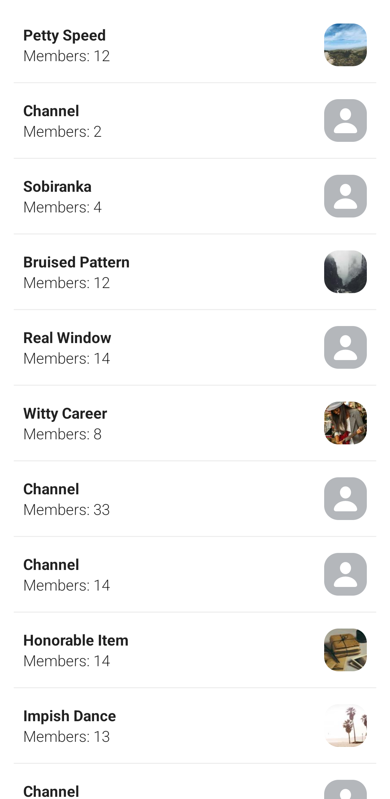

# Custom Channel List

In this cookbook recipe, we will show you how to implement a simple channel list screen, without using any of the SDK's UI components. We will rely only on the `ChatClient` for state and on standard Jetpack Compose for the UI.



## Custom Channel List View Model

The UI state is handled by a view model, `CustomChannelListViewModel`. It receives a `ChatClient` instance as a constructor parameter. This is done for simplicity, you should use a repository class and a DI library in a real app.

```kotlin 
class CustomChannelListViewModel(val chatClient: ChatClient = ChatClient.instance()) : ViewModel()
```

In our view model we expose the UI state to the UI layer through the `uiState` property, which is a read-only `StateFlow` of `ChannelListUiState`. This allows the UI layer to observe changes to the state and update the UI accordingly.

```kotlin
private val _uiState = MutableStateFlow(ChannelListUiState())
val uiState = _uiState.asStateFlow()

data class ChannelListUiState(
    val channels: List<Channel> = emptyList(),
    val error: String? = null,
)
```

Next, we query the chat client for channels in the view model's `init` block. We do this by defining our request and passing it to `chatClient.queryChannelsAsState`. We get back a `StateFlow<QueryChannelsState?>`, which we store in the `queryChannelsStateFlow` class property.

Finally, we start collecting `queryChannelsStateFlow` and it's `channels: StateFlow<List<Channel>?>` property, and update `_uiState` accordingly.

```kotlin
private var queryChannelsStateFlow: StateFlow<QueryChannelsState?> = MutableStateFlow(null)

init {
    // Get last conversations I participated in, sorted by last updated
    val request = QueryChannelsRequest(
        filter = Filters.and(
            Filters.`in`("members", listOf("filip")),
        ),
        offset = 0,
        limit = 12,
        querySort = QuerySortByField.descByName("last_updated")
    )

    queryChannelsStateFlow = chatClient.queryChannelsAsState(request, coroutineScope = viewModelScope)

    viewModelScope.launch {
        queryChannelsStateFlow.collect{ queryChannelsState ->
            if (queryChannelsState != null) {
                queryChannelsState.channels.collect { channels ->
                    channels?.let {
                        _uiState.update { it.copy(channels = channels, error = null) }
                    }
                }
            } else {
                _uiState.update { it.copy(error = "Cannot load channels") }
            }
        }
    }
}
```

## Custom Channel List UI

The channel list screen is represented by a composable called `CustomChannelListScreen`, which follows the standard _view model with UI state + UI Controller_ pattern. 

We start by observing the view model's `uiState: StateFlow` property for changes. We then pass the `uiState.channels` list down the Composition to build the UI.

Here is the full code for our custom channel list screen:

```kotlin
@Composable
fun CustomChannelListScreen(
    viewModel: CustomChannelListViewModel = viewModel(),
    navigateToMessageList: (String) -> Unit,
) {
    val uiState by viewModel.uiState.collectAsStateWithLifecycle()

    if (uiState.error == null) {
        CustomChannelList(channels = uiState.channels, onChannelClick = navigateToMessageList)
    } else {
        Error(message = uiState.error!!)
    }
}

@Composable
private fun CustomChannelList(channels: List<Channel>, onChannelClick: (String) -> Unit) {
    LazyColumn(
        modifier = Modifier.fillMaxSize(),
        contentPadding = PaddingValues(all = 15.dp),
        verticalArrangement = Arrangement.spacedBy(7.dp),
    ) {
        itemsIndexed(channels) { index, item ->
            CustomChannelListItem(channel = item, onChannelClick = onChannelClick)
            if (index < channels.lastIndex) {
                Spacer(modifier = Modifier.height(7.dp))
                Divider(color = Color(0xFFEEEEEE), thickness = 1.dp)
            }
        }
    }
}

@Composable
private fun CustomChannelListItem(channel: Channel, onChannelClick: (String) -> Unit) {
    Row(
        modifier = Modifier
            .fillMaxWidth()
            .clickable { onChannelClick(channel.cid) }
            .padding(all = 10.dp),
        horizontalArrangement = Arrangement.SpaceBetween,
        verticalAlignment = Alignment.CenterVertically
    ) {
        Column {
            Text(text = if (channel.name != "") channel.name else "Channel", fontWeight = FontWeight.Bold)
            Text(text = "Members: ${channel.memberCount}", fontWeight = FontWeight.Light)
        }
        ChannelImage(channel.image)
    }
}

@Composable
private fun ChannelImage(url: String) {
    // We use coil for getting the images
    AsyncImage(
        model = ImageRequest.Builder(LocalContext.current)
            .data(url)
            .crossfade(durationMillis = 500)
            .build(),
        contentDescription = null,
        modifier = Modifier
            .size(45.dp)
            .clip(shape = RoundedCornerShape(15.dp)),
        contentScale = ContentScale.Crop,
        error = painterResource(id = R.drawable.ic_avatar),
        fallback = painterResource(id = R.drawable.ic_avatar),
        placeholder = painterResource(id = R.drawable.ic_avatar),
    )
}

@Composable
private fun Error(message: String) {
    Box(
        modifier = Modifier.fillMaxSize(),
        contentAlignment = Alignment.Center
    ) {
        Text(text = message)
    }
}
```

## Paginating Channels

#### Determine if the channel list is scrolled to the end

To create simple pagination for the channel list, we create an extension method, `OnListEndReached`, on the `LazyListState` class.

This function takes two parameters: `buffer` and `handler`. `handler` is a lambda that will be executed when the end of the list (considering the `buffer`) is reached.

Inside the function, a `derivedStateOf` block is used to create a boolean state that tells us if `handler` should be called. This state, named `shouldCallHandler`, is _true_ when the index of the last visible item equals the total number of items minus the buffer.

Finally, a `LaunchedEffect` block is used to call the handler function when `shouldCallHandler` is _true_. This effect is re-launched every time `shouldCallHandler` changes. In other words, `handler` will be called every time the user scrolls the list to its end (considering the buffer).

```kotlin
@Composable
fun LazyListState.OnListEndReached(buffer: Int = 0, handler: () -> Unit) {
    val shouldCallHandler by remember {
        derivedStateOf {
            layoutInfo.visibleItemsInfo.lastOrNull()?.let { lastVisibleItem ->
                lastVisibleItem.index == layoutInfo.totalItemsCount - 1 - buffer
            } ?: false
        }
    }

    LaunchedEffect(shouldCallHandler) {
        if (shouldCallHandler) handler()
    }
}
```

#### Load more channels in the View Model

The next step is to add a method to `CustomChannelListViewModel` that will be used to load more channels when the list is scrolled to the end.

```kotlin
fun loadMoreChannels() {
    val queryChannelsState = queryChannelsStateFlow.value ?: return

    queryChannelsState.nextPageRequest.value?.let {
        chatClient.queryChannels(it).enqueue(
            onError = { streamError ->
                Log.e("[Channels]", "Cannot load more channels. Error: ${streamError.message}")
            },
        )
    }
}
```

#### Tie everything together in the UI

The last step is to adjust the UI by making a few changes in our composables.

We add a new lambda parameter named `onListEndReached` to the `CustomChannelList` composable and we use the list state `OnListEndReached` extension method what we created earlier:

```kotlin
private fun CustomChannelList(
    channels: List<Channel>,
    onChannelClick: (String) -> Unit,
    onListEndReached: () -> Unit,
) {
    val listState = rememberLazyListState()
    listState.OnListEndReached(buffer = 5, handler = onListEndReached)

    LazyColumn(
        // ...
        state = listState,
        // ...
    ) {
        // ...
    }
}
```

In `CustomChannelListScreen`, we call the view model method that loads more channels when the `onListEndReached` lambda is called:

```kotlin
// ...
CustomChannelList(
    // ...
    onListEndReached = viewModel::loadMoreChannels
)
// ...
```

Now, when the user scrolls to the end of the list, more channels will be loaded.

:::note
There might be edge cases that are not covered by this pagination implementation. Its purpose is to demonstrate how more channels can be fetched for pagination. Make sure you test your production implementation. 
:::

## More Resources
Be sure to read the [Getting Started](../01-basics/03-getting-started.mdx) page for more info about channels, queries, asynchronous calls and others.

If you want to learn how to use and customize our Compose UI Components, see [here](../03-compose/01-overview.mdx).