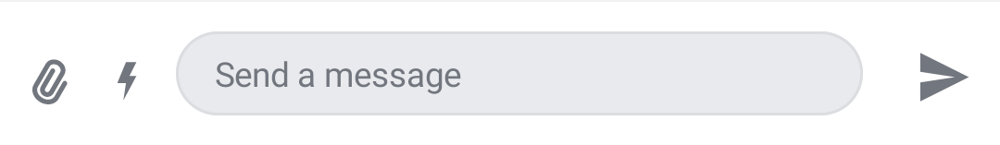
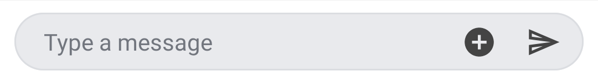

# Custom Composer

The message composer allows users to participate in a conversation by sending messages and attachments.

The name of the standard Compose UI component is `MessageComposer` and, by default, it looks like below:



After we'll finish our customization, it will look like this:



We'll customize:
- The input field's size and hint message
- The position and icon of the _Add Attachments_ and _Send_ buttons

## State Handling

Let's define a new composable, `CustomMessageComposer`, that takes two view models as parameters, needed for state handling.

Inside it, we'll use the standard `MessageComposer` component and customize it as we need.

```kotlin
private fun CustomMessageComposer(
    composerViewModel: MessageComposerViewModel,
    attachmentsPickerViewModel: AttachmentsPickerViewModel,
) {
    MessageComposer(
        viewModel = composerViewModel,
        modifier = Modifier
            .fillMaxWidth()
            .wrapContentHeight(),
        input = {
            // ... See below
        },
        onAttachmentsClick = { attachmentsPickerViewModel.changeAttachmentState(showAttachments = true) },
        integrations = {} // Important for hiding the default Add Attachments button
    )
}
```

## Input Field Customization

We have access to the input field through the `input` parameter of `MessageComposer`. We'll pass a custom version of the `MessageInput` SDK component.

```kotlin
MessageComposer(
    // ... See above
    input = { composerState ->
        // Standard component that we can customize
        MessageInput(
            messageComposerState = composerState,
            onValueChange = { composerViewModel.setMessageInput(it) },
            onAttachmentRemoved = { composerViewModel.removeSelectedAttachment(it) },
            modifier = Modifier
                .padding(horizontal = 10.dp)
                .align(Alignment.CenterVertically),
            // ... See below
        )
    },
    onAttachmentsClick = { attachmentsPickerViewModel.changeAttachmentState(showAttachments = true) },
    integrations = {} // Important for hiding the default Add Attachments button
)
```

### Custom Hint

In order to customize the hint message, we'll use the `MessageInput` `label` parameter and pass a `Text` composable to it.

```kotlin
MessageInput(
    // ... See above
    label = {
        Text(
            modifier = Modifier.padding(start = 4.dp),
            text = "Type a message",
            color = ChatTheme.colors.textLowEmphasis
        )
    },
)
```

### Custom Buttons

To customize the _Add Attachments_ and _Send_ buttons, we'll use the `innerTrailingContent` slot. We'll pass a `Row` that contains two `IconButton` composables, each with a different icon.

For the button click handlers, we use methods from the attachments and composer view models.

```kotlin
MessageInput(
    // ... See above
    innerTrailingContent = {
        Row {
            IconButton(
                modifier = Modifier.size(24.dp),
                onClick = {
                    attachmentsPickerViewModel.changeAttachmentState(showAttachments = true)
                },
                content = {
                    Icon(
                        imageVector = Icons.Outlined.AddCircle,
                        contentDescription = null,
                        tint = Color.DarkGray
                    )
                }
            )
            Spacer(modifier = Modifier.width(20.dp))
            IconButton(
                modifier = Modifier.size(24.dp),
                onClick = {
                    composerViewModel.sendMessage(
                        composerViewModel.buildNewMessage(
                            composerState.inputValue,
                            composerState.attachments
                        )
                    )
                },
                content = {
                    Icon(
                        imageVector = Icons.Outlined.Send,
                        contentDescription = null,
                        tint = Color.DarkGray
                    )
                }
            )
        }
    }
)
```

In order to hide the default buttons, we need to pass an empty composable to the `MessageComposer` `integrations` parameter (see section above).

## Usage

We'll use our custom message composer in a screen that contains other components, like a header, a messages list and an attachments picker. We'll also use the `BackHandler` standard component.

```kotlin
fun CustomScreen(cid: String, onBackClick: () -> Unit = {}) {
    val viewModelFactory = MessagesViewModelFactory(LocalContext.current, channelId = cid)
    val listViewModel = viewModel(modelClass = MessageListViewModel::class.java, factory = viewModelFactory)
    val composerViewModel = viewModel(modelClass = MessageComposerViewModel::class.java, factory = viewModelFactory)
    val attachmentsPickerViewModel = viewModel(modelClass = AttachmentsPickerViewModel::class.java, factory = viewModelFactory)
    
    val isShowingAttachments = attachmentsPickerViewModel.isShowingAttachments

    val backAction = remember(composerViewModel, attachmentsPickerViewModel) {
        {
            // First close the attachments picker, if visible, then call onBackClick
            when {
                attachmentsPickerViewModel.isShowingAttachments -> {
                    attachmentsPickerViewModel.changeAttachmentState(false)
                }
                else -> onBackClick()
            }
        }
    }
    BackHandler(enabled = true, onBack = backAction) // Standard SDK component

    Box(modifier = Modifier.fillMaxSize(), contentAlignment = Alignment.BottomCenter) {
        // Screen content
        Scaffold(
            topBar = { 
                // MessageListHeader,
            },
            bottomBar = {
                CustomMessageComposer(
                    composerViewModel = composerViewModel,
                    attachmentsPickerViewModel = attachmentsPickerViewModel
                )
            },
            content = { 
                // MessageList
            }
        )

        if (isShowingAttachments) {
            // AttachmentsPicker
        }
    }
}
```

## More Resources
<!-- Todo: check link -->
If you want to learn how to use our Compose UI Components, read [this](../03-compose/01-overview.mdx) page.

Also, check the other pages in this Cookbook to find out how to create custom versions of our components.