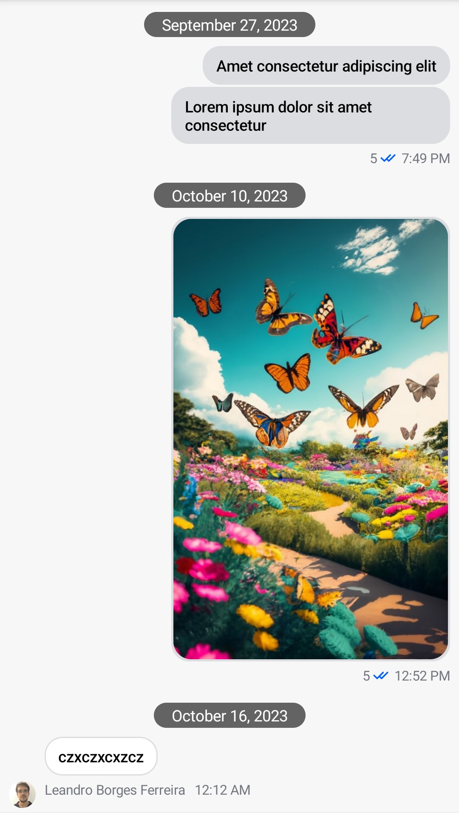

# Message List Alignment

If you want to change the message alignment in the message list you can do so by using the `messageAlignmentProvider` parameter of `ChatTheme`. This way you can align all messages to the left, for example, like Slack does.

`ChatTheme` should be the root of all your composables. It provides several style properties to its children. One of these properties is `messageAlignmentProvider` of type `MessageAlignmentProvider`, which is an interface.

Let's provide a custom value for this parameter. We'll pass an anonymous object that implements the `MessageAlignmentProvider` interface, written in the lambda format.

```kotlin
ChatTheme(
    messageAlignmentProvider = { MessageAlignment.Start },
) {
    // ...
    // MessageList is used somewhere down the tree
    // ...
}
```

Below you can see the original list and the customized one.

| Default message alignment                             | Left message alignment                                 |
|-------------------------------------------------------|--------------------------------------------------------|
|  |  |

