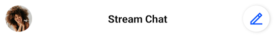
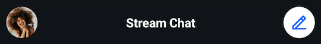
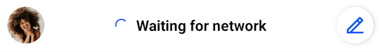
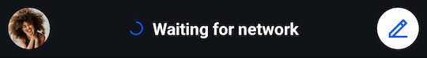
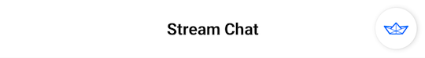

import Tabs from '@theme/Tabs';
import TabItem from '@theme/TabItem';

# Channel List Header

`ChannelListHeaderView` is a component that shows the title of the channels list, the current connection status, the avatar of the current user, and provides an action button that can be used to create a new conversation. It is designed to be displayed at the top of the channels screen of your app.
 
 | Light Mode | Dark Mode |
 | --- | --- |
 |||
 
## Usage

To use `ChannelListHeaderView`, include it in your XML layout as shown below:

```xml
<io.getstream.chat.android.ui.feature.channels.header.ChannelListHeaderView
    android:id="@+id/channelListHeaderView"
    android:layout_width="match_parent"
    android:layout_height="wrap_content" />
```

`ChannelListHeaderView` is supposed to work with `ChannelListHeaderViewModel`. The basic setup of the ViewModel and connecting it with the View can be done in the following way:

<Tabs>
<TabItem value="kotlin" label="Kotlin">

 ```kotlin
// Instantiate the ViewModel
val viewModel: ChannelListHeaderViewModel by viewModels()

// Bind the ViewModel with ChannelListHeaderView
viewModel.bindView(channelListHeaderView, viewLifecycleOwner)
```
</TabItem>

<TabItem value="java" label="Java">

```java
// Instantiate the ViewModel
ChannelListHeaderViewModel viewModel = new ViewModelProvider(this).get(ChannelListHeaderViewModel.class);

// Bind it with ChannelListHeaderView
ChannelListHeaderViewModelBinding.bind(viewModel, channelListHeaderView, getViewLifecycleOwner());
```
</TabItem>
</Tabs>

The `ChannelListHeaderViewModel::bindView` function provides all the logic of subscribing to data emitted by the ViewModel. By default, the ViewModel will make the View display the avatar of the currently logged-in user as well as the "Waiting for network" state when needed.

 | Light Mode | Dark Mode |
 | --- | --- |
 |||

## Handling Actions

The View displays an avatar and action button by default. You can set listeners to handle when a user clicks these:

<Tabs>
<TabItem value="kotlin" label="Kotlin">

```kotlin
channelListHeaderView.setOnActionButtonClickListener {
    // Handle action button click
}
channelListHeaderView.setOnUserAvatarClickListener {
    // Handle user avatar click
}
```
</TabItem>

<TabItem value="java" label="Java">

```java
channelListHeaderView.setOnActionButtonClickListener(() -> {
    // Handle action button click
});
channelListHeaderView.setOnUserAvatarClickListener(() -> {
    // Handle user avatar click
});
```
</TabItem>
</Tabs>

You can also use XML attributes to hide those Views instead. This is explained below.

## Customization

### Using XML Attributes

The appearance of `ChannelListHeaderView` can be conveniently modified using its XML attributes.   
```xml
<io.getstream.chat.android.ui.feature.channels.header.ChannelListHeaderView
    android:id="@+id/channelListHeaderView"
    android:layout_width="match_parent"
    android:layout_height="wrap_content"
    app:streamUiShowUserAvatar="false"
    app:streamUiShowOfflineProgressBar="false"
    app:streamUiActionButtonIcon="@drawable/ic_stream_logo"
    app:streamUiOnlineTitleTextStyle="bold" />
```

The example above hides the avatar view, makes the title text bold and sets the drawable of the action button to a custom icon.
    
| Before | After |
| --- | --- |
|||

A full list of available XML attributes is available [here](https://github.com/GetStream/stream-chat-android/blob/main/stream-chat-android-ui-components/src/main/res/values/attrs_channel_list_header_view.xml).
