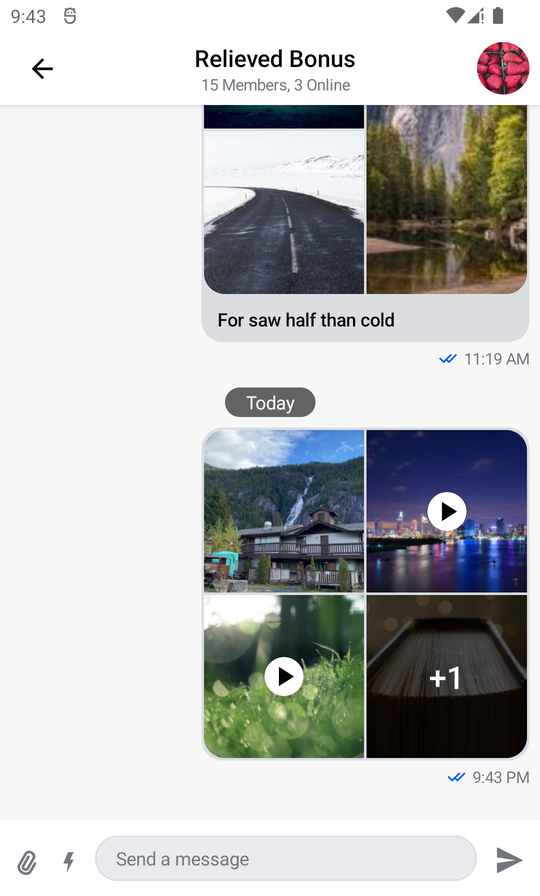
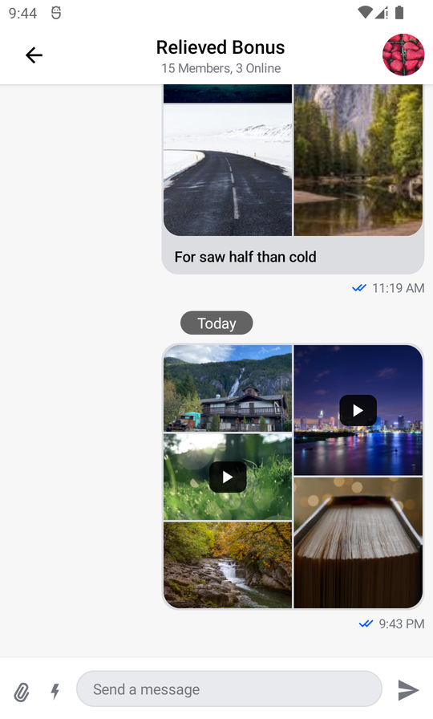

# Customizing Image and Video Previews

## Introduction

The Compose UI Components chat SDK supports various types of attachments by using [attachment factories](../03-general-customization/01-chat-theme.mdx#streamattachmentfactories). The one used to display image and video attachments is called `MediaAttachmentFactory` and offers a degree of customization.

:::note
Video Attachment preview thumbnails are a paid feature and as such can be turned off. You can find the pricing [here](https://getstream.io/chat/pricing/) and the information on how to turn them off in [this](../05-message-components/03-message-list.mdx#image-and-video) section.
:::

## Customization

Let's take a look at the function designed to produce the necessary attachment factory:

```kotlin
public fun MediaAttachmentFactory(
    maximumNumberOfPreviewedItems: Int = 4,
    itemOverlayContent: @Composable (attachmentType: String?) -> Unit = { attachmentType ->
        if (attachmentType == AttachmentType.VIDEO) {
            DefaultItemOverlayContent()
        }
    },
    previewItemOverlayContent: @Composable (attachmentType: String?) -> Unit = { attachmentType ->
        if (attachmentType == AttachmentType.VIDEO) {
            DefaultPreviewItemOverlayContent()
        }
    },
): AttachmentFactory =
    AttachmentFactory(
        canHandle = {
            it.none { attachment ->
                !attachment.isImage() && !attachment.isVideo()
            }
        },
        previewContent = { modifier, attachments, onAttachmentRemoved ->
            MediaAttachmentPreviewContent(
                attachments = attachments,
                onAttachmentRemoved = onAttachmentRemoved,
                modifier = modifier,
                previewItemOverlayContent = previewItemOverlayContent
            )
        },
        content = @Composable { modifier, state ->
            MediaAttachmentContent(
                modifier = modifier,
                attachmentState = state,
                maximumNumberOfPreviewedItems = maximumNumberOfPreviewedItems,
                itemOverlayContent = itemOverlayContent
            )
        }
    )
```

* `maximumNumberOfPreviewedItems`: Controls the maximum number of tiles that can be displayed when previewing attachments inside the message list. In case there are more attachments inside the message than are able to be previewed, the remaining attachment count is displayed.
* `itemOverlayContent`: Overlays a UI item over the attachment preview inside the message list. By default this is used to display a play button icon over video attachments, signaling their type to the user.
* `previewItemOverlayContent`: Serves the same function as `itemOverlayContent`, but used inside `MessageComposer` when selecting attachments instead.

The stock experience we provide out of the box looks like this:

|  |

We'll start changing it by replacing the stock play button in favor of a flatter, semi-transparent design.

Let's create the new button:

```kotlin
@Composable
private fun CustomPlayButton(modifier: Modifier) {
    Box(
        modifier = modifier,
        contentAlignment = Alignment.Center
    ) {
        Icon(
            modifier = Modifier
                .padding(2.dp)
                .fillMaxSize(0.8f),
            painter = painterResource(id = R.drawable.stream_compose_ic_play),
            tint = Color.White,
            contentDescription = null
        )
    }
}
```

Now that we have created our custom button, we can use the slots provided by `MediaAttachmentContent` to override the default play button inside both the message list and the message composer.
We'll also use the opportunity to increase the maximum number of tiles that the factory can display.

```kotlin
val customMediaAttachmentFactory = MediaAttachmentFactory(
    // Increase the maximum number of previewed items to 5
    maximumNumberOfPreviewedItems = 5,
    // Render a custom item above attachments inside the message list
    itemOverlayContent = { attachmentType ->
        // Apply it only to video attachments
        if (attachmentType == AttachmentType.VIDEO) {
            CustomPlayButton(
                modifier = Modifier
                    .widthIn(10.dp)
                    .padding(2.dp)
                    .background(
                        color = Color(red = 256, blue = 256, green = 256, alpha = 220),
                        shape = RoundedCornerShape(8.dp)
                    )
                    .fillMaxWidth(0.3f)
                    .aspectRatio(1.20f),
            )
        }
    },
    // Render a custom item above attachments inside the message composer
    previewItemOverlayContent = { attachmentType ->
        // Apply it only to video attachments
        if (attachmentType == AttachmentType.VIDEO) {
            CustomPlayButton(
                modifier = Modifier
                    .padding(2.dp)
                    .background(
                        color = Color(red = 256, blue = 256, green = 256, alpha = 220),
                        shape = RoundedCornerShape(8.dp)
                    )
                    .fillMaxWidth(0.35f)
                    .aspectRatio(1.20f),
            )
        }
    })
```

Since we only want to modify `MediaAttachmentFactory` and keep the rest of the default factories, we'll copy them in the same order they are created in [StreamAttachmentFactories.defaultFactories()](https://github.com/GetStream/stream-chat-android/blob/main/stream-chat-android-compose/src/main/java/io/getstream/chat/android/compose/ui/attachments/StreamAttachmentFactories.kt#L65).

```kotlin
val attachmentFactories = listOf(
    UploadAttachmentFactory(),
    LinkAttachmentFactory(linkDescriptionMaxLines = 5),
    GiphyAttachmentFactory(),
    customMediaAttachmentFactory,
    FileAttachmentFactory(),
    UnsupportedAttachmentFactory()
)
```

Order of precedence matters when creating a list of attachment factories, the first one whose `canHandle()` returns true will render the given attachment.

Finally, let's replace the default attachment factories:

```kotlin
override fun onCreate(savedInstanceState: Bundle?, persistentState: PersistableBundle?) {
    super.onCreate(savedInstanceState, persistentState)

    setContent {
        // Replace the default attachment factories
        ChatTheme(attachmentFactories = attachmentFactories) {
            MessagesScreen(
                viewModelFactory = messageListViewModelFactory,
                onBackPressed = { finish() }
            )
        }
    }
}
```

And the resulting experience looks like this:



## Conclusion

If you need to put small personal touches to how your app displays image and video attachments while expending very little time on development, the approach we've discussed is optimal. If you need to do large changes, remember you can always create your own attachment factory and replace the default one with it.

:::note
You can read more about custom attachment factories [here](../07-guides/01-adding-custom-attachments.mdx).
:::