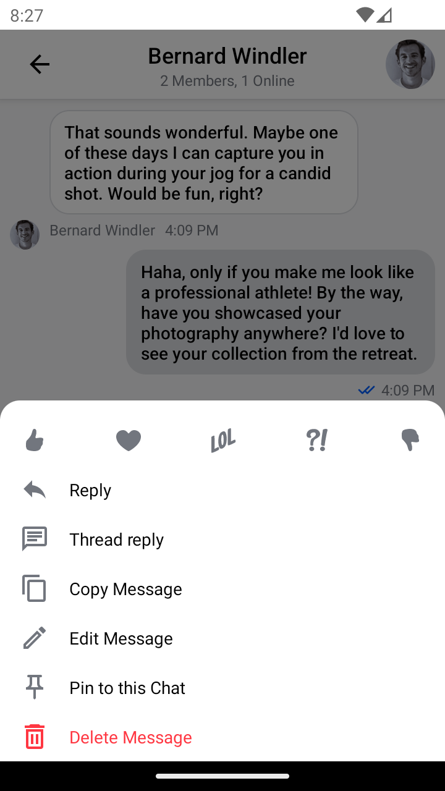

# Adding Localization

The Android SDK's Compose UI Components are available in multiple languages out-of-the-box. At the moment we support the following languages (and more will be added in the future):
- [English](https://github.com/GetStream/stream-chat-android/tree/main/stream-chat-android-compose/src/main/res/values-en)
- [French](https://github.com/GetStream/stream-chat-android/tree/main/stream-chat-android-compose/src/main/res/values-fr)
- [Hindi](https://github.com/GetStream/stream-chat-android/tree/main/stream-chat-android-compose/src/main/res/values-hi)
- [Indonesian](https://github.com/GetStream/stream-chat-android/tree/main/stream-chat-android-compose/src/main/res/values-in)
- [Italian](https://github.com/GetStream/stream-chat-android/tree/main/stream-chat-android-compose/src/main/res/values-it)
- [Japanese](https://github.com/GetStream/stream-chat-android/tree/main/stream-chat-android-compose/src/main/res/values-ja)
- [Korean](https://github.com/GetStream/stream-chat-android/tree/main/stream-chat-android-compose/src/main/res/values-ko)
- [Spanish](https://github.com/GetStream/stream-chat-android/tree/main/stream-chat-android-compose/src/main/res/values-es)

:::note
[English](https://github.com/GetStream/stream-chat-android/tree/main/stream-chat-android-compose/src/main/res/values) is used as the default language.
:::

:::caution
If your app doesn't support all these languages, you might want to [remove some of them](#removing-existing-languages).
:::

| English                                                          | Italian                                                          |
|------------------------------------------------------------------|------------------------------------------------------------------|
|  |  |


### What is Localization?
If you deploy your app to users who speak another language, you might want to internationalize (localize) it. That means you need to write the app in a way that makes it possible to localize values like text and layouts for each language or locale that the app supports. For more information, see the official [Android documentation](https://developer.android.com/guide/topics/resources/localization).

Support for different languages in the SDK is based on the standard [Android mechanism](https://developer.android.com/training/basics/supporting-devices/languages) of switching resources on system locale change. The locale will be set automatically, based on system preferences. You can provide custom localization for the SDK's string resources by overriding them in the locale-specific `/res/values` directories of your project.

All of the string resources names provided by Stream SDK are prefixed with `stream_compose_`, for example:

```xml
<string name="stream_compose_message_list_empty_messages">No messages</string>
```

### Adding a new language

Let's see how you can add support for additional languages in the SDK. As an example, we'll implement a custom Polish language translation for the [`ChannelListHeader`](../04-channel-components/02-channel-list-header.mdx) UI component.

Usually, base string resources are located in the `/res/values/strings.xml` file. In order to add translations for the new language (PL) we are going to create a new `strings.xml` file under `res/values-pl` directory.

Let's take a look at the [strings.xml](https://github.com/GetStream/stream-chat-android/blob/main/stream-chat-android-compose/src/main/res/values/strings.xml) file and discover strings defined for `ChannelListHeader`:

```xml
<?xml version="1.0" encoding="utf-8"?>
<resources>
    <string name="stream_compose_disconnected">Disconnected</string>
    <string name="stream_compose_waiting_for_network">Waiting for network</string>
</resources>
```

As you can see there are two string resources used by this UI component. Let's say we need to localize only the one called `stream_compose_waiting_for_network`.

In order to do that, we need to add the following string resource to the target locale-specific file. In our case, this will be the `res/values-pl/strings.xml`:

```xml
<?xml version="1.0" encoding="utf-8"?>
<resources>
    <string name="stream_compose_waiting_for_network">Oczekiwanie na połączenie</string>
</resources>
``` 

As the result, your app will display _`Oczekiwanie na połączenie`_ text on devices set to a Polish locale.

### Overriding existing languages

To override strings for a language supported by default, create new string resources in the locale-specific `/res/values-XX` directories of your project with the same resource `name`. [Here](https://github.com/GetStream/stream-chat-android/tree/main/stream-chat-android-compose/src/main/res/values) you can find a list of available text resources.

### Overriding the default language

To change the strings used by default, place the string resources you want to override inside the `/res/values` [directory](https://github.com/GetStream/stream-chat-android/tree/main/stream-chat-android-compose/src/main/res/values) directory.

### Removing existing languages

The Android UI Components include resources for all of the languages mentioned above. If your app doesn't support all those languages, you can exclude some of them by explicitly defining a list of supported languages inside your `build.gradle` file:

```groovy
defaultConfig {
    resConfigs "en", "es"
}
```

With the configuration here, your app will include only _English_ and _Spanish_ resources.

### Translating User Messages

Stream Chat provides the ability to run users' messages through automatic translation.
While machine translation is never perfect it can enable two users to communicate with
each other without speaking the same language. 

In order to enable automatic translation, the following steps are required to do in the Client SDKs:
#### Enabling the feature in the Compose SDK through:
```kotlin
ChatTheme(
    autoTranslationEnabled = true,
) {
    // ...
}
```

#### Enabling the feature for Push Notifications through:
```kotlin
val notificationConfig = NotificationConfig(
    //...
    autoTranslationEnabled = true,
    //...
)
val notificationHandler = NotificationHandlerFactory.createNotificationHandler(
    //...
    notificationConfig = notificationConfig,
    //...
)
ChatClient.Builder(apiKey, context)
    //...
    .notifications(notificationConfig, notificationHandler)
    //...
    .build()

```
#### Providing the language when connecting the user:
```kotlin
client.connectUser(user = User(id = "userId", language = "en"), token = "userToken").await()
```

For more information, see the full guide to [adding automatic translation](https://getstream.io/chat/docs/android/translation?language=kotlin).