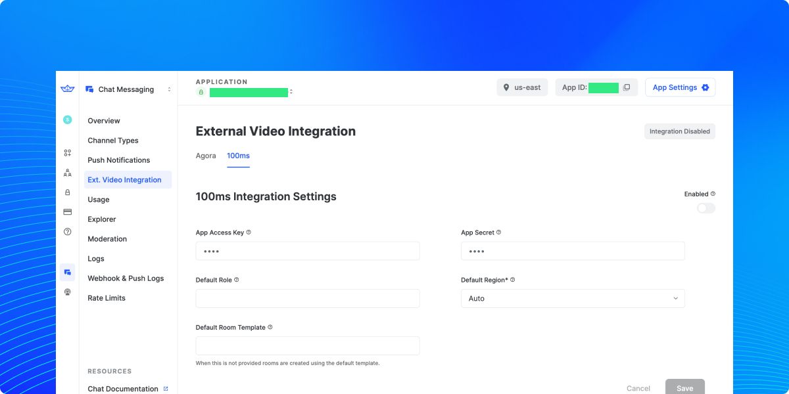
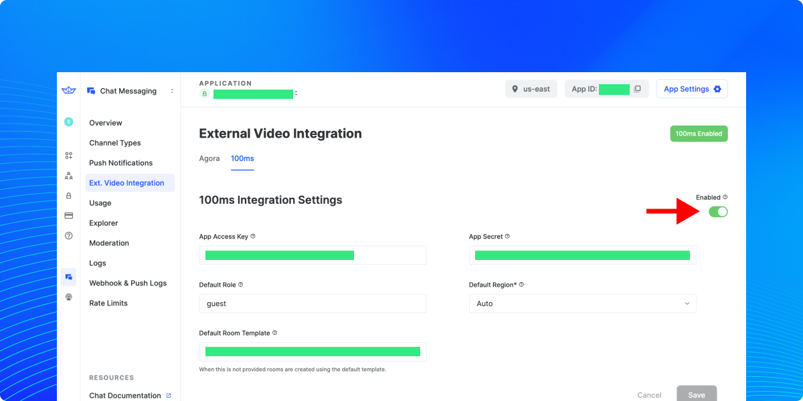
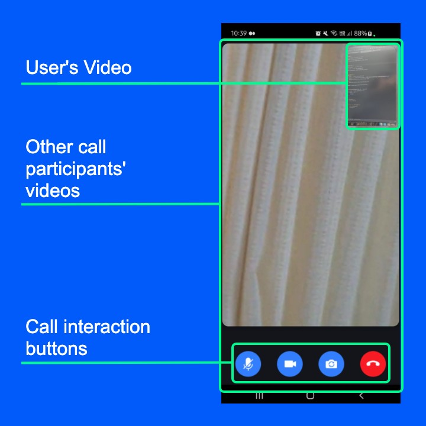

# 100ms: Video Integration Guide for Android

<!-- Code is available here: https://github.com/GetStream/android-video-integration-100ms -->

This page shows you how to integrate [100ms SDK](https://www.100ms.live/) into Stream Chat SDK for implementing video call features.

## Introduction

Video calls have become an integral part of daily life since the pandemic hit. Today, we will take a look at how you can use the 100ms service to integrate video calls into the Stream Chat SDK.

100ms is an infrastructure provider for services like video, audio, and live streaming. They offer native SDKs for mobile platforms and the web that allow for simple integration with very few lines of code. They cover a wide range of use cases such as video conferencing, Telehealth, classrooms, and many more.

There are a few necessary steps to follow to integrate video calling capabilities with the Stream Chat SDK, but we will go over each phase of the process to come up with a functional and reusable solution that allows your end-users to communicate with one another through a seamless video experience.

Follow the steps below to produce this app that allows your users to make video calls:

1. Setting up an account for 100ms
2. Stream Dashboard integration
3. Configure dependencies
4. Implement a ViewModel for video calls
5. Implement video call layouts
6. Implement custom call messages using custom attachments

:::note
This tutorial assumes you already use [Stream Chat SDK for Android](https://getstream.io/chat/sdk/android/) in your Android project. So you will not cover how to set up the Stream Chat SDK in this tutorial. For more information, check out the [Android Chat Messaging Tutorial](https://getstream.io/tutorials/android-chat/) guide.
:::

## 1. Setting Up an Account for 100ms

First, let’s go over a quick introduction to [100ms](https://www.100ms.live). It is a service that allows you to do video conferencing, audio, and more. Their aim is to provide you with a wide range of extensible features, all while allowing you to get started quickly with minimum effort.

To get started, you must [set up an account](https://dashboard.100ms.live/register) for the platform. Click the **Try For Free** button for a trial to use for this tutorial. You can sign up with either a Google or GitHub account, or you can use any other email address. You will receive an email asking you to confirm your credentials.

Next, you’ll get a quick tour of how to create your own video conference. Here is an outline of the steps you must take:

1. Choose a template: Select **Video Conferencing**, hit **Next**
2. Add a few more details: Enter everything that is valid for you
3. Choose a subdomain: Create a subdomain that is suitable for your use case and select the closest region (for example in our case, “integrationguide” and “EU” make the most sense, resulting in the domain: **integrationguide.app.100ms.live**)
4. Your app is ready: You can join the room if you want to see a sample (not necessary)

From here, click the **Go to Dashboard** button at the bottom. After completing the quick introductory tour, your account and app will be ready to continue. Nice job.

You will come back to the Dashboard later, but we will move on to other steps next.

## 2. Stream Dashboard Integration

In order for the integration of 100ms to work there needs to be a server component handling token generation and more. Normally this would require a custom server implementation but Stream offers first-class integration for 100ms relieving you of these duties.

There are only a few setup steps to go through in the Stream dashboard and this guide details all of them:

1. Head over to the [Dashboard](https://dashboard.getstream.io) and login
2. Create a new app or select your app by name
3. In the sidebar on the left, select **Ext. Video Integration**
4. Make sure the **100ms** tab is selected

This is the screen that you navigated to:



First, it is necessary to enable the integration through the toggle in the top right (red arrow in the image below). Make sure that you can see the green **100ms Enabled** badge at the top.

Next, it is necessary to enter the credentials from the 100ms console. This is the place you need to enter the following values (in brackets are the place you can find them in the 100ms dashboard):

- `App Access Key` (100ms Dashboard: `Developer` -> `App Access Key`)
- `App Secret` (100ms Dashboard: `Developer` -> `App Secret`)
- `Default Role` (can be `guest`)
- `Default Room Template` (100ms Dashboard: `Templates` -> `Name`)



With these steps being taken, the Stream Chat SDK will use these credentials internally to initiate calls without you needing to take additional steps.

So, let's focus on the Video call implementation.

## 3. Configure Dependencies

Before you dive in, you need to configure the dependencies. First, add the codes below to your root `settings.gradle` at the end of the `repositories closure`:

```groovy
dependencyResolutionManagement {
    repositoriesMode.set(RepositoriesMode.FAIL_ON_PROJECT_REPOS)
    repositories {
        google()
        mavenCentral()
        maven { url "https://jitpack.io" }
    }
}
```

Next, add the dependencies below to your app-level **build.gradle** file:

```groovy {2, 5}
// 100ms SDK
implementation "com.github.100mslive.android-sdk:lib:2.3.4"

// Stream chat SDK
implementation "io.getstream:stream-chat-android-ui-components:6.0.0"
implementation "io.getstream:stream-chat-android-offline:6.0.0"
```

Now, let’s build a video call screen with the 100ms SDK.

## 4. Implement a ViewModel for Video Calls

We will implement a `VideoCallViewModel`, which includes all video-relevant behaviors, such as creating a dynamic call, requesting an authentication token, connecting to a video call, and toggling the mic or video. 

First, according to [100ms joining room guidelines](https://www.100ms.live/docs/android/v2/features/join), you should extends `HMSUpdateListener` for listening room updates, such as creating, joining, or getting a list of participants as you’ve seen in the example below:

```kotlin
class VideoCallViewModel constructor(
    private val hmsSdk: HMSSDK,
    private val chatClient: ChatClient,
    private val cid: String
) : ViewModel(), HMSUpdateListener {
  ..
}
```

Next, you can create a new video call with an unique call id and get a video call token with Stream chat SDK like the below:

```kotlin {4, 17}
private suspend fun createVideoCall(): String = withContext(Dispatchers.IO) {
    val uuid = UUID.randomUUID().toString()
    val (channelType, channelId) = cid.cidToTypeAndId()
    val result = chatClient.createVideoCall(
        channelType = channelType,
        channelId = channelId,
        callType = CallType.VIDEO.name.lowercase(),
        callId = uuid
    ).await()
    when (result) {
        is Result.Success -> result.value.callId // returns a call id from the network result
        is Result.Failure -> throw IllegalStateException("Couldn't create a call id.")
    }
}

private suspend fun getVideoCallToken(callId: String): String = withContext(Dispatchers.IO) {
    when (val result = chatClient.getVideoCallToken(callId).await()) {
        is Result.Success -> result.value.token // returns an authentication token from the network result
        is Result.Failure -> throw IllegalStateException("Couldn't create a token.")
    }
}
```

Stream chat SDK provides video integration APIs for 100ms, so you can create a new video call and get a video call token from the Stream server without building your own backend service.

Next, you can join a room with the `join` method of 100ms SDK like the below:

```kotlin {4}
private fun joinRoom(name: String?, authToken: String?) {
    if (authToken != null && name != null) {
        Timber.d("Joining with $authToken")
        hmsSdk.join(HMSConfig(userName = name, authtoken = authToken), this)
    } else {
        Timber.d("Neither auth token nor name can be null.")
    }
}
```

As you can see in the example above, you should pass a user name that will be joined as a participant and a unique token of the user. For more information about joining a room, check out [100ms official guide about Join Room](https://www.100ms.live/docs/android/v2/features/join).

As a result, the full source code of the `VideoCallViewModel` will be like the below:

```kotlin
data class TrackPeerMap(
    val videoTrack: HMSVideoTrack?,
    val peer: HMSPeer
)

class VideoCallViewModel constructor(
    private val hmsSdk: HMSSDK,
    private val chatClient: ChatClient,
    private val cid: String
) : ViewModel(), HMSUpdateListener {

    private val _videoCallParticipants = MutableLiveData<List<TrackPeerMap>>(emptyList())
    val videoCallParticipants: LiveData<List<TrackPeerMap>> = _videoCallParticipants

    private val _myVideoTrackPeer: MutableLiveData<TrackPeerMap?> = MutableLiveData()
    val myVideoTrackPeer: LiveData<TrackPeerMap?> = _myVideoTrackPeer

    private val _loading = MutableLiveData(true)
    val loading: LiveData<Boolean> = _loading

    private val _muteVideo = MutableStateFlow(false)
    val muteVideo: StateFlow<Boolean> = _muteVideo

    private val _muteMic = MutableStateFlow(false)
    val muteMic: StateFlow<Boolean> = _muteMic

    private val cameraFacing = MutableStateFlow(HMSVideoTrackSettings.CameraFacing.FRONT)

    fun createVideoCallOrJoin(callId: String?, onCreateRoom: (String) -> Unit) {
        viewModelScope.launch {
            try {
                val userName = chatClient.getCurrentUser()?.name ?: "name"
                val createdVideoCallId = callId ?: createVideoCall()
                val token = getVideoCallToken(createdVideoCallId)
                onCreateRoom.invoke(createdVideoCallId)
                joinRoom(userName, token)
            } catch (e: Exception) {
                Timber.e(e)
            }
        }
    }

    private suspend fun createVideoCall(): String = withContext(Dispatchers.IO) {
        val uuid = UUID.randomUUID().toString()
        val (channelType, channelId) = cid.cidToTypeAndId()
        val result = chatClient.createVideoCall(
            channelType = channelType,
            channelId = channelId,
            callType = CallType.VIDEO.name.lowercase(),
            callId = uuid
        ).await()
        when (result) {
            is Result.Success -> result.value.callId
            is Result.Failure -> throw IllegalStateException("Couldn't create a call id.")
        }
    }

    private suspend fun getVideoCallToken(callId: String): String = withContext(Dispatchers.IO) {
        when (val result = chatClient.getVideoCallToken(callId).await()) {
            is Result.Success -> result.value.token
            is Result.Failure -> throw IllegalStateException("Couldn't create a token.")
        }
    }

    private fun joinRoom(name: String?, authToken: String?) {
        if (authToken != null && name != null) {
            Timber.d("Joining with $authToken")
            hmsSdk.join(HMSConfig(userName = name, authtoken = authToken), this)
            _loading.postValue(false)
        } else {
            Timber.d("Neither auth token nor name can be null.")
        }
    }

    override fun onJoin(room: HMSRoom) = updatePeerInformation()
    override fun onPeerUpdate(type: HMSPeerUpdate, peer: HMSPeer) = updatePeerInformation()
    override fun onMessageReceived(message: HMSMessage) = Unit
    override fun onRoleChangeRequest(request: HMSRoleChangeRequest) = Unit
    override fun onChangeTrackStateRequest(details: HMSChangeTrackStateRequest) = Unit
    override fun onRoomUpdate(type: HMSRoomUpdate, hmsRoom: HMSRoom) = updatePeerInformation()
    override fun onTrackUpdate(type: HMSTrackUpdate, track: HMSTrack, peer: HMSPeer) =
        updatePeerInformation()

    override fun onError(error: HMSException) {
        Timber.e("Error $error")
    }

    private fun updatePeerInformation() {
        _myVideoTrackPeer.postValue(getMyVideoTrack())
        _videoCallParticipants.postValue(getCurrentParticipants())
    }

    private fun getCurrentParticipants(): List<TrackPeerMap> {
        // Convert all the peers into a map of them and their tracks.
        val trackAndPeerMap =
            hmsSdk.getPeers().filter { it.name != chatClient.getCurrentUser()?.name }.flatMap {
                val screenShare = it.auxiliaryTracks.find { auxTrack -> auxTrack is HMSVideoTrack }
                if (screenShare is HMSVideoTrack) {
                    listOf(TrackPeerMap(it.videoTrack, it), TrackPeerMap(screenShare, it))
                } else {
                    listOf(TrackPeerMap(it.videoTrack, it))
                }
            }

        return trackAndPeerMap
    }

    private fun getMyVideoTrack(): TrackPeerMap? {
        val peers = hmsSdk.getPeers()
        val peer = peers.firstOrNull { it.name == chatClient.getCurrentUser()?.name } ?: return null
        return TrackPeerMap(peer.videoTrack, peer)
    }

    fun toggleVideo() {
        _muteVideo.value = !_muteVideo.value
        val myPeer = hmsSdk.getLocalPeer()
        myPeer?.videoTrack?.setMute(muteVideo.value)
    }

    fun toggleMic() {
        _muteMic.value = !_muteMic.value
        val myPeer = hmsSdk.getLocalPeer()
        myPeer?.audioTrack?.setMute(muteMic.value)
    }

    fun toggleCamera() {
        val myPeer = hmsSdk.getLocalPeer()
        val facing = if (cameraFacing.value == HMSVideoTrackSettings.CameraFacing.BACK) {
            HMSVideoTrackSettings.CameraFacing.FRONT
        } else {
            HMSVideoTrackSettings.CameraFacing.BACK
        }
        myPeer?.videoTrack?.switchCamera(facing)
    }

    fun runIfLastAttendee(block: () -> Unit) {
        val size = hmsSdk.getPeers().size
        if (size == 1) {
            block()
        }
    }

    fun leaveCall() {
        hmsSdk.leave()
    }

    override fun onCleared() {
        super.onCleared()
        leaveCall()
    }
}
```

Let’s break down each method one by one:

- **`createVideoCallOrJoin`**: This method requests an authentication token to the Stream server and joins a call with a specific `callId` parameter. If the `callId` is null, it will request creating a new call dynamically.
- **`createVideoCall`**: This method creates a new call dynamically with a unique UUID for the call id.
- **`getVideoCallToken`**: This method requests an authentication token to the Stream server.
- **`joinRoom`**: Join a room and connect to a video call with the specific name of the room and an authentication token. You can join the room by invoking the `join` method of the `HMSSDK` and `HMSConfig`. For more details, check out the [100ms Join Room](https://www.100ms.live/docs/android/v2/features/join) Android guide.

For more details about override methods from `HMSUpdateListener`, check out the [100ms official Join Room guideline](https://www.100ms.live/docs/android/v2/features/Join).

## 5. Implement Video Call Layouts
Now you’ll implement a video call screen like the below:


The UI components of the call are:

1. A vertical list of all call participants
2. The user’s own video (placed at the top right above the other content)
3. A row of buttons at the bottom to control certain call elements (namely, toggle audio, video, rotate the camera, and end call)

You’ll implement the call screen with [RecyclerView](https://developer.android.com/develop/ui/views/layout/recyclerview) that has the list of all call participants as the first element.

### Create PeerViewHolder and PeerAdapter

First, you need to build a single video track layout, which renders a single video call for each different user. To implement this, you need to implement a [`RecyclerView.ViewHolder`](https://developer.android.com/reference/androidx/recyclerview/widget/RecyclerView.ViewHolder) and [`RecyclerView.Adapter`](https://developer.android.com/reference/androidx/recyclerview/widget/RecyclerView.Adapter) to implement the list of participants.

To implement a single video track layout, you can use `SurfaceViewRenderer`, which allows you to render a video stream on your layout. So you can build your single video track XML layout called `layout_single_video_track.xml` like the below:

```xml
<?xml version="1.0" encoding="utf-8"?>
<layout xmlns:android="http://schemas.android.com/apk/res/android"
    xmlns:app="http://schemas.android.com/apk/res-auto"
    xmlns:tools="http://schemas.android.com/tools">
    
    <androidx.cardview.widget.CardView
        android:layout_width="match_parent"
        android:layout_height="wrap_content"
        android:layout_margin="6dp"
        app:cardCornerRadius="14dp"
        app:cardElevation="6dp">

        <androidx.constraintlayout.widget.ConstraintLayout
            android:layout_width="match_parent"
            android:layout_height="match_parent"
            android:background="@color/background900">

            <org.webrtc.SurfaceViewRenderer
                android:id="@+id/videoSurfaceView"
                android:layout_width="match_parent"
                android:layout_height="match_parent"
                app:layout_constraintStart_toStartOf="parent"
                app:layout_constraintTop_toTopOf="parent" />

            <io.getstream.avatarview.AvatarView
                android:id="@+id/avatar"
                android:layout_width="80dp"
                android:layout_height="80dp"
                app:layout_constraintBottom_toBottomOf="parent"
                app:layout_constraintEnd_toEndOf="parent"
                app:layout_constraintStart_toStartOf="parent"
                app:layout_constraintTop_toTopOf="parent"
                tools:src="@tools:sample/avatars" />

        </androidx.constraintlayout.widget.ConstraintLayout>

    </androidx.cardview.widget.CardView>
</layout>
```

The example used `AvatarView` that is provided by Stream chat SDK to show up the user’s initial instead of video track when the user mutes the camera. It’s optional so you can remove it from the example above.

Next, you should implement `PeerViewHolder` that renders each single video track on the list like the below:

```kotlin
class PeerViewHolder constructor(
    private val binding: LayoutPeerItemBinding,
    private val getItem: (Int) -> TrackPeerMap
) : RecyclerView.ViewHolder(binding.root) {

    private var sinkAdded = false

    fun startSurfaceView() {
        if (!sinkAdded) {
            binding.videoSurfaceView.apply {
                getItem(bindingAdapterPosition).videoTrack?.let { hmsVideoTrack ->
                    init(SharedEglContext.context, null)
                    hmsVideoTrack.addSink(this)
                    sinkAdded = true
                }
            }
        }
    }

    fun stopSurfaceView() {
        // If the sink was added, AND there was a video
        //  then remove the sink and release
        binding.videoSurfaceView.apply {
            if (sinkAdded && bindingAdapterPosition != -1) {
                getItem(bindingAdapterPosition).videoTrack?.let {
                    it.removeSink(this)
                    release()
                    sinkAdded = false
                }
            }
        }
    }

    fun bind(trackPeerMap: TrackPeerMap) {
        if (!sinkAdded) {
            binding.videoSurfaceView.apply {
                setEnableHardwareScaler(true)
                setScalingType(RendererCommon.ScalingType.SCALE_ASPECT_FIT)
                sinkAdded = false
            }
        }

        binding.avatar.avatarInitials = trackPeerMap.peer.name
        binding.avatar.isVisible = trackPeerMap.videoTrack?.isMute ?: false
    }
}
```

Next, you should implement `PeerAdapter` that binds video track data to views that you’ve created sections above like the below:

```kotlin
class PeerAdapter : ListAdapter<TrackPeerMap, PeerViewHolder>(callback) {

    companion object {
        val callback = object : DiffUtil.ItemCallback<TrackPeerMap>() {
            override fun areItemsTheSame(
                oldItem: TrackPeerMap,
                newItem: TrackPeerMap
            ) = oldItem.peer.peerID == newItem.peer.peerID &&
                oldItem.videoTrack?.trackId == newItem.videoTrack?.trackId

            override fun areContentsTheSame(
                oldItem: TrackPeerMap,
                newItem: TrackPeerMap
            ) = oldItem.videoTrack?.isMute == newItem.videoTrack?.isMute
        }
    }

    override fun onCreateViewHolder(parent: ViewGroup, viewType: Int): PeerViewHolder {
        val binding = DataBindingUtil.inflate<LayoutPeerItemBinding>(
            LayoutInflater.from(parent.context),
            R.layout.layout_peer_item,
            parent,
            false
        )
        return PeerViewHolder(binding, ::getItem)
    }

    override fun onBindViewHolder(holder: PeerViewHolder, position: Int) {
        getItem(position)?.let {
            holder.stopSurfaceView()
            holder.bind(it)
        }
    }

    override fun onViewAttachedToWindow(holder: PeerViewHolder) {
        super.onViewAttachedToWindow(holder)
        holder.startSurfaceView()
    }

    override fun onViewDetachedFromWindow(holder: PeerViewHolder) {
        super.onViewDetachedFromWindow(holder)
        holder.stopSurfaceView()
    }
}
```

The `PeerAdapter` uses `PeerViewHolder` to bind `TrackPeerMap` items to the single video track layout. Now, let’s implement the video call screen layout. 

### Create a Video Call Layout

Next, you should create a video call layout that renders a user’s video, a list of participants, and call interaction buttons that you’ve seen in the image above. You implement the `fragment_video_call.xml` file like the below:

```xml
<?xml version="1.0" encoding="utf-8"?>
<layout xmlns:android="http://schemas.android.com/apk/res/android"
    xmlns:app="http://schemas.android.com/apk/res-auto"
    xmlns:tools="http://schemas.android.com/tools">

    <data>

        <variable
            name="adapter"
            type="io.getstream.video.hms.ui.call.PeerAdapter" />

        <variable
            name="vm"
            type="io.getstream.video.hms.ui.call.VideoCallViewModel" />
    </data>

    <androidx.constraintlayout.widget.ConstraintLayout
        android:layout_width="match_parent"
        android:layout_height="match_parent"
        android:background="@color/background">

        <androidx.recyclerview.widget.RecyclerView
            android:id="@+id/recyclerView"
            android:layout_width="match_parent"
            android:layout_height="match_parent"
            android:adapter="@{adapter}"
            android:keepScreenOn="true"
            android:orientation="vertical"
            app:layoutManager="androidx.recyclerview.widget.LinearLayoutManager"
            tools:listitem="@layout/layout_peer_item" />

        <include
            android:id="@+id/myVideoTrack"
            layout="@layout/layout_single_video_track"
            android:layout_width="110dp"
            android:layout_height="180dp"
            android:layout_margin="12dp"
            app:layout_constraintEnd_toEndOf="parent"
            app:layout_constraintTop_toTopOf="parent" />

        <androidx.constraintlayout.widget.ConstraintLayout
            android:layout_width="match_parent"
            android:layout_height="wrap_content"
            android:paddingVertical="18dp"
            app:gone="@{vm.loading}"
            app:layout_constraintBottom_toBottomOf="parent"
            app:layout_constraintEnd_toEndOf="parent"
            app:layout_constraintStart_toStartOf="parent">

            <ImageView
                android:id="@+id/mic"
                android:layout_width="wrap_content"
                android:layout_height="wrap_content"
                android:src="@drawable/ic_mic"
                app:layout_constraintBottom_toBottomOf="parent"
                app:layout_constraintEnd_toStartOf="@id/video"
                app:layout_constraintStart_toStartOf="parent"
                app:layout_constraintTop_toTopOf="parent"
                app:toggleMic="@{vm.muteMic}" />

            <ImageView
                android:id="@+id/video"
                android:layout_width="wrap_content"
                android:layout_height="wrap_content"
                android:src="@drawable/ic_video"
                app:layout_constraintBottom_toBottomOf="parent"
                app:layout_constraintEnd_toEndOf="@id/camera"
                app:layout_constraintStart_toEndOf="@id/mic"
                app:layout_constraintTop_toTopOf="parent"
                app:toggleVideo="@{vm.muteVideo}" />

            <ImageView
                android:id="@+id/camera"
                android:layout_width="wrap_content"
                android:layout_height="wrap_content"
                android:src="@drawable/ic_camera"
                app:layout_constraintBottom_toBottomOf="parent"
                app:layout_constraintEnd_toStartOf="@id/call"
                app:layout_constraintStart_toEndOf="@id/video"
                app:layout_constraintTop_toTopOf="parent" />

            <ImageView
                android:id="@+id/call"
                android:layout_width="wrap_content"
                android:layout_height="wrap_content"
                android:src="@drawable/ic_call_end"
                app:layout_constraintBottom_toBottomOf="parent"
                app:layout_constraintEnd_toEndOf="parent"
                app:layout_constraintStart_toEndOf="@id/camera"
                app:layout_constraintTop_toTopOf="parent" />

        </androidx.constraintlayout.widget.ConstraintLayout>

        <ProgressBar
            android:id="@+id/progress"
            android:layout_width="wrap_content"
            android:layout_height="wrap_content"
            app:gone="@{!vm.loading}"
            app:layout_constraintBottom_toBottomOf="parent"
            app:layout_constraintEnd_toEndOf="parent"
            app:layout_constraintStart_toStartOf="parent"
            app:layout_constraintTop_toTopOf="parent" />

    </androidx.constraintlayout.widget.ConstraintLayout>
</layout>
```

As you can see in the example above, it reuses the `layout_single_video_track` layout that you’ve created in the previous section to render the user’s video track.

### Create a VideoCallDialogFragment

Now, you can implement a video call screen called `VideoCallDialogFragment` and connect all UI behaviors to `VideoCallViewModel`. The example below uses `DialogFragment` to make belong to the chat message list screen and show the video call screen above the message list screen:

```kotlin
class VideoCallDialogFragment : DialogFragment() {

    private lateinit var binding: FragmentVideoCallBinding
    private val videoCallViewModel: VideoCallViewModel by activityViewModels()
    private val channelViewModel: ChannelViewModel by activityViewModels()
    private val peerAdapter = PeerAdapter()

    override fun onResume() {
        super.onResume()
        dialog?.window?.setLayout(
            ViewGroup.LayoutParams.MATCH_PARENT,
            ViewGroup.LayoutParams.MATCH_PARENT
        )
        dialog?.window?.setBackgroundDrawable(ColorDrawable(Color.TRANSPARENT))
        dialog?.window?.clearFlags(WindowManager.LayoutParams.FLAG_DIM_BEHIND)
    }

    override fun onCreateView(
        inflater: LayoutInflater,
        container: ViewGroup?,
        savedInstanceState: Bundle?
    ): View {
        super.onCreateView(inflater, container, savedInstanceState)

        binding = DataBindingUtil.inflate(
            inflater,
            R.layout.fragment_video_call,
            container,
            false
        )
        return binding.apply {
            lifecycleOwner = viewLifecycleOwner
            vm = videoCallViewModel
            adapter = peerAdapter
        }.root
    }

    override fun onViewCreated(view: View, savedInstanceState: Bundle?) {
        super.onViewCreated(view, savedInstanceState)

        binding.mic.setOnClickListener {
            videoCallViewModel.toggleMic()
        }

        binding.video.setOnClickListener {
            videoCallViewModel.toggleVideo()
        }

        binding.camera.setOnClickListener {
            videoCallViewModel.toggleCamera()
        }

        val callType = arguments?.getSerializable(EXTRA_CALL_TYPE) as? CallType
        binding.call.setOnClickListener {
            videoCallViewModel.leaveCall()
            videoCallViewModel.runIfLastAttendee {
                callType?.let { channelViewModel.leaveOnCall(it) }
            }
            dismissAllowingStateLoss()
        }

        val callId = arguments?.getString(EXTRA_CALL_ID)
        videoCallViewModel.createVideoCallOrJoin(callId) {
            if (callId == null && callType != null) {
                channelViewModel.createCallAttachment(
                    callType = callType, callId = it
                )
            }
        }

        var sinkAdded = false
        videoCallViewModel.myVideoTrackPeer.observe(viewLifecycleOwner) {
            with(binding.myVideoTrack) {
                if (!sinkAdded) {
                    videoSurfaceView.setZOrderMediaOverlay(true)
                    videoSurfaceView.init(SharedEglContext.context, null)
                    it?.videoTrack?.addSink(videoSurfaceView)
                    videoSurfaceView.setEnableHardwareScaler(true)
                    videoSurfaceView.setScalingType(RendererCommon.ScalingType.SCALE_ASPECT_FIT)
                    sinkAdded = true
                }
                avatar.avatarInitials = it?.peer?.name
                avatar.isVisible = it?.videoTrack?.isMute ?: false
            }
        }

        videoCallViewModel.videoCallParticipants.observe(viewLifecycleOwner) {
            peerAdapter.submitList(it)
        }
    }

    companion object {
        const val TAG = "VideoCallDialogFragment"

        private const val EXTRA_CALL_TYPE = "EXTRA_CALL_TYPE"
        private const val EXTRA_CALL_ID = "EXTRA_CALL_ID"

        fun create(callType: CallType, callId: String?): VideoCallDialogFragment =
            VideoCallDialogFragment().apply {
                arguments = bundleOf(EXTRA_CALL_TYPE to callType, EXTRA_CALL_ID to callId)
            }
    }
}
```

Now, you can launch the video call screen from other Activities or Fragments with the following code:

```kotlin
VideoCallDialogFragment.create(callType = callType, callId = callId)
            .show(supportFragmentManager, VideoCallDialogFragment.TAG)
```

The end result will look like this:


But you may face an unresolved IDE error for the `ChannelViewModel` if you build your project now. You’ll cover it in the following sections.

We implemented a basic form of a video call with 100ms SDK. Now let’s create custom call messages that represent video call messages with Stream chat’s custom attachment.

## 6. Implement Custom Call Messages Using Custom Attachments

Now, let’s integrate the video call into your chat screen with the custom attachment. You will show a custom UI for call messages in the message list that will look like this:


### Create Video Call Custom Attachments

First, you should define the `CallType` `enum` class as shown below to distinguish call type:

```kotlin
enum class CallType(val type: String) {
    AUDIO("Audio"),
    VIDEO("Video"),
    UNKNOWN("Unknown");
}
```

Next, create a new Kotlin class, **ModelExtensions.kt**, which includes the extensions below that distinguish call types for convenience:

```kotlin
val CallType.attachmentForCallOn: String
    get() = if (this == CallType.AUDIO) {
        ATTACHMENT_AUDIO_CALL_ON
    } else {
        ATTACHMENT_VIDEO_CALL_ON
    }

val CallType.attachmentForCallOff: String
    get() = if (this == CallType.AUDIO) {
        ATTACHMENT_AUDIO_CALL_OFF
    } else {
        ATTACHMENT_VIDEO_CALL_OFF
    }

fun Attachment.hasCallType(): Boolean = getOnCallType() != CallType.UNKNOWN

fun Attachment.getOnCallType(): CallType {
    return when (title) {
        CallType.AUDIO.attachmentForCallOn -> CallType.AUDIO
        CallType.VIDEO.attachmentForCallOn -> CallType.VIDEO
        else -> CallType.UNKNOWN
    }
}

fun Attachment.getOffCallType(): CallType {
    return when (title) {
        CallType.AUDIO.attachmentForCallOff -> CallType.AUDIO
        CallType.VIDEO.attachmentForCallOff -> CallType.VIDEO
        else -> CallType.UNKNOWN
    }
```

Next, you need to create a custom attachment factory class, which extends `AttachmentFactory` called `CallOnAttachmentViewFactory` like the below:

```kotlin
class CallOnAttachmentViewFactory constructor(
    private val onJoinClicked: (CallType, String) -> Unit
) : AttachmentFactory {

    override fun canHandle(message: Message): Boolean {
        val callOnAttachment = message.attachments.firstOrNull { it.hasCallType() }
        return callOnAttachment != null
    }

    override fun createViewHolder(
        message: Message,
        listeners: MessageListListenerContainer?,
        parent: ViewGroup
    ): InnerAttachmentViewHolder {
        val callOnAttachment = message.attachments.firstOrNull { it.hasCallType() }
            ?: return createViewHolder(message, listeners, parent)
        val binding = AttachmentCallOnBinding
            .inflate(LayoutInflater.from(parent.context), null, false)
        return CallOnAttachmentViewHolder(
            attachment = callOnAttachment,
            binding = binding
        )
    }

    inner class CallOnAttachmentViewHolder(
        binding: AttachmentCallOnBinding,
        attachment: Attachment
    ) :
        InnerAttachmentViewHolder(binding.root) {

        init {
            with(binding) {
                shape.apply {
                    shapeAppearanceModel = shapeAppearanceModel
                        .toBuilder()
                        .setAllCornerSizes(resources.getDimension(io.getstream.chat.android.ui.R.dimen.stream_ui_selected_attachment_corner_radius))
                        .build()
                }

                val callTypeName = attachment.getOnCallType().name
                callTitle.text = context.getString(R.string.call_in_progress, callTypeName)

                val start = attachment.text?.toLong() ?: Instant.now().toEpochMilli()
                val callTime = Instant.now().toEpochMilli().minus(start)
                val localTime =
                    Instant.ofEpochMilli(callTime).atZone(ZoneId.systemDefault()).toLocalTime()
                callContent.text =
                    context.getString(R.string.call_time, localTime.minute, localTime.second)

                join.setOnClickListener {
                    onJoinClicked(
                        attachment.getOnCallType(),
                        attachment.getRoomId()
                    )
                }
            }
        }
    }
}
```

The `AttachmentFactory` class allows you to build your own attachments to display in your message list. This custom attachment indicates a video call was initiated and ongoing in the channel, and it contains the information of the video call.

With the video call information, people who are joined the same channel can join the video call by clicking the **Join** button on the custom attachment.

For more information, check out the [Custom Attachments](https://getstream.io/chat/docs/sdk/android/compose/general-customization/attachment-factory/).

In a similar way, you can build the `CallOffAttachmentViewFactory` class, which indicates the video call has been ended in your channel. But you will not cover the details in this tutorial.

By setting the `AttachmentFactoryManager` to your message list like the below, the custom video call attachment will be shown in your message list when you invoke the `createCallAttachment` of the `ChannelViewModel`:

```kotlin
// Set attachment factories
val attachmentManager = AttachmentFactoryManager(
      listOf(
          CallOnAttachmentViewFactory(onCallJoinClicked),
          CallOffAttachmentViewFactory()
      )
)            

binding.messageListView.setAttachmentFactoryManager(attachmentManager)

private val onCallJoinClicked = { callType: CallType, roomId: String ->
        VideoCallDialogFragment.create(callType)
            .show(supportFragmentManager, VideoCallDialogFragment.TAG)
        videoCallViewModel.createRoomOrJoin(roomId) {}
    }
```

Next, you’ll cover how to create the custom attachment in a channel and leave a video call with `ChannelViewModel` that we've missed before.

### Create ChannelViewModel

Now, you should create the `ChannelViewModel` that was used in the `VideoCallDialogFragment` class in the previous sections. The `ChannelViewModel` is responsible for creating a new custom attachment message in a channel and handling leaving a video call. 

You can implement `ChannelViewModel` like the below:

```kotlin
class ChannelViewModel constructor(
    chatClient: ChatClient,
    private val cid: String
) : ViewModel() {

    private val channel = chatClient.channel(cid)

    fun createCallAttachment(callType: CallType, callId: String) {
        viewModelScope.launch {
            when (val channelResult = channel.watch().await()) {
                is Result.Success -> {
                    val callStatus = channelResult.value.extraData[CHANNEL_CALL_STATUS].toString()
                    if (CallStatus.getCallStatus(callStatus) != CallStatus.ON_CALL) {
                        val attachment = Attachment(
                            title = callType.attachmentForCallOn,
                            text = Instant.now().toEpochMilli().toString(),
                            extraData = mutableMapOf("callId" to callId)
                        )
                        val message = Message(
                            cid = cid,
                            attachments = mutableListOf(attachment),
                        )
                        channel.sendMessage(message).await()
                        channel.update(
                            extraData = mapOf(
                                CHANNEL_CALL_STATUS to CallStatus.ON_CALL.status
                            )
                        ).await()
                    }
                }
                is Result.Failure -> {
                    // Handle error
                }
            }
        }
    }

    fun leaveOnCall(callType: CallType) {
        viewModelScope.launch {
            when (val channelResult = channel.watch().await()) {
                is Result.Success -> {
                    val callStatus = channelResult.value.extraData[CHANNEL_CALL_STATUS].toString()
                    if (CallStatus.getCallStatus(callStatus) == CallStatus.ON_CALL) {
                        val message = channelResult.value.messages.reversed().firstOrNull {
                            it.attachments.any { attachment -> attachment.isCallOnAttachment() }
                        } ?: return@launch
                        val attachment = Attachment(
                            title = callType.attachmentForCallOff,
                            text = Instant.now().toEpochMilli().toString()
                        )
                        message.attachments = mutableListOf(attachment)
                        channel.updateMessage(message).await()
                        channel.update(
                            extraData = mapOf(
                                CHANNEL_CALL_STATUS to CallStatus.OFF_CALL.status
                            )
                        ).await()
                    }
                }
                is Result.Failure -> {
                    // Handle error
                }
            }
        }
    }
}
```

Let’s break down each method one by one:

- **createCallAttachment**: Creates a new attachment that contains a new video call information and sends a new message to the channel. The channel will contain call information, such as status in the extra data.

- **leaveOnCall**: Leave a call and update the call attachment to be ended up. This method should be called if there are no participants on the video call.
## Conclusion
This concludes how you integrate video calls in your chat application with the 100ms SDK. You can utilize video calls in comprehensive ways such as group calls, screen sharing, live streams, and much more.
To learn more about each SDK, check out the materials below:

- [Integrating The 100ms  SDK](https://www.100ms.live/docs/android/v2/features/Integration).
- [Stream Chat SDK’s UI Components](https://getstream.io/chat/docs/sdk/android/).

