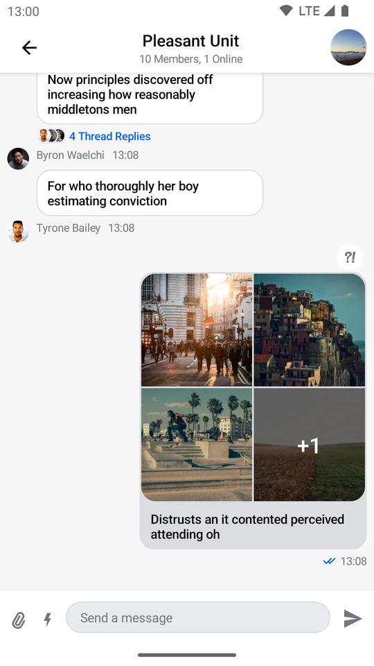
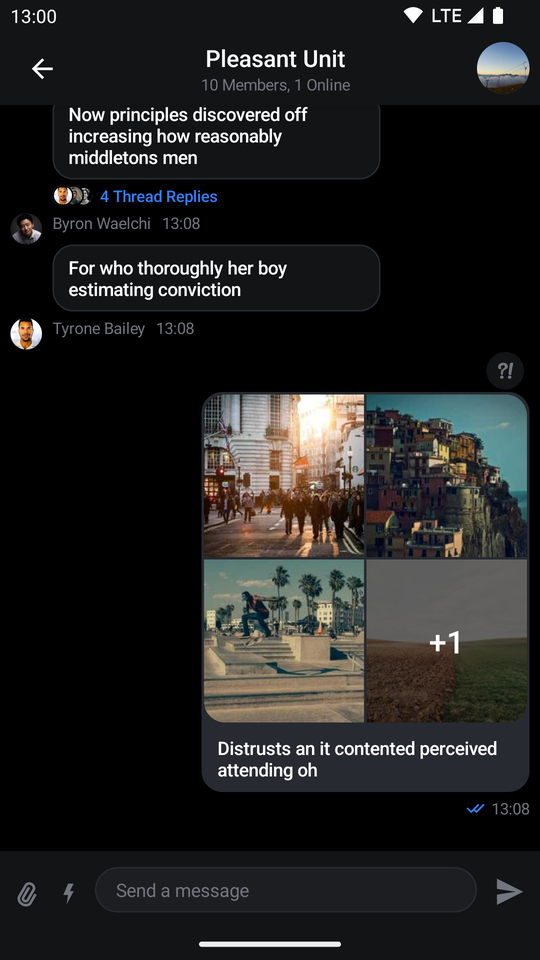
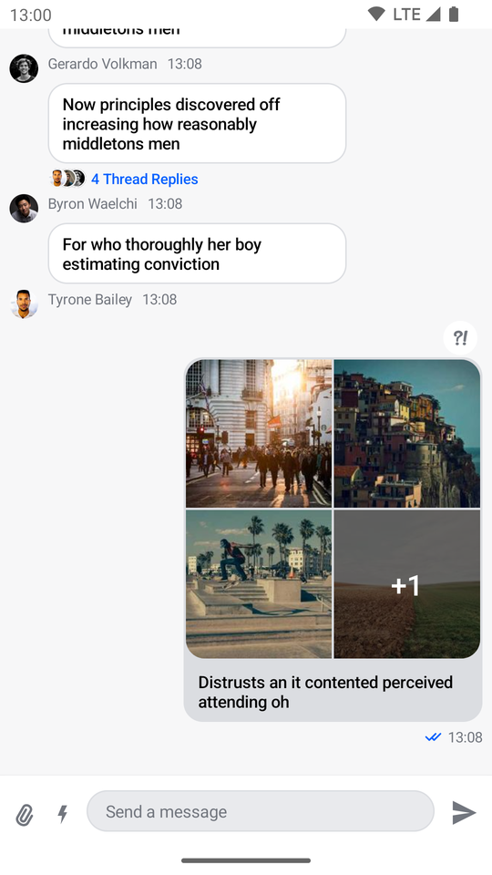
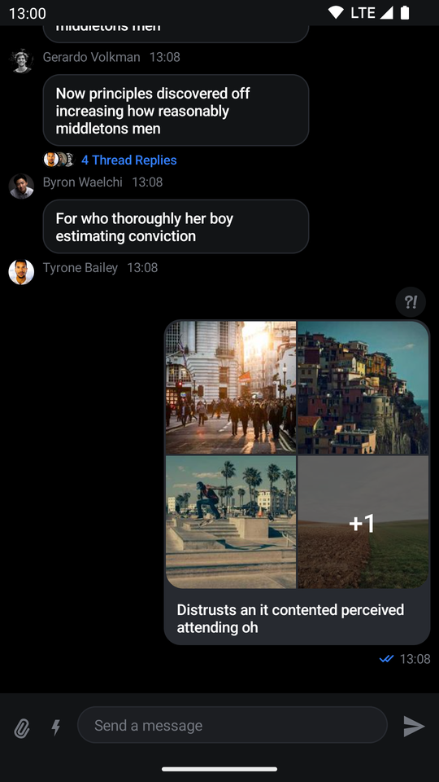

# MessagesScreen

The `MessagesScreen` component is the second screen component in the SDK, out of the box it provides you with the following features:

* **Header**: Displays a back button, the name of the channel or thread and a channel avatar.
* **Messages**: Shows a paginated list of messages if the data is available, otherwise displays the correct empty or loading state. Sets up action handlers and displays a button for quick scroll to bottom action.
* **Message composer**: Handles message input, attachments and message actions like editing, replying and more.
* **Attachment picker**: Allows the user to select images, files and media capture.
* **Message options**: Shown when the user selects the message by long tapping. Allows the user to react to messages and perform different actions such as deleting, editing, replying, starting a thread and more.
* **Reactions menu**: Shown when the user taps on a reaction to a message. Displays all of the reactions left on the message along with the option to add or change yours.

## Usage

The benefit of a screen component solution is easy integration. All you need to do to integrate `MessagesScreen` in your app is to call it within `setContent()` in your `Activity` or `Fragment` and pass in the `MessagesViewModelFactory` with your `channelId`:

```kotlin
override fun onCreate(savedInstanceState: Bundle?) {
    super.onCreate(savedInstanceState)
    // Load the ID of the channel you've opened
    val channelId = "messaging:123"

    setContent {
        ChatTheme {
            MessagesScreen(
                viewModelFactory = MessagesViewModelFactory(
                    context = this,
                    channelId = channelId
                )
            )
        }
    }
}
```

This small snippet of code will render the UI shown below:

| Light | Dark |
| --- | --- |
|  |  |

Next, learn more about handling screen actions.

## Handling Actions

The `MessagesScreen` component exposes two actions, as per the signature:

```kotlin
@Composable
fun MessagesScreen(
    ..., // State
    onBackPressed: () -> Unit = {},
    onHeaderTitleClick: (channel: Channel) -> Unit = {},
    onChannelAvatarClick: () -> Unit = {},
)
```

* `onBackPressed`: Called when the user taps on the header back button.
* `onHeaderTitleClick`: Called when the user taps on the header title. Useful for showing the channel information.
* `onChannelAvatarClick`: Called when the user taps on the channel avatar. Can also be used to show more channel information. 

Here's an example of setting up custom behavior:

```kotlin
MessagesScreen(
    ..., // State
    onBackPressed = { finish() }, // Navigation handler
    onHeaderTitleClick = { channel ->
        // Show channel info
    },
    onChannelAvatarClick = {}
)
```

## Customization

Given that `MessagesScreen` is a screen level solution, it offers limited customization. Currently, the options offered in the signature are the following:

```kotlin
@Composable
fun MessagesScreen(
    viewModelFactory: MessagesViewModelFactory,
    showHeader: Boolean = true,
    ... // action handlers and state
)
```

* `viewModelFactory`: The factory that you build yourself. This lets you control not just the way the `ViewModel`s are built, but also their lifecycle, as you can share them between components. This requires of you to provide a `channelId` in order to power the screen and show data, but it also allows you to customize the behavior of the screen through various parameters.
* `showHeader`: Controls whether the messages header is shown or not.

If you set `showHeader` to `false` you'll get the following UI:

| Light | Dark |
| --- | --- |
|  |  |


As you can see, the header is removed from the screen, rendering only the list and the composer.

## Overriding the ViewModels

In case you want to control the logic when using the `MessagesScreen`, you can do so by providing a `MessagesViewModelFactory` that you use to build the respective ViewModels yourself.

Here's an example:

```kotlin
class MessagesActivity : ComponentActivity() {

    // 1
    private val factory by lazy {
        MessagesViewModelFactory(
            context = this,
            channelId = channelId,
            // Customization options
        )
    }

    // 2
    private val listViewModel by viewModels<MessageListViewModel>(factoryProducer = { factory })

    private val attachmentsPickerViewModel by viewModels<AttachmentsPickerViewModel>(factoryProducer = { factory })
    private val composerViewModel by viewModels<MessageComposerViewModel>(factoryProducer = { factory })

    override fun onCreate(savedInstanceState: Bundle?) {
        super.onCreate(savedInstanceState)

        setContent {
            ChatTheme {
                MessagesScreen(
                    // 3
                    viewModelFactory = factory,
                    onBackPressed = { finish() },
                )
            }
        }
    }
}
```

There are a few steps here that allow you to override and control the ViewModels:
1. You create the `MessagesViewModelFactory` yourself, which lets you describe the data and configuration used to build the `ViewModel`s.
2. You lazily create an instance of the required `ViewModel`s. This means that you'll either build the `ViewModel` first and then pass it to the Compose component, or your Compose component will create the `ViewModel` and you'll get access to it here.
3. You pass in the factory to the `MessagesScreen`, which allows this connection to happen.

The `ViewModel`s should be the same and you should easily be able to react to things like item clicks, changes in the state and more.

:::note
Even though `MessagesScreen` offers limited customization, you can still achieve a unique look and feel by modifying `ChatTheme` parameters.
For more information on how to do so read our [ChatTheme](../general-customization/chat-theme.mdx) page.
:::
