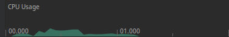
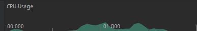
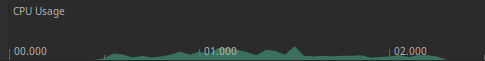
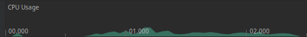

# Choosing The Correct SDK

There are many factors which contribute to deciding that a technology is appropriate for you and your team, and here at
Stream we offer two different UI SDKs.
One is UI Components which relies on the more traditional combination of XML and `View`s, and the other is Compose, which
uses Jetpack Compose.

In this guide we will present a detailed explanation of the practical differences between the two.

## Customizability

Fundamentally, Jetpack Compose was introduced to solve a few key problems in the world of Android UI:

1. State management
2. Maintainability
3. Modularity

Number three is very important for the current section as Compose allows us as SDK creators to give you, the user, much
more freedom in customizing your chat implementation and enjoy very fine grained control.

First, let's take a look into a high level overview of the differences between the two SDKs

|                                 |                                    UI Components                                     |                               Compose                                |
|:-------------------------------:|:------------------------------------------------------------------------------------:|:--------------------------------------------------------------------:|
| Main Building Blocks (no.)      |                                          5                                           |                                  5                                   |
| Secondary Building Blocks (no.) |                                         ~10                                          |                                 ~70                                  |
|      Ease of Theming            |                                     ✅   Good                                    |       ✅   Excellent. Also allows for easy runtime changes.      |
|  Runtime Customizability   |                             ✅   As a custom feature                              |                  ✅   As idiomatic Compose code                   |
|      Development Cost      | ⚠️ Noticeable   (Requires more boilerplate, more files generated or changed) | ✅ Low   (Less boilerplate, fewer files generated or changed) |
|    Stateless Components    |                                          ⛔️                                          |                                  ✅                               |
|  Extensive Layout Changes  |                                          ⛔️                                          |                                  ✅   Using slot APIs                                       |

- Main building blocks: Large elements crucial to a chat experience such as lists, headers and message input.
- Secondary building blocks: Smaller elements such as avatars, typing indicators, etc. Building Composables is a lot
  easier than building Views, this enables us to deliver a higher amount of content.
- Stateless Components: UI Components which do not hold state themselves, rather they are representations of state.
  These lead to more reliable state updates.
- Slots: APIs that let you replace a part of the UI with your own. They allow easy UI changes and the ability to decide
  which parts of the UI you want to keep original, and which you want to customize.

### Extensive Layout Changes

What do we mean by that? Put simply, it signifies the ability to re-order elements in a Composable/ View or even replace parts of a Composable/ View with your custom UI.

In the traditional View based technology, achieving this is difficult, incurs a significant maintenance cost and can lead to inefficient UI due to multiple measurement passes. The combination of slots in Compose and its firm rule to measure layouts only once allows us to give you the ability to significantly alter the UI.

Let's see that in action:

Notice how the image shows the header broken down into 3 distinct pieces?
All of these are slots which allow you to pass in your own content.

We are used to seeing small changes in XML, such as changing the background color, setting a different drawable inside an `ImageView` or so on, but Compose enables much more radical changes.

In just dozen simple lines, you can leverage Compose to re-order and customize the content of this header like so:

If you're curious about the code powering these changes, you can read more about it [here](http://localhost:3000/chat/docs/sdk/android/compose/message-components/message-list-header/#customization).

`MessageListHeader` is not the only Composable we offer that uses slots, in fact, most of our major components such as `MessageComposer`, `MessageList`, various menus, dialogs and others make extensive use of slots.
This level of customization is miles above anything we can offer you with UI Components.

### Results Conclusion

If you want a stock chat experience that works out of the box, either SDK is a good option. However, if you want a highly customizable chat, our Compose SDK is unparalleled in this regard.

Don't feel apprehensive about trying it out if your developers are not familiar with Jetpack Compose and/or if your app is written using XML and Views.
Jetpack Compose is easy to learn and is inter-operable with View based technology. The time saved by not having to write boilerplate code such as `ViewHolder`s will most likely offset the time spent on learning Jetpack Compose. On top of that, Compose code is often easier to maintain and produces fewer bugs.

## Implementation Time

Before we proceed, we have to state a small caveat: Implementation time was measured for one of our developers.
This means that it is most likely going to be slightly quicker than usual. However we have taken the time to go through both our [UI Components](https://getstream.io/tutorials/android-chat/) and [Compose](https://getstream.io/chat/compose/tutorial/) tutorials and complete the steps individually in order to make the experience as close as possible to a first time implementation.

The implementation will follow the tutorials exactly, with the result presented in the following table:

| SDK | Implementation Time |
|:---:|:-------------:|
| | |
| | |

## Performance

There are many important aspects to what makes a certain technology a good candidate for your project, and performance
is one of them.
Having that in mind we tested the building blocks of our SDK using
Google's [Macrobenchmark](https://developer.android.com/studio/profile/macrobenchmark-overview).

The tests run on fully functional chat applications connected to real life servers and are indicative of real world
performance. Each one is run multiple times in order to get more reliable metrics.

### Device information

Performance benchmarks should always be run on physical phones in order to measure real world performance.

Ours were run using the following:

| Device         | API             |
|:--------------:|:--------------:|
| Google Pixel 6 | 31 (Android 12) |

### Startup Time

These tests measure startup time for both our SDKs. In the following cases, by the time the reported time has elapsed
the app has connected to the server, logged the user in, fetched a set of channels and displayed them on-screen.

#### Cold Startup

This type of startup means that the app's process is not alive, and has to be started. Once the process has been
started the app will be launched and the Activity created.

The average time that it takes for UI Components to complete the startup procedure is 397.5ms while it takes Compose
455.5ms to do the same.
UI Components achieve around 13% better performance in this aspect.

#### Warm Startup

In this scenario the app's process is alive and a new Activity will be created and displayed in it.

On average, UI Components finish the startup procedure in 398.5ms while Compose finishes it in 476.3.
UI components hold the lead here as well at 16% faster startup time than Compose.

#### Hot Startup

Both the process and Activity exist from previous launch and are brought into foreground

UI components manage to complete the startup in an average of 400.9ms while Compose does it in 459.1ms.
The situation seen in previous startup is repeated here with UI Components achieving a 13% faster startup time.

### Channel List Scrolling UI Performance

In this scenario, the fully loaded channel list is flung to the end. Flinging is the act of a brief,
but very fast scrolling movement.
Because the movement is so fast, it is effectively a torture test for scrollable components.

All the channels in this test have titles, avatars, preview messages, timestamps and in certain cases unread messages
counts.

UI Components manage to draw all of the frames without any overrun while Compose displayed some overrun in 5% of the
frames.
Neither displayed any visible UI jank.

You can check out the CPU load graphs down below.

#### UI Components:

#### Compose:

:::note
`UiAutomator` seems to interact slightly differently with apps running Compose scrollable components. This is the reason
for the slight discrepancy in the CPU load time signatures.
:::

### Message List Scrolling UI Performance

This test uses the same act of flinging the list to the end in order to torture test it.
The channel contains mixed types of messages, including plain text messages, links, images and groups of images.

Here we see a slight reversal of fortunes. Once again both apps manage to draw the frames without any frame overrun the
vast majority of times, however they do experience some frame overrun 1% of the time with Compose performing better than
UI Components.
No UI jank was visible in either SDK.

#### UI Components:

#### Compose:

:::note
`UiAutomator` seems to interact slightly differently with apps running Compose scrollable components. This is the reason
for the slight discrepancy in the CPU load time signatures.
:::

### Memory Footprint Test

For our memory footprint test we wanted to measure how our SDKs behave in two main scenarios:

1. A baseline memory footprint where an app using our SDK has just been opened and is currently displaying a fully
   loaded channel list.

| UI SDK        | Memory Consumption |
|:-------------:|:------------------:|
| UI Components | 244 MB             |
| Compose       | 244.9 MB           |

Remarkably both apps show the same memory footprint. However, Compose does briefly achieve a larger memory footprint
before the first garbage collection event.

2. After loading many messages in a channel with rich multimedia content. Over 120 messages were loaded in memory,
   scrolled through in the UI with 35 different images loaded.

| UI SDK        | Memory Consumption |
|:-------------:|:------------------:|
| UI Components | 342.2 MB           |
| Compose       | 346.8 MB           |

The two apps show nearly identical memory footprint with the discrepancy in a few MB most likely related to garbage
collection events.

### Results Conclusion

Both SDKs are good performers with slightly different strong points. UI Components dealing with a list of channels
slightly better while Compose renders a list of messages better.
Performance wise, none of these results exclude the other.

It should be noted though that Jetpack Compose is a much more recent technology and that as such, it will certainly
receive performance improvements in the future. If you choose our Compose SDK, you should probably expect a performance
bump with every Jetpack Compose Compiler and Runtime improvement.

## SDK Size Comparison

Size constraints matter less on modern devices, however it is still a good idea to make your app as small as possible because smaller apps download faster and achieve a higher rate of successful installs.

For a side by side size comparison see the following table:

| Metric | UI Components | Compose |
|:---:|:-------------:|:-------:|
| Source Code (.aar) | 1.9 MB | 2.3 MB |
| APK Size (Downloaded) | 3.3 MB | 3.8 MB |
| APK Size (On Disk) | 7.4 MB | 8.5 MB |
| Installed App | 8 MB| 9.26 MB |

### Results Conclusion

Both SDKs pack a lot of features into a minuscule application size. You can expect minimal size overhead for a fully functional chat experience with broad multimedia support.

UI Components still lead the way here. This is because we have to include View reliant technology for certain solutions such as our media player.
As technology progresses Compose alternatives will be offered for these and we will manage to substantially reduce the size of our Compose SDK.
