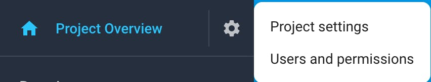
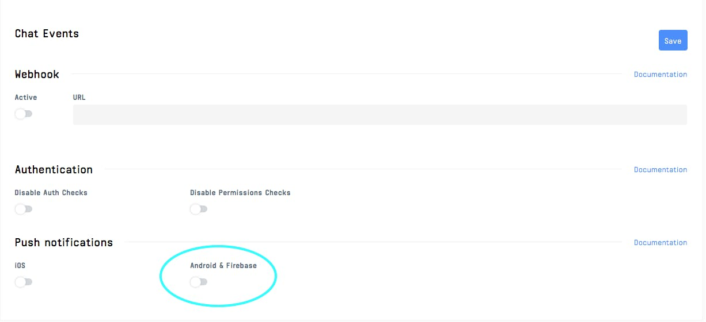
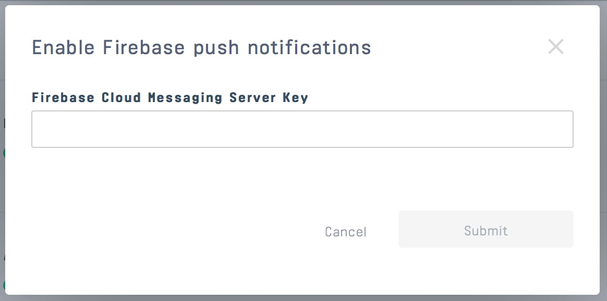
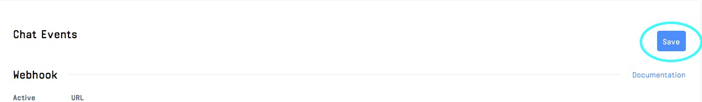

# Push Notifications

Besides [Events](https://getstream.io/chat/docs/android/event_listening/?language=kotlin), push notifications are another way to stay up to date with changes to the chat.
The user will receive a push notification if they're watching a channel but don't have an open socket connection.

## Configuring Push Notifications

The Android SDK handles push notifications by default. That includes:

1. Receiving push notification using _FirebaseMessagingService_
2. Loading required data using a _Worker_
3. Showing a notification with default actions

See [Customizing Push Notifications](#customizing-push-notifications) for customization options.

:::note
Make sure _ChatClient_ is initialized before handling push notifications. We highly recommend initializing it in the `Application` class.
:::

In order to configure push notifications on Android devices, you need to:

#### Step 1
Go to the [Firebase Console](https://console.firebase.google.com/), and select the project your app belongs to.

#### Step 2
Click on the gear icon next to _Project Overview_ and navigate to _Project settings_:


#### Step 3
Navigate to the _Cloud Messaging_ tab. Under _Project Credentials_, locate the _Server key_ and copy it:


#### Step 4
Enable _Android & Firebase_ push notifications and upload the _Server Key_ to the Chat Dashboard:



#### Step 5
Save the push notification settings changes:


:::note
Remember to add _google-services.json_ file to your project source directory. For more information take a look at [Firebase setup tutorial](https://firebase.google.com/docs/android/setup).
:::

#### Step 6
Setup the following push notification data payload at Stream Dashboard:
```json
{
  "message_id": "{{ message.id }}",
  "channel_id": "{{ channel.id }}",
  "channel_type": "{{ channel.type }}"
}
```

#### Step 7
Initialize _ChatClient_ with _NotificationConfig_:

```kotlin
val notificationsConfig = NotificationConfig(
    firebaseMessageIdKey = "message_id",
    firebaseChannelIdKey = "channel_id",
    firebaseChannelTypeKey = "channel_type",
)

ChatClient.Builder("apiKey", context)
    .notifications(ChatNotificationHandler(context, notificationsConfig))
    .build()
```

## Customizing Push Notifications

Notifications can be customized using:
* _NotificationsConfig_ - allows to customize notification's resources and meta data
* _ChatNotificationHandler_ - allows to customize default push notifications handling behaviour

### Redirecting From Notification To App

In order to redirect from notification to the specific _Activity_ in your app, you need to create custom _ChatNotificationHandler_ and override _ChatNotificationHandler#getNewMessageIntent_:

```kotlin
    val notificationHandler = MyNotificationHandler(context, notificationsConfig)

    ChatClient.Builder("{{ api_key }}", context)
                .notifications(notificationHandler)
                .build()
                
    class MyNotificationHandler(context: Context, notificationConfig: NotificationConfig) :
        ChatNotificationHandler(context, notificationConfig) {

        override fun getNewMessageIntent(
            messageId: String,
            channelType: String,
            channelId: String
        ): Intent = Intent(context, MainActivity::class.java).apply {
            putExtra(EXTRA_CHANNEL_ID, channelId)
            putExtra(EXTRA_CHANNEL_TYPE, channelType)
            putExtra(EXTRA_MESSAGE_ID, messageId)
        }

        companion object {
            const val EXTRA_CHANNEL_ID = "extra_channel_id"
            const val EXTRA_CHANNEL_TYPE = "extra_channel_type"
            const val EXTRA_MESSAGE_ID = "extra_message_id"
        }
    }
```

:::note
Consider overriding _ChatNotificationHandler#getErrorCaseIntent_ for error case notifications
:::

## Handling Push Notifications From Multiple Providers

_ChatClient_ provides following static methods that might be helpful for push notification handling:
* `ChatClient.isValidRemoteMessage` - checks if remote message can be handled by the SDK
* `ChatClient.handleRemoteMessage` - handles remote message internally
* `ChatClient.setFirebaseToken` - sets Firebase token

:::note
Each method should be called after initializing _ChatClient_
:::

Push notifications from multiple providers can be handled in two different ways:

### Using Custom _ChatNotificationHandler_

```kotlin
class CustomChatNotificationHandler(context: Context, notificationConfig: NotificationConfig) :
    ChatNotificationHandler(context, notificationConfig) {

    override fun onFirebaseMessage(message: RemoteMessage): Boolean {
        // Handle remote message and return true if message should not be handled by SDK
        return true
    }
}

ChatClient.Builder("{{ api_key }}", context)
    // Pass custom chat notification handler to ChatClient
    .notifications(CustomChatNotificationHandler(context, notificationsConfig))
    .build()
```

### Implement Custom _FirebaseMessagingService_

```kotlin
class CustomFirebaseMessagingService : FirebaseMessagingService() {

    override fun onNewToken(token: String) {
        // Update device's token on Stream backend
        try {
            ChatClient.setFirebaseToken(token)
        } catch (exception: IllegalStateException) {
            // ChatClient was not initialized
        }
    }

    override fun onMessageReceived(message: RemoteMessage) {
        try {
            // Handle RemoteMessage sent from Stream backend
            ChatClient.handleRemoteMessage(message)
        } catch (exception: IllegalStateException) {
            // ChatClient was not initialized
        }
    }
}
```

:::note
Make sure that CustomMessageFirebaseService's priority is higher than -1 to override the default service
:::
