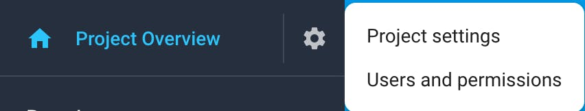
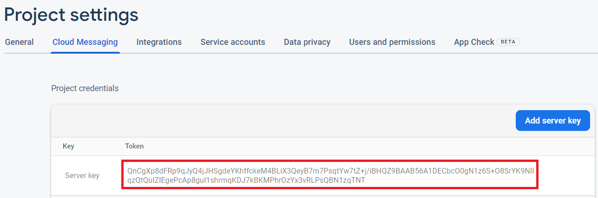
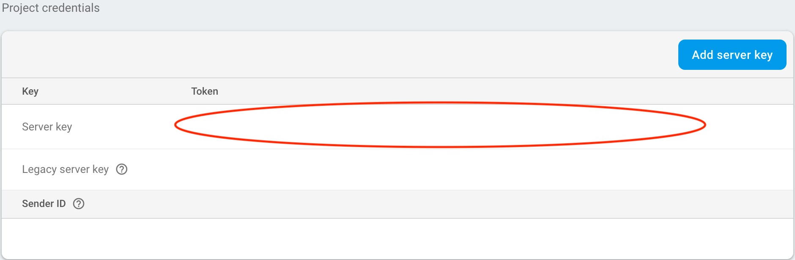
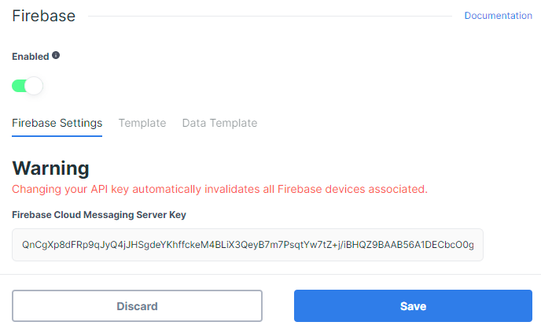

# Firebase

This page shows you how to receive Stream Chat push notifications using [Firebase Cloud Messaging](https://firebase.google.com/docs/cloud-messaging).

## Configuring Notifications on the Stream Dashboard

To be able to receive notifications from Stream, you need to provide your Firebase credentials to Stream.

Go to the [Firebase Console](https://console.firebase.google.com/), and select the project your app belongs to.

:::info
If you don't have a Firebase project yet, you'll have to create a new one.
:::

Click on the gear icon next to _Project Overview_ and navigate to _Project settings_:



Navigate to the _Cloud Messaging_ tab. Under _Project Credentials_, locate the _Server key_ and copy it:



Open the [Stream Dashboard](https://dashboard.getstream.io/). Navigate to the Chat _Overview_ page for your app.



Scroll down and enable the _Firebase_ switch. Paste your server key, and click _Save_ to confirm your changes.



That's the server-side setup done. You can now receive Stream's push notifications on the client side.

## Receiving Notifications in the Client

We provide an artifact with all the implementation needed to work with **Firebase**. To use it follow the next steps:

Start by [adding Firebase to your Android project](https://firebase.google.com/docs/cloud-messaging/android/client). You only need to set up the FCM dependencies and add a _google-services.json_ file to your project source directory.

Next, add the Stream Firebase push provider artifact to your app's `build.gradle` file:

```groovy
dependencies {
    implementation "io.getstream:stream-chat-android-pushprovider-firebase:$stream_version"
}
```

Finally, add the `FirebasePushDeviceGenerator` to your `NotificationConfig` and pass it into the `ChatClient.Builder` when you initialize the SDK:

```kotlin {2,5}
val notificationConfig = NotificationConfig(
    pushDeviceGenerators = listOf(FirebasePushDeviceGenerator())
)
ChatClient.Builder("apiKey", context)
    .notifications(ChatNotificationHandler(context, notificationsConfig))
    .build()
```

:::caution
Make sure that _ChatClient_ is always initialized before handling push notifications. We highly recommend initializing it in the `Application` class.
:::

That's all you have to do to integrate our Firebase push provider artifact!

### Using a Custom Firebase Messaging Service

The Stream Firebase push provider artifact includes an implementation of `FirebaseMessagingService` that will send new Firebase tokens and incoming push messages to the Stream SDK.

If you're also using Firebase notifications for other things in your app, you can use your own custom service instead. This should make the following calls to the `FirebaseMessagingDelegate` class:

```kotlin {6,14}
class CustomFirebaseMessagingService : FirebaseMessagingService() {

    override fun onNewToken(token: String) {
        // Update device's token on Stream backend
        try {
            FirebaseMessagingDelegate.registerFirebaseToken(token)
        } catch (exception: IllegalStateException) {
            // ChatClient was not initialized
        }
    }

    override fun onMessageReceived(message: RemoteMessage) {
        try {
            if (FirebaseMessagingDelegate.handleRemoteMessage(message)) {
                // RemoteMessage was from Stream and it is already processed
            } else {
                // RemoteMessage wasn't sent from Stream and it needs to be handled by you
            }
        } catch (IllegalStateException exception) {
            // ChatClient was not initialized
        }
    }
}
```

:::note
Make sure that your custom service has an [`<intent-filter>` priority](https://developer.android.com/guide/topics/manifest/intent-filter-element#priority) higher than `-1` to override our default service. (This priority is `0` by default.)
:::
