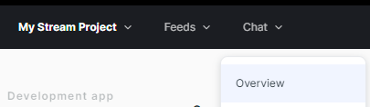
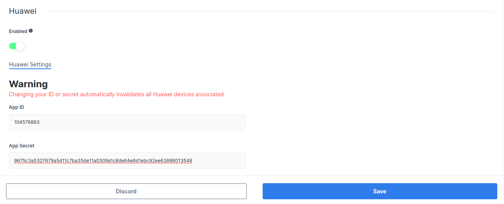

# Huawei Push Kit

This is the guide for using [Huawei Push Kit](https://developer.huawei.com/consumer/en/hms/huawei-pushkit/) to receive notifications from Stream Chat.

## Configuring Notifications on the Stream Dashboard

To be able to receive notifications from Stream, you need to provide your Huawei credentials to Stream.

Go to the [Huawei Console](https://developer.huawei.com/consumer/cn/service/josp/agc/index.html#/myProject), and select the project your app belongs to.

:::info
If you don't have a Huawei project yet, you'll have to create a new one.
:::

Click on _Project settings_ and navigate to the _General information_ tab. Under _App Information_, locate the _App ID_ and _App secret_, and copy them:


Open the [Stream Dashboard](https://dashboard.getstream.io/). Navigate to the Chat _Overview_ page for your app.



Scroll down and enable the _Huawei_ switch. Paste your _App ID_ and _App secret_, and click _Save_ to confirm your changes.



That's the server-side setup done. You can now receive Stream's push notifications on the client side.

## Receiving Notifications in the Client

Start by [adding Huawei to your Android project](https://developer.huawei.com/consumer/en/doc/development/AppGallery-connect-Guides/agc-get-started-android-0000001058210705). You only need to set up the Huawei Push Kit dependencies and add a _agconnect-services.json_ file to your project source directory.

Stream Chat's Android SDK ships an artifact that allows quick integration of Huawei Push Kit messages. Add the following dependency to your app's `build.gradle` file:

```groovy
repositories {
    maven { url 'https://developer.huawei.com/repo/' }
}

dependencies {
    implementation "io.getstream:stream-chat-android-pushprovider-huawei:$stream_version"
}
```

Then, add a `HuaweiPushDeviceGenerator` to your `NotificationConfig`, and pass that into `ChatClient.Builder` when initializing the SDK:

```kotlin {2-7,10}
val notificationConfig = NotificationConfig(
    pushDeviceGenerators = listOf(
        HuaweiPushDeviceGenerator(
            context = context,
            appId = "YOUR HUAWEI APP ID"
        )
    )
)
ChatClient.Builder("apiKey", context)
    .notifications(ChatNotificationHandler(context, notificationsConfig))
    .build()
```

:::caution
Make sure that _ChatClient_ is initialized before handling push notifications. We strongly recommend initializing it in the `Application` class.
:::

That's it! You can now receive push notifications from Huawei Push Kit!

### Using a Custom Huawei Messaging Service

The Stream Huawei push provider artifact contains a `HuaweiMessagingService` implementation that sends new Huawei tokens to Stream and forwards incoming push messages to `ChatClient` to handle.

If you're using Huawei notifications for other purposes inside your app as well, you will need your own custom service to replace this.  Here, you have to call `HuaweiMessagingDelegate`'s `registerHuaweiToken` and `handleRemoteMessage` methods, like so:

```kotlin {6,14}
class CustomHuaweiMessagingService : HuaweiMessagingService() {

    override fun onNewToken(token: String) {
        // Update device's token on Stream backend
        try {
            HuaweiMessagingDelegate.registerHuaweiToken(token)
        } catch (exception: IllegalStateException) {
            // ChatClient was not initialized
        }
    }

    override fun onMessageReceived(message: RemoteMessage) {
        try {
            if (HuaweiMessagingDelegate.handleRemoteMessage(message)) {
                // RemoteMessage was from Stream and it is already processed
            } else {
                // RemoteMessage wasn't sent from Stream and it needs to be handled by you
            }
        } catch (IllegalStateException exception) {
            // ChatClient was not initialized
        }
    }
}
```

:::note
Your custom service needs to have an [`<intent-filter>` priority](https://developer.android.com/guide/topics/manifest/intent-filter-element#priority) higher than `-1` to replace our default service. (This priority is `0` by default.)
:::
