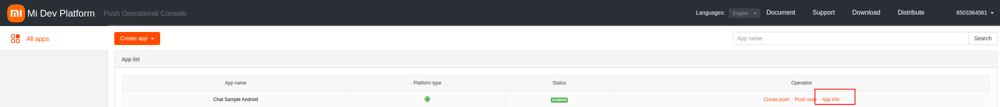
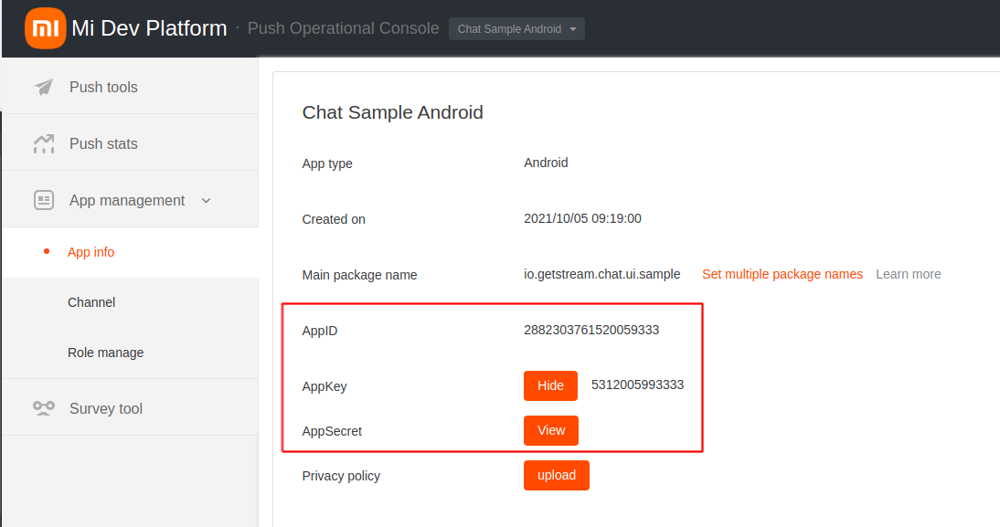
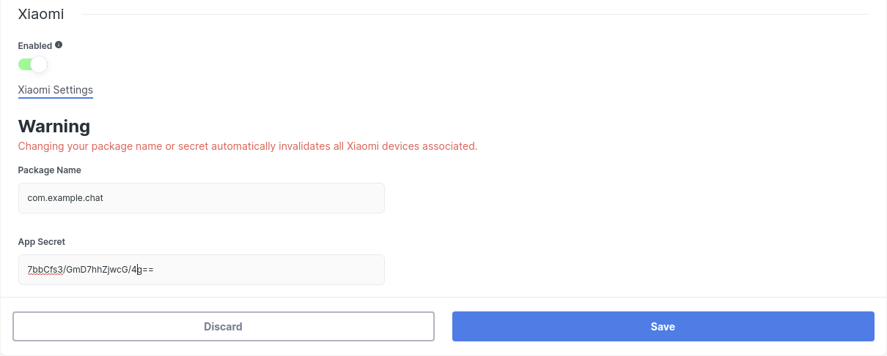
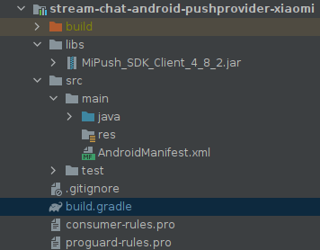

# Xiaomi Mi Push

Follow this guide to get push notifications from Stream Chat using  [Xiaomi Mi Push](http://mipush.global.xiaomi.com/).

## Setting up Notifications on the Stream Dashboard

First, to get notifications from Stream, you'll need to provide your Xiaomi app details on the Stream dashboard.

Go to the [Xiaomi Console](https://admin.xmpush.xiaomi.com/en/app/nav), and select the project your app belongs to.

:::info
Create a new Xiaomi project here if you don't have one yet.
:::

Click on **App Info** and locate the **App ID** and **App secret**, and copy them (if values are not shown, you need to click **View** button):





Open the [Stream Dashboard](https://dashboard.getstream.io/), and go to the Chat **Overview** page.


Find and select the **Xiaomi** switch. Paste your **App ID** and **App secret**, and click **Save** to confirm your changes.



That's all you need to configure on the dashboard. You can now set up the client-side integration.

## Receiving Notifications in the Client

First, [add Xiaomi to your Android project](https://dev.mi.com/console/doc/detail?pId=1244). You need to download Xiaomi Mi Push SDK and add it to your project. At the time of writing this documentation, they don't provide any Maven repository that you can use, so you need to download the .jar file manually and add it to the `libs` folder of your app, following their instructions.



```groovy
dependencies {
    implementation files('libs/MiPush_SDK_Client_4_8_2.jar')
}
```

Stream Chat for Android offers an artifact that allows easy setup of Xiaomi Mi Push. Add this dependency to your app's `build.gradle` file:

```groovy
dependencies {
    implementation "io.getstream:stream-chat-android-pushprovider-xiaomi:$stream_version"
}
```

Then, create a `XiaomiPushDeviceGenerator` and add it to the list of generators in `NotificationConfig`, which you should pass into `ChatClient.Builder` when you initialize the SDK:

```kotlin {3-7,11}
val notificationConfig = NotificationConfig(
    pushDeviceGenerators = listOf(
        XiaomiPushDeviceGenerator(
            context = context,
            appId = "YOUR XIAOMI APP ID",
            appKey = "YOUR XIAOMI APP KEY",
        )
    )
)
ChatClient.Builder("apiKey", context)
    .notifications(notificationsConfig)
    .build()
```

:::caution
You must initialize _ChatClient_ before you can process push notifications. A good way to achieve this is by creating it within the `Application` class.
:::

Your client is now set up to receive notifications from Stream using Xiaomi Mi Push.

### Using a Custom PushMessageReceiver

The Stream Xiaomi push provider artifact contains a `ChatXiaomiMessagingReceiver` implementation that sends new Xiaomi tokens to Stream and forwards incoming push messages to `ChatClient` to handle.

If you're using Xiaomi notifications for other purposes inside your app as well, you will need your own custom receiver to replace this. Here, you have to call `XiaomiMessagingDelegate`'s `registerXiaomiToken` and `handleRemoteMessage` methods, like so:

```kotlin {6,14}
class CustomPushMessageReceiver : PushMessageReceiver() {

    override fun onReceiveRegisterResult(context: Context, miPushCommandMessage: MiPushCommandMessage) {
        // Update device's token on Stream backend
        try {
            XiaomiMessagingDelegate.registerHuaweiToken(miPushCommandMessage)
        } catch (exception: IllegalStateException) {
            // ChatClient was not initialized
        }
    }

    override fun onReceivePassThroughMessage(context: Context, miPushMessage: MiPushMessage) {
        try {
            if (XiaomiMessagingDelegate.handleMiPushMessage(miPushMessage)) {
                // MiPushMessage was from Stream and it is already processed
            } else {
                // MiPushMessage wasn't sent from Stream and it needs to be handled by you
            }
        } catch (IllegalStateException exception) {
            // ChatClient was not initialized
        }
    }
}
```

:::note
Your custom receiver needs to have an [`<intent-filter>` priority](https://developer.android.com/guide/topics/manifest/intent-filter-element#priority) higher than `-1` to replace our SDK's service. (By default, this priority is `0`.)
:::
