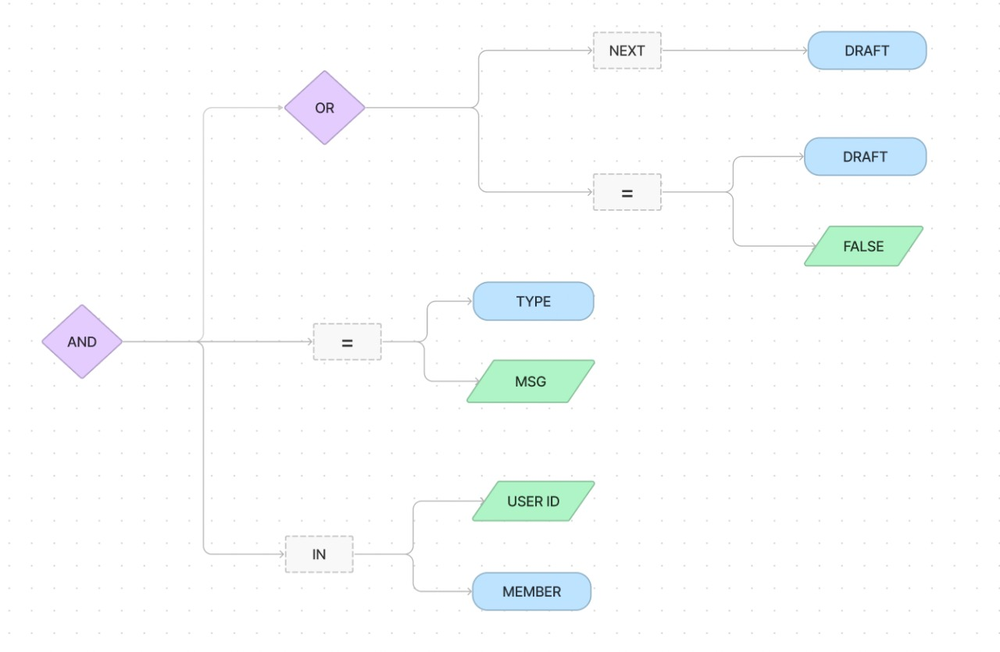

# Replace Database

In some cases, uses may want to add their own database/ORM to Stream Android SDK instead of using the default one. This can be useful to add side effects when a certain data is used to control the flow of information in a specific way, use it to debug the SDK or support an existing database that already exists in the app without adding a new one. 

There are 2 ways to replace the default offline support of the SDK. It is possible to implement your own Plugin that handles persistence in the SDK. The best way for this would be to extend `io.getstream.chat.android.client.plugin.Plugin` interface and override all the methods and substitute `io.getstream.chat.android.client.persistance.repository.factory.RepositoryFactory.Provider` providing the repository that should handle the data. Another option would be to just substitute `RepositoryFactory.Provider` inside OfflinePlugin, which we will cover in this document.

The offline support module uses Room as the ORM to handle persistence in the Stream Chat SDK, but it is possible to use a custom persistence library by injecting custom Repositories in the SDK. 

To show how to substitute Room for another ORM we elaborated a tutorial showing how to use Realm with Stream's SDK. With some modifications in the code of this tutorial, you will able to use any other database.

## Using a custom RepositoryFactoryProvider

`ChatClient.Builder` allows the user to substitute the `Repository` classes in the SDK. These classes are used by the entire SDK to access data from the database, so by changing then you will be able to use the database of your preference. You can call a `ChatClient.Builder.withRepositoryFactoryProvider` with a custom implementation of `RepositoryFactory.Provider`. This is a functional interface that only provides 
[RepositoryFactory](https://github.com/GetStream/stream-chat-android/blob/main/stream-chat-android-client/src/main/java/io/getstream/chat/android/client/persistance/repository/factory/RepositoryFactory.kt):


```
val client = ChatClient.Builder(apiKey, context)
    .withRepositoryFactoryProvider { RealmRepositoryFactory(configureRealm()) }
    .build()
    
public fun configureRealm(): Realm =
    RealmConfiguration.Builder(schema = realmSchema())
        .schemaVersion(SCHEMA_VERSION)
        .deleteRealmIfMigrationNeeded()
        .build()
        .let(Realm::open)           

private fun realmSchema(): Set<KClass<out RealmObject>> =
    setOf(
        MessageEntityRealm::class,
        ChannelEntityRealm::class,
        UserEntityRealm::class,
        QueryChannelsEntityRealm::class,
        MemberEntityRealm::class,
        ChannelUserReadEntityRealm::class,
        ReactionEntityRealm::class,
        ReactionCountEntityRealm::class,
        ReactionScoreEntityRealm::class,
        ConfigEntityRealm::class,
        CommandEntityRealm::class,
        QuerySorterInfoEntityRealm::class,
        SortSpecificationEntityRealm::class,
        SyncStateEntityRealm::class,
        AttachmentEntityRealm::class,
        UploadStateEntityRealm::class,
    )    
```

:::note
The implementation of the entities of realmSchema() will be covered later in this document.
::: 

`RepositoryFactory` is the access point for all the `Repositories` of the SDK, so they must be provided by this interface:

```kotlin 
public class RealmRepositoryFactory(private val realm: Realm) : RepositoryFactory {
    override fun createUserRepository(): UserRepository = RealmUserRepository(realm)

    override fun createChannelConfigRepository(): ChannelConfigRepository = RealmChannelConfigRepository(realm)

    override fun createQueryChannelsRepository(): QueryChannelsRepository = RealmQueryChannelsRepository(realm)

    override fun createSyncStateRepository(): SyncStateRepository = RealmSyncStateRepository(realm)

    override fun createAttachmentRepository(): AttachmentRepository = RealmAttachmentRepository(realm)

    override fun createReactionRepository(
        getUser: suspend (userId: String) -> User,
    ): ReactionRepository = RealmReactionRepository(realm)

    override fun createMessageRepository(
        getUser: suspend (userId: String) -> User,
    ): MessageRepository = RealmMessageRepository(realm)

    override fun createChannelRepository(
        getUser: suspend (userId: String) -> User,
        getMessage: suspend (messageId: String) -> Message?,
    ): ChannelRepository = RealmChannelRepository(realm)
}
```

:::caution 
All the Repositories should be provided with real implementations. Using a `Repository` that doesn't provide real data may create unpredicted states because all the repositories are connected to SDK and are essential to it. Mocking one or more repositories may prevent the SDK to work correctly.
:::

## Implementing ChannelRepository

To save to and fetch channels from Realm, it is necessary to implement a version of ChannelRepository interface that handles Realm. You can find the following implementation with some of the methods: 

```kotlin
public class RealmChannelRepository(private val realm: Realm) : ChannelRepository {
	override suspend fun clear() {
        realm.writeBlocking {
            query<ChannelEntityRealm>().find().let(this::delete)
        }
    }
    
    override suspend fun deleteChannel(cid: String) {
        val channel = realm.query<ChannelEntityRealm>("cid == '$cid'")
            .first()
            .find()

        realm.writeBlocking {
            channel?.let(::findLatest)?.let(::delete)
        }
    }
    
    override suspend fun insertChannel(channel: Channel) {
        realm.writeBlocking {
            this.copyToRealm(channel.toRealm(), updatePolicy = UpdatePolicy.ALL)
        }
    }
    
    override suspend fun selectChannelByCid(cid: String): Channel? =
        selectChannelByCidRealm(cid)?.toDomain()
    
    private fun selectChannelByCidRealm(cid: String): ChannelEntityRealm? =
        realm.query<ChannelEntityRealm>("cid == '$cid'")
            .first()
            .find()
            
    // All the other methods must be implemented, following this same approach.
}
```

This is the key of changing the database in the Stream Android SDK. All you need to do is implement the `Repository` interfaces handling the database of choice.

As you can see, in order to Realm understand how to save your data, you must create a `Scheme`. The model classes of the SDK must be represented as `Entity` classes. Those are: 

- AttachmentEntity
- ChannelEntity
- ChannelUserReadEntity
- ConfigEntity
- CommandEntity
- MemberEntity
- MessageEntity
- QueryChannelsEntity
- QuerySorterInfoEntity
- SortSpecificationEntity
- ReactionCountEntity
- ReactionEntity
- ReactionScoreEntity
- SyncStateEntity
- UploadStateEntity
- UserEntity


Most of the entities are trivial and based in the model class. All is needed is to create the class and functions to convert Entity to Model and Model to Entity. Like the following example: 

```
internal class ChannelEntityRealm : RealmObject {
    @PrimaryKey
    var cid: String = ""
    var channel_id: String = ""
    var type: String = ""
    var name: String = ""
    var image: String = ""
    var cooldown: Int = 0
    var created_by: UserEntityRealm? = null
    var frozen: Boolean = false
    var hidden: Boolean? = null
    var hide_messages_before: RealmInstant? = null
    var member_count: Int = 0
    var messages: RealmList<MessageEntityRealm> = realmListOf()
    var members: RealmList<MemberEntityRealm> = realmListOf()
    var watchers: RealmList<UserEntityRealm> = realmListOf()
    var watcher_count: Int = 0
    var last_message_at: RealmInstant? = null
    var last_message_id: String = ""
    var reads: RealmList<ChannelUserReadEntityRealm> = realmListOf()
    var created_at: RealmInstant? = null
    var updated_at: RealmInstant? = null
    var deleted_at: RealmInstant? = null
    var extra_data: MutableMap<String, Any> = mutableMapOf()
    var sync_status: Int = SyncStatus.COMPLETED.status
    var team: String = ""
    var own_capabilities: Set<String> = emptySet()
    var membership: MemberEntityRealm? = null
}

internal fun Channel.toRealm(): ChannelEntityRealm {
    val thisChannel = this
    return ChannelEntityRealm().apply {
        cid = thisChannel.cid
        type = thisChannel.type
        channel_id = thisChannel.id
        name = thisChannel.name
        image = thisChannel.image
        cooldown = thisChannel.cooldown
        created_by = thisChannel.createdBy.toRealm()
        frozen = thisChannel.frozen
        hidden = thisChannel.hidden
        hide_messages_before = thisChannel.hiddenMessagesBefore?.toRealmInstant()
        messages = thisChannel.messages.map { message -> message.toRealm() }.toRealmList()
        member_count = thisChannel.memberCount
        members = thisChannel.members.map { member -> member.toRealm() }.toRealmList()
        watchers = thisChannel.watchers.map { it.toRealm() }.toRealmList()
        watcher_count = thisChannel.watcherCount
        last_message_at = thisChannel.lastMessageAt?.toRealmInstant()
        last_message_id = thisChannel.lastMessage()?.id ?: ""
        created_at = thisChannel.createdAt?.toRealmInstant()
        updated_at = thisChannel.updatedAt?.toRealmInstant()
        deleted_at = thisChannel.deletedAt?.toRealmInstant()
        extra_data = thisChannel.extraData
        sync_status = thisChannel.syncStatus.toRealm()
        team = thisChannel.team
        own_capabilities = thisChannel.ownCapabilities
    }
}

internal fun ChannelEntityRealm.toDomain(): Channel =
    Channel(
        id = this.channel_id,
        type = this.type,
        name = this.name,
        image = this.image,
        watcherCount = this.watcher_count,
        frozen = this.frozen,
        lastMessageAt = this.last_message_at?.toDate(),
        createdAt = this.created_at?.toDate(),
        deletedAt = this.deleted_at?.toDate(),
        updatedAt = this.updated_at?.toDate(),
        syncStatus = this.sync_status.toDomain(),
        members = members.map { it.toDomain() },
        memberCount = this.member_count,
        messages = messages.map { messageEntityRealm -> messageEntityRealm.toDomain() },
        createdBy = this.created_by?.toDomain() ?: User(),
        watchers = watchers.map { watcher -> watcher.toDomain() },
        team = this.team,
        read = reads.map { readEntity -> readEntity.toDomain() },
        hidden = this.hidden,
        hiddenMessagesBefore = this.hide_messages_before?.toDate(),
        cooldown = this.cooldown,
        ownCapabilities = this.own_capabilities,
        membership = this.membership?.toDomain(),
        extraData = this.extra_data
    )

internal fun Channel.lastMessage(): Message? = messages.lastOrNull()

```

The exceptions to the Entity classes are `QueryChannelsEntityRealm` and `QuerySorterInfoEntityRealm`. 

`QueryChannelsEntityRealm` has the information about the filters used in the queries. The filters can stored as graph where each node represents a filter that may or may not be composed by one or more filters. Example: The `And` filter is composed by many other filters and the `Equals` filter is composed by two values and an operation. We discuss in detail how to store this data in a later section. 

`QuerySorterInfoEntityRealm` has the information about how the query was sorted. We can transform the classes primary values to make it easier to save the information about this class. 

## Storing QuerySorterInfoEntityRealm

First we create the base of the class to be kept inside Realm database:


```
internal class QuerySorterInfoEntityRealm : RealmObject {
    var query_specs: RealmList<SortSpecificationEntityRealm> = realmListOf()

    @PrimaryKey
    var id: Int = query_specs.hashCode()

    override fun toString(): String {
        return "[QuerySorterInfoEntityRealm] id: $id " +
            "${query_specs.joinToString { "name: ${it.sort_attribute_name} direction: ${it.sort_direction}" }}}"
    }
}
```

And the functions to parse it to entity and to the domain values.


```

@Suppress("VariableNaming")
internal class SortSpecificationEntityRealm : RealmObject {
    var sort_attribute_name: String = ""
    var sort_direction: Int = 0
}

internal fun <T : ComparableFieldProvider> QuerySorterInfoEntityRealm.toDomain(): QuerySorter<T> {
    return QuerySortParser<T>().fromSpecifications(this.query_specs.map { it.toDomain() })
}

internal fun <T : ComparableFieldProvider> QuerySorter<T>.toRealm(): QuerySorterInfoEntityRealm {
    val thisQuerySorter = this

    return QuerySorterInfoEntityRealm().apply {
        query_specs = thisQuerySorter.sortSpecifications
            .map { spec -> spec.toRealm() }
            .toRealmList()

        id = query_specs.hashCode()
    }
}

internal fun <T> SortSpecificationEntityRealm.toDomain(): SortSpecification<T> {
    return SortSpecification(
        sortAttribute = SortAttribute.FieldNameSortAttribute(this.sort_attribute_name),
        sortDirection = SortDirection.fromNumber(sort_direction),
    )
}

private fun SortSpecification<*>.toRealm(): SortSpecificationEntityRealm {
    val thisSortSpec = this

    return SortSpecificationEntityRealm().apply {
        sort_attribute_name = thisSortSpec.sortAttribute.name
        sort_direction = thisSortSpec.sortDirection.value
    }
}
```

We store only the basic information about the sorting and allow the SDK to convert between entity and model classes. The SDK provides some methods to make it easier, like `SortDirection.fromNumber(int)`.

## Storing QueryChannelsEntityRealm

To define the `QueryChannelsEntityRealm`, we define filters as a String to be parsed using `Moshi`. Filters of search should not be a very complex graph will hundreds of nodes, so keeping the filter as String should not be a problem for most cases. It is advisable to review the filter logic, if the filter becomes big. `QueryChannelsEntityRealm` can be defined in the following way:


```kotlin
internal class QueryChannelsEntityRealm : RealmObject {
    @PrimaryKey
    var id: String = ""
    var filter_as_string: String? = null
    var query_sort: QuerySorterInfoEntityRealm? = null
    var cids: RealmList<String> = realmListOf()
}
```

The conversion of `QueryChannelsEntityRealm` can be done by converting the Filter in and out to String using an adapter of `Moshi`:

```
internal fun QueryChannelsSpec.toRealm(): QueryChannelsEntityRealm {
    val thisQuery = this
    val adapter = filterNodeAdapter()

    return QueryChannelsEntityRealm().apply {
        id = generateQuerySpecId(thisQuery.filter, thisQuery.querySort)
        filter_as_string = adapter.toJson(thisQuery.filter.toFilterNode())
        query_sort = thisQuery.querySort.toRealm()
        cids = thisQuery.cids.toRealmList()
    }
}

@OptIn(ExperimentalStdlibApi::class)
private fun filterNodeAdapter() =
    Moshi.Builder()
        .addAdapter(FilterNodeAdapter())
        .build()
        .adapter(FilterNode::class.java)

internal fun generateQuerySpecId(filter: FilterObject, querySort: QuerySorter<out Channel>): String {
    return "${filter.hashCode()}-${querySort.toDto().hashCode()}"
}
```

We need to define the adapter for the serialization and de-serialization. So let's start defining the structure of our `Filters`. 

## Representing Filters as a graph

Before serializing our Filters, we should convert then into a structure that is easier reason about. Then this structure can be converted in and out to the Filters that the SDK uses.

We are going to represent the `Filters` as a graph, with `Nodes` and `Edges`.  Let's pick the following example:

```
Filters.and(
    Filters.eq("type", "messaging"),
    Filters.`in`("members", listOf("1054")),
    Filters.or(Filters.notExists("draft"), Filters.eq("draft", false)),
)
```

This filter can be represented by the following graph:



Now that we defined the structure of the composition of filters, we need to define as code our building blocks. 

Each node can be represented by the class `FilterNode`:

```
internal data class FilterNode(
    var filterType: String? = null,
    var field: String? = null,
    var value: Any? = null,
)
```

Every filter must have a type and the properties `field` and `value` and they should be populated accordingly with its type.

`Filters` that are compositions of other filters like `AND` and `OR` won't have any `field` and the value will be other `filters`. `Filters` that are an operation, like `EQUALS` should have both `field` and `value`. The `Filter` `EXISTS` only contains the value that it should look for, there isn't any value in this case. 

By converting `Filters` to `FilterNode` we have an structure that contains only one class and then we can create a serialization adapter for this class making the process of serializing and de-serializing `Filters` easy.

 
Let's create an extension function that converts a `FilterObject` to a `FilterNode`: 


``` kotlin
internal fun FilterObject.toFilterNode(): FilterNode = when (this) {
    is AndFilterObject -> createCompositeFilterNode(KEY_AND, this.filterObjects.map(FilterObject::toFilterNode))
    is OrFilterObject -> createCompositeFilterNode(KEY_OR, this.filterObjects.map(FilterObject::toFilterNode))
    is NorFilterObject -> createCompositeFilterNode(KEY_NOR, this.filterObjects.map(FilterObject::toFilterNode))
    is ExistsFilterObject -> createFilterNode(KEY_EXIST, this.fieldName, null)
    is NotExistsFilterObject -> createFilterNode(KEY_NOT_EXIST, this.fieldName, null)
    is EqualsFilterObject -> createFilterNode(KEY_EQUALS, this.fieldName, this.value)
    is NotEqualsFilterObject -> createFilterNode(KEY_NOT_EQUALS, this.fieldName, this.value)
    is ContainsFilterObject -> createFilterNode(KEY_CONTAINS, this.fieldName, this.value)
    is GreaterThanFilterObject -> createFilterNode(KEY_GREATER_THAN, this.fieldName, this.value)
    is GreaterThanOrEqualsFilterObject ->
        createFilterNode(KEY_GREATER_THAN_OR_EQUALS, this.fieldName, this.value)
    is LessThanFilterObject -> createFilterNode(KEY_LESS_THAN, this.fieldName, this.value)
    is LessThanOrEqualsFilterObject -> createFilterNode(KEY_LESS_THAN_OR_EQUALS, this.fieldName, this.value)
    is InFilterObject -> createFilterNode(KEY_IN, this.fieldName, this.values)
    is NotInFilterObject -> createFilterNode(KEY_NOT_IN, this.fieldName, this.values)
    is AutocompleteFilterObject -> createFilterNode(KEY_AUTOCOMPLETE, this.fieldName, this.value)
    is DistinctFilterObject -> createFilterNode(KEY_DISTINCT, null, null)
    is NeutralFilterObject -> createFilterNode(KEY_NEUTRAL, null, null)
}
```

As you can see. There are two types of nodes **Composite Nodes** and **Filter Nodes**. 

**Composite nodes** are nodes that point to one of more nodes, like `AND`, `OR` and `NOR` they apply a boolean logic to the results of the nodes they point to. 

**Filter nodes** are nodes that realize and operation like comparing if a field is **equal** to a value, if a field is **bigger than** a value, etc. 

Those can be created in a simple way:

```
private fun createCompositeFilterNode(filterType: String, value: Any): FilterNode =
    FilterNode(filterType = filterType).apply {
        this.value = value
    }

private fun createFilterNode(filterType: String, field: String?, value: Any?): FilterNode =
    FilterNode(filterType = filterType).apply {
        this.field = field
        this.value = value
    }
```

**Composite nodes** won't have any field, but must always contain a **value** and `Filter` nodes may contain **fields** and **values**. 

Now that we defined the function `FilterObject.toFilterNode` we already know how to convert any `FilterObject` into a composition of `FilterNodes`. Now we can serialize our nodes.

## Serializing FilterNode

Using `Moshi`, you can create a JsonAdapter to be able to serialize the `FilterNode` to a `String`.


```
internal class FilterNodeAdapter : JsonAdapter<FilterNode>() {
    override fun fromJson(reader: JsonReader): FilterNode {
	    // Let's define it later. 
    }

    override fun toJson(writer: JsonWriter, node: FilterNode?) {
        val type = node?.filterType
        val field = node?.field
        val value = node?.value

        writer.beginObject()

        type?.let { nodeType ->
            writer.name("filter_type")
            writer.value(nodeType)
        }

        field?.let { nodeField ->
            writer.name("field")
            writer.value(nodeField)
        }

        value?.let { nodeValue ->
            writer.name("value")

            when {
                isCompositeNode(type) -> {
                    writeCompositeNode(writer, nodeValue)
                }

                isMultipleValueNode(type) -> {
                    writeMultipleValueNode(writer, value)
                }

                else -> {
                    writeFilterNode(writer, nodeValue)
                }
            }
        }

        writer.endObject()
    }

    private fun isCompositeNode(nodeType: String?): Boolean =
        nodeType == KEY_AND || nodeType == KEY_OR || nodeType == KEY_NOR

    private fun isMultipleValueNode(nodeType: String?): Boolean {
        return nodeType == KEY_IN || nodeType == KEY_NOT_IN
    }

    private fun writeCompositeNode(writer: JsonWriter, nodeValue: Any) {
        writer.beginArray()
        (nodeValue as Iterable<FilterNode>).forEach { filterNode ->
            toJson(writer, filterNode)
        }
        writer.endArray()
    }

    private fun writeMultipleValueNode(writer: JsonWriter, value: Any) {
        writer.beginArray()
        (value as Iterable<String>).forEach(writer::value)
        writer.endArray()
    }

    private fun writeFilterNode(writer: JsonWriter, nodeValue: Any) {
        when (nodeValue) {
            is Boolean -> writer.value(nodeValue)
            is String -> writer.value(nodeValue)
            is Number -> writer.value(nodeValue)
            else -> throw IllegalStateException("Unsupported type of filter")
        }
    }

```

Each node should be created accordingly if it is a node made of **other nodes**, a composite node, a node with many values like `IN` and `NOT_INT` or a simple node like **EQUALS**. 


## De-serializing FilterNode
In the opposite way, it is possible to create a `FilterNode` from a `String`. 

```
override fun fromJson(reader: JsonReader): FilterNode {
    reader.beginObject()
    reader.skipName()

    val type = reader.nextString()

    reader.skipName()
    val node = when {
        (isCompositeNode(type)) -> readCompositeNode(reader, type)

        isMultipleValueNode(type) -> readMultipleNode(reader, type)

        else -> readSimpleNode(reader, type)
    }

    reader.endObject()
    return node
}

val nodeList: Set<FilterNode> = reader.readArray { this.fromJson(reader) }
    return FilterNode(filterType = type, field = null, value = nodeList)
}

private fun readMultipleNode(reader: JsonReader, type: String): FilterNode {
    val field = reader.nextString()
    reader.skipName()
    val values = reader.readArray(reader::nextString)

    return FilterNode(filterType = type, field = field, value = values)
}

private fun readSimpleNode(reader: JsonReader, type: String): FilterNode {
    val field = reader.nextString()
    var value: Any? = null
    if (reader.hasNext()) {
        reader.skipName()

        value = when (reader.peek()) {
            JsonReader.Token.STRING -> reader.nextString()
            JsonReader.Token.NUMBER -> reader.nextDouble()
            JsonReader.Token.BOOLEAN -> reader.nextBoolean()
            JsonReader.Token.NULL -> reader.nextNull()
            else -> null
        }
    }

    return FilterNode(filterType = type, field = field, value = value)
}

```

This follows the same approach of the write, but in a reverse order. 

## Conclusion
Implementing correctly all the repositories, it will be possible to change the database to Realm. Following this same approach, it is possible to change to any type of database.
