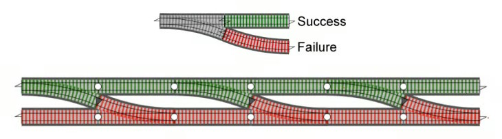

# Stream Result

The low level implementation of our Chat SDK provides multiple methods to perform actions and communicate with our server.
The implementation of those actions is almost always done by a deferred computation that is encapsulated in a class named `Call`.
This `Call` class allows you to perform the actions asynchronously by providing a `callback` or suspending the process within a coroutine.
When this `call` is completed, a `Result` object is returned. This `Result` object encapsulates the result of the `call` computation and could contain a success value if the process completed successfully or an error indicating what went wrong.

The previous implementation of those classes wasn't safe enough, due to the extra step of ensuring the result was successful before accessing the value.
Accessing the data value while `result` contains an error was allowed, producing an illegal state exception. A similar happens while accessing the error value when the result was successful.
It caused our code to become very verbose whenever a `result` needs to be handled, or when leaving the Happy/Unhappy path in our code without proper handling.

To avoid this inconvenience and rely on the Kotlin language, we are improving the implementation of those classes to ensure they are easy and safe to use.
The new implementation relies on Railway-Oriented Programming.

## What's Railway-Oriented Programming?
Railway Oriented Programming is a functional approach to handling success and errors in a normalized manner, always allowing you to predict the result.
Read [Railway Oriented Programming](https://fsharpforfunandprofit.com/rop/) if you want to learn more about ROP.


## Result

This is a basic model for representing a normalized result from business work. It appears similar to [Kotlin's Result](https://kotlinlang.org/api/latest/jvm/stdlib/kotlin/-result/), but Stream Result was designed to include more information about success and error and provide more convenient functionalities to handle results. Result is basically consists of two detailed types listed below:

- **`Result.Success`**: This represents a successful result from your business logic, which includes a `value` property of the generic type of Result.
- **`Result.Failure`**: This represents the failed result of your business result and includes a `value` property, the `Error` type.

The old way of working with `result` was by checking whether the result was successful or not and performing different actions in each case, something like:
```kotlin {2,3,6}
val result = obtainResult()
if (result.isSuccess) {
    val data = result.data()
    [...] // work with successful data
} else {
    val error = result.error()
    [...] // Notify an error happened
}
```

In the new implementation, it has been improved to allow for easier and safer usage:
```kotlin
val result = obtainResult()
result.onSuccess { data ->
    [...] // work with successful data
}.onError { error ->
    [...] // Notify an error happened
}
```

## Error

`Result.Failure` has `Error` as a value property, which contains error details of your business work. Basically, `Error` consists of three different types of errors below:

- **`Error.GenericError`**: Represents a standard type of error and only contains an error message.
- **`Error.ThrowableError`**: Represents an exceptional type of error and contains both a message and cause information.
- **`Error.NetworkError`**: Represents a network error and contains the status code, message, and cause information.

## Result Extensions

**Stream Result** provides the following useful extensions in order to effectively achieve Railway Oriented Programming in Kotlin:

### Result.then

Composes the `Result` with a given `Result` from a lambda function.

```kotlin
val result0: Result<String> = Result.Success(value = "result0")
val result1: Result<Int> = Result.Success(value = 123)
val result = result0 then { result1 }
result.onSuccess { intValue -> .. }
```

### Result.map, Result.mapSuspend

Returns a transformed `Result` by applying the given function if the `Result` contains a successful data payload.

```kotlin
val result: Result<String> = Result.Success(value = "result")
val mappedResult = result.map { 123 }
mappedResult.onSuccess { intValue -> }
```

### Result.flatMap, Result.flatMapSuspend

Returns a transformed `Result` obtained from the results of the function if the `Result` contains a successful data payload. Otherwise, returns the original `Result` if the `Result` contains an error payload.

```kotlin
val result: Result<String> = Result.Success(value = "result")
val mappedResult = result.flatMap { Result.Success(value = 123) }
mappedResult.onSuccess { intValue -> }
```

## Use Stream Result within your project
This implementation has been extracted into an open-source library that you can use in your own project without the need to depend on ChatSDK.
You can include the dependency in your project by using the following code:
```groovy {2}
dependencies {
    implementation "io.getstream:stream-result:$stream_result_version"
}
```

The source code is on [GitHub](https://github.com/GetStream/stream-result).