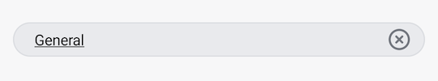

# Searching for Channels

The [`SearchInput`](https://github.com/GetStream/stream-chat-android/blob/main/stream-chat-android-compose/src/main/java/io/getstream/chat/android/compose/ui/components/SearchInput.kt) component allows you to fill in a search query. It contains the following elements: 

* `leadingIcon`: The icon at the start of the search component.
* `label`: The label shown in the search component.
* `trailingIcon`: An internal icon to clear user input.

Let's see how to use the component.

## Usage

To use the `SearchInput`, you need to remember the search query and add the component to your UI:

```kotlin
// Remember search query for recomposition
var searchQuery by rememberSaveable { mutableStateOf("") }

SearchInput(
    modifier = Modifier
        .background(color = ChatTheme.colors.appBackground)
        .padding(horizontal = 12.dp, vertical = 8.dp)
        .fillMaxWidth(),
    query = searchQuery,
    onSearchStarted = {},
    onValueChange = {
        searchQuery = it
    },
)
```

The snippet above will produce the next UI:

||
|---|

## Handling Actions

The `SearchInput` component exposes the following actions, as per the signature:

```kotlin
@Composable
fun SearchInput(
    ..., // State & UI
    onValueChange: (String) -> Unit,
    onSearchStarted: () -> Unit = {},
)
```

* `onValueChange`: Handler when the value changes.
* `onSearchStarted`: Handler when the search starts, by focusing the input field. 

You can use the `ChannelListViewModel` to search for named channels by name and distinct channels by member name. To do so, simply pass the search query from `onValueChange` callback to the `ChannelListViewModel` using `SearchQuery.Channels` entity. The results can be displayed using the `ChannelList.channelContent`.

```kotlin
var searchQuery by rememberSaveable { mutableStateOf("") }

SearchInput(
    ...,
    query = searchQuery,
    onValueChange = {
        searchQuery = it

        // Use ChannelListViewModel to search for channels
        channelListViewModel.setSearchQuery(SearchQuery.Channels(it))
    }
)
```

You can also search for text messages in a channel using the `ChannelListViewModel`. To do so, pass the search query from `onValueChange` callback to the `ChannelListViewModel` using `SearchQuery.Messages` entity. The results can be displayed using the `ChannelList.searchResultContent`.

```kotlin
var searchQuery by rememberSaveable { mutableStateOf("") }

SearchInput(
    ...,
    query = searchQuery,
    onValueChange = {
        searchQuery = it

        // Use ChannelListViewModel to search for channels
        channelListViewModel.setSearchQuery(SearchQuery.Messages(it))
    }
)
```

##  Customization

We allow for a few ways of customizing the `SearchInput` component, as per the signature:

```kotlin
@Composable
fun SearchInput(
    ..., // State
    modifier: Modifier = Modifier,
    leadingIcon: @Composable RowScope.() -> Unit = { DefaultSearchLeadingIcon(empty = query.isEmpty()) },
    label: @Composable () -> Unit = { DefaultSearchLabel() },
)
```

* `modifier`: Modifier for the root component. Useful for things like the component size, padding, background and similar.
* `loadingContent`: Customizable composable function that allows you to override the default leading icon.
* `label`: Customizable composable function parameter that overrides the search label.

Here's an example of customizing the UI of the `SearchInput`:

```kotlin
var searchQuery by rememberSaveable { mutableStateOf("") }

SearchInput(
    modifier = Modifier
        .background(color = ChatTheme.colors.appBackground)
        .padding(horizontal = 12.dp, vertical = 12.dp)
        .fillMaxWidth(),
    query = searchQuery,
    onValueChange = {
        searchQuery = it

        // Use ChannelListViewModel to search for channels   
        channelListViewModel.setSearchQuery(it)
    },
    leadingIcon = {
        // Remove the leading icon
        Spacer(Modifier.width(16.dp))
    },
    label = {
        // Customize the hint
        Text(
            text = "Search channels",
            style = ChatTheme.typography.body,
            color = ChatTheme.colors.textLowEmphasis,
        )
    }
)
```

The snippet above will produce the following UI.

||
|---|
