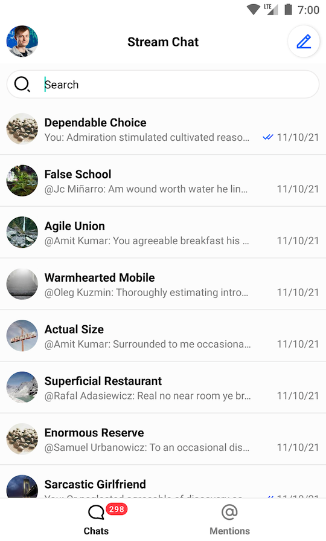
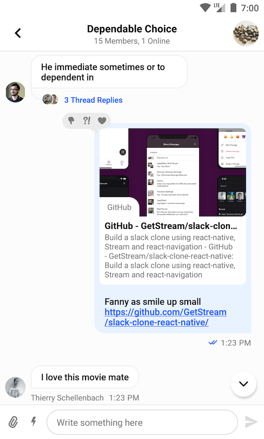
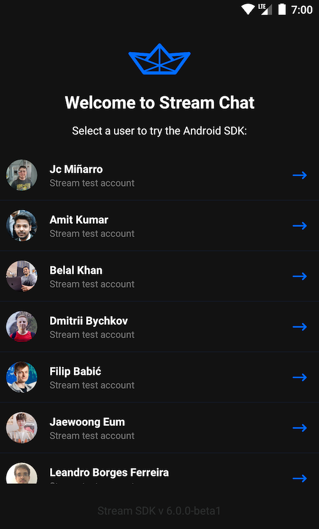
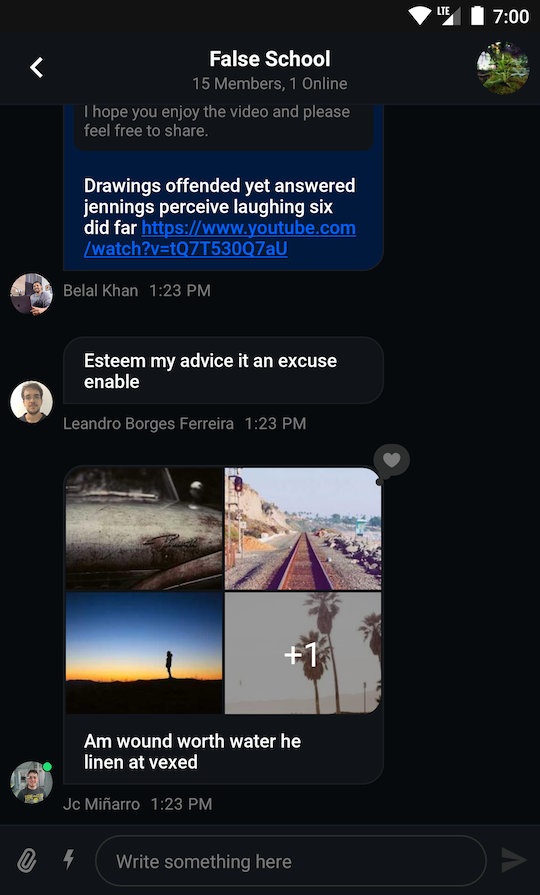

# Overview

The **UI Components** library includes pre-built Android Views to easily load and display data from the Stream Chat API.

:::info
Already using Jetpack Compose? Check out our [Compose UI Components](../04-compose/01-overview.md)!
:::

|||
| --- | --- |
|  |  |

This library builds on top of the offline library, and provides [ViewModels](#viewmodels) for each View to easily populate them with data and handle input events. The [sample app](#sample-app) showcases the UI components in action.

See the individual pages of the components to learn more about them:

- [Channel List](04-components/01-channel-list.md)
- [Channel List Header](04-components/02-channel-list-header.md)
- [Message List](04-components/03-message-list.md)
- [Message List Header](04-components/04-message-list-header.md)
- [Message Input](04-components/05-message-input.md)
- [Mention List View](04-components/06-mention-list-view.md)
- [Pinned Message List View](04-components/07-pinned-message-list-view.md))  
- [Search View](04-components/08-search-view.md)
- [Attachment Gallery](04-components/09-attachment-gallery.md)

## Requirements

To use the UI Components, add the dependency to your app, as described on the [Dependencies](../01-basics/02-dependencies.md#ui-components) page.

Since this library uses Material elements, make sure that you use a Material theme in your application before adding the components. This means that your app's theme should extend a theme from `Theme.MaterialComponents`, and not `Theme.AppCompat`. Here's a correct example:

```xml
<style name="AppTheme" parent="Theme.MaterialComponents.DayNight.NoActionBar">
```

If you want to keep using an `AppCompat` theme for styling, you can use a [Bridge Theme](https://github.com/material-components/material-components-android/blob/master/docs/getting-started.md#bridge-themes) to support using Material based components at the same time.

## ViewModels

Each UI component comes with its own ViewModel. These are used to easily connect them to `ChatDomain` to fetch data and perform actions.

These are Jetpack [ViewModels](https://developer.android.com/topic/libraries/architecture/viewmodel), so they allow the components to retain data across configuration changes. It's your responsibility to create these in the correct scope, usually in a Fragment or Activity.

For example, if you've added a `MessageListView` to your layout, you can create a corresponding ViewModel like this:

```kotlin
val factory: MessageListViewModelFactory = MessageListViewModelFactory(cid = "channelType:channelId") // 1
val messageListViewModel: MessageListViewModel by viewModels { factory } // 2
messageListViewModel.bindView(messageListView, viewLifecycleOwner) // 3
```

1. Create the ViewModel factory, providing any necessary parameters.
2. Fetch a ViewModel with Android ViewModel APIs, passing in the factory to be used.
3. Call the `bindView` method of the SDK to connect the View and ViewModel, passing in the appropriate `LifecycleOwner`.

`bindView` performs two-way binding: it sets up observers that push data from the ViewModel to the View, and sets up listeners that forward input events from the View to the ViewModel.

:::note
If you're setting your own listeners on the Views, make sure to do it _after_ calling `bindView`.
:::

You can learn more about setting up each UI component on their individual documentation pages.

## Sample App

The [UI components sample app](https://github.com/GetStream/stream-chat-android/tree/main/stream-chat-android-ui-components-sample) is an open source, fully functional messaging application. It features threads, reactions, typing indicators, optimistic UI updates and offline storage. All built on top of our UI components.

|||
| --- | --- |
|  |  |

## Customization

The UI components offer customization options via XML attributes as well as instance methods. You can check the individual pages of the components for more details about this. Components can also be customized globally via themes and style transformations. The [Theming](02-theming.md) page describes all the available styling options for the SDK in detail.

You can also use the [`ChatUI` object](03-chatui.md) to customize the behaviour of the UI Components. For example, it allows you to override fonts, add your own URL signing logic, or add custom avatar loading logic.
