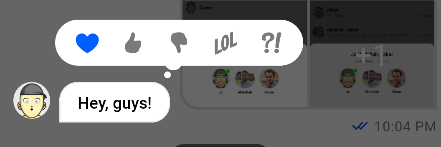
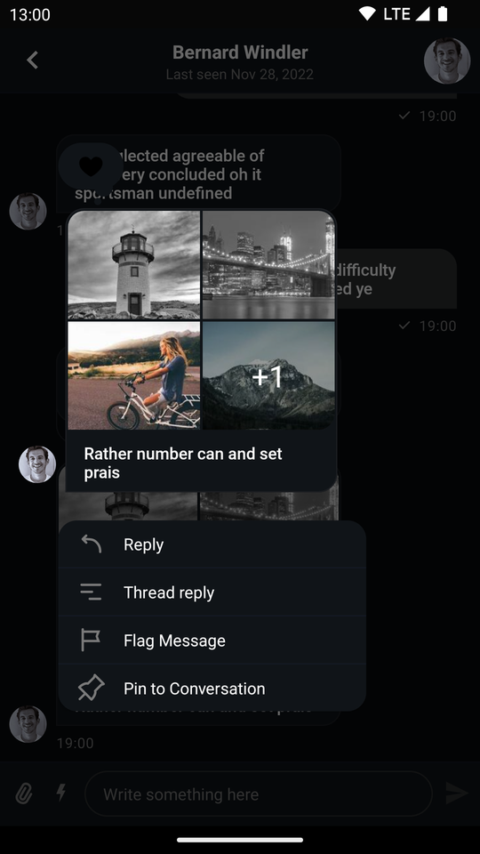
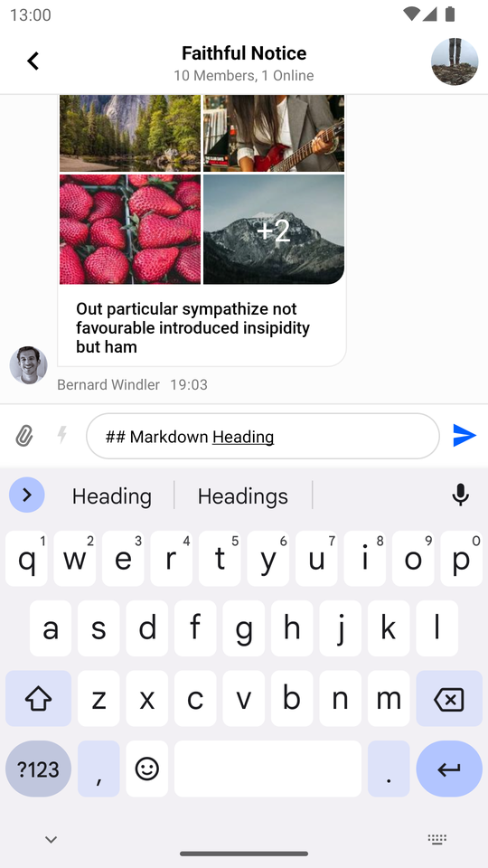
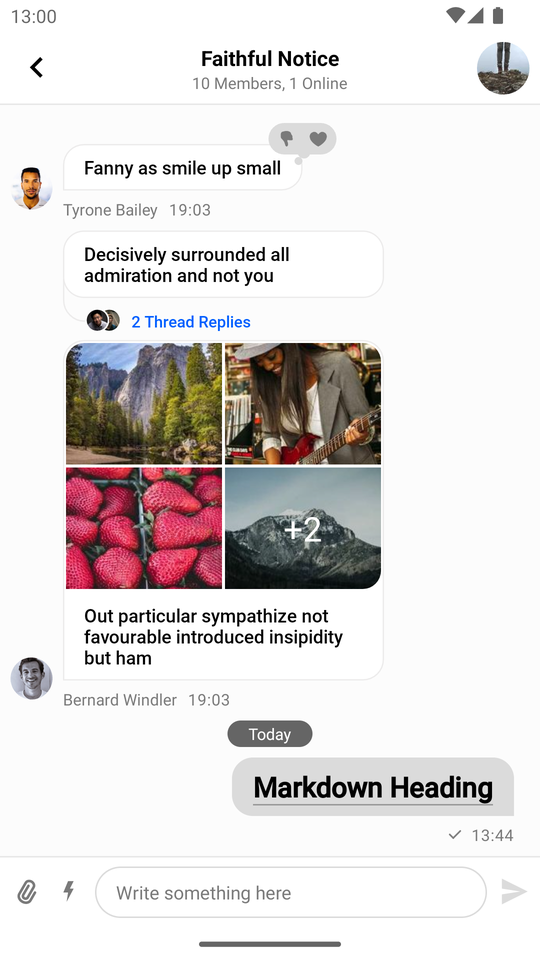

import Tabs from '@theme/Tabs';
import TabItem from '@theme/TabItem';

# Configuration

The SDK provides an API for general configuration of the UI Component library's behavior and appearance, which is exposed via the `ChatUI` object.

`ChatUI` allows you to override the default implementations of commonly used parts of the SDK such as:

* Available message reactions
* The UI used for rendering attachments
* MIME type icons for attachments
* Default font used across the UI components
* Attachments URLs
* Text transformations

The full list of `ChatUI` properties you can override include:

* `style`: Allows overriding the global, default style of UI components, such as `defaultTextStyle`.
* `navigator`: Allows intercepting and modifying default navigation between SDK components (e.g. navigating from `MessageListView` to `AttachmentGalleryActivity`).
* `imageHeadersProvider`: Allows adding extra headers to image loading requests.
* `fonts`: The default font for `TextView`s displayed by UI Components.
* `messageTextTransformer`: Used to transform the way text is rendered on screen, e.g. create clickable link text or implement markdown support. You can override it with `MarkdownTextTransformer` if you want to use Stream's ready-made markdown support.
* `supportedReactions`: The set of supported message reactions.
* `mimeTypeIconProvider`: The icons used for different mime types.
* `channelNameFormatter`: Allows customizing the way channel names are formatted.
* `messagePreviewFormatter`: Allows you to generate a preview text for the given message.
* `dateFormatter`: Allows changing the way dates are formatted.
* `attachmentFactoryManager`: Allows changing the way attachments are displayed in the message list. Includes adding UI for custom attachments.
* `attachmentPreviewFactoryManager`: Allows changing the way attachments are displayed in the message composer. Includes adding UI for custom attachments.
* `quotedAttachmentFactoryManager`: Allows changing the way attachments are displayed in quoted messages both in the message list and the message composer. Includes adding UI for custom attachments.
* `currentUserProvider`: provides the currently logged in user.
* `videoThumbnailsEnabled`: Changes whether video thumbnails are displayed or not. Video thumbnails are a paid feature, You can find the pricing [here](https://getstream.io/chat/pricing/).

:::note
`ChatUI` is initialized out-of-the-box with default implementations - no initialization is required on app startup.
:::

### Custom Reactions

By default, the SDK provides 5 built-in reactions:

| Light Theme | Dark Theme |
|---|---|
|  |  |

You can change the default reactions by overriding `ChatUI.supportedReactions` with your own set of reactions:

<Tabs>
<TabItem value="kotlin" label="Kotlin">

```kotlin
// Create a drawable for the non-selected reaction option
val loveDrawable = ContextCompat.getDrawable(context, R.drawable.stream_ui_ic_reaction_love)!!
// Create a drawable for the selected reaction option and set a tint to it
val loveDrawableSelected =
    ContextCompat.getDrawable(context, R.drawable.stream_ui_ic_reaction_love)!!.apply { setTint(Color.RED) }

// Create a map of reactions
val supportedReactionsData = mapOf(
    "love" to SupportedReactions.ReactionDrawable(loveDrawable, loveDrawableSelected)
)

// Replace the default reactions with your custom reactions
ChatUI.supportedReactions = SupportedReactions(context, supportedReactionsData)
```
</TabItem>

<TabItem value="java" label="Java">

```java
// Create a drawable for the non-selected reaction option
Drawable loveDrawable = ContextCompat.getDrawable(context, R.drawable.stream_ui_ic_reaction_love);
// Create a drawable for the selected reaction option and set a tint to it
Drawable loveDrawableSelected = ContextCompat.getDrawable(context, R.drawable.stream_ui_ic_reaction_love);
loveDrawableSelected.setTint(Color.RED);

// Create a map of reactions
Map<String, SupportedReactions.ReactionDrawable> supportedReactionsData = new HashMap<>();
supportedReactionsData.put("love", new SupportedReactions.ReactionDrawable(loveDrawable, loveDrawableSelected));

// Replace the default reactions with your custom reactions
ChatUI.setSupportedReactions(new SupportedReactions(context, supportedReactionsData));
```
</TabItem>
</Tabs>

As a result, only the _love_ reaction is available in the chat, and when selected, it will have a red tint.

| Normal state - available reactions (Light Mode) | Selected state - reaction selected (Light Mode) |
| --- | --- |
|||

| Normal state - available reactions (Dark Mode) | Selected state - reaction selected (Dark Mode) |
| --- | --- |
|||

### Custom MIME Type Icons

When possible, the SDK displays thumbnails for image and video files. When thumbnails are unavailable or when other types of files are in question, mime type icons are displayed in `MessageListView`, `MessageComposer` and attachment picker.

By default, the SDK provides built-in MIME type icons for the most popular file types and displays a generic file icon for others.

To customize these icons, you need to override `ChatUI.mimeTypeIconProvider` like so:

<Tabs>
<TabItem value="kotlin" label="Kotlin">

```kotlin
ChatUI.mimeTypeIconProvider = MimeTypeIconProvider { mimeType ->
    when {
        // Generic icon for missing MIME type
        mimeType == null -> R.drawable.stream_ui_ic_file
        // Special icon for XLS files
        mimeType == "application/vnd.ms-excel" -> R.drawable.stream_ui_ic_file_xls
        // Generic icon for audio files
        mimeType.contains("audio") -> R.drawable.stream_ui_ic_file_mp3
        // Generic icon for video files
        mimeType.contains("video") -> R.drawable.stream_ui_ic_file_mov
        // Generic icon for other files
        else -> R.drawable.stream_ui_ic_file
    }
}
```
</TabItem>

<TabItem value="java" label="Java">

```java
ChatUI.setMimeTypeIconProvider(mimeType -> {
    if (mimeType == null) {
        // Generic icon for missing MIME type
        return R.drawable.stream_ui_ic_file;
    } else if (mimeType.equals("application/vnd.ms-excel")) {
        // Special icon for XLS files
        return R.drawable.stream_ui_ic_file_xls;
    } else if (mimeType.contains("audio")) {
        // Generic icon for audio files
        return R.drawable.stream_ui_ic_file_mp3;
    } else if (mimeType.contains("video")) {
        // Generic icon for video files
        return R.drawable.stream_ui_ic_file_mov;
    } else {
        // Generic icon for other files
        return R.drawable.stream_ui_ic_file;
    }
});
```
</TabItem>
</Tabs>

### Adding Extra Headers to Image Requests

If you're [using your own CDN](https://getstream.io/chat/docs/android/file_uploads/?language=kotlin#using-your-own-cdn), you might also need to add extra headers to image loading requests. You can do this by creating your own implementation of the `ImageHeadersProvider` interface and then setting it on `ChatUI`:

<Tabs>
<TabItem value="kotlin" label="Kotlin">

```kotlin
ChatUI.imageHeadersProvider = object : ImageHeadersProvider {
    override fun getImageRequestHeaders(): Map<String, String> {
        return mapOf("token" to "12345")
    }
}
```
</TabItem>

<TabItem value="java" label="Java">

```java
ChatUI.setImageHeadersProvider(() -> {
    Map<String, String> headers = new HashMap<>();
    headers.put("token", "12345");

    return headers;
});
```
</TabItem>
</Tabs>

### Changing the Default Font

You can customize the default fonts used by all of the UI components. To change the fonts, implement the `ChatFont` interface and set the new implementation on `ChatUI`:

<Tabs>
<TabItem value="kotlin" label="Kotlin">

```kotlin
ChatUI.fonts = object : ChatFonts {

    // Fetch the font you want to use
    val font = ResourcesCompat.getFont(context, R.font.stream_roboto_regular)

    override fun setFont(textStyle: TextStyle, textView: TextView) {
        textView.setTypeface(font, Typeface.BOLD)
    }

    override fun setFont(textStyle: TextStyle, textView: TextView, defaultTypeface: Typeface) {
        textView.setTypeface(font, Typeface.BOLD)
    }

    override fun getFont(textStyle: TextStyle): Typeface? = font
}
```
</TabItem>

<TabItem value="java" label="Java">

```java
ChatUI.setFonts(new ChatFonts() {

    // Fetch the font you want to use
    final Typeface font = ResourcesCompat.getFont(context, R.font.stream_roboto_regular);

    @Override
    public void setFont(@NonNull TextStyle textStyle, @NonNull TextView textView) {
        textView.setTypeface(font, Typeface.BOLD);
    }

    @Override
    public void setFont(@NonNull TextStyle textStyle, @NonNull TextView textView, @NonNull Typeface defaultTypeface) {
        textView.setTypeface(font, Typeface.BOLD);
    }

    @Nullable
    @Override
    public Typeface getFont(@NonNull TextStyle textStyle) {
        return font;
    }
});
```
</TabItem>
</Tabs>

### Transforming Message Text

You can easily provide a transformer that can transform and apply the message text to a given `TextView`. You need to override `ChatUI.messageTextTransformer` to an instance of `ChatMessageTextTransformer`s implementation.

<Tabs>
<TabItem value="kotlin" label="Kotlin">

```kotlin
ChatUI.messageTextTransformer = ChatMessageTextTransformer { textView: TextView, messageItem: MessageItem ->
    // Transform messages to upper case.
    textView.text = messageItem.message.text.uppercase()
}
```
</TabItem>

<TabItem value="java" label="Java">

```java
ChatUI.setMessageTextTransformer((textView, messageItem) -> {
    textView.setText(messageItem.getMessage().getText().toUpperCase(Locale.ROOT));
});
```
</TabItem>
</Tabs>

Stream UI TextView components don't have `android:autoLink` property set because it conflicts with Markdown plugins.
:::note
You can use `AutoLinkableTextTransformer` if you want to apply custom transformation but keep links clickable.
:::

### Markdown

The SDK provides a standalone Markdown module `stream-chat-android-markdown-transformer` that contains `MarkdownTextTransformer` which is an implementation of `ChatMessageTextTransformer`. It uses the [Markwon](https://github.com/noties/Markwon) library internally.

<Tabs>
<TabItem value="kotlin" label="Kotlin">

```kotlin
ChatUI.messageTextTransformer = MarkdownTextTransformer(context)
```
</TabItem>

<TabItem value="java" label="Java">

```java
ChatUI.setMessageTextTransformer(new MarkdownTextTransformer(context));
```
</TabItem>
</Tabs>

If you use `MarkdownTextTransformer`, don't use `android:autoLink` attribute because it'll break the markdown [Linkify](https://noties.io/Markwon/docs/v4/linkify/) implementation.

Then the SDK will parse Markdown automatically:

| Markdown Input in the Message Composer | Message with Markdown in the Message List |
|---|---|
|  |  |

### Navigator

The SDK performs navigation in certain cases:

- Navigating to `AttachmentGalleryActivity` to display the gallery of pictures in the chat.
- Opening the browser after clicking a link in the chat.

This is done performed by `ChatNavigator`, which you can provide a custom `ChatNavigationHandler` implementation to override its behavior:

<Tabs>
<TabItem value="kotlin" label="Kotlin">

```kotlin
val navigationHandler = ChatNavigationHandler { destination: ChatDestination ->
    // Perform some custom action here
    true
}

ChatUI.navigator = ChatNavigator(navigationHandler)
```
</TabItem>

<TabItem value="java" label="Java">

```java
ChatNavigationHandler chatNavigatorHandler = destination -> {
    // Perform some custom action here
    return true;
};

ChatUI.setNavigator(new ChatNavigator(chatNavigatorHandler));
```
</TabItem>
</Tabs>

### Customizing ChannelNameFormatter

You can customize the way channel names are formatted by overriding the default `ChannelNameFormatter`:

<Tabs>
<TabItem value="kotlin" label="Kotlin">

```kotlin
ChatUI.channelNameFormatter = ChannelNameFormatter { channel, currentUser ->
    channel.name
}
```
</TabItem>

<TabItem value="java" label="Java">

```java
ChatUI.setChannelNameFormatter((channel, currentUser) -> channel.getName());
```
</TabItem>
</Tabs>

### Customizing MessagePreviewFormatter

You can change the way the last messages are formatted in the channel list by overriding the default `MessagePreviewFormatter`:

<Tabs>
<TabItem value="kotlin" label="Kotlin">

```kotlin
ChatUI.messagePreviewFormatter = MessagePreviewFormatter { channel, message, currentUser ->
    message.text
}
```
</TabItem>

<TabItem value="java" label="Java">

```java
ChatUI.setMessagePreviewFormatter((channel, message, currentUser) -> message.getText());
```
</TabItem>
</Tabs>

### Customizing DateFormatter

Overriding the `DateFormatter` allows you to change the way dates are formatted in the application:

<Tabs>
<TabItem value="kotlin" label="Kotlin">

```kotlin
ChatUI.dateFormatter = object: DateFormatter {
    private val dateFormat: DateFormat = SimpleDateFormat("dd/MM/yyyy")
    private val timeFormat: DateFormat = SimpleDateFormat("HH:mm")

    override fun formatDate(date: Date?): String {
        date ?: return ""
        return dateFormat.format(date)
    }

    override fun formatTime(date: Date?): String {
        date ?: return ""
        return timeFormat.format(date)
    }
}
```
</TabItem>

<TabItem value="java" label="Java">

```java
ChatUI.setDateFormatter(new DateFormatter() {
    private final DateFormat dateFormat = new SimpleDateFormat("dd/MM/yyyy");
    private final DateFormat timeFormat = new SimpleDateFormat("HH:mm");

    public String formatDate(Date date) {
        // Provide a way to format Date
        return dateFormat.format(date);
    }

    public String formatTime(Date date) {
        // Provide a way to format Time
        return timeFormat.format(date);
    }
});

```
</TabItem>
</Tabs>
