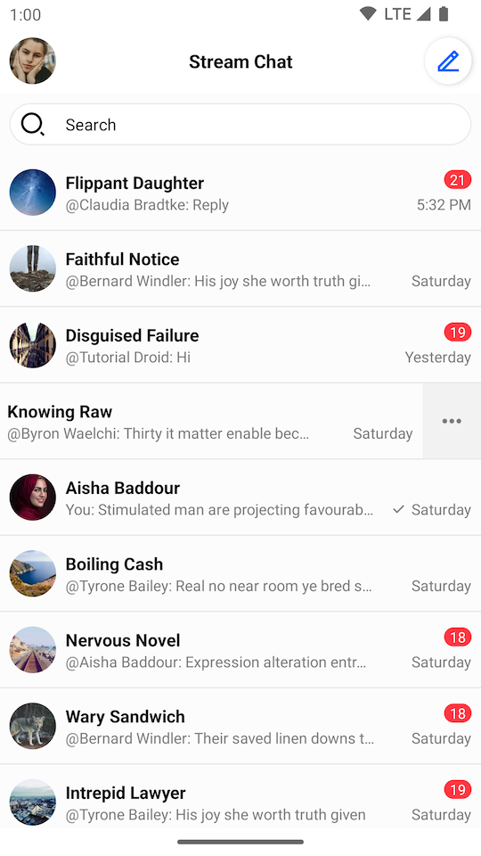
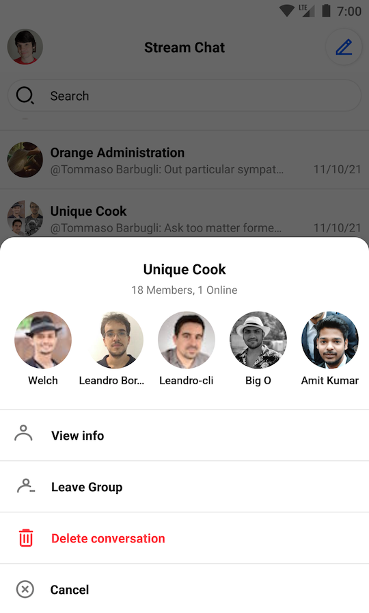
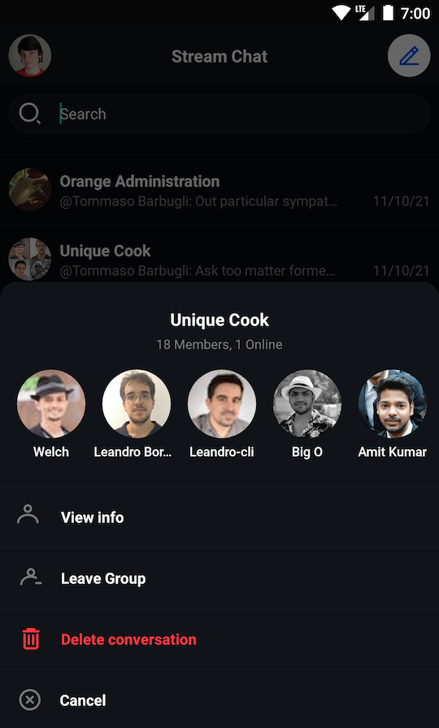
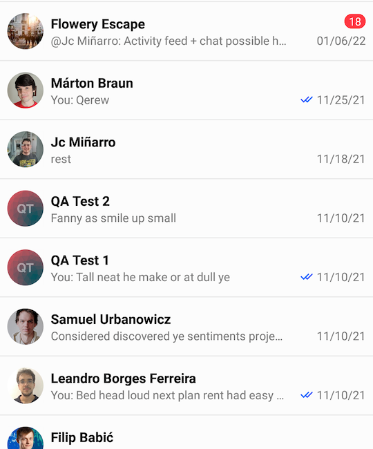
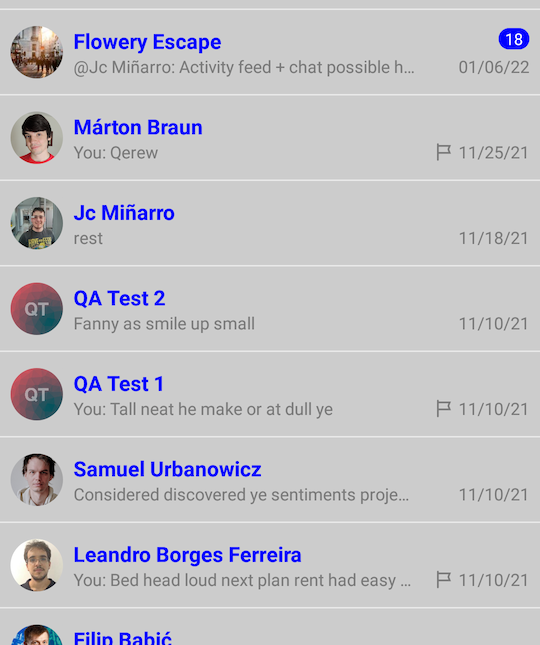
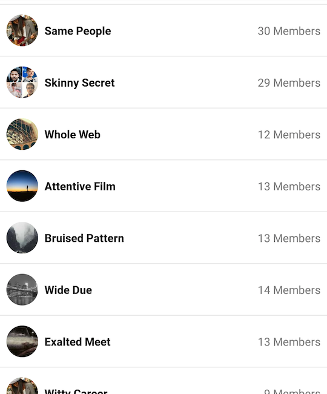
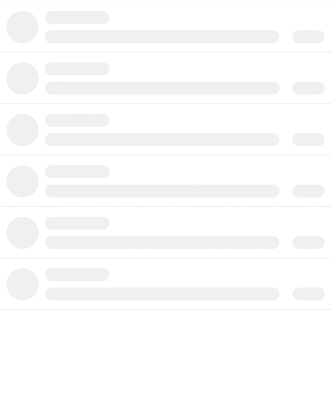

# Channel List

<!-- TODO: Import whatever makes sense to import from https://getstream.io/chat/docs/android/channel_list_view/?language=kotlin -->

## Overview

`ChannelListView` is a component responsible for displaying list of channels. It also supports loading and empty states displaying. 
By default, a single list item shows the channel name, user's read state, last message, and the time of the last message. 
It also implements swiping behaviour which allows handling different actions on the channel. This is what `ChannelListView` looks like: 



## Usage

To use `ChannelListView` in your layout include it in your XML layout as shown below:
```XML
<io.getstream.chat.android.ui.channel.list.ChannelListView 
    android:id="@+id/channelsView" 
    android:layout_width="match_parent" 
    android:layout_height="match_parent" />
```

In order to get the actual list of data from Stream API and render it to the screen using `ChannelListView` we recommend using `ChannelListViewModel` provided by the SDK.
The basic setup of the view model and connecting it to the view is done the following way:
```kotlin 
// 1. Instantiate the view model 
val viewModel: ChannelListViewModel by viewModels { 
    ChannelListViewModelFactory( 
        filter = Filters.and( 
            Filters.eq("type", "messaging"), 
            Filters.`in`("members", listOf(ChatDomain.instance().currentUser.id)), 
        ), 
        sort = ChannelListViewModel.DEFAULT_SORT, 
        limit = 30, 
    ) 
} 
// 2. Bind it with ChannelListView 
viewModel.bindView(channelListView, viewLifecycleOwner) 
```
All the logic of subscribing to data emitted by view model is provided by the `ChannelListViewModel::bindView` function. Other than channel data loading, the view model is also handling actions like channel deleting, leaving a group conversation by default.

## Handling Actions

`ChannelListView` comes with a set of channel actions out of the box. Actions on `ChannelListView` items are available on swipe. You can:
* Delete the channel if you have sufficient permissions
* See channel members
* Leave the channel if it's a group channel

| Light Mode | Dark Mode |
| --- | --- |
|||

The following actions that are not implemented out of the box:

```kotlin
channelListView.setChannelItemClickListener { channel ->
    // Handle Channel Click
}
channelListView.setChannelInfoClickListener { channel ->
    // Handle Channel Info Click
}
channelListView.setUserClickListener { user ->
    // Handle Member Click
}
``` 

The full list of available listeners is available [here](https://getstream.github.io/stream-chat-android/stream-chat-android-ui-components/stream-chat-android-ui-components/io.getstream.chat.android.ui.channel.list/-channel-list-view/index.html).

## Customization

There are multiple ways of customizing appearance `ChannelListView`. It can be achieved using XML attributes, and in runtime calling `ChannelListView` setter functions directly or using the `TransformStyle` API. 

### Customization with XML attributes
There are multiple XML attributes that can be used to customize the appearance of the channel list. The most useful ones include:
* `app:streamUiChannelDeleteEnabled` Specifying if the delete icon should be displayed.
* `app:streamUiChannelDeleteIcon` A drawable reference for channel delete icon.
* `app:streamUiChannelTitleTextColor` Color of channel title text.
* `app:streamUiChannelTitleTextSize` Size of channel title text.
* `app:streamUiChannelTitleFontAssets` Font assets reference for title font customization.
* `app:streamUiChannelTitleTextFont` A font name for channel title.
* `app:streamUiLastMessageTextSize` Size of last message text.
* `app:streamUiLastMessageTextColor` Color of last message text.
* `app:streamUiForegroundLayoutColor` A foreground color of channel list item.
* `app:streamUiBackgroundLayoutColor` A background color of channel list item, visible when swiping the list item.


The full list of available XML attributes is available under `ChannelListView` styleable [resource](https://github.com/GetStream/stream-chat-android/blob/main/stream-chat-android-ui-components/src/main/res/values/attrs_channel_list_view.xml).

### Customization at Runtime

<!-- TODO: Review this example, possibly remove it. -->

Let's make an example and modify _ChannelListViewStyle_ programmatically. We want to change the title text appearance, some default icons, and colors, and disable some options:

| Before | After |
| --- | --- |
|||

In order to achieve such effect we need to provide custom _TransformStyle.channelListStyleTransformer_:
```kotlin
TransformStyle.channelListStyleTransformer = StyleTransformer { defaultStyle ->
    defaultStyle.copy(
        optionsEnabled = false,
        foregroundLayoutColor = Color.LTGRAY,
        indicatorReadIcon = ContextCompat.getDrawable(requireContext(), R.drawable.stream_ui_ic_clock)!!,
        channelTitleText = TextStyle(
            color = Color.WHITE,
            size = resources.getDimensionPixelSize(R.dimen.stream_ui_text_large),
        ),
        lastMessageText = TextStyle(
            size = resources.getDimensionPixelSize(R.dimen.stream_ui_text_small),
        ),
        unreadMessageCounterBackgroundColor = Color.BLUE,
    )
}
```
:::note
The transformer should be set before the view is rendered to make sure that the new style was applied.
:::

## Creating a Custom ViewHolder Factory

`ChannelListView` provides a mechanism for completely changing the default view holders, as well as introducing different types of views. All you need to do is to provide your own `ChannelListItemViewHolderFactory`. Let's make an example that displays the channel's photo, name, and member count:



In order to achieve such effect, we need to do the following steps. We are going to use _View Binding_ to simplify things:

1. Create `custom_channel_list_item.xml` layout:

```xml
<?xml version="1.0" encoding="utf-8"?>
<androidx.constraintlayout.widget.ConstraintLayout xmlns:android="http://schemas.android.com/apk/res/android"
    xmlns:app="http://schemas.android.com/apk/res-auto"
    android:layout_width="match_parent"
    android:layout_height="64dp"
    >

    <io.getstream.chat.android.ui.avatar.AvatarView
        android:id="@+id/avatarView"
        style="@style/StreamUiChannelListAvatarStyle"
        android:layout_marginVertical="12dp"
        android:layout_marginStart="8dp"
        app:layout_constraintBottom_toBottomOf="parent"
        app:layout_constraintStart_toStartOf="parent"
        app:layout_constraintTop_toTopOf="parent"
        />

    <TextView
        android:id="@+id/nameTextView"
        android:layout_width="wrap_content"
        android:layout_height="wrap_content"
        android:layout_marginStart="8dp"
        android:ellipsize="end"
        android:singleLine="true"
        android:textAppearance="@style/StreamUiTextAppearance.BodyBold"
        app:layout_constraintBottom_toBottomOf="parent"
        app:layout_constraintEnd_toStartOf="@id/membersCountTextView"
        app:layout_constraintHorizontal_chainStyle="spread_inside"
        app:layout_constraintStart_toEndOf="@+id/avatarView"
        app:layout_constraintTop_toTopOf="parent"
        />

    <TextView
        android:id="@+id/membersCountTextView"
        android:layout_width="wrap_content"
        android:layout_height="wrap_content"
        android:layout_marginHorizontal="8dp"
        android:textAllCaps="false"
        android:textColor="#7A7A7A"
        android:textSize="14sp"
        android:textStyle="normal"
        app:layout_constraintBottom_toBottomOf="parent"
        app:layout_constraintEnd_toEndOf="parent"
        app:layout_constraintStart_toEndOf="@id/nameTextView"
        app:layout_constraintTop_toTopOf="parent"
        />

</androidx.constraintlayout.widget.ConstraintLayout>
```

2. Add _plurals_ entry to `strings.xml`

```xml
    <plurals name="members_count">
        <item quantity="one">%1d Member</item>
        <item quantity="other">%1d Members</item>
    </plurals>
```

3. Create custom view holder and view holder factory

```kotlin
    class CustomChannelListItemViewHolderFactory : ChannelListItemViewHolderFactory() {
        override fun createChannelViewHolder(parentView: ViewGroup): BaseChannelListItemViewHolder {
            return CustomChannelViewHolder(parentView, listenerContainer.channelClickListener)
        }
    }

    class CustomChannelViewHolder(
        parent: ViewGroup,
        private val channelClickListener: ChannelListView.ChannelClickListener,
        private val binding: CustomChannelListItemBinding = CustomChannelListItemBinding.inflate(
            LayoutInflater.from(parent.context),
            parent,
            false
        ),
    ) : BaseChannelListItemViewHolder(binding.root) {

        private lateinit var channel: Channel

        init {
            binding.root.setOnClickListener { channelClickListener.onClick(channel) }
        }

        override fun bind(channel: Channel, diff: ChannelListPayloadDiff) {
            this.channel = channel

            binding.apply {
                avatarView.setChannelData(channel)
                nameTextView.text = channel.getDisplayName(itemView.context)
                membersCountTextView.text = itemView.context.resources.getQuantityString(
                    R.plurals.members_count,
                    channel.members.size,
                    channel.members.size
                )
            }
        }
    }
```

4. Set custom view holder factory

```kotlin
channelListView.setViewHolderFactory(CustomChannelListItemViewHolderFactory())
```

## Creating a Custom Loading View

Custom loading view can be set using `ChannelListView::setLoadingView` method.

Let's see an example of `ChannelListView` that will have a custom loading view with a shimmer effect:

<!-- TODO: Actually show shimmer effect here in the screenshots. -->



Assuming that we have the setup similar to previous steps, we have to do the following steps:
1. Add Shimmer dependency
```groovy
implementation "com.facebook.shimmer:shimmer:0.5.0"
```
2. Add `shape_shimmer.xml` into _drawable_ folder:
```xml
<?xml version="1.0" encoding="utf-8"?>
<shape xmlns:android="http://schemas.android.com/apk/res/android"
    android:shape="rectangle"
    >
    <solid android:color="#CCCCCC" />
    <corners android:radius="20dp" />
</shape>
```
3. Add a single row layout - `item_loading_view.xml` into _layout_ folder:
```xml
<?xml version="1.0" encoding="utf-8"?>
<androidx.constraintlayout.widget.ConstraintLayout xmlns:android="http://schemas.android.com/apk/res/android"
    xmlns:app="http://schemas.android.com/apk/res-auto"
    android:layout_width="match_parent"
    android:layout_height="64dp"
    >

    <View
        android:id="@+id/avatarPlaceholder"
        android:layout_width="40dp"
        android:layout_height="40dp"
        android:layout_marginStart="8dp"
        android:background="@drawable/shape_shimmer"
        app:layout_constraintBottom_toBottomOf="parent"
        app:layout_constraintStart_toStartOf="parent"
        app:layout_constraintTop_toTopOf="parent"
        />

    <View
        android:id="@+id/titlePlaceholder"
        android:layout_width="80dp"
        android:layout_height="16dp"
        android:layout_gravity="center"
        android:layout_marginStart="8dp"
        android:layout_marginEnd="8dp"
        android:background="@drawable/shape_shimmer"
        app:layout_constraintStart_toEndOf="@id/avatarPlaceholder"
        app:layout_constraintTop_toTopOf="@id/avatarPlaceholder"
        />

    <View
        android:id="@+id/subtitlePlaceholder"
        android:layout_width="0dp"
        android:layout_height="16dp"
        android:layout_gravity="center"
        android:layout_marginStart="8dp"
        android:layout_marginTop="8dp"
        android:background="@drawable/shape_shimmer"
        app:layout_constraintBottom_toBottomOf="@id/avatarPlaceholder"
        app:layout_constraintEnd_toStartOf="@+id/datePlaceholder"
        app:layout_constraintStart_toEndOf="@id/avatarPlaceholder"
        />

    <View
        android:id="@+id/datePlaceholder"
        android:layout_width="40dp"
        android:layout_height="16dp"
        android:layout_gravity="center"
        android:layout_marginStart="16dp"
        android:layout_marginEnd="8dp"
        android:background="@drawable/shape_shimmer"
        app:layout_constraintEnd_toEndOf="parent"
        app:layout_constraintStart_toEndOf="@id/subtitlePlaceholder"
        app:layout_constraintTop_toTopOf="@id/subtitlePlaceholder"
        />

    <View
        android:id="@+id/separator"
        android:layout_width="0dp"
        android:layout_height="1dp"
        android:layout_gravity="center"
        android:background="@drawable/shape_shimmer"
        app:layout_constraintBottom_toBottomOf="parent"
        app:layout_constraintEnd_toEndOf="parent"
        app:layout_constraintStart_toStartOf="parent"
        />

</androidx.constraintlayout.widget.ConstraintLayout>
```
4. Create final loading view with shimmer effect. Let's call it `channel_list_loading_view`:
```xml
<?xml version="1.0" encoding="utf-8"?>
<com.facebook.shimmer.ShimmerFrameLayout xmlns:android="http://schemas.android.com/apk/res/android"
    xmlns:app="http://schemas.android.com/apk/res-auto"
    android:id="@+id/loadingViewContainer"
    android:layout_width="match_parent"
    android:layout_height="match_parent"
    android:layout_marginTop="64dp"
    app:shimmer_auto_start="true"
    app:shimmer_base_color="#CCCCCC"
    app:shimmer_colored="true"
    app:shimmer_highlight_color="#FFFFFF"
    >

    <LinearLayout
        android:layout_width="match_parent"
        android:layout_height="match_parent"
        android:orientation="vertical"
        >

        <include layout="@layout/item_loading_view" />

        <include layout="@layout/item_loading_view" />

        <include layout="@layout/item_loading_view" />

        <include layout="@layout/item_loading_view" />

        <include layout="@layout/item_loading_view" />

        <include layout="@layout/item_loading_view" />

    </LinearLayout>

</com.facebook.shimmer.ShimmerFrameLayout>
```

5. Change `ChannelListView`'s loading view:
```kotlin
// Inflate loading view
val loadingView = LayoutInflater.from(context).inflate(R.layout.channel_list_loading_view, channelListView)
// Set loading view
channelListView.setLoadingView(loadingView, FrameLayout.LayoutParams(MATCH_PARENT, MATCH_PARENT))
```
