# Message List

`MessageListView` is one of our core UI components, which displays a list of messages for a channel. It contains the following list of possible items:

- Plain text message
- Text and attachments (media or file) message
- Deleted message (only for current user)
- Error message (e.g. autoblocked message with inappropriate content)
- System message (e.g. some user joined a channel)
- Giphy preview
- Date separator
- Loading more indicator
- Thread separator (for thread mode only)
- Typing indicator

You're able to customize the appearance of this component using custom attributes as well as method calls at runtime. `MessageListView` also contains the set of overridable action/option handlers and event listeners. By default, this component has the following look:

| Light Mode | Dark Mode |
| --- | --- |
|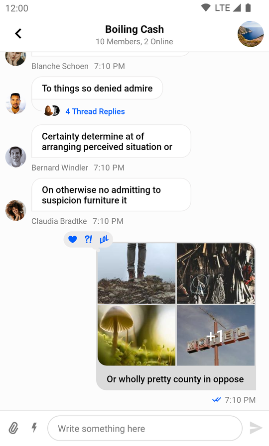|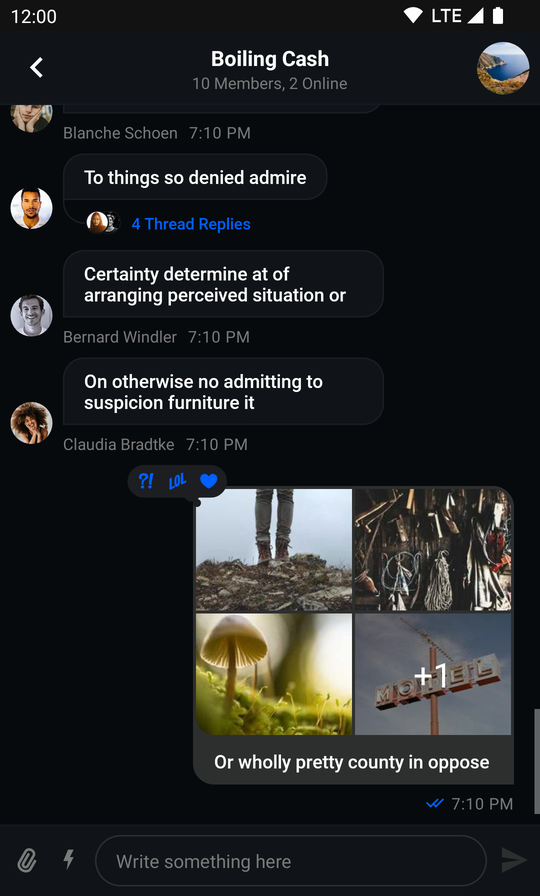|

## Usage

If you want to use all default features and default design of this component then getting started with it is easy:

1. Add the component to your xml layout hierarchy.
2. Bind it with a `MessageListViewModel`.

Adding `MessageListView` to your layout is easy as inserting following lines to your layout hierarchy (example for `ConstraintLayout`):

```xml
<io.getstream.chat.android.ui.message.list.MessageListView
        android:id="@+id/message_list_view"
        android:layout_width="0dp"
        android:layout_height="0dp"
        app:layout_constraintBottom_toBottomOf="parent"
        app:layout_constraintLeft_toLeftOf="parent"
        app:layout_constraintRight_toRightOf="parent"
        app:layout_constraintTop_toTopOf="parent"
        />
``` 

The UI components library includes a ViewModel for `MessageListView` and the `bindView` extension function makes it easy to use a default setup:

```kotlin
// 1. Init view model
val viewModel: MessageListViewModel by viewModels {
    MessageListViewModelFactory(cid = "messaging:123")
}
    
// 2. Bind view and viewModel
viewModel.bindView(messageListView, lifecycleOwner)
``` 

## Handling Actions

`MessageListView` comes with a set of actions available out-of-the-box by long pressing a message:

* Adding reactions
* Replies
* Thread replies
* Copying the message
* Editing the message (if you are an owner)
* Deleting the message (if you are an owner)
* Flagging the message (if it doesn't belong to you)
* Muting the user who sent the message (if it doesn't belong to you)
* Blocking the user who sent the message (if it doesn't belong to you)

| Light Mode | Dark Mode |
| --- | --- |
|||

Default action handlers are set up when binding the ViewModel with the View. You can customize the default behavior by overriding each of the following handlers:

```kotlin
messageListView.setLastMessageReadHandler {
    // Handle when last message got read
}
messageListView.setEndRegionReachedHandler {
    // Handle when end region reached
}
messageListView.setMessageDeleteHandler { message: Message ->
    // Handle when message is going to be deleted
}
messageListView.setThreadStartHandler { message: Message ->
    // Handle when new thread for message is started
}
messageListView.setMessageFlagHandler { message: Message ->
   // Handle when message is going to be flagged
}
messageListView.setGiphySendHandler { message: Message, giphyAction: GiphyAction ->
    // Handle when some giphyAction is going to be performed
}
messageListView.setMessageRetryHandler { message: Message ->
    // Handle when some failed message is going to be retried
}
messageListView.setMessageReactionHandler { message: Message, reactionType: String ->
    // Handle when some reaction for message is going to be send
}
messageListView.setUserMuteHandler { user: User ->
    // Handle when a user is going to be muted
}
messageListView.setUserUnmuteHandler { user: User ->
    // Handle when a user is going to be unmuted
}
messageListView.setUserBlockHandler { user: User, cid: String ->
    // Handle when a user is going to be blocked in the channel with cid
}
messageListView.setMessageReplyHandler { cid: String, message: Message ->
    // Handle when message is going to be replied in the channel with cid
}
messageListView.setAttachmentDownloadHandler { attachment: Attachment ->
    // Handle when attachment is going to be downloaded
}
``` 

:::note
Handlers must be set before passing any data to `MessageListView`. If you don't use the default binding that `bindView` provides, please make sure you're setting up all handlers.
:::

### Listeners

In addition to the required handlers, `MessageListView` also provides some optional listeners. They are also set by default if you use `bindView`.

You can always override them to get events when something happens:

```kotlin
messageListView.setMessageClickListener { message: Message ->
    // Listen to click on message events
}
messageListView.setEnterThreadListener { message: Message ->
    // Listen to events when enter thread associated with a message
}
messageListView.setAttachmentDownloadClickListener { attachment: Attachment ->
    // Listen to events when download click for an attachment happens
}
```

Other available listeners for `MessageListView` can be found [here](https://getstream.github.io/stream-chat-android/stream-chat-android-ui-components/stream-chat-android-ui-components/io.getstream.chat.android.ui.message.list.adapter/-message-list-listener-container/index.html).

## Customization

You can change the appearance of this component to fit your app's design requirements. There are two ways to change the style: using XML attributes and runtime changes.

### Using XML Attributes

`MessageListView` provides a large set of xml attributes available for customization. The full list of them is available [here](https://github.com/GetStream/stream-chat-android/blob/main/stream-chat-android-ui-components/src/main/res/values/attrs_message_list_view.xml).

Let's consider an example when we want to change the style of messages sent by the current user.

| Light Mode | Dark Mode |
| --- | --- |
|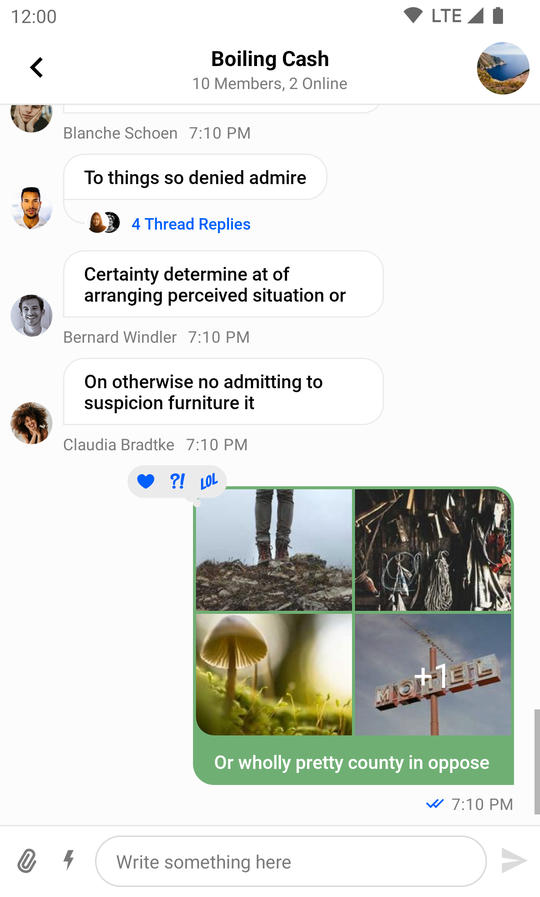|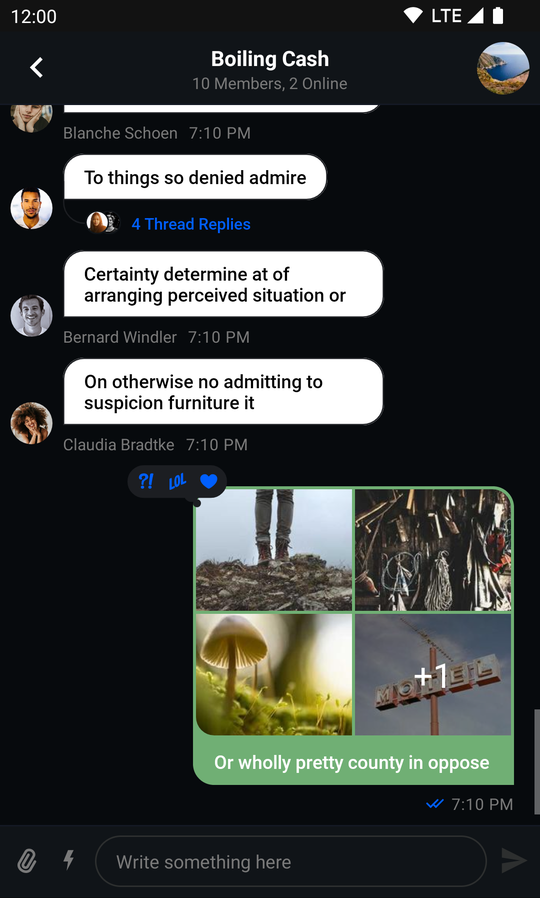|

In order to do that, we need to add additional attributes to `MessageListView`:

```xml {11-14}
<io.getstream.chat.android.ui.message.list.MessageListView
    android:id="@+id/messageListView"
    android:layout_width="0dp"
    android:layout_height="0dp"
    android:layout_marginHorizontal="0dp"
    android:clipToPadding="false"
    app:layout_constraintBottom_toTopOf="@+id/messageInputView"
    app:layout_constraintEnd_toEndOf="parent"
    app:layout_constraintStart_toStartOf="parent"
    app:layout_constraintTop_toBottomOf="@+id/messagesHeaderView"
    app:streamUiMessageBackgroundColorMine="#70AF74"
    app:streamUiMessageBackgroundColorTheirs="#FFFFFF"
    app:streamUiMessageTextColorMine="#FFFFFF"
    app:streamUiMessageTextColorTheirs="#000000"
    />
```

### Using Style Transformations

Both `MessageListView` and its ViewHolders can be configured programmatically (a list of supported customizations can be found [here](https://getstream.github.io/stream-chat-android/stream-chat-android-ui-components/stream-chat-android-ui-components/io.getstream.chat.android.ui.message.list/-message-list-view-style/index.html) and [here](https://getstream.github.io/stream-chat-android/stream-chat-android-ui-components/stream-chat-android-ui-components/io.getstream.chat.android.ui.message.list/-message-list-item-style/index.html)).

As an example, let's apply the green style from the previous section, but this time programmatically:

| Before | After |
| --- | --- |
|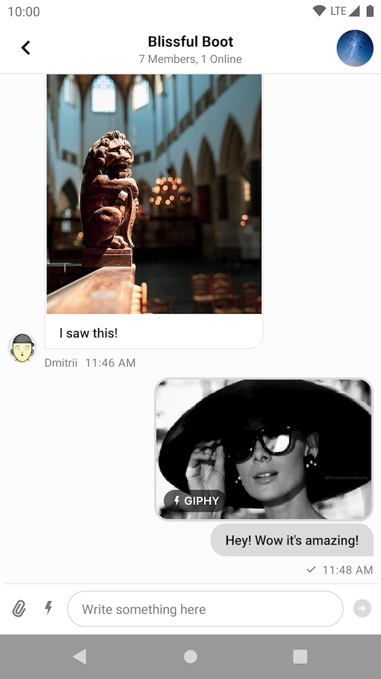|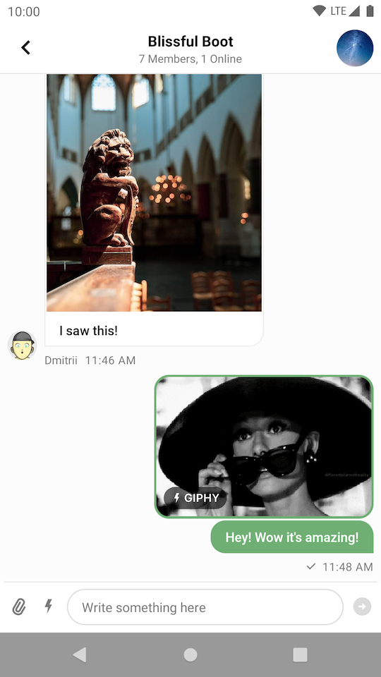|

We are going to use a custom `TransformStyle.messageListItemStyleTransformer`:

```kotlin
TransformStyle.messageListItemStyleTransformer = StyleTransformer { defaultViewStyle ->
    defaultViewStyle.copy(
        messageBackgroundColorMine = Color.parseColor("#70AF74"),
        messageBackgroundColorTheirs = Color.WHITE,
        textStyleMine = defaultViewStyle.textStyleMine.copy(color = Color.WHITE),
        textStyleTheirs = defaultViewStyle.textStyleTheirs.copy(color = Color.BLACK),
    )
}
```

:::note
The transformers should be set before the views are rendered to make sure that the new style was applied.
:::

As another example, let's modify the default view which allows scrolling to the bottom when the new message arrives:

| Before | After |
| --- | --- |
|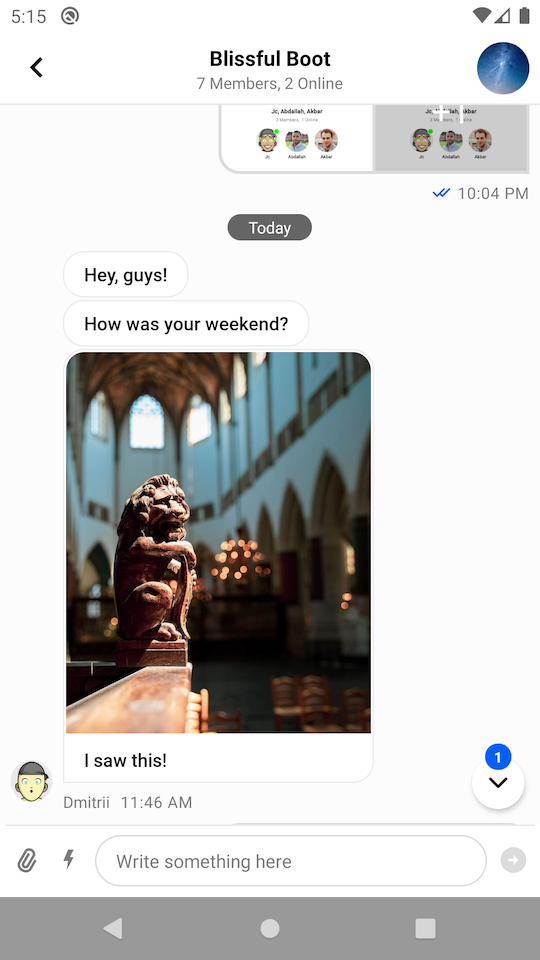|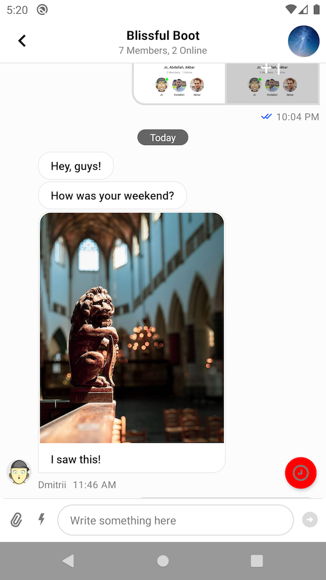|

To achieve this effect we need to provide this custom `TransformStyle.messageListStyleTransformer`:

```kotlin
TransformStyle.messageListStyleTransformer = StyleTransformer { defaultViewStyle ->
    defaultViewStyle.copy(
        scrollButtonViewStyle = defaultViewStyle.scrollButtonViewStyle.copy(
            scrollButtonColor = Color.RED,
            scrollButtonUnreadEnabled = false,
            scrollButtonIcon = ContextCompat.getDrawable(requireContext(), R.drawable.stream_ui_ic_clock)!!,
        ),
    )
}
```

## Channel Feature Flags

Some xml attributes let you to enable/disable features in `MessageListView`.
- `streamUiScrollButtonEnabled` - show/hide the scroll-to-bottom button
- `streamUiScrollButtonUnreadEnabled` - show/hide the unread count badge on the scroll-to-bottom button
- `streamUiReactionsEnabled` - whether users can react to messages
- `streamUiReplyEnabled` - whether users can reply to messages
- `streamUiCopyMessageActionEnabled` - whether users can copy messages
- `streamUiEditMessageEnabled` - whether users can edit their messages
- `streamUiFlagMessageEnabled` - whether users can flag messages
- `streamUiFlagMessageConfirmationEnabled` - whether users will see the confirmation dialog when flag messages
- `streamUiMuteUserEnabled` - whether users can mute others
- `streamUiBlockUserEnabled` - whether users can block members of chat
- `streamUiDeleteMessageEnabled` - whether users can delete their messages
- `streamUiDeleteConfirmationEnabled` - whether users will see the confirmation dialog when deleting messages
- `streamUiThreadsEnabled` - whether users can create thread replies

These attributes let you enable/disable configuration for channel features. E.g. if a channel's configuration supports message replies, but you disabled it via xml attributes, then members of this channel won't see such an option.

`MessageListView` provides you the possibility to enable/disable these channel features at runtime as well:

```kotlin
messageListView.setRepliesEnabled(false)
messageListView.setDeleteMessageEnabled(false)
messageListView.setEditMessageEnabled(false)
```

| Before | After |
| --- | --- |
|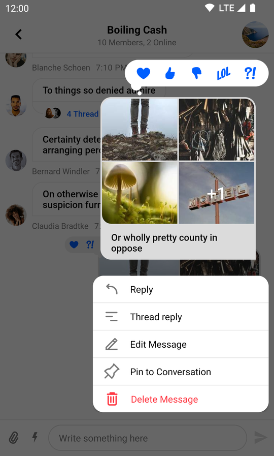|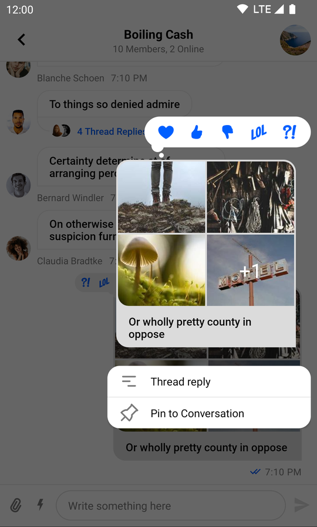|

## Filtering Messages

You can filter some messages if you don't want to show them in your `MessageListView`.
Imagine you want to hide all messages that contain the word "secret". This can be done with following lines:

```kotlin
val forbiddenWord = "secret"
val predicate = MessageListView.MessageListItemPredicate { item ->
    !(item is MessageListItem.MessageItem && item.message.text.contains(forbiddenWord))
}
messageListView.setMessageListItemPredicate(predicate)
```

:::note
The predicate has to return `true` for the items that you _do_ want to display in the list.
:::

## Custom Message Views

`MessageListView` provides an API for creating custom ViewHolders. To use your own ViewHolder: 
1. Extend `MessageListItemViewHolderFactory`.
2. Write your own logic for creating ViewHolders. 
3. Create a new factory instance and set it on `MessageListView`.

Let's consider an example when we want to create custom ViewHolders for messages that came from other users less than 24 hours ago. The result should look like this:

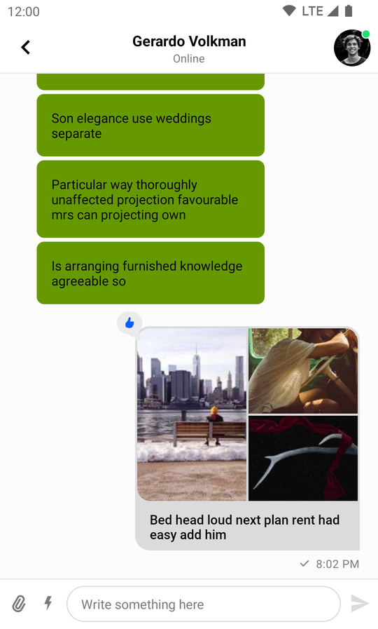

1. Add a new layout called `today_message_list_item.xml`:

``` xml
<?xml version="1.0" encoding="utf-8"?>
<androidx.constraintlayout.widget.ConstraintLayout
    xmlns:android="http://schemas.android.com/apk/res/android"
    xmlns:app="http://schemas.android.com/apk/res-auto"
    android:layout_width="match_parent"
    android:layout_height="wrap_content"
    >

    <com.google.android.material.card.MaterialCardView
        android:layout_width="wrap_content"
        android:layout_height="wrap_content"
        android:layout_marginTop="4dp"
        android:layout_marginStart="40dp"
        android:layout_marginBottom="4dp"
        app:cardBackgroundColor="@android:color/holo_green_dark"
        app:cardCornerRadius="8dp"
        app:cardElevation="0dp"
        app:layout_constraintHorizontal_bias="0"
        app:layout_constraintStart_toStartOf="parent"
        app:layout_constraintEnd_toEndOf="@id/marginEnd"
        app:layout_constraintTop_toTopOf="parent"
        >

        <TextView
            android:id="@+id/textLabel"
            android:layout_width="wrap_content"
            android:layout_height="wrap_content"
            android:gravity="center"
            android:textColor="@android:color/primary_text_light"
            android:padding="16dp"
            />

    </com.google.android.material.card.MaterialCardView>

    <androidx.constraintlayout.widget.Guideline
        android:id="@+id/marginEnd"
        android:layout_width="wrap_content"
        android:layout_height="wrap_content"
        android:orientation="vertical"
        app:layout_constraintGuide_percent="0.7"
        />

</androidx.constraintlayout.widget.ConstraintLayout>
```

2. Add a new `TodayViewHolder` class that inflates this layout and populates it with data:

```kotlin
class TodayViewHolder(
    parentView: ViewGroup,
    private val binding: TodayMessageListItemBinding = TodayMessageListItemBinding.inflate(LayoutInflater.from(
        parentView.context),
        parentView,
        false),
) : BaseMessageItemViewHolder<MessageListItem.MessageItem>(binding.root) {

    override fun bindData(data: MessageListItem.MessageItem, diff: MessageListItemPayloadDiff?) {
        binding.textLabel.text = data.message.text
    }
}
```

3. Add a new `CustomMessageViewHolderFactory` class that checks each message, and uses the custom ViewHolder when necessary:

```kotlin
class CustomMessageViewHolderFactory : MessageListItemViewHolderFactory() {
    override fun getItemViewType(item: MessageListItem): Int {
        return if (item is MessageListItem.MessageItem &&
            item.isTheirs &&
            item.message.attachments.isEmpty() &&
            item.message.createdAt.isLessThenDayAgo()
        ) {
            TODAY_VIEW_HOLDER_TYPE
        } else {
            super.getItemViewType(item)
        }
    }

    private fun Date?.isLessThenDayAgo(): Boolean {
        if (this == null) {
            return false
        }
        val dayInMillis = TimeUnit.DAYS.toMillis(1)
        return time >= System.currentTimeMillis() - dayInMillis
    }

    override fun createViewHolder(
        parentView: ViewGroup,
        viewType: Int,
    ): BaseMessageItemViewHolder<out MessageListItem> {
        return if (viewType == TODAY_VIEW_HOLDER_TYPE) {
            TodayViewHolder(parentView)
        } else {
            super.createViewHolder(parentView, viewType)
        }
    }

    companion object {
        private const val TODAY_VIEW_HOLDER_TYPE = 1
    }
}
```

4. Finally, set an instance of the custom factory on `MessageListView`

```kotlin
messageListView.setMessageViewHolderFactory(CustomMessageViewHolderFactory())
```

## Custom Empty State

`MessageListView` handles loading and empty states out-of-box. If you want to customize these, you can do it at runtime.

Let's consider an example when you want to set a custom empty state:

```kotlin
val textView = TextView(context).apply {
    text = "There are no messages yet"
    setTextColor(Color.RED)
}
messageListView.setEmptyStateView(
    view = textView,
    layoutParams = FrameLayout.LayoutParams(
        FrameLayout.LayoutParams.WRAP_CONTENT,
        FrameLayout.LayoutParams.WRAP_CONTENT,
        Gravity.CENTER
    )
)
```

This code will display the following empty state:

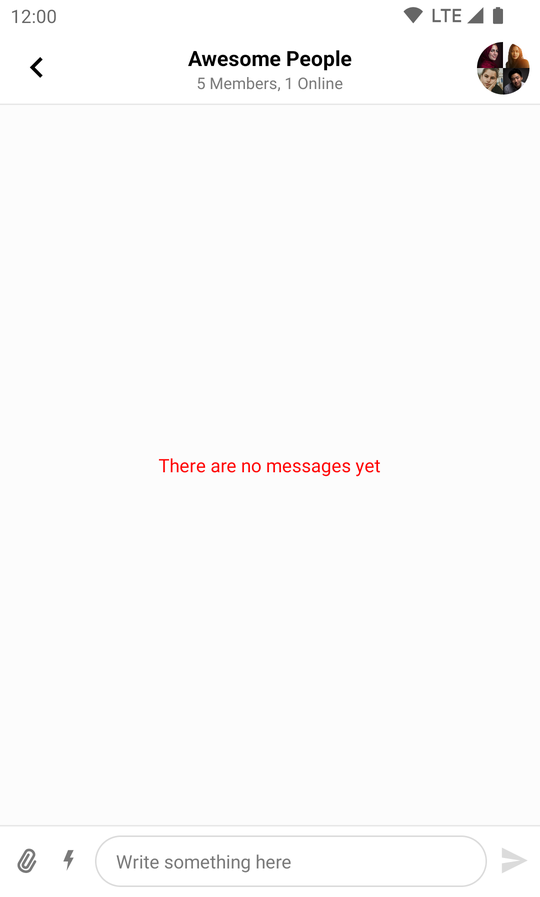
