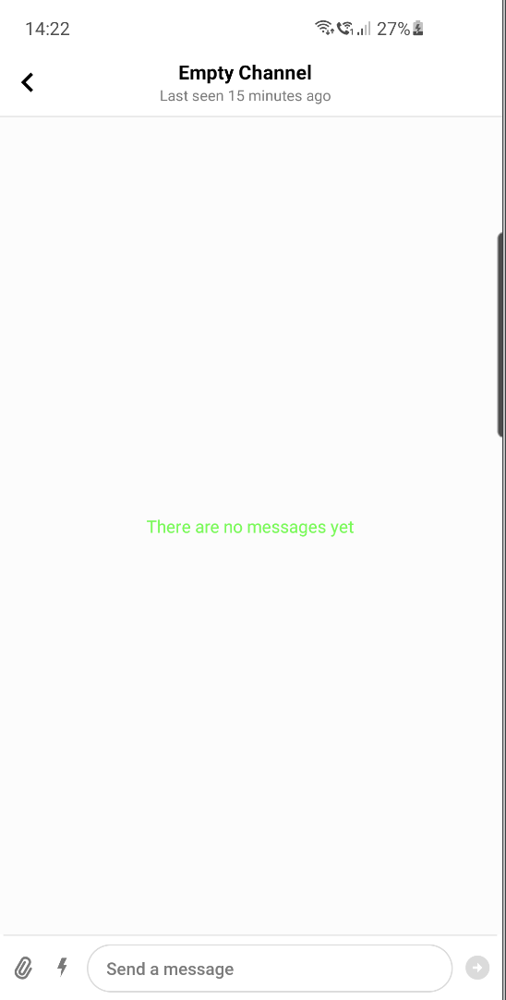
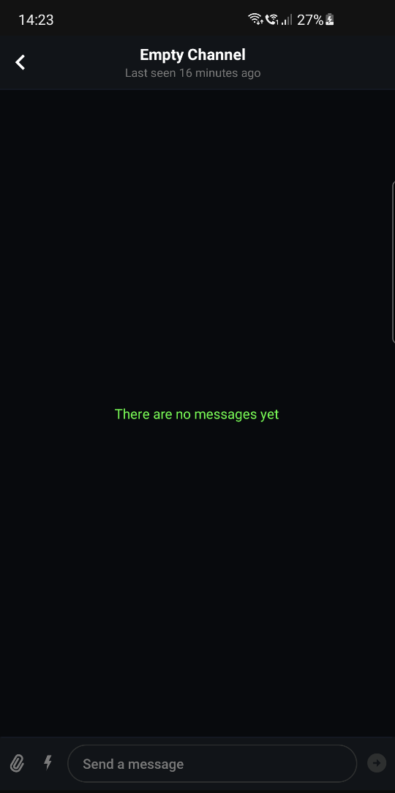

# Message List Header

<!-- TODO: Import whatever makes sense to import from https://getstream.io/chat/docs/android/message_list_header_view/?language=kotlin -->

## Overview

<!-- TODO: Brief description and a couple screenshots with default styling. -->

## Customizations

### Customization with XML Attributes

<!-- TODO: Review this example, possibly remove it. -->

Let's slightly change the chat view by hiding the user avatar in the header and providing a custom empty state view.

| Light Mode | Dark Mode |
| --- | --- |
|||

We need to do following step to achieve that:
1. Modify _MessageListHeaderView_ layout:
```xml
    <io.getstream.chat.android.ui.message.list.header.MessageListHeaderView
        android:id="@+id/messagesHeaderView"
        android:layout_width="0dp"
        android:layout_height="wrap_content"
        app:layout_constraintEnd_toEndOf="parent"
        app:layout_constraintStart_toStartOf="parent"
        app:layout_constraintTop_toTopOf="parent"
        app:streamUiMessageListHeaderShowUserAvatar="false"
        />
```
