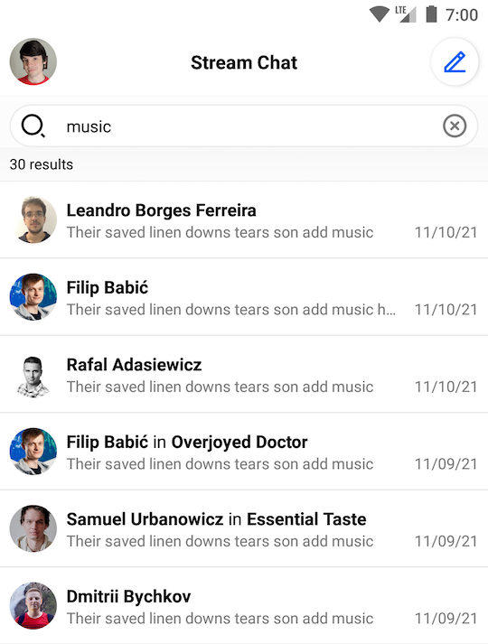
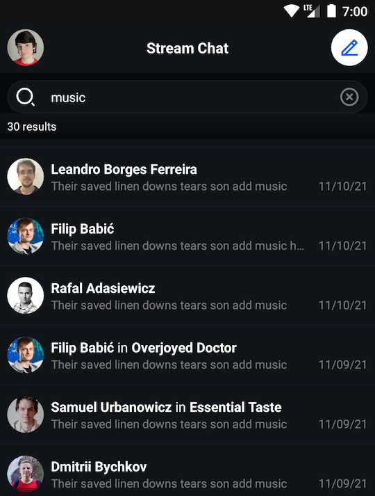

# Search View

<!-- TODO: Import whatever makes sense to import from https://getstream.io/chat/docs/android/search_input_view/?language=kotlin -->
<!-- TODO: Import whatever makes sense to import from https://getstream.io/chat/docs/android/search_result_list_view/?language=kotlin -->

## Overview

The SDK provides two views: `SearchInputView` and `SearchResultListView` which can be used to search and display messages that contain specific text in all channels in which the current user is a member.

| Light Mode | Dark Mode |
| --- | --- |
|||

## Creating Search View Layout

Here's an example layout using these two Views:

```xml
<?xml version="1.0" encoding="utf-8"?>
<androidx.constraintlayout.widget.ConstraintLayout xmlns:android="http://schemas.android.com/apk/res/android"
    xmlns:app="http://schemas.android.com/apk/res-auto"
    android:layout_width="match_parent"
    android:layout_height="match_parent"
    android:background="#FCFCFC">

    <io.getstream.chat.android.ui.search.SearchInputView
        android:id="@+id/searchInputView"
        android:layout_width="0dp"
        android:layout_height="wrap_content"
        android:layout_margin="8dp"
        app:layout_constraintEnd_toEndOf="parent"
        app:layout_constraintStart_toStartOf="parent"
        app:layout_constraintTop_toTopOf="parent"/>

    <io.getstream.chat.android.ui.search.list.SearchResultListView
        android:id="@+id/searchResultListView"
        android:layout_width="0dp"
        android:layout_height="0dp"
        app:layout_constraintBottom_toBottomOf="parent"
        app:layout_constraintEnd_toEndOf="parent"
        app:layout_constraintStart_toStartOf="parent"
        app:layout_constraintTop_toBottomOf="@id/searchInputView"/>

</androidx.constraintlayout.widget.ConstraintLayout>
```

## Binding Search View Components

To display search results, you need to bind `SearchResultListView` with the ViewModel and pass the search query from `SearchInputView` to the same ViewModel:

```kotlin
// Get view model
val searchViewModel: SearchViewModel by viewModels()

// Pass query to view model
searchInputView.apply {
    setSearchStartedListener { query ->
        // Pass query when search query was submitted
        searchViewModel.setQuery(query)
    }
    setDebouncedInputChangedListener { query ->
        // You can also track debounced search input changes
    }
    setContinuousInputChangedListener { query ->
        // You can also track continuous search input changes
    }
}

// Bind search result list view with view model
searchViewModel.bindView(searchResultView, viewLifecycleOwner)

// You can also handle search result clicks
searchResultView.setSearchResultSelectedListener { message ->
    // Handle search result click
}
```

:::note
`bindView` sets listeners on the view and the ViewModel. Any additional listeners should be set _after_ calling `bindView`.
:::