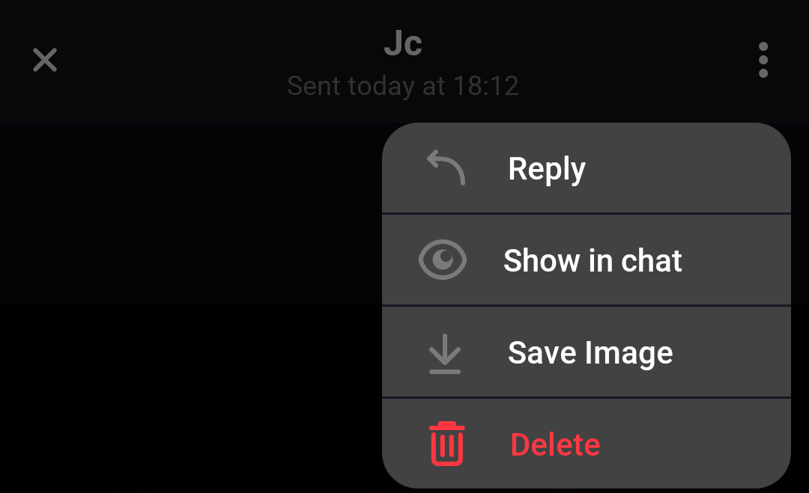
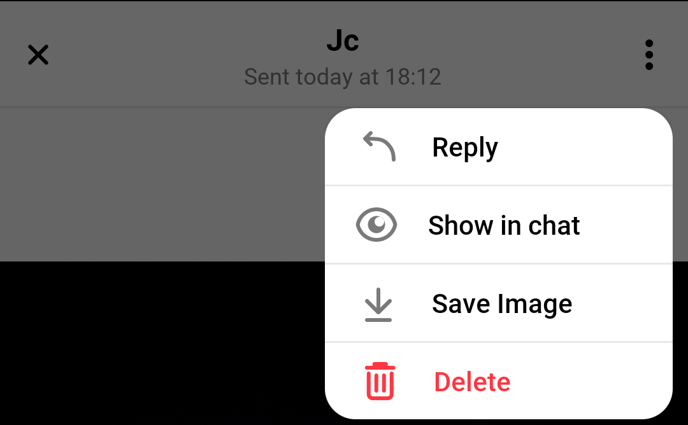

# Attachment Gallery

<!-- TODO: Import whatever makes sense to import from https://getstream.io/chat/docs/android/attachmentgallery/?language=kotlin -->

## Overview

_AttachmentGalleryActivity_ is an _Activity_ used to display attachments that the users have sent in the chat. It is an image gallery where users can see the pictures, share, download, and use a menu to navigate through the pictures.

| Light Mode | Dark Mode |
| --- | --- |
|||
|||

## Handling user input
There are 4 behaviours that can be customized by the following handlers:

* AttachmentGalleryActivity.AttachmentReplyOptionHandler
* AttachmentGalleryActivity.AttachmentShowInChatOptionHandler
* AttachmentGalleryActivity.AttachmentDownloadOptionHandler
* AttachmentGalleryActivity.AttachmentDeleteOptionHandler

The next section shows how to implement the listeners and inject the desired behaviour.

It is also possible to set listener for options in the overflow menu (three dots)

|Light|Dark| 
|---|---|
|||  

```kotlin
messageListView.setAttachmentReplyOptionClickHandler { resultItem ->
    resultItem.messageId
    // Handle reply to attachment
}

messageListView.setAttachmentShowInChatOptionClickHandler { resultItem ->
    resultItem.messageId
    // Handle show in chat
}

messageListView.setDownloadOptionHandler { resultItem ->
    resultItem.assetUrl
    // Handle download the attachment
}

messageListView.setAttachmentDeleteOptionClickHandler { resultItem ->
    resultItem.assetUrl
    resultItem.imageUrl
    // Handle delete
}
```

## Navigating To Attachment Gallery

By default, the Attachment Gallery is opened when a user clicks on an attachment in _MessageListView_. In that case, all actions mentioned above have a default implementation, which can be changed by overriding _MessageListView_'s handlers.

You can also navigate to _AttachmentGalleryActivity_ but in that case, you will need to implement all available actions:

```kotlin
// Create Attachment Gallery Destination
val destination = AttachmentGalleryDestination(
    requireContext(),
    attachmentReplyOptionHandler = { resultItem ->
        // Handle reply
    },
    attachmentShowInChatOptionHandler = { resultItem ->
        // Handle show image in chat
    },
    attachmentDownloadOptionHandler = { resultItem ->
        // Handle download image
    },
    attachmentDeleteOptionClickHandler = { resultItem ->
        // Handle delete image
    },
)

// Register destination with the ActivityResultRegistry
activity?.activityResultRegistry?.let { registry ->
    destination.register(registry)
}

// Set the data to display
destination.setData(attachmentGalleryItems = listOf(), attachmentIndex = 0)

// Fire the navigation request
ChatUI.instance().navigator.navigate(destination)
```
