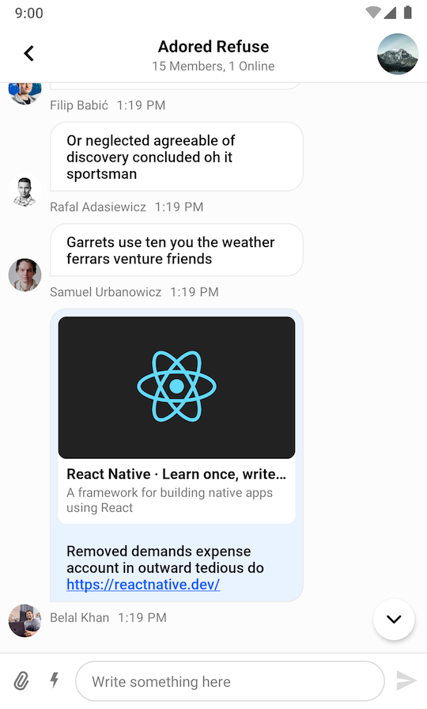
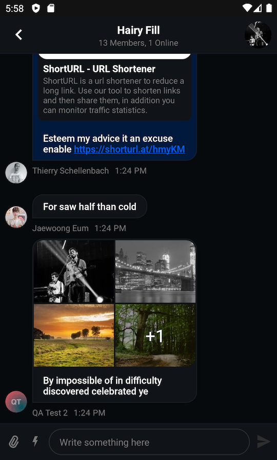

# Building a Message List Screen

The SDK provides multiple UI Components which can be used together to build a message list screen. This guide will show you how to combine and customize `MessageListHeaderView`, `MessageListView`, and `MessageInputView`.

This is what a screen made with these three components looks like:

| Light Mode | Dark Mode |
| --- | --- |
||| 

To add these Views to your app, first create them in an XML layout:

```xml
<?xml version="1.0" encoding="utf-8"?>
<androidx.constraintlayout.widget.ConstraintLayout xmlns:android="http://schemas.android.com/apk/res/android"
    xmlns:app="http://schemas.android.com/apk/res-auto"
    android:layout_width="match_parent"
    android:layout_height="match_parent"
    >

    <io.getstream.chat.android.ui.message.list.header.MessageListHeaderView
        android:id="@+id/messagesHeaderView"
        android:layout_width="0dp"
        android:layout_height="wrap_content"
        app:layout_constraintEnd_toEndOf="parent"
        app:layout_constraintStart_toStartOf="parent"
        app:layout_constraintTop_toTopOf="parent"
        />

    <io.getstream.chat.android.ui.message.list.MessageListView
        android:id="@+id/messageListView"
        android:layout_width="0dp"
        android:layout_height="0dp"
        android:layout_marginHorizontal="0dp"
        android:clipToPadding="false"
        app:layout_constraintBottom_toTopOf="@+id/messageInputView"
        app:layout_constraintEnd_toEndOf="parent"
        app:layout_constraintStart_toStartOf="parent"
        app:layout_constraintTop_toBottomOf="@+id/messagesHeaderView"
        />

    <io.getstream.chat.android.ui.message.input.MessageInputView
        android:id="@+id/messageInputView"
        android:layout_width="0dp"
        android:layout_height="wrap_content"
        app:layout_constraintBottom_toBottomOf="parent"
        app:layout_constraintEnd_toEndOf="parent"
        app:layout_constraintStart_toStartOf="parent"
        app:layout_constraintTop_toBottomOf="@+id/messageListView"
        />

</androidx.constraintlayout.widget.ConstraintLayout>
```

Just like other components, these three views come with [ViewModels](../01-getting-started.md#viewmodels) which are responsible for providing all necessary data for them.

After setting up the ViewModels, this screen also requires some additional setup to pass information between the different chat components.

```kotlin
// Create view models
val factory: MessageListViewModelFactory = MessageListViewModelFactory(cid = "channelType:channelId")
val messageListHeaderViewModel: MessageListHeaderViewModel by viewModels { factory }
val messageListViewModel: MessageListViewModel by viewModels { factory }
val messageInputViewModel: MessageInputViewModel by viewModels { factory }

// Bind view models
messageListHeaderViewModel.bindView(messageListHeaderView, viewLifecycleOwner)
messageListViewModel.bindView(messageListView, viewLifecycleOwner)
messageInputViewModel.bindView(messageInputView, viewLifecycleOwner)

// Let both message list header and message input know when we open a thread
messageListViewModel.mode.observe(this) { mode ->
    when (mode) {
        is MessageListViewModel.Mode.Thread -> {
            messageListHeaderViewModel.setActiveThread(mode.parentMessage)
            messageInputViewModel.setActiveThread(mode.parentMessage)
        }
        MessageListViewModel.Mode.Normal -> {
            messageListHeaderViewModel.resetThread()
            messageInputViewModel.resetThread()
        }
    }
}

// Let the message input know when we are editing a message
messageListView.setMessageEditHandler(messageInputViewModel::postMessageToEdit)

// Handle navigate up state
messageListViewModel.state.observe(this) { state ->
    if (state is MessageListViewModel.State.NavigateUp) {
        // Handle navigate up
    }
}

// Handle back button behaviour correctly when you're in a thread
val backHandler = {
    messageListViewModel.onEvent(MessageListViewModel.Event.BackButtonPressed)
}
messageListHeaderView.setBackButtonClickListener(backHandler)

// You should also consider overriding default Activity's back button behaviour
```

:::note
`bindView` sets listeners on the View and the ViewModel. Any additional listeners should be set _after_ calling `bindView`.
:::

This gives you a fully functional messaging screen, where you're able to display and send messages, and perform various actions in the message list.
